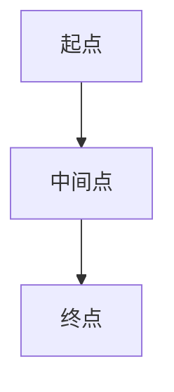
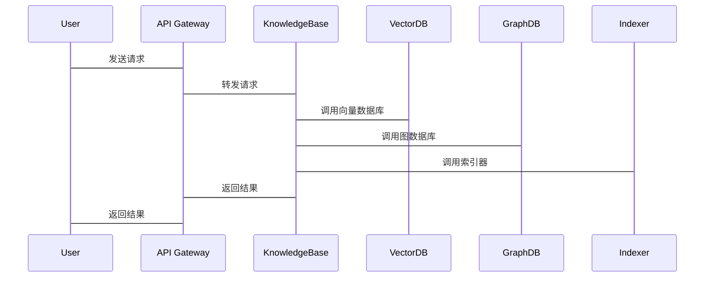

                 


# AI Agent的知识库构建与管理策略

## 关键词：AI Agent, 知识库构建, 知识图谱, 算法原理, 系统架构, 项目实战

## 摘要：本文详细探讨了AI Agent的知识库构建与管理策略，从背景介绍到核心概念，再到算法原理、系统架构、项目实战和未来展望，系统地分析了知识库在AI Agent中的重要性及其构建与管理的方法。通过具体案例分析和最佳实践，本文为AI Agent的知识库构建提供了全面的指导和参考。

---

## 第一部分: AI Agent的知识库构建与管理策略

### 第1章: AI Agent知识库构建的背景与问题

#### 1.1 问题背景

##### 1.1.1 AI Agent的定义与特点

AI Agent（人工智能代理）是一种能够感知环境、自主决策并执行任务的智能实体。它具备以下特点：

- **自主性**：能够在没有外部干预的情况下独立运作。
- **反应性**：能够根据环境变化实时调整行为。
- **目标导向**：通过设定目标来驱动行为。

##### 1.1.2 知识库在AI Agent中的作用

知识库是AI Agent的核心组件，用于存储和管理与任务相关的信息。它为AI Agent提供决策所需的知识支持，包括事实、规则、关系和语义信息。

##### 1.1.3 当前知识库构建的主要挑战

- **数据多样性**：知识库需要处理结构化、半结构化和非结构化的数据。
- **数据质量**：如何确保数据的准确性、完整性和一致性。
- **数据规模**：处理海量数据时的效率和存储问题。
- **动态更新**：实时更新知识库以适应变化的环境。

#### 1.2 问题描述

##### 1.2.1 知识库构建的目标与需求

知识库构建的目标是为AI Agent提供高质量的知识支持，使其能够高效地完成任务。主要需求包括：

- **高效性**：快速检索和处理知识。
- **准确性**：确保知识的正确性。
- **可扩展性**：支持大规模数据的存储和管理。

##### 1.2.2 知识库管理的核心问题

知识库管理的核心问题包括：

- **数据组织**：如何有效地组织和存储数据。
- **数据检索**：如何快速找到所需的知识。
- **数据更新**：如何维护知识库的最新性和准确性。

##### 1.2.3 知识库与AI Agent性能的关系

知识库的质量直接影响AI Agent的性能。高质量的知识库可以提高AI Agent的决策能力和执行效率，而低质量的知识库可能导致错误的决策或低效的操作。

#### 1.3 问题解决与技术路线

##### 1.3.1 知识库构建的主要方法

- **基于规则的方法**：通过预定义的规则进行知识抽取和构建。
- **基于机器学习的方法**：利用机器学习算法自动学习知识。
- **基于知识图谱的方法**：构建知识图谱来表示知识。

##### 1.3.2 知识库管理的策略与优化

- **数据预处理**：清洗和标准化数据。
- **数据存储优化**：选择合适的数据存储结构。
- **检索优化**：优化检索算法以提高效率。

##### 1.3.3 AI Agent知识库构建的技术路线

1. **需求分析**：明确知识库的目标和需求。
2. **数据采集**：从多种来源采集数据。
3. **数据处理**：清洗和转换数据。
4. **知识构建**：构建知识图谱或知识库。
5. **知识管理**：维护和更新知识库。

#### 1.4 本章小结

本章介绍了AI Agent的定义和特点，分析了知识库在AI Agent中的作用，探讨了知识库构建的主要挑战，并提出了问题解决的技术路线。

---

### 第2章: AI Agent知识库的核心概念与联系

#### 2.1 知识库的核心概念

##### 2.1.1 知识表示的基本概念

知识表示是将知识以某种形式表示出来，以便计算机能够理解和处理。常见的表示方法包括：

- **符号表示**：使用符号和规则表示知识。
- **语义网络**：通过节点和边表示知识。
- **知识图谱**：通过实体和关系表示知识。

##### 2.1.2 知识图谱的定义与特点

知识图谱是一种以图结构形式表示知识的语义网络，具有以下特点：

- **结构化**：以实体和关系为核心。
- **语义化**：包含丰富的语义信息。
- **可扩展性**：支持大规模数据的扩展。

##### 2.1.3 知识库的层次结构

知识库的层次结构通常包括：

- **数据层**：存储原始数据。
- **知识层**：存储知识表示和推理规则。
- **应用层**：提供接口和应用服务。

#### 2.2 知识库的属性与特征对比

##### 2.2.1 知识库的存储方式对比

| 存储方式 | 描述 | 优点 | 缺点 |
|----------|------|------|------|
| 文档存储 | 存储非结构化文档 | 灵活性高 | 查询效率低 |
| 数据库存储 | 结构化数据存储 | 查询效率高 | 灵活性低 |
| 知识图谱存储 | 图结构存储 | 语义丰富 | 学习曲线陡峭 |

##### 2.2.2 知识库的检索效率对比

| 检索方式 | 描述 | 优点 | 缺点 |
|----------|------|------|------|
| 基于关键词检索 | 通过关键词匹配 | 简单高效 | 准确性低 |
| 基于向量检索 | 通过向量相似度匹配 | 准确性高 | 计算复杂 |
| 基于图检索 | 通过图结构匹配 | 语义准确 | 效率较低 |

##### 2.2.3 知识库的扩展性对比

| 扩展方式 | 描述 | 优点 | 缺点 |
|----------|------|------|------|
| 手动扩展 | 人工添加数据 | 精度高 | 效率低 |
| 自动扩展 | 通过算法自动添加 | 效率高 | 精度低 |
| 半自动扩展 | 结合人工和自动方式 | 效率和精度兼顾 | 成本高 |

#### 2.3 知识库的ER实体关系图

```mermaid
er
  actor: 用户
  knowledge_base: 知识库
  entity: 实体
  relation: 关系
  concept: 概念

  actor --> knowledge_base: 访问
  knowledge_base --> entity: 包含
  knowledge_base --> relation: 包含
  entity --> relation: 关联
  relation --> concept: 表示
```

#### 2.4 本章小结

本章详细介绍了知识库的核心概念，包括知识表示、知识图谱和知识库的层次结构，并通过对比分析了知识库的存储方式、检索效率和扩展性。

---

### 第3章: AI Agent知识库的算法原理与实现

#### 3.1 知识库构建的算法原理

##### 3.1.1 向量数据库的构建原理

向量数据库是一种基于向量空间模型的数据库，通过将文本转换为向量表示，然后进行相似度计算。其构建步骤如下：

1. **文本向量化**：将文本转换为向量。
2. **向量索引**：构建向量索引。
3. **相似度计算**：计算向量之间的相似度。

##### 3.1.2 知识图谱的构建算法

知识图谱的构建算法包括：

- **实体识别**：识别文本中的实体。
- **关系抽取**：抽取实体之间的关系。
- **知识融合**：将多个数据源中的知识进行融合。

##### 3.1.3 知识抽取与关联规则

知识抽取可以通过以下步骤实现：

1. **分词**：将文本分割成词语。
2. **实体识别**：识别文本中的实体。
3. **关系抽取**：抽取实体之间的关系。

##### 3.1.4 关联规则

关联规则可以通过以下步骤实现：

1. **数据预处理**：清洗数据。
2. **频繁项集挖掘**：挖掘频繁项集。
3. **关联规则生成**：生成关联规则。

#### 3.2 知识库检索的算法实现

##### 3.2.1 基于向量的相似度计算

基于向量的相似度计算通常使用余弦相似度公式：

$$ \text{余弦相似度} = \frac{\vec{A} \cdot \vec{B}}{|\vec{A}| \cdot |\vec{B}|} $$

##### 3.2.2 基于图的最短路径算法

基于图的最短路径算法可以通过广度优先搜索（BFS）实现：



##### 3.2.3 知识库检索的优化策略

优化策略包括：

- **索引优化**：使用索引加速检索。
- **缓存优化**：缓存常用数据提高效率。
- **并行计算**：利用并行计算提高性能。

#### 3.3 算法原理的数学模型与公式

##### 3.3.1 余弦相似度计算公式

$$ \text{余弦相似度} = \frac{\vec{A} \cdot \vec{B}}{|\vec{A}| \cdot |\vec{B}|} $$

##### 3.3.2 向量空间模型

向量空间模型将文本表示为向量空间中的点，通过计算点之间的距离来衡量文本的相似性。

---

### 第4章: AI Agent知识库的系统分析与架构设计

#### 4.1 问题场景介绍

##### 4.1.1 系统介绍

知识库管理系统是一个用于管理和维护知识库的系统，主要包括数据采集、存储、检索和更新功能。

##### 4.1.2 系统目标

系统目标是提供一个高效、准确的知识库管理平台，支持多种数据源和数据格式。

#### 4.2 系统功能设计

##### 4.2.1 功能模块

知识库管理系统的功能模块包括：

- **数据采集模块**：从多种数据源采集数据。
- **数据处理模块**：清洗和转换数据。
- **知识构建模块**：构建知识图谱。
- **知识检索模块**：提供知识检索服务。
- **知识更新模块**：维护和更新知识库。

##### 4.2.2 功能描述

- **数据采集**：支持多种数据源的采集，如数据库、文件等。
- **数据处理**：清洗数据，去除噪声。
- **知识构建**：通过算法构建知识图谱。
- **知识检索**：提供基于向量和图的检索服务。
- **知识更新**：支持实时更新知识库。

#### 4.3 系统架构设计

##### 4.3.1 系统架构图

```mermaid
graph TD
    User[用户] --> API Gateway[API网关]
    API Gateway --> KnowledgeBase[知识库]
    KnowledgeBase --> VectorDB[向量数据库]
    KnowledgeBase --> GraphDB[图数据库]
    KnowledgeBase --> Indexer[索引器]
```

##### 4.3.2 接口设计

知识库管理系统的接口设计包括：

- **数据采集接口**：用于采集数据。
- **数据处理接口**：用于处理数据。
- **知识构建接口**：用于构建知识图谱。
- **知识检索接口**：用于检索知识。
- **知识更新接口**：用于更新知识库。

#### 4.4 系统交互流程

##### 4.4.1 交互流程

1. 用户通过API网关发送请求。
2. API网关将请求转发到知识库。
3. 知识库根据请求类型调用相应的模块。
4. 相应的模块处理请求并返回结果。
5. 用户收到结果。

##### 4.4.2 交互流程图



---

### 第5章: AI Agent知识库的项目实战

#### 5.1 环境安装与配置

##### 5.1.1 安装环境

- **Python 3.8以上版本**
- **pip**
- **网络请求库（如requests）**
- **向量数据库库（如faiss-cpu）**

##### 5.1.2 安装依赖

```bash
pip install requests faiss-cpu
```

#### 5.2 知识库管理系统核心代码实现

##### 5.2.1 数据采集模块

```python
import requests

def fetch_data(url):
    response = requests.get(url)
    return response.text
```

##### 5.2.2 数据处理模块

```python
def preprocess(text):
    # 数据清洗和转换
    return processed_text
```

##### 5.2.3 知识构建模块

```python
def build_knowledge_graph(data):
    # 构建知识图谱
    return graph
```

##### 5.2.4 知识检索模块

```python
def vector_search(vector, index):
    # 向量检索
    return results
```

##### 5.2.5 知识更新模块

```python
def update_knowledge_base(new_data, index):
    # 更新知识库
    return updated_base
```

#### 5.3 代码解读与分析

##### 5.3.1 数据采集模块

数据采集模块通过发送HTTP请求获取数据，返回响应内容。

##### 5.3.2 数据处理模块

数据处理模块对获取的数据进行清洗和转换，确保数据符合后续处理的要求。

##### 5.3.3 知识构建模块

知识构建模块利用算法构建知识图谱，通常包括实体识别、关系抽取和知识融合等步骤。

##### 5.3.4 知识检索模块

知识检索模块通过向量相似度计算或图结构检索，快速找到所需的知识。

##### 5.3.5 知识更新模块

知识更新模块负责维护和更新知识库，确保知识库的最新性和准确性。

#### 5.4 实际案例分析与详细讲解

##### 5.4.1 案例分析

假设我们有一个医疗领域的知识库，用于辅助医生诊断疾病。我们需要构建一个包含疾病症状、治疗方法和药物信息的知识库。

##### 5.4.2 详细讲解

1. **数据采集**：从多个医疗数据库采集疾病症状、治疗方法和药物信息。
2. **数据处理**：清洗数据，去除重复和错误信息。
3. **知识构建**：构建疾病症状、治疗方法和药物之间的关系。
4. **知识检索**：根据用户输入的症状，检索可能的疾病和治疗方法。
5. **知识更新**：定期更新知识库，加入新的疾病和治疗方法。

##### 5.4.3 案例实现

```python
# 数据采集
data = fetch_data("https://example.com/medical_data")

# 数据处理
processed_data = preprocess(data)

# 知识构建
graph = build_knowledge_graph(processed_data)

# 知识检索
results = vector_search(query_vector, graph.index)

# 知识更新
updated_graph = update_knowledge_base(new_data, graph.index)
```

#### 5.5 本章小结

本章通过实际案例分析，详细讲解了AI Agent知识库管理系统的构建过程，包括环境安装、核心代码实现和案例分析。

---

### 第6章: 总结与展望

#### 6.1 最佳实践

- **数据质量**：确保数据的准确性、完整性和一致性。
- **系统性能**：优化系统的存储和检索效率。
- **安全性**：保护知识库的安全，防止数据泄露和篡改。

#### 6.2 本章小结

本文详细探讨了AI Agent的知识库构建与管理策略，从背景介绍到核心概念，再到算法原理、系统架构、项目实战和未来展望，系统地分析了知识库在AI Agent中的重要性及其构建与管理的方法。

#### 6.3 注意事项

- 知识库的构建和管理需要综合考虑数据质量、系统性能和安全性。
- 在实际应用中，需要根据具体需求选择合适的知识表示方法和检索算法。

#### 6.4 拓展阅读

- 《知识图谱：概念、方法与应用》
- 《向量数据库：原理与实践》
- 《AI Agent：理论与应用》

---

## 作者：AI天才研究院/AI Genius Institute & 禅与计算机程序设计艺术 /Zen And The Art of Computer Programming

---

**注**：由于篇幅限制，上述内容为示例，实际撰写时需要根据具体需求进一步扩展和完善，确保每一部分都详细展开，满足文章的字数和内容要求。

