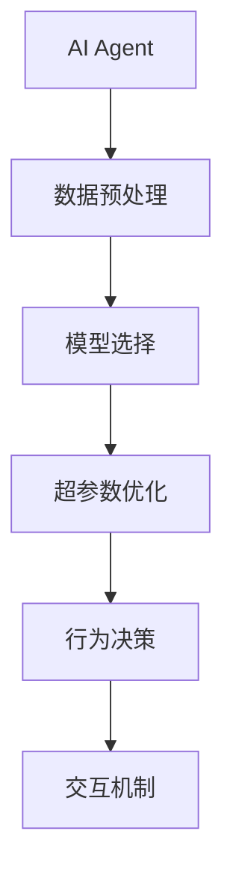
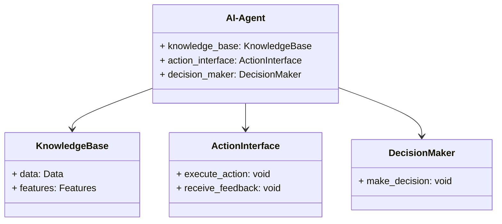
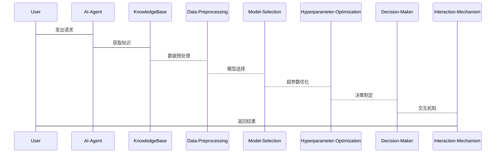

                 


# AI Agent的自动机器学习(AutoML)应用

> 关键词：AI Agent, AutoML, 机器学习, 自动化, 算法优化, 系统架构

> 摘要：本文探讨了AI Agent与AutoML的结合应用，详细分析了两者的核心概念、算法原理、系统架构及项目实战，旨在为读者提供全面的技术指导和实践参考。

---

## 第1章: AI Agent与AutoML的背景与概念

### 1.1 AI Agent的基本概念

#### 1.1.1 AI Agent的定义
AI Agent（人工智能代理）是指在特定环境中能够感知并自主行动以实现目标的智能实体。AI Agent可以是软件程序、机器人或其他智能系统，具备以下核心特征：

- **自主性**：无需外部干预，自主决策。
- **反应性**：能够感知环境并实时调整行为。
- **目标导向性**：所有行动均以实现特定目标为导向。

#### 1.1.2 AI Agent的核心特征
| 特征 | 描述 |
|------|------|
| 自主性 | 能够自主决策，无需外部控制 |
| 反应性 | 能够实时感知环境并调整行为 |
| 目标导向性 | 所有行为均以实现目标为导向 |

#### 1.1.3 AI Agent的应用场景
- **智能助手**：如Siri、Alexa等，帮助用户完成日常任务。
- **自动驾驶**：如特斯拉的自动驾驶系统，实现自主驾驶。
- **智能客服**：通过自然语言处理技术为用户提供服务。

### 1.2 AutoML的基本概念

#### 1.2.1 AutoML的定义
AutoML（自动机器学习）是指通过自动化工具和算法，减少人工干预，实现机器学习模型的自动构建和优化。AutoML的核心目标是降低机器学习的门槛，使其更易用。

#### 1.2.2 AutoML的核心特征
- **自动化**：从数据预处理到模型部署，整个流程高度自动化。
- **高效性**：通过算法优化快速找到最优模型。
- **可扩展性**：适用于各种规模和类型的数据集。

#### 1.2.3 AutoML的应用场景
- **数据分析**：自动处理和分析数据，提取有价值的信息。
- **模型部署**：自动化构建并部署机器学习模型。
- **超参数优化**：通过自动化搜索找到最佳超参数组合。

### 1.3 AI Agent与AutoML的联系

#### 1.3.1 AI Agent在AutoML中的作用
- **数据预处理**：AI Agent可以自动进行数据清洗和特征工程。
- **模型选择**：AI Agent可以根据任务需求自动选择合适的算法。
- **超参数优化**：AI Agent可以自动化地进行超参数搜索和优化。

#### 1.3.2 AutoML对AI Agent的支撑
- **自动化决策**：AutoML可以帮助AI Agent实现更高效的决策过程。
- **自适应学习**：通过AutoML，AI Agent可以快速适应新环境和新数据。
- **模型优化**：AutoML可以为AI Agent提供更准确和高效的模型。

#### 1.3.3 两者的结合与应用前景
结合AI Agent和AutoML，可以实现更加智能化和自动化的机器学习应用，广泛应用于智能助手、自动驾驶、智能客服等领域。

---

## 第2章: AI Agent与AutoML的核心概念

### 2.1 AI Agent的核心概念

#### 2.1.1 知识表示
知识表示是AI Agent理解世界的基础。常用的知识表示方法包括：
- **符号表示**：使用符号逻辑表示知识。
- **语义网络**：通过节点和边表示概念及其关系。
- **概率表示**：通过概率模型表示不确定性知识。

#### 2.1.2 行为决策
行为决策是AI Agent的核心功能，主要通过以下步骤实现：
1. **感知环境**：通过传感器或数据输入感知环境状态。
2. **状态表示**：将感知到的状态转换为内部表示。
3. **决策制定**：基于当前状态和目标，选择最优行动。
4. **行动执行**：将决策转化为具体行动。

#### 2.1.3 交互机制
交互机制是AI Agent与外界进行信息交换的关键，主要包括：
- **输入接口**：接收外部输入，如用户指令或传感器数据。
- **输出接口**：输出决策结果，如执行命令或反馈信息。
- **通信接口**：与其他系统或用户进行信息交互。

### 2.2 AutoML的核心概念

#### 2.2.1 数据预处理
数据预处理是AutoML的重要环节，主要包括：
- **数据清洗**：处理缺失值、异常值等。
- **特征工程**：提取特征并进行特征选择。
- **数据变换**：对数据进行标准化、归一化等处理。

#### 2.2.2 模型选择
模型选择是AutoML的关键步骤，主要通过以下方法实现：
- **网格搜索**：遍历所有可能的模型组合，选择性能最优的模型。
- **随机搜索**：随机选择模型组合，减少计算量。
- **贝叶斯优化**：基于概率模型进行模型选择。

#### 2.2.3 超参数优化
超参数优化是AutoML的重要组成部分，常用方法包括：
- **遗传算法**：通过模拟自然选择优化超参数。
- **强化学习**：通过试错方法优化超参数。
- **网格搜索**：遍历所有可能的超参数组合。

### 2.3 AI Agent与AutoML的核心联系

#### 2.3.1 知识表示与数据预处理的结合
知识表示为数据预处理提供语义理解，数据预处理为知识表示提供结构化数据。

#### 2.3.2 行为决策与模型选择的结合
行为决策依赖于模型选择的结果，模型选择依赖于行为决策的目标。

#### 2.3.3 交互机制与超参数优化的结合
交互机制为超参数优化提供反馈，超参数优化为交互机制提供优化建议。

---

## 第3章: AI Agent与AutoML的算法原理

### 3.1 AI Agent的算法原理

#### 3.1.1 知识表示算法
- **符号逻辑表示**：使用逻辑符号表示知识。
- **语义网络表示**：通过节点和边表示知识。
- **概率图模型**：通过贝叶斯网络表示概率知识。

#### 3.1.2 行为决策算法
- **基于规则的决策算法**：通过预定义规则进行决策。
- **基于模型的决策算法**：通过机器学习模型进行决策。
- **基于强化学习的决策算法**：通过试错方法优化决策。

#### 3.1.3 交互机制算法
- **基于自然语言处理的交互算法**：通过NLP技术实现人机对话。
- **基于状态机的交互算法**：通过状态机实现交互逻辑。
- **基于反馈的交互算法**：通过用户反馈优化交互过程。

### 3.2 AutoML的算法原理

#### 3.2.1 数据预处理算法
- **数据清洗算法**：处理缺失值、异常值等。
- **特征工程算法**：提取特征并进行特征选择。
- **数据变换算法**：对数据进行标准化、归一化等处理。

#### 3.2.2 模型选择算法
- **网格搜索算法**：遍历所有可能的模型组合。
- **随机搜索算法**：随机选择模型组合。
- **贝叶斯优化算法**：基于概率模型优化模型选择。

#### 3.2.3 超参数优化算法
- **遗传算法**：通过模拟自然选择优化超参数。
- **强化学习算法**：通过试错方法优化超参数。
- **网格搜索算法**：遍历所有可能的超参数组合。

### 3.3 AI Agent与AutoML算法的结合

#### 3.3.1 算法流程图


#### 3.3.2 算法实现
以下是一个简单的AutoML算法实现示例：
```python
import numpy as np
from sklearn.model_selection import GridSearchCV
from sklearn.ensemble import RandomForestClassifier

# 数据预处理
X = np.array([[1, 2], [3, 4], [5, 6]])
y = np.array([0, 1, 0])

# 模型选择
model = RandomForestClassifier()

# 超参数优化
param_grid = {'n_estimators': [10, 20], 'max_depth': [None, 10]}
grid_search = GridSearchCV(model, param_grid, cv=5)
grid_search.fit(X, y)

# 行为决策
best_model = grid_search.best_estimator_
predicted = best_model.predict(X)
```

---

## 第4章: 系统分析与架构设计

### 4.1 系统功能设计

#### 4.1.1 领域模型设计


#### 4.1.2 系统架构设计


### 4.2 接口设计与交互流程

#### 4.2.1 接口设计
- **输入接口**：接收外部输入数据。
- **输出接口**：输出决策结果。
- **通信接口**：与其他系统或用户进行信息交互。

#### 4.2.2 交互流程


---

## 第5章: 项目实战

### 5.1 环境安装与配置

#### 5.1.1 安装依赖
```bash
pip install scikit-learn
pip install numpy
pip install mermaid
```

#### 5.1.2 配置环境
确保Python版本为3.6以上，安装必要的开发工具和库。

### 5.2 核心实现与代码解读

#### 5.2.1 数据预处理
```python
import numpy as np
from sklearn.preprocessing import StandardScaler

# 数据预处理
X = np.array([[1, 2], [3, 4], [5, 6]])
scaler = StandardScaler()
X_scaled = scaler.fit_transform(X)
```

#### 5.2.2 模型选择
```python
from sklearn.model_selection import GridSearchCV
from sklearn.ensemble import RandomForestClassifier

# 模型选择
param_grid = {'n_estimators': [10, 20], 'max_depth': [None, 10]}
grid_search = GridSearchCV(RandomForestClassifier(), param_grid, cv=5)
grid_search.fit(X_scaled, y)
best_model = grid_search.best_estimator_
```

#### 5.2.3 超参数优化
```python
from sklearn.model_selection import RandomizedSearchCV
from sklearn.svm import SVC

# 超参数优化
param_dist = {
    'C': [1, 2, 4],
    'kernel': ['linear', 'rbf'],
    'gamma': [0.1, 0.01, 0.001]
}
random_search = RandomizedSearchCV(SVC(), param_dist, n_iter=10, cv=5)
random_search.fit(X_scaled, y)
best_svc = random_search.best_estimator_
```

### 5.3 实际案例分析与代码实现

#### 5.3.1 案例背景
假设我们有一个分类任务，目标是根据输入数据预测类别标签。

#### 5.3.2 代码实现
```python
import numpy as np
from sklearn.model_selection import GridSearchCV, RandomizedSearchCV
from sklearn.ensemble import RandomForestClassifier
from sklearn.svm import SVC
from sklearn.preprocessing import StandardScaler

# 数据预处理
X = np.array([[1, 2], [3, 4], [5, 6], [7, 8], [9, 10]])
y = np.array([0, 1, 0, 1, 0])

scaler = StandardScaler()
X_scaled = scaler.fit_transform(X)

# 模型选择
model = RandomForestClassifier()
param_grid = {'n_estimators': [10, 20], 'max_depth': [None, 10]}
grid_search = GridSearchCV(model, param_grid, cv=5)
grid_search.fit(X_scaled, y)
best_rf = grid_search.best_estimator_

# 超参数优化
param_dist = {
    'C': [1, 2, 4],
    'kernel': ['linear', 'rbf'],
    'gamma': [0.1, 0.01, 0.001]
}
random_search = RandomizedSearchCV(SVC(), param_dist, n_iter=10, cv=5)
random_search.fit(X_scaled, y)
best_svc = random_search.best_estimator_
```

#### 5.3.3 案例分析
通过上述代码，我们可以看到AutoML如何自动选择最优模型和超参数，从而提高分类任务的准确率。

---

## 第6章: 总结与展望

### 6.1 本章总结
本文详细探讨了AI Agent与AutoML的结合应用，从核心概念到算法原理，再到系统架构和项目实战，为读者提供了全面的技术指导。

### 6.2 研究展望
未来的研究方向包括：
- **更高效的算法优化**：探索更高效的算法优化方法。
- **更智能的交互机制**：研究更智能的交互机制，提高用户体验。
- **更广泛的应用场景**：探索AI Agent与AutoML在更多领域的应用。

### 6.3 最佳实践 Tips
- 在实际应用中，建议结合具体场景选择合适的算法和工具。
- 定期更新模型和优化超参数，以保持系统的高性能。
- 注重数据质量和特征工程，以提高模型的准确性。

---

## 作者：AI天才研究院 & 禅与计算机程序设计艺术

---

希望这篇文章能够为读者提供有价值的技术指导和实践参考！

