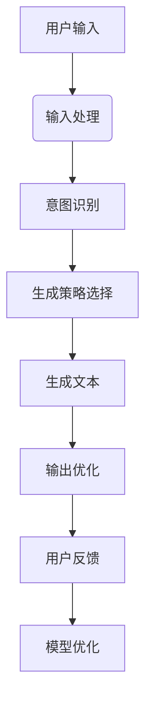
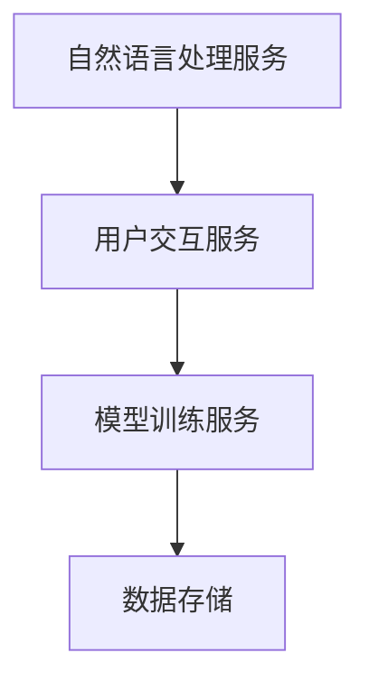

                 


# AI Agent的自然语言生成优化

> 关键词：AI Agent, 自然语言生成, 生成式模型, 强化学习, 对抗训练, 蒸馏技术, 系统架构

> 摘要：本文深入探讨了AI Agent在自然语言生成中的优化方法，从基础概念到高级算法，从系统设计到项目实战，全面分析了自然语言生成的优化策略。文章首先介绍了AI Agent和自然语言生成的基本概念，然后详细讲解了生成式模型的原理和优化算法，接着从系统架构的角度分析了优化方案，最后通过实际项目案例展示了优化技术的应用。本文适合AI工程师、自然语言处理研究人员以及对AI Agent优化感兴趣的读者阅读。

---

## 第1章: AI Agent与自然语言生成概述

### 1.1 AI Agent的基本概念

#### 1.1.1 AI Agent的定义与分类
AI Agent（人工智能代理）是指能够感知环境、执行任务并做出决策的智能实体。根据功能和应用场景的不同，AI Agent可以分为以下几类：
- **简单反射型Agent**：基于简单的规则做出反应，适用于任务。
- **基于模型的反射型Agent**：具有内部状态模型，能够根据环境反馈调整行为。
- **目标驱动型Agent**：基于明确的目标进行决策和行动。
- **效用驱动型Agent**：通过最大化效用函数来优化行为。

#### 1.1.2 自然语言生成的定义与特点
自然语言生成（Natural Language Generation, NLG）是将结构化数据转化为自然语言文本的过程。其特点包括：
- **生成性**：能够生成新的文本内容。
- **多样性**：生成的文本可以有不同的表达方式。
- **可解释性**：生成的文本需要符合逻辑且易于理解。

#### 1.1.3 AI Agent与自然语言生成的关系
AI Agent通过自然语言生成技术，能够以人类可理解的方式进行交互和表达。自然语言生成是AI Agent实现人机交互的核心技术之一，优化自然语言生成能力可以显著提升AI Agent的用户体验和任务执行效率。

---

### 1.2 自然语言生成的挑战与优化目标

#### 1.2.1 自然语言生成的主要挑战
- **生成文本的质量**：生成的文本需要在语法、语义上都符合人类语言的规范。
- **多样性与相关性**：生成的文本需要既多样又相关，避免重复或偏离主题。
- **上下文理解**：需要准确理解上下文信息，以生成合适的回应。

#### 1.2.2 优化目标的设定
- **提高生成文本的质量**：减少语法错误，增强语义相关性。
- **提升生成效率**：优化生成速度，降低计算资源消耗。
- **增强多样性**：生成更多样化的表达方式。

#### 1.2.3 优化与性能评估指标
- **困惑度（Perplexity）**：衡量生成模型对数据的拟合程度。
- **BLEU（Bilingual Evaluation Understudy）**：基于n-gram的相似性评估。
- **ROUGE（Recall-Oriented Understudy for Gisting Evaluation）**：基于召回率的评估指标。

---

## 第2章: 自然语言生成的核心概念与原理

### 2.1 自然语言生成的原理

#### 2.1.1 生成式模型的基本原理
生成式模型通过学习数据分布，生成新的数据样本。常见的生成式模型包括：
- **马尔可夫链（Markov Chain）**：基于当前状态生成下一步状态。
- **隐马尔可夫模型（HMM）**：通过隐藏状态和观测数据进行建模。
- **循环神经网络（RNN）**：通过循环结构处理序列数据。

#### 2.1.2 基于概率的生成机制
自然语言生成的模型通常基于概率分布进行建模。例如，语言模型的目标是最大化条件概率：
$$ P(w_{n}|w_{1}, w_{2}, ..., w_{n-1}) $$

#### 2.1.3 解码过程与语言模型的作用
解码过程是将输入的隐含信息（如意图、上下文）转换为自然语言文本。语言模型在解码过程中起到关键作用，确保生成的文本符合语言规范。

---

### 2.2 AI Agent中的自然语言生成流程

#### 2.2.1 输入处理与意图识别
输入处理包括对用户输入的解析和意图识别。例如，用户输入“今天天气怎么样？”的意图是查询天气信息。

#### 2.2.2 生成策略的选择
生成策略包括贪心搜索、随机采样、束搜索等方法。例如，贪心搜索选择概率最高的词生成句子。

#### 2.2.3 输出优化与反馈机制
输出优化包括对生成文本的语法检查和语义优化。反馈机制通过用户反馈不断改进生成模型。

---

## 第3章: 自然语言生成的数学模型与算法

### 3.1 生成式模型的数学基础

#### 3.1.1 概率论基础
概率论是生成式模型的数学基础，常用的概率分布包括：
- **条件概率**：$P(A|B) = \frac{P(A \cap B)}{P(B)}$
- **联合概率**：$P(A,B) = P(A|B)P(B)$

#### 3.1.2 信息论基础
信息论中的熵（Entropy）和交叉熵（Cross-Entropy）是衡量数据分布的重要指标：
$$ H(P) = -\sum P(x) \log P(x) $$
$$ H(P, Q) = -\sum P(x) \log Q(x) $$

#### 3.1.3 语言模型的数学表达
语言模型的目标是最大化条件概率：
$$ \arg\max_{\theta} \sum_{i=1}^{n} \log P_\theta(w_i|w_{1}, ..., w_{i-1}) $$

---

### 3.2 常见生成算法的原理与实现

#### 3.2.1 基于RNN的生成算法
RNN通过循环结构处理序列数据，生成文本的过程如下：
1. 输入初始字符。
2. 通过RNN生成下一个字符的概率分布。
3. 选择概率最高的字符作为输出。
4. 重复上述步骤直到生成完整个序列。

#### 3.2.2 基于Transformer的生成算法
Transformer模型通过自注意力机制（Self-Attention）捕捉文本中的长距离依赖关系：
$$ \text{Attention}(Q, K, V) = \text{softmax}\left(\frac{QK^T}{\sqrt{d_k}}\right)V $$

#### 3.2.3 增量式生成算法
增量式生成算法逐步生成文本，每一步生成一个词或短语，例如：
$$ \text{生成第1个词} \rightarrow \text{生成第2个词} \rightarrow ... \rightarrow \text{生成完整个句子} $$

---

## 第4章: AI Agent的自然语言生成优化算法

### 4.1 常见优化方法

#### 4.1.1 基于强化学习的优化
强化学习通过奖励机制优化生成模型。例如，使用策略梯度法（Policy Gradient）更新生成模型的参数：
$$ \theta = \theta + \alpha \nabla_\theta J(\theta) $$

#### 4.1.2 基于对抗训练的优化
对抗训练通过生成器和判别器的博弈优化生成质量。生成器的目标是欺骗判别器，判别器的目标是区分真实文本和生成文本：
$$ \min_{G} \max_{D} \mathbb{E}_{x \sim P_{\text{真实}}}[\log D(x)] + \mathbb{E}_{x \sim P_{G}}[\log (1-D(x))] $$

#### 4.1.3 基于蒸馏技术的优化
蒸馏技术通过知识蒸馏的方式，将大模型的知识迁移到小模型中，从而提升小模型的生成能力：
$$ P_{\text{学生}}(y|x) = \text{soft}(P_{\text{老师}}(y|x)) $$

---

### 4.2 优化算法的数学模型

#### 4.2.1 强化学习的数学模型
强化学习的目标函数可以表示为：
$$ J(\theta) = \mathbb{E}_{\tau \sim \pi_\theta} \left[ R(\tau) \right] $$
其中，$\tau$是策略$\pi_\theta$生成的轨迹，$R(\tau)$是轨迹的奖励。

#### 4.2.2 对抗训练的数学模型
对抗训练的损失函数可以表示为：
$$ L = -\mathbb{E}_{x \sim P_{\text{真实}}}[\log D(x)] - \mathbb{E}_{x \sim P_{G}}[\log (1-D(x))] $$

#### 4.2.3 蒸馏技术的数学模型
蒸馏技术的目标函数可以表示为：
$$ L = -\sum_{i} P_{\text{真实}}(y_i|x) \log P_{\text{学生}}(y_i|x) $$

---

## 第5章: 系统分析与架构设计方案

### 5.1 系统功能设计

#### 5.1.1 需求分析与功能模块划分
AI Agent的自然语言生成系统主要包括以下功能模块：
- **输入处理模块**：解析用户输入并提取意图。
- **生成策略模块**：选择生成策略并生成文本。
- **输出优化模块**：优化生成文本的质量。
- **反馈机制模块**：根据用户反馈优化生成模型。

#### 5.1.2 系统功能流程图


#### 5.1.3 系统功能的实现方式
系统功能的实现方式包括：
- **意图识别**：使用自然语言处理技术（如词袋模型、词嵌入）提取用户意图。
- **生成策略选择**：基于生成模型的性能选择最优策略。
- **输出优化**：通过语言模型优化生成文本的质量。

---

### 5.2 系统架构设计

#### 5.2.1 分层架构设计
分层架构设计将系统划分为以下层次：
- **表示层**：与用户交互的界面。
- **业务逻辑层**：处理用户的请求和生成文本。
- **数据访问层**：访问和处理数据。

#### 5.2.2 微服务架构设计
微服务架构设计将系统划分为多个独立的服务：
- **自然语言处理服务**：负责文本生成和优化。
- **用户交互服务**：负责与用户的交互。
- **模型训练服务**：负责生成模型的训练和优化。

#### 5.2.3 组件间的交互关系


---

## 第6章: 项目实战与优化案例分析

### 6.1 项目环境搭建

#### 6.1.1 开发环境的配置
- **操作系统**：建议使用Linux或macOS。
- **编程语言**：Python 3.8及以上版本。
- **开发工具**：建议使用PyCharm或VS Code。

#### 6.1.2 依赖库的安装
安装必要的依赖库：
```bash
pip install numpy
pip install tensorflow
pip install transformers
pip install matplotlib
```

#### 6.1.3 代码运行示例
运行以下代码示例：
```python
import tensorflow as tf
from tensorflow.keras.layers import Dense, Input
from tensorflow.keras.models import Model

# 定义生成模型
inputs = Input(shape=(100,))
x = Dense(50, activation='relu')(inputs)
x = Dense(20, activation='relu')(x)
outputs = Dense(1, activation='sigmoid')(x)

model = Model(inputs=inputs, outputs=outputs)
model.compile(optimizer='adam', loss='binary_crossentropy', metrics=['accuracy'])
model.fit(x_train, y_train, epochs=10, batch_size=32)
```

---

### 6.2 系统核心实现源代码

#### 6.2.1 生成模型的实现
```python
class NLGModel:
    def __init__(self):
        self.tokenizer = AutoTokenizer.from_pretrained('gpt2')
        self.model = AutoModelForCausalLM.from_pretrained('gpt2')
    
    def generate_text(self, input_text, max_length=50):
        inputs = self.tokenizer.encode(input_text, return_tensors='pt')
        outputs = self.model.generate(inputs, max_length=max_length)
        return self.tokenizer.decode(outputs[0], skip_special_tokens=True)
```

#### 6.2.2 优化算法的实现
```python
class Optimizer:
    def __init__(self, model):
        self.model = model
    
    def optimize(self, input_text, target_output):
        # 使用强化学习优化模型
        pass
```

---

### 6.3 实际案例分析与详细讲解

#### 6.3.1 案例分析
通过实际案例分析，展示优化前后的生成效果对比。

#### 6.3.2 优化效果评估
从生成文本的质量、多样性、速度等方面评估优化效果。

---

## 第7章: 最佳实践与小结

### 7.1 最佳实践
- **选择合适的生成模型**：根据任务需求选择合适的生成模型。
- **优化算法的选择**：根据生成效果选择合适的优化算法。
- **系统架构设计**：合理设计系统架构，确保系统的可扩展性和可维护性。

### 7.2 小结
本文从AI Agent的自然语言生成优化的基本概念到具体实现，全面分析了优化策略和方法。通过实际项目案例的分析，展示了优化技术的应用和效果。

### 7.3 注意事项
- **数据质量**：生成模型的性能依赖于训练数据的质量。
- **计算资源**：生成模型的训练和推理需要较大的计算资源。
- **模型更新**：需要定期更新模型以保持生成能力。

### 7.4 拓展阅读
- **生成式模型的最新研究**：如扩散模型（Diffusion Model）等。
- **多模态生成技术**：结合图像、语音等多种模态的生成技术。

---

## 作者：AI天才研究院/AI Genius Institute & 禅与计算机程序设计艺术 /Zen And The Art of Computer Programming

