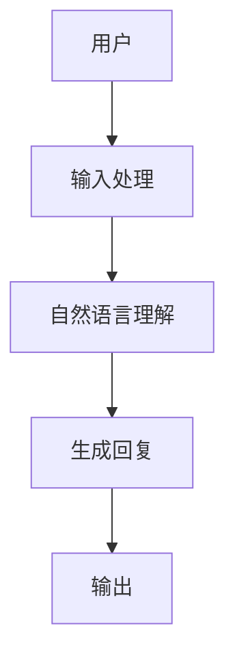

                 


# AI Agent的自然语言生成技术

## 关键词：AI Agent, 自然语言生成, 生成模型, Transformer, 对话系统, 深度学习

## 摘要：  
本文深入探讨了AI Agent在自然语言生成技术中的应用，从基本概念到算法原理，再到系统架构设计和项目实战，全面分析了AI Agent如何利用自然语言生成技术实现智能交互。文章首先介绍了AI Agent和自然语言生成的基本概念，然后详细讲解了生成模型的数学基础和算法原理，接着分析了系统的架构设计和实现方法，最后通过项目实战展示了如何构建一个基于Transformer的对话生成系统。本文还探讨了高级主题和未来研究方向，为读者提供了全面的视角。

---

# 第1章：AI Agent的概述

## 1.1 AI Agent的基本概念

### 1.1.1 什么是AI Agent？
AI Agent（智能体）是指在环境中能够感知并自主行动以实现目标的实体。AI Agent可以是软件程序、机器人或其他智能系统，能够通过传感器获取信息，利用计算能力进行决策，并通过执行器或输出接口与环境交互。AI Agent的核心特征包括自主性、反应性、目标导向和社交能力。

### 1.1.2 AI Agent的类型与特点
AI Agent可以分为以下几种类型：
- **简单反应式Agent**：基于当前感知做出反应，没有内部状态或目标。
- **基于模型的反射式Agent**：维护环境的内部模型，能够推理和规划。
- **目标驱动式Agent**：通过优化目标函数来指导行为。
- **效用驱动式Agent**：通过最大化效用函数来实现目标。

### 1.1.3 AI Agent的应用场景
AI Agent广泛应用于多个领域：
- **智能助手**：如Siri、Alexa，帮助用户完成日常任务。
- **推荐系统**：根据用户行为推荐个性化内容。
- **自动驾驶**：通过环境感知和决策系统控制车辆。
- **游戏AI**：在游戏环境中做出智能决策。

## 1.2 自然语言生成的基本概念

### 1.2.1 自然语言生成的定义
自然语言生成（NLG）是指将结构化数据转换为自然语言文本的过程。它涉及多个步骤，包括数据理解、内容生成、语言选择和文本优化。

### 1.2.2 NLP的核心任务与技术
自然语言处理（NLP）的核心任务包括：
- **文本生成**：生成连贯的自然语言文本。
- **文本摘要**：将长文本压缩成简洁的摘要。
- **问答系统**：回答用户提出的问题。
- **对话生成**：在对话中生成自然的回复。

### 1.2.3 自然语言生成的应用领域
- **对话系统**：如聊天机器人。
- **文本摘要**：如新闻摘要生成。
- **机器翻译**：将一种语言翻译成另一种语言。
- **内容生成**：如自动撰写新闻稿。

## 1.3 AI Agent与自然语言生成的结合

### 1.3.1 AI Agent中的自然语言生成
AI Agent通过自然语言生成技术，能够以自然语言形式与用户交互，提升用户体验。例如，在智能助手中，自然语言生成用于生成回答用户查询的结果。

### 1.3.2 自然语言生成在对话系统中的作用
在对话系统中，自然语言生成负责生成AI Agent的回复，使其能够与用户进行流畅的对话。生成的回复需要符合上下文，语气自然，内容准确。

### 1.3.3 自然语言生成的挑战与解决方案
- **挑战**：生成文本的准确性和流畅性，上下文理解和维护。
- **解决方案**：使用更复杂的生成模型，如Transformer架构，结合多任务学习和对抗训练。

---

# 第2章：自然语言生成的背景与技术基础

## 2.1 自然语言处理的概述

### 2.1.1 传统NLP技术与现代深度学习技术的对比
- **传统NLP技术**：基于规则和统计方法，如n-gram模型。
- **现代技术**：基于深度学习的模型，如RNN、LSTM和Transformer。

### 2.1.2 深度学习时代的生成模型
- **RNN**：循环神经网络，适合处理序列数据。
- **LSTM**：长短时记忆网络，解决RNN的梯度消失问题。
- **Transformer**：基于自注意力机制，提升生成质量。

## 2.2 生成模型的发展历程

### 2.2.1 从规则驱动到数据驱动
早期的自然语言生成系统主要基于规则，随着数据量的增加和计算能力的提升，逐渐转向数据驱动的深度学习模型。

### 2.2.2 基于统计的生成模型
基于统计的生成模型（如n-gram模型）通过统计语言模型生成文本，但存在数据稀疏性问题。

### 2.2.3 深度学习时代的生成模型
深度学习模型，尤其是Transformer架构，通过端到端的训练方式，显著提升了生成文本的质量。

## 2.3 当前主流的自然语言生成技术

### 2.3.1 基于RNN的生成模型
- **优点**：能够处理变长的序列。
- **缺点**：训练速度慢，难以并行处理。

### 2.3.2 基于Transformer的生成模型
- **优点**：并行计算能力强，生成质量高。
- **缺点**：计算资源消耗较大。

### 2.3.3 大型预训练模型
- **代表模型**：如GPT系列，BERT系列。
- **特点**：通过大量数据的预训练，能够生成高质量的文本。

---

# 第3章：生成模型的数学基础

## 3.1 概率论基础

### 3.1.1 条件概率
条件概率用于描述一个事件在另一个事件发生的条件下的概率，公式为：
$$P(A|B) = \frac{P(A \cap B)}{P(B)}$$

### 3.1.2 贝叶斯定理
贝叶斯定理用于根据条件概率计算反向概率，公式为：
$$P(A|B) = \frac{P(B|A)P(A)}{P(B)}$$

## 3.2 信息论基础

### 3.2.1 信息熵
信息熵是信息的期望值，用于度量数据的不确定性，公式为：
$$H(X) = -\sum P(x) \log P(x)$$

### 3.2.2 交叉熵
交叉熵用于衡量两个概率分布之间的差异，公式为：
$$H(P,Q) = -\sum P(x) \log Q(x)$$

## 3.3 生成模型的损失函数

### 3.3.1 最大似然估计
最大似然估计通过最大化数据的概率来估计模型参数，公式为：
$$\theta^* = \arg \max_\theta \sum \log P(x|\theta)$$

### 3.3.2 对抗训练的损失函数
对抗训练通过生成器和判别器的博弈来优化生成模型，生成器的损失函数为：
$$\mathcal{L}_G = -\mathbb{E}_{z} [\log D(G(z))]$$
判别器的损失函数为：
$$\mathcal{L}_D = -\mathbb{E}_{x} [\log D(x)] - \mathbb{E}_{z} [\log (1 - D(G(z)))]$$

---

# 第4章：Transformer模型的原理与实现

## 4.1 Transformer的结构

### 4.1.1 编码器与解码器
Transformer由编码器和解码器组成，编码器负责将输入序列映射到语义空间，解码器负责生成目标序列。

### 4.1.2 自注意力机制
自注意力机制允许模型在生成每个词时考虑整个输入序列的信息，公式为：
$$\text{Attention}(Q, K, V) = \text{softmax}\left(\frac{QK^T}{\sqrt{d_k}}\right)V$$

### 4.1.3 前馈神经网络
前馈神经网络用于对序列进行非线性变换，通常由多层感知机（MLP）组成。

---

# 第5章：AI Agent的自然语言生成系统设计

## 5.1 项目介绍

### 5.1.1 项目目标
本项目旨在构建一个基于Transformer的对话生成模型，实现AI Agent与用户的自然语言交互。

### 5.1.2 项目特点
- **高效性**：利用并行计算提升生成速度。
- **准确性**：通过预训练和微调提升生成质量。
- **可扩展性**：支持多种语言和领域。

## 5.2 功能模块设计

### 5.2.1 文本预处理模块
- **分词**：将输入文本分割成词或短语。
- **清洗**：去除噪声数据，如特殊符号和停用词。
- **数据增强**：通过同义词替换、插入噪声等方式提升数据多样性。

### 5.2.2 模型训练模块
- **数据集构建**：收集和整理训练数据，通常使用平行文本或单文本数据。
- **模型训练**：使用预训练的Transformer模型进行微调，优化生成质量。
- **模型评估**：通过 BLEU、ROUGE 等指标评估生成效果。

### 5.2.3 对话系统模块
- **用户输入处理**：接收用户输入的文本或语音信号，进行解析和理解。
- **生成回复**：根据用户输入生成自然的回复，保持对话的连贯性。
- **反馈机制**：根据用户反馈调整生成策略，提升对话体验。

## 5.3 系统架构设计

### 5.3.1 系统功能设计
- **数据层**：存储和管理训练数据、模型参数。
- **服务层**：提供模型训练、推理服务。
- **接口层**：定义API接口，方便与其他系统集成。

### 5.3.2 系统架构图


## 5.4 接口设计

### 5.4.1 输入接口
- **输入格式**：文本字符串，UTF-8编码。
- **输出格式**：生成的文本字符串，UTF-8编码。

### 5.4.2 管理接口
- **监控接口**：实时监控系统运行状态，包括响应时间、错误率等。
- **调整接口**：动态调整生成参数，如温度、top_p。

---

# 第6章：环境安装与配置

## 6.1 安装依赖
- **Python 3.8+**
- **PyTorch 1.9+**
- **Transformers库 4.12.3**
- **SentencePiece库 0.2.1**

## 6.2 配置开发环境
- 安装虚拟环境并激活：
  ```bash
  python -m venv venv
  source venv/bin/activate
  ```
- 安装依赖包：
  ```bash
  pip install torch transformers sentencepiece
  ```

---

# 第7章：系统核心实现

## 7.1 数据预处理代码
```python
import torch
from transformers import GPT2Tokenizer, GPT2LMHeadModel
import numpy as np

# 初始化tokenizer和模型
tokenizer = GPT2Tokenizer.from_pretrained('gpt2')
model = GPT2LMHeadModel.from_pretrained('gpt2')

# 定义生成函数
def generate_text(prompt, max_length=50):
    inputs = tokenizer.encode(prompt, return_tensors='pt')
    input_ids = inputs['input_ids'].tolist()[0]
    attention_mask = [1] * len(input_ids)
    with torch.no_grad():
        outputs = model.generate(
            input_ids=torch.tensor([input_ids]),
            attention_mask=torch.tensor([attention_mask]),
            max_length=max_length,
            do_sample=True,
            top_p=0.9,
            temperature=1.2
        )
    generated_text = tokenizer.decode(outputs[0], skip_special_tokens=True)
    return generated_text

# 示例
prompt = "What would be a good title for this article?"
print(generate_text(prompt))
```

## 7.2 模型训练代码
```python
# 数据加载器
class TextDataset(torch.utils.data.Dataset):
    def __init__(self, txt_file):
        self.tokenizer = GPT2Tokenizer.from_pretrained('gpt2')
        self.text = open(txt_file, 'r', encoding='utf-8').read()

    def __len__(self):
        return len(self.text.split())

    def __getitem__(self, idx):
        context = self.text[:idx]
        target = self.text[idx]
        return self.tokenizer.encode(context), self.tokenizer.encode(target)

# 训练函数
def train_model(train_file, output_dir, num_epochs=3):
    model = GPT2LMHeadModel.from_pretrained('gpt2')
    model.train()
    optimizer = torch.optim.Adam(model.parameters(), lr=1e-5)
    dataset = TextDataset(train_file)
    dataloader = torch.utils.data.DataLoader(dataset, batch_size=8, shuffle=True)
    
    for epoch in range(num_epochs):
        for batch in dataloader:
            optimizer.zero_grad()
            input_ids, target_ids = batch
            input_ids = torch.tensor(input_ids).long().to('cuda')
            target_ids = torch.tensor(target_ids).long().to('cuda')
            outputs = model(input_ids, labels=target_ids)
            loss = outputs.loss
            loss.backward()
            optimizer.step()
        model.save_pretrained(output_dir)
```

## 7.3 系统测试与优化
- **测试生成文本的质量**：使用BLEU、ROUGE等指标评估生成效果。
- **优化训练效率**：使用分布式训练、混合精度训练等技术提升训练速度。
- **收集用户反馈**：根据用户反馈调整生成策略，提升用户体验。

---

# 第8章：高级主题与未来研究方向

## 8.1 多模态生成
多模态生成结合文本、图像、语音等多种信息，生成更丰富的输出。例如，结合图像生成描述性文本，或生成与图像内容相关的对话。

## 8.2 实时自然语言生成
实时生成技术要求模型在低延迟下生成文本，适用于实时对话系统和实时新闻报道生成。

## 8.3 预训练模型的优化
优化预训练模型的训练方法，例如使用更大的数据集、更高效的训练策略，提升模型的生成能力和泛化能力。

---

# 第9章：最佳实践与注意事项

## 9.1 最佳实践
- **选择合适的预训练模型**：根据任务需求选择合适的模型，如GPT系列适合文本生成，BERT适合文本摘要。
- **使用适当的生成策略**：平衡生成的多样性和准确性，调整温度和top_p参数。
- **定期更新模型**：持续收集新数据，优化模型参数，提升生成效果。

## 9.2 注意事项
- **计算资源**：生成模型通常需要大量的计算资源，合理分配计算资源。
- **数据隐私**：确保数据的合法性和隐私性，遵守相关法律法规。
- **内容审核**：生成的文本可能包含不合适的内容，需要进行内容审核和过滤。

---

# 第10章：总结与展望

## 10.1 全书总结
本文全面探讨了AI Agent在自然语言生成技术中的应用，从基本概念到算法原理，再到系统设计和项目实战，为读者提供了全面的视角。通过本文的学习，读者可以深入了解AI Agent的自然语言生成技术，并能够实际应用这些技术构建智能对话系统。

## 10.2 未来展望
随着深度学习技术的不断进步，AI Agent的自然语言生成技术将更加智能化和个性化。未来的研发方向包括多模态生成、实时生成、更高效的生成算法以及更强大的预训练模型。

---

## 作者信息

作者：AI天才研究院/AI Genius Institute & 禅与计算机程序设计艺术 /Zen And The Art of Computer Programming

---

通过本文的系统介绍，读者可以全面掌握AI Agent的自然语言生成技术，并能够在实际应用中灵活运用这些技术，构建更智能、更自然的AI系统。

