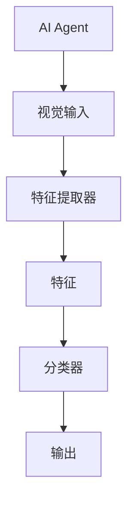
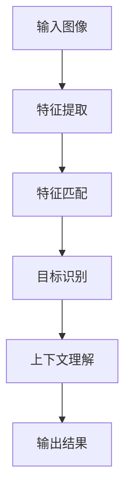
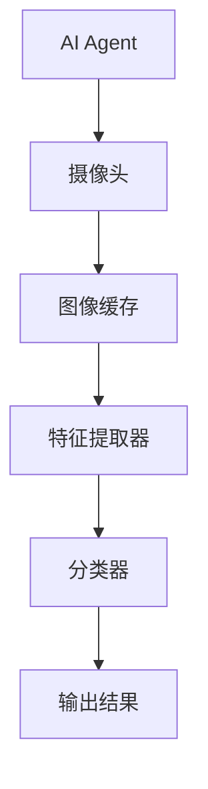

                 


# AI Agent的视觉理解能力增强

> 关键词：AI Agent, 视觉理解, 人工智能, 机器学习, 计算机视觉, 系统架构, 项目实战

> 摘要：本文将深入探讨AI Agent的视觉理解能力增强的关键技术与实现方法。通过分析视觉理解的核心概念、算法原理、系统架构设计，以及实际项目实战，全面解析如何提升AI Agent在复杂场景下的视觉感知与理解能力。本文适合对AI技术感兴趣的技术人员、开发者以及研究者阅读。

---

# 第一部分: AI Agent的视觉理解能力增强基础

## 第1章: AI Agent与视觉理解能力概述

### 1.1 AI Agent的基本概念

#### 1.1.1 AI Agent的定义与特点
AI Agent（人工智能代理）是指能够感知环境、自主决策并执行任务的智能实体。它具备以下特点：
- **自主性**：能够在没有外部干预的情况下自主运行。
- **反应性**：能够实时感知环境并做出反应。
- **目标导向**：具备明确的目标，所有行为都围绕目标展开。
- **学习能力**：能够通过经验改进自身的性能。

#### 1.1.2 视觉理解能力在AI Agent中的重要性
视觉理解能力是AI Agent实现智能决策的关键能力之一。通过视觉感知，AI Agent可以识别人类、物体、场景等信息，从而更好地理解环境并做出合理的决策。

#### 1.1.3 当前AI Agent视觉理解能力的挑战与机遇
- **挑战**：复杂的视觉场景、光照变化、物体遮挡等问题。
- **机遇**：深度学习技术的快速发展为视觉理解能力的提升提供了新的可能性。

### 1.2 视觉理解能力的核心概念

#### 1.2.1 视觉理解能力的定义
视觉理解能力是指AI Agent能够从图像或视频中提取有意义的信息，并通过上下文推理理解场景的能力。

#### 1.2.2 视觉理解能力的关键要素
- **特征提取**：从图像中提取有用的特征信息。
- **目标识别**：识别图像中的具体目标或物体。
- **上下文推理**：理解目标之间的关系和场景的整体含义。

#### 1.2.3 视觉理解能力的边界与外延
- **边界**：视觉理解能力的边界在于如何准确地提取和理解图像中的信息。
- **外延**：视觉理解能力的外延包括与听觉、触觉等其他感知能力的结合。

### 1.3 本章小结
本章主要介绍了AI Agent的基本概念、视觉理解能力的重要性以及当前面临的挑战与机遇。通过这些内容，读者可以初步理解视觉理解能力在AI Agent中的核心地位。

---

## 第2章: AI Agent视觉理解能力的核心概念与联系

### 2.1 核心概念原理

#### 2.1.1 视觉感知与理解的基本原理
视觉感知是通过摄像头或其他传感器获取图像信息，并通过算法提取特征，最终理解图像内容的过程。

#### 2.1.2 视觉特征提取与目标识别的关系
- **视觉特征提取**：提取图像中的低级特征（如边缘、纹理）和高级特征（如物体形状、语义信息）。
- **目标识别**：基于提取的特征，识别图像中的具体目标。

#### 2.1.3 视觉理解与上下文推理的联系
- **上下文推理**：通过分析目标之间的关系，理解场景的整体含义。
- **视觉理解**：结合上下文推理，提升目标识别的准确性。

### 2.2 核心概念属性特征对比

#### 2.2.1 视觉特征提取方法对比
| 方法             | 特点                     |
|------------------|--------------------------|
| Haar特征         | 计算简单，适合人脸检测   |
| HOG特征          | 常用于目标检测           |
| CNN特征          | 能够提取深层次语义信息   |

#### 2.2.2 目标识别算法对比
| 算法             | 适用场景                 |
|------------------|--------------------------|
| HOG + SVM        | 适合小目标检测           |
| Fast R-CNN       | 适合大目标检测           |
| YOLO             | 适合实时目标检测         |

#### 2.2.3 视觉理解模型的性能对比
| 模型             | 准确率                   | 实时性                 |
|------------------|--------------------------|------------------------|
| Faster R-CNN    | 高                     | 较低                   |
| YOLOv5           | 中高                   | 较高                   |

### 2.3 实体关系图（ER图）架构



### 2.4 本章小结
本章通过对比分析，详细讲解了视觉理解能力的核心概念及其相互关系。通过对比不同方法和算法的优缺点，读者可以更好地理解视觉理解能力的实现原理。

---

## 第3章: AI Agent视觉理解能力的算法原理

### 3.1 算法原理概述

#### 3.1.1 视觉特征提取算法
- **CNN（卷积神经网络）**：通过卷积操作提取图像的特征信息。
- **ResNet**：通过残差结构提升网络的深度和性能。

#### 3.1.2 目标识别算法
- **Faster R-CNN**：结合了区域建议网络（RPN）和CNN，实现高效的目标检测。
- **YOLO**：通过单个网络直接预测边界框和类别，实现端到端的目标检测。

#### 3.1.3 视觉理解模型的构建
- **注意力机制**：通过注意力机制，提升模型对关键区域的感知能力。
- **多任务学习**：同时学习目标识别和场景理解，提升模型的综合性能。

### 3.2 算法流程图



### 3.3 算法实现代码示例

#### 3.3.1 使用YOLOv5进行目标识别的代码示例

```python
import torch
from yolov5.models import * 
from yolov5.utils.general import *

# 加载YOLOv5模型
model = torch.hub.load('ultralytics/yolov5', 'yolov5s')

# 设置设备为GPU
device = torch.device('cuda' if torch.cuda.is_available() else 'cpu')
model = model.to(device)

# 定义输入图像
image = cv2.imread('input.jpg')

# 推理
results = model(image, augment=False)

# 解析结果
for pred in results:
    for box in pred['boxes']:
        x1, y1, x2, y2, label, score = box
        cv2.rectangle(image, (x1, y1), (x2, y2), (0, 255, 0), 2)
        cv2.putText(image, f'{label} {score:.2f}', (x1, y1-10), cv2.FONT_HERSHEY_SIMPLEX, 0.5, (0, 255, 0), 2)
```

#### 3.3.2 使用Faster R-CNN进行目标识别的代码示例

```python
import tensorflow as tf
from tensorflow.keras import layers

# 定义Faster R-CNN模型
def build_model():
    model = tf.keras.Sequential([
        layers.Conv2D(32, (3,3), activation='relu', input_shape=(224, 224, 3)),
        layers.MaxPooling2D((2,2)),
        layers.Conv2D(64, (3,3), activation='relu'),
        layers.MaxPooling2D((2,2)),
        layers.Flatten(),
        layers.Dense(64, activation='relu'),
        layers.Dense(10, activation='softmax')
    ])
    return model

# 加载预训练模型
model = build_model()
model.load_weights('faster_rcnn_weights.h5')

# 推理
image = cv2.imread('input.jpg')
image = cv2.resize(image, (224, 224))
image = image / 255.0
image = np.expand_dims(image, axis=0)
prediction = model.predict(image)
print('预测结果:', prediction)
```

### 3.4 本章小结
本章详细讲解了视觉理解能力的算法原理，包括特征提取、目标识别和上下文理解。通过具体的代码示例，读者可以更好地理解这些算法的实现细节。

---

## 第4章: AI Agent视觉理解能力的系统分析与架构设计

### 4.1 系统分析

#### 4.1.1 问题场景介绍
AI Agent需要在复杂的视觉场景中，准确识别目标并理解场景，例如在自动驾驶、智能安防等领域。

#### 4.1.2 系统功能设计
- **图像采集**：通过摄像头或其他传感器获取图像信息。
- **特征提取**：提取图像的特征信息。
- **目标识别**：识别图像中的具体目标。
- **上下文理解**：理解目标之间的关系和场景的整体含义。

#### 4.1.3 系统架构设计



### 4.2 系统架构设计

#### 4.2.1 系统架构图


#### 4.2.2 系统接口设计
- **输入接口**：摄像头或其他传感器获取图像信息。
- **输出接口**：显示结果或输出决策指令。
- **内部接口**：特征提取器与分类器之间的数据传递。

#### 4.2.3 系统交互流程图


### 4.3 本章小结
本章通过系统分析与架构设计，详细讲解了AI Agent视觉理解能力的实现过程。通过架构图和交互流程图，读者可以更好地理解整个系统的运行机制。

---

## 第5章: AI Agent视觉理解能力的项目实战

### 5.1 项目环境安装

#### 5.1.1 安装Python
```bash
python --version
```

#### 5.1.2 安装必要的库
```bash
pip install numpy
pip install matplotlib
pip install tensorflow
pip install keras
pip install opencv-python
```

### 5.2 核心代码实现

#### 5.2.1 特征提取代码

```python
import cv2

def extract_features(image):
    # 使用OpenCV提取特征
    gray = cv2.cvtColor(image, cv2.COLOR_RGB2GRAY)
    edges = cv2.Canny(gray, 100, 200)
    return edges
```

#### 5.2.2 目标识别代码

```python
import tensorflow as tf
from tensorflow.keras import layers

def build_model():
    model = tf.keras.Sequential([
        layers.Conv2D(32, (3,3), activation='relu', input_shape=(224, 224, 3)),
        layers.MaxPooling2D((2,2)),
        layers.Conv2D(64, (3,3), activation='relu'),
        layers.MaxPooling2D((2,2)),
        layers.Flatten(),
        layers.Dense(64, activation='relu'),
        layers.Dense(10, activation='softmax')
    ])
    return model

# 加载预训练模型
model = build_model()
model.load_weights('weights.h5')

# 推理
image = cv2.imread('input.jpg')
image = cv2.resize(image, (224, 224))
image = image / 255.0
image = np.expand_dims(image, axis=0)
prediction = model.predict(image)
print('预测结果:', prediction)
```

#### 5.2.3 上下文理解代码

```python
import tensorflow as tf
from tensorflow.keras import layers

def build_model():
    model = tf.keras.Sequential([
        layers.Conv2D(32, (3,3), activation='relu', input_shape=(224, 224, 3)),
        layers.MaxPooling2D((2,2)),
        layers.Conv2D(64, (3,3), activation='relu'),
        layers.MaxPooling2D((2,2)),
        layers.Flatten(),
        layers.Dense(64, activation='relu'),
        layers.Dense(10, activation='softmax')
    ])
    return model

# 加载预训练模型
model = build_model()
model.load_weights('weights.h5')

# 推理
image = cv2.imread('input.jpg')
image = cv2.resize(image, (224, 224))
image = image / 255.0
image = np.expand_dims(image, axis=0)
prediction = model.predict(image)
print('预测结果:', prediction)
```

### 5.3 项目实战小结
本章通过具体的项目实战，详细讲解了AI Agent视觉理解能力的实现过程。通过代码示例，读者可以更好地理解如何在实际项目中应用这些技术。

---

## 第6章: 最佳实践、小结、注意事项与拓展阅读

### 6.1 最佳实践 Tips
- **数据预处理**：对图像进行归一化处理，确保模型输入的一致性。
- **模型优化**：通过数据增强、学习率调整等方法优化模型性能。
- **实时性优化**：通过硬件加速（如GPU）提升模型的推理速度。

### 6.2 小结
本文详细讲解了AI Agent视觉理解能力的实现过程，包括核心概念、算法原理、系统架构设计和项目实战。通过这些内容，读者可以全面理解AI Agent视觉理解能力的关键技术与实现方法。

### 6.3 注意事项
- **数据隐私**：在处理图像数据时，需要注意数据的隐私保护。
- **模型泛化能力**：在实际应用中，需要关注模型的泛化能力，避免过拟合。

### 6.4 拓展阅读
- **深度学习经典论文**：阅读相关领域的经典论文，深入理解算法原理。
- **前沿技术跟踪**：关注视觉理解领域的最新研究成果，保持技术领先。

---

# 作者：AI天才研究院/AI Genius Institute & 禅与计算机程序设计艺术 /Zen And The Art of Computer Programming

