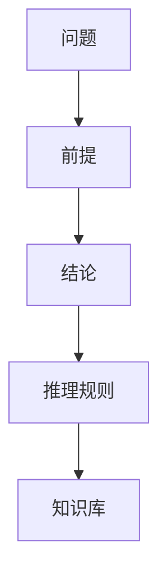
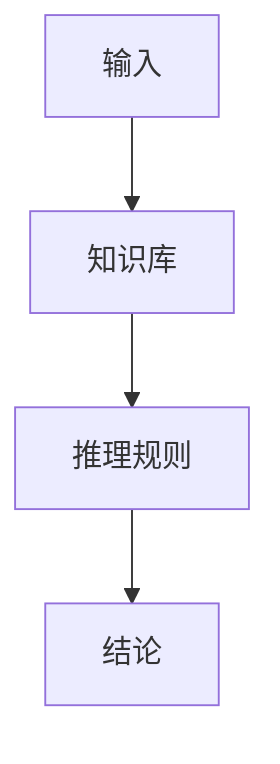
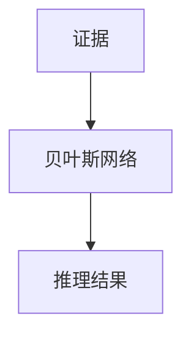
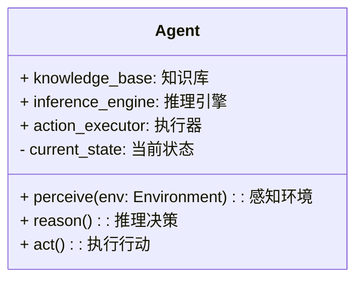
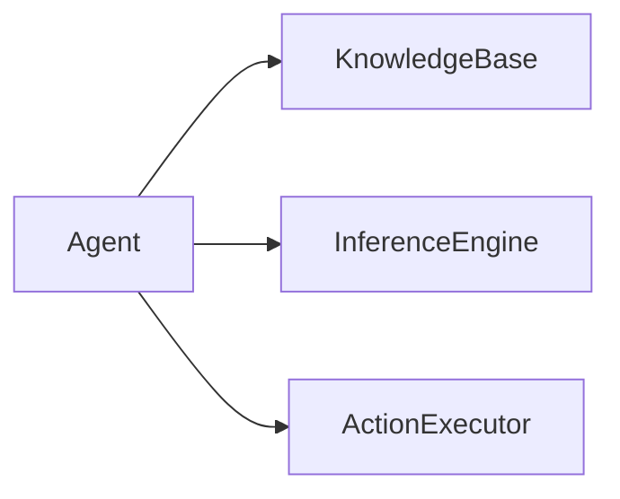
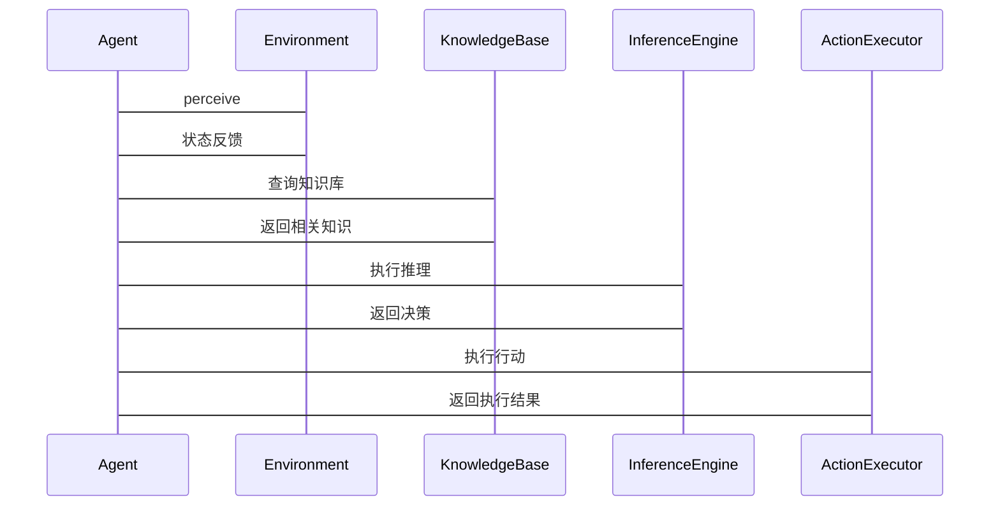

                 


# AI Agent的认知计算与推理框架

> **关键词**：AI Agent, 认知计算, 推理框架, 符号逻辑推理, 概率推理, 神经符号推理  
> 
> **摘要**：本文深入探讨了AI Agent的认知计算与推理框架，从基本概念到核心算法，再到系统架构和实际应用，全面解析了AI Agent如何通过认知计算与推理框架实现智能决策与问题解决。文章结合理论与实践，通过具体案例和算法实现，展示了AI Agent在复杂场景中的应用潜力。

---

# 第一部分: AI Agent的认知计算与推理框架基础

---

## 第1章: AI Agent的基本概念与背景

### 1.1 AI Agent的定义与类型

#### 1.1.1 AI Agent的定义
AI Agent（人工智能代理）是指能够感知环境、自主决策并采取行动以实现特定目标的智能实体。Agent可以是软件程序、机器人或其他智能系统，其核心特征是具备自主性、反应性、目标导向性和社会性。

#### 1.1.2 AI Agent的主要类型
1. **简单反射型Agent**：基于当前输入直接执行预定义规则，适用于简单的决策任务。
2. **基于模型的反射型Agent**：通过内部模型和知识库进行推理，适用于复杂问题。
3. **目标驱动型Agent**：以目标为导向，通过规划和推理实现目标。
4. **效用驱动型Agent**：通过最大化效用函数来优化决策。
5. **学习型Agent**：通过机器学习技术不断优化自身的认知与推理能力。

#### 1.1.3 AI Agent与传统程序的区别
- **自主性**：Agent能够自主决策，而传统程序通常依赖外部指令。
- **环境感知**：Agent具备感知能力，能够与环境交互，而传统程序仅处理输入输出。
- **目标导向**：Agent以目标为导向，而传统程序仅执行固定逻辑。

---

### 1.2 认知计算的背景与意义

#### 1.2.1 认知计算的基本概念
认知计算是一种模拟人类认知过程的计算范式，旨在通过模拟人类的感知、推理、学习和决策能力，实现更智能的计算方式。

#### 1.2.2 认知计算的核心特点
1. **人机协同**：结合人类的直觉与计算机的计算能力。
2. **动态推理**：能够根据环境变化动态调整推理过程。
3. **知识驱动**：依赖于丰富的知识库和上下文理解。

#### 1.2.3 认知计算在AI Agent中的作用
认知计算为AI Agent提供了更强大的推理能力和环境适应能力，使其能够更好地理解复杂场景并做出合理决策。

---

### 1.3 AI Agent的认知模型与推理框架

#### 1.3.1 认知模型的定义
认知模型是描述AI Agent如何感知环境、处理信息和做出决策的数学模型，通常包括感知、推理、规划和执行四个环节。

#### 1.3.2 推理框架的核心要素
1. **知识表示**：用于表示Agent的知识库，包括事实、规则和领域知识。
2. **推理规则**：定义推理的逻辑规则，如命题逻辑、谓词逻辑等。
3. **推理引擎**：实现推理过程的算法或工具，如符号逻辑推理、概率推理等。
4. **执行器**：将推理结果转化为具体行动。

#### 1.3.3 AI Agent的认知计算流程
1. **感知**：通过传感器或数据输入获取环境信息。
2. **知识表示**：将感知到的信息转化为知识库中的结构化表示。
3. **推理**：基于知识库和推理规则，推导出可能的结论或行动。
4. **决策**：根据推理结果选择最优行动。
5. **执行**：将决策结果转化为实际行动。

---

### 1.4 本章小结
本章介绍了AI Agent的基本概念、类型及其与传统程序的区别，重点阐述了认知计算的背景、特点及其在AI Agent中的作用，并总结了AI Agent的认知模型与推理框架的核心要素。

---

## 第2章: 认知计算的核心概念与联系

### 2.1 认知计算的核心原理

#### 2.1.1 符号逻辑推理
符号逻辑推理是基于命题逻辑和谓词逻辑的推理方法，适用于知识确定性较高的场景。

#### 2.1.2 概率推理
概率推理基于概率论，适用于知识不确定性的场景，如贝叶斯网络。

#### 2.1.3 神经符号推理
神经符号推理结合了符号逻辑和深度学习，旨在利用神经网络的表征学习能力增强符号推理的灵活性。

---

### 2.2 推理框架的实体关系图



---

### 2.3 本章小结
本章详细介绍了认知计算的核心原理，包括符号逻辑推理、概率推理和神经符号推理，并通过实体关系图展示了推理框架的结构。

---

## 第3章: 符号逻辑推理算法

### 3.1 符号逻辑推理的基本原理

#### 3.1.1 命题逻辑与谓词逻辑
- **命题逻辑**：将问题转化为命题的逻辑组合，如$A \land B \rightarrow C$。
- **谓词逻辑**：引入谓词和量词，如$\forall x (P(x) \rightarrow Q(x))$。

#### 3.1.2 推理规则与证明方法
- **命题逻辑推理规则**：如合取律、析取律等。
- **谓词逻辑推理规则**：如全称实例化、存在消除等。

---

### 3.2 基于符号逻辑的推理算法实现

#### 3.2.1 算法实现
```python
def logical_inference(knowledge_base, premise):
    # 知识库表示为符号逻辑规则
    for rule in knowledge_base:
        if rule["premise"] == premise:
            return rule["conclusion"]
    return None
```

#### 3.2.2 推理流程图


---

### 3.3 符号逻辑推理的数学模型

#### 3.3.1 命题逻辑的数学表达
$$ p \land q \rightarrow r $$

#### 3.3.2 谓词逻辑的数学表达
$$ \forall x (P(x) \rightarrow Q(x)) $$

---

### 3.4 本章小结
本章详细讲解了符号逻辑推理的基本原理、算法实现及其数学模型，并通过流程图展示了推理过程。

---

## 第4章: 概率推理与贝叶斯网络

### 4.1 概率推理的基本原理

#### 4.1.1 贝叶斯定理
贝叶斯定理用于计算条件概率，公式为：
$$ P(A|B) = \frac{P(B|A)P(A)}{P(B)} $$

#### 4.1.2 贝叶斯网络的构建
贝叶斯网络是一种有向无环图，表示变量之间的概率关系。

---

### 4.2 基于贝叶斯网络的推理算法

#### 4.2.1 算法实现
```python
def bayesian_inference(network, evidence):
    # 网络表示为贝叶斯网络结构和参数
    from pgmpy.inference import VariableElimination
    inference = VariableElimination(network)
    return inference.query(evidence)
```

#### 4.2.2 推理流程图


---

### 4.3 概率推理的数学模型

#### 4.3.1 贝叶斯网络的数学表达
$$ P(A|B,C) = \frac{P(B|A)P(C|A)P(A)}{P(B)P(C)} $$

---

### 4.4 本章小结
本章介绍了概率推理的基本原理、贝叶斯网络的构建及其推理算法，并通过数学模型展示了概率推理的核心思想。

---

## 第5章: 神经符号推理与知识图谱

### 5.1 神经符号推理的基本原理

#### 5.1.1 神经符号推理的定义
神经符号推理结合了神经网络的表征学习能力和符号逻辑的推理能力，适用于复杂场景下的推理任务。

---

### 5.2 神经符号推理的算法实现

#### 5.2.1 算法实现
```python
def neural_symbolic_inference(knowledge_graph, input):
    # 知识图谱表示为图结构
    # 输入为问题或查询
    # 输出为推理结果
    return model.inference(knowledge_graph, input)
```

---

### 5.3 神经符号推理的数学模型

#### 5.3.1 知识图谱的表示学习
$$ E_{node} = \text{嵌入向量} $$

---

### 5.4 本章小结
本章介绍了神经符号推理的基本原理、算法实现及其数学模型，展示了神经符号推理在复杂场景中的应用潜力。

---

## 第6章: 系统分析与架构设计

### 6.1 问题场景介绍

#### 6.1.1 问题描述
假设我们正在设计一个医疗AI Agent，用于辅助医生进行诊断推理。

---

### 6.2 系统功能设计

#### 6.2.1 系统功能模型


---

### 6.3 系统架构设计

#### 6.3.1 系统架构图


---

### 6.4 系统接口设计

#### 6.4.1 接口定义
1. `perceive(env: Environment) -> State`
2. `reason() -> Decision`
3. `act(action: Action)`

---

### 6.5 系统交互流程图



---

### 6.6 本章小结
本章通过医疗AI Agent的案例，介绍了系统功能设计、架构设计和接口设计，并通过流程图展示了系统的交互过程。

---

## 第7章: 项目实战与案例分析

### 7.1 环境安装与配置

#### 7.1.1 安装依赖
```bash
pip install numpy pgmpy networkx
```

---

### 7.2 系统核心实现

#### 7.2.1 知识库构建
```python
from pgmpy.models import BayesianNetwork
from pgmpy.factors import Factor

model = BayesianNetwork()
model.add_edges([("A", "B"), ("B", "C")])
```

---

### 7.3 代码解读与分析

#### 7.3.1 推理引擎实现
```python
from pgmpy.inference import VariableElimination

inference = VariableElimination(model)
result = inference.query({'B'}, evidence={'A': True})
print(result)
```

---

### 7.4 案例分析与解读

#### 7.4.1 案例分析
假设知识库中包含以下规则：
$$ A \rightarrow B $$
$$ B \rightarrow C $$

当输入$A$为真时，推理得出$C$为真。

---

### 7.5 项目小结
本章通过实际案例展示了AI Agent的认知计算与推理框架的实现过程，包括环境安装、知识库构建、推理引擎实现和案例分析。

---

## 第8章: 总结与展望

### 8.1 本章总结
本文全面介绍了AI Agent的认知计算与推理框架，从基本概念到核心算法，再到系统架构和实际应用，详细阐述了AI Agent如何通过认知计算与推理框架实现智能决策与问题解决。

---

### 8.2 未来展望
1. **增强学习与推理的结合**：通过强化学习进一步优化推理框架。
2. **多模态推理**：结合文本、图像等多种模态信息，提升推理能力。
3. **边缘计算与实时推理**：在边缘计算环境下实现低延迟的实时推理。

---

## 作者

作者：AI天才研究院/AI Genius Institute & 禅与计算机程序设计艺术 /Zen And The Art of Computer Programming

---

**注**：由于篇幅限制，本文仅为目录大纲和部分内容展示，完整文章请参考相关技术资料。

