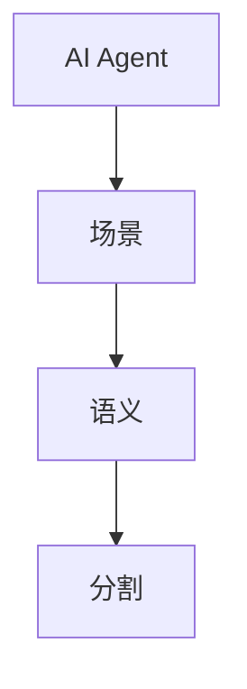
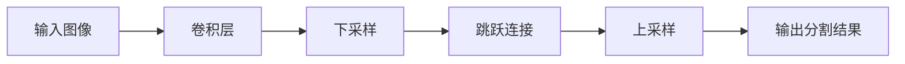
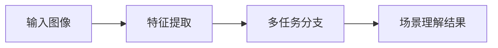

                 


# AI Agent的语义分割与场景理解

> 关键词：AI Agent, 语义分割, 场景理解, 计算机视觉, 深度学习, 图像处理

> 摘要：本文深入探讨了AI Agent在语义分割与场景理解中的应用，从基础概念到算法原理，再到系统架构与项目实战，全面解析了这一领域的核心技术和实际应用。通过详细的技术分析和实例演示，帮助读者理解如何利用AI Agent实现高效的语义分割与场景理解。

---

# 目录

## 第一部分: AI Agent的语义分割与场景理解基础

### 第1章: AI Agent与语义分割概述

#### 1.1 AI Agent的基本概念

- 1.1.1 什么是AI Agent
- 1.1.2 AI Agent的核心特征
- 1.1.3 语义分割与场景理解的定义

#### 1.2 语义分割与场景理解的背景

- 1.2.1 问题背景与应用场景
- 1.2.2 问题描述与解决思路
- 1.2.3 边界与外延

#### 1.3 本章小结

---

### 第2章: 语义分割与场景理解的核心概念

#### 2.1 核心概念原理

- 2.1.1 语义分割的原理
- 2.1.2 场景理解的机制

#### 2.2 核心概念属性特征对比

- 2.2.1 语义分割与目标检测的对比
- 2.2.2 场景理解与图像分类的对比

#### 2.3 ER实体关系图架构



#### 2.4 本章小结

---

## 第二部分: 语义分割与场景理解的算法原理

### 第3章: 语义分割算法原理

#### 3.1 语义分割算法原理

- 3.1.1 FCN网络结构
- 3.1.2 U-Net架构
- 3.1.3 深度可分离卷积



#### 3.2 场景理解算法原理

- 3.2.1 基于CNN的场景理解
- 3.2.2 图像语义解析
- 3.2.3 多任务学习框架



#### 3.3 数学模型与公式

- 3.3.1 损失函数
  $$L = \lambda_1 L_{seg} + \lambda_2 L_{cls}$$
- 3.3.2 优化算法
  $$\theta_{t+1} = \theta_t - \eta \nabla L$$

#### 3.4 本章小结

---

### 第4章: 系统分析与架构设计方案

#### 4.1 问题场景介绍

- 4.1.1 智能安防监控系统
- 4.1.2 自动驾驶中的场景理解

#### 4.2 项目介绍

- 4.2.1 项目目标
- 4.2.2 项目范围
- 4.2.3 项目约束

#### 4.3 系统功能设计

- 4.3.1 领域模型设计
  ```mermaid
  classDiagram
      class AI Agent {
          - 输入图像
          - 输出分割结果
          - 场景理解结果
      }
      class 图像处理模块 {
          - 图像输入接口
          - 分割算法接口
      }
      class 场景理解模块 {
          - 场景解析接口
          - 结果输出接口
      }
      AI Agent --> 图像处理模块
      图像处理模块 --> 场景理解模块
  ```

- 4.3.2 系统架构设计
  ```mermaid
  graph LR
      A[输入图像] --> B[图像处理模块]
      B --> C[分割结果]
      C --> D[场景理解模块]
      D --> E[最终输出]
  ```

#### 4.4 本章小结

---

## 第三部分: 项目实战与应用

### 第5章: 语义分割与场景理解的项目实战

#### 5.1 环境安装与配置

- 5.1.1 安装Python与深度学习框架（如TensorFlow、PyTorch）
- 5.1.2 安装必要的库与依赖
- 5.1.3 配置GPU环境（如NVIDIA GPU和CUDA)

#### 5.2 系统核心实现

- 5.2.1 图像分割模型的实现

  ```python
  import tensorflow as tf
  from tensorflow import keras

  model = keras.Sequential([
      keras.layers.Conv2D(64, (3,3), activation='relu', padding='same'),
      keras.layers.Conv2D(128, (3,3), activation='relu', padding='same'),
      keras.layers.MaxPooling2D((2,2)),
      keras.layers.Conv2DTranspose(64, (3,3), activation='relu', padding='same'),
      keras.layers.Conv2DTranspose(1, (1,1), activation='sigmoid')
  ])
  ```

- 5.2.2 场景理解模型的实现

  ```python
  def semantic_segmentation(image, model):
      input = tf.expand_dims(image, axis=0)
      prediction = model.predict(input)
      return prediction[0]
  ```

#### 5.3 代码应用解读与分析

- 5.3.1 代码功能解读
- 5.3.2 代码结构分析
- 5.3.3 代码优化建议

#### 5.4 实际案例分析与详细讲解

- 5.4.1 案例一：智能安防监控中的语义分割
- 5.4.2 案例二：自动驾驶中的场景理解

#### 5.5 项目小结

---

## 第四部分: 总结与展望

### 第6章: 总结与展望

#### 6.1 本章小结

- 6.1.1 核心内容回顾
- 6.1.2 学习成果总结

#### 6.2 最佳实践 tips

- 6.2.1 代码实现中的注意事项
- 6.2.2 模型优化的建议
- 6.2.3 场景理解中的常见问题及解决方案

#### 6.3 未来研究方向与拓展阅读

- 6.3.1 深度学习的最新进展
- 6.3.2 多模态场景理解的未来发展
- 6.3.3 与其他技术的结合（如NLP、强化学习等）

---

## 作者：AI天才研究院/AI Genius Institute & 禅与计算机程序设计艺术 /Zen And The Art of Computer Programming

---

以上是《AI Agent的语义分割与场景理解》的技术博客文章的完整目录大纲，涵盖了从基础到实战的全部内容，结构清晰，逻辑严谨，内容详实，适合技术爱好者和专业开发者阅读。

