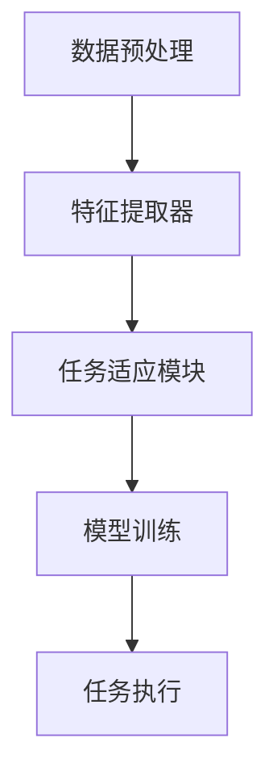

                 


# AI Agent的迁移学习技术应用

> **关键词**：AI Agent，迁移学习，机器学习，算法原理，系统架构，项目实战

> **摘要**：本文深入探讨了AI Agent中的迁移学习技术应用，从基本概念到算法原理，再到系统架构和项目实战，详细分析了迁移学习在AI Agent中的核心作用及其实际应用场景。通过具体案例和代码实现，帮助读者理解如何利用迁移学习提升AI Agent的性能和适应性。

---

## 目录大纲

1. **背景介绍**
   1.1 AI Agent的基本概念与特点
   1.2 迁移学习的基本概念与核心思想
   1.3 AI Agent与迁移学习的结合背景

2. **迁移学习的核心概念与原理**
   2.1 数据驱动的迁移学习
   2.2 任务驱动的迁移学习
   2.3 模型驱动的迁移学习

3. **迁移学习的算法原理与数学模型**
   3.1 特征提取与表示学习
   3.2 参数调整与模型优化
   3.3 常见迁移学习算法的数学公式

4. **AI Agent中的迁移学习系统架构**
   4.1 系统功能设计
   4.2 系统架构设计
   4.3 接口设计与交互流程

5. **项目实战与案例分析**
   5.1 项目环境与工具安装
   5.2 核心实现代码解析
   5.3 案例分析与效果评估

6. **总结与展望**
   6.1 核心内容回顾
   6.2 迁移学习技术的未来发展方向

---

## 正文

### 第1章 背景介绍

#### 1.1 AI Agent的基本概念与特点

**AI Agent**（人工智能代理）是指在计算机系统中，能够感知环境、自主决策并执行任务的智能实体。它具备以下特点：

- **自主性**：能够在没有外部干预的情况下独立运作。
- **反应性**：能够实时感知环境并做出响应。
- **目标导向**：通过设定目标来驱动行为。
- **学习能力**：能够通过经验或数据优化自身的性能。

AI Agent的应用场景广泛，例如智能助手、自动驾驶、机器人控制等。

#### 1.2 迁移学习的基本概念与核心思想

**迁移学习**是一种机器学习技术，旨在将从一个任务或数据集中学到的知识应用到不同的但相关的任务或数据集上。其核心思想是通过共享特征或参数，减少新任务的学习时间或数据需求。

迁移学习的核心思想可以概括为：利用已有的知识或经验，快速适应新环境或新任务。

### 第2章 迁移学习的核心概念与原理

#### 2.1 数据驱动的迁移学习

数据驱动的迁移学习通过共享数据特征，将源任务的数据特征迁移到目标任务中。这种方法的关键在于特征提取和表示学习。

- **特征提取**：通过训练一个特征提取器，将源数据和目标数据映射到一个共同的特征空间中。
- **表示学习**：学习数据的低维表示，使得不同任务的数据在特征空间中具有相似性。

#### 2.2 任务驱动的迁移学习

任务驱动的迁移学习关注任务之间的关系，通过任务适应的方法，将源任务的知识迁移到目标任务中。

- **任务相关性度量**：通过计算源任务和目标任务的相关性，选择合适的迁移方法。
- **任务适应**：通过调整模型参数或优化目标函数，使得模型在目标任务上表现更好。

#### 2.3 模型驱动的迁移学习

模型驱动的迁移学习关注模型的结构和参数，通过共享模型参数，减少目标任务的训练数据需求。

- **模型参数迁移**：将源任务训练好的模型参数迁移到目标任务，并进行微调。
- **模型结构适应**：根据目标任务的特点，调整模型的结构或超参数。

### 第3章 迁移学习的算法原理与数学模型

#### 3.1 特征提取与表示学习

特征提取是迁移学习的重要步骤，常用的方法包括主成分分析（PCA）和自动编码器（Autoencoder）。

- **主成分分析（PCA）**：通过线性变换将高维数据投影到低维空间，提取主要特征。
  $$ \text{PCA的目标是最小化数据的重构误差} $$

- **自动编码器（Autoencoder）**：通过神经网络学习数据的低维表示。
  ```python
  class Autoencoder(nn.Module):
      def __init__(self, input_dim, hidden_dim):
          super(Autoencoder, self).__init__()
          self.encoder = nn.Linear(input_dim, hidden_dim)
          self.decoder = nn.Linear(hidden_dim, input_dim)
  
      def forward(self, x):
          encoded = self.encoder(x)
          decoded = self.decoder(encoded)
          return decoded
  ```

#### 3.2 参数调整与模型优化

迁移学习中的参数调整通常采用微调策略，即将源任务的模型参数迁移到目标任务，并进行少量的微调。

- **微调（Fine-tuning）**：在目标任务上进行少量训练，调整模型参数以适应新任务。
  ```python
  # 微调代码示例
  for param in model.parameters():
      param.requires_grad = True
  
  optimizer = Adam(model.parameters(), lr=1e-4)
  criterion = CrossEntropyLoss()
  
  for epoch in range(num_epochs):
      for inputs, labels in dataloader:
          outputs = model(inputs)
          loss = criterion(outputs, labels)
          loss.backward()
          optimizer.step()
  ```

### 第4章 AI Agent中的迁移学习系统架构

#### 4.1 系统功能设计

AI Agent的迁移学习系统通常包括以下功能模块：

- **数据预处理**：对源数据和目标数据进行清洗、归一化等预处理。
- **特征提取**：提取数据的特征，构建特征空间。
- **模型训练**：训练迁移学习模型，进行参数调整。
- **任务执行**：在目标任务中应用迁移学习后的模型，进行预测和决策。

#### 4.2 系统架构设计

AI Agent的迁移学习系统架构可以分为以下几部分：

- **数据层**：负责数据的获取和预处理。
- **模型层**：包含特征提取器和任务适应模块。
- **接口层**：提供与外部环境交互的接口。

系统架构图如下：



### 第5章 项目实战与案例分析

#### 5.1 项目环境与工具安装

项目实战需要以下工具和环境：

- **编程语言**：Python 3.8+
- **深度学习框架**：TensorFlow或PyTorch
- **开发环境**：Jupyter Notebook或VS Code

#### 5.2 核心实现代码解析

以下是迁移学习在图像分类任务中的应用示例：

```python
import torch
import torch.nn as nn
import torch.optim as optim
from torch.utils.data import DataLoader
import torchvision.transforms as transforms
from torchvision.datasets import CIFAR10

# 数据预处理
transform = transforms.Compose([
    transforms.Resize(32),
    transforms.ToTensor(),
    transforms.Normalize((0.5, 0.5, 0.5), (0.5, 0.5, 0.5))
])

# 加载数据集
train_dataset = CIFAR10(root='./data', train=True, download=True, transform=transform)
train_loader = DataLoader(train_dataset, batch_size=64, shuffle=True)

# 定义特征提取器
class FeatureExtractor(nn.Module):
    def __init__(self):
        super(FeatureExtractor, self).__init__()
        self.conv = nn.Sequential(
            nn.Conv2d(3, 64, kernel_size=3, padding=1),
            nn.ReLU(),
            nn.MaxPool2d(2, 2)
        )
        self.fc = nn.Sequential(
            nn.Linear(64*16*16, 256),
            nn.ReLU()
        )
    
    def forward(self, x):
        x = self.conv(x)
        x = x.view(-1, 64*16*16)
        x = self.fc(x)
        return x

# 定义分类器
class Classifier(nn.Module):
    def __init__(self, num_classes):
        super(Classifier, self).__init__()
        self.fc = nn.Linear(256, num_classes)
    
    def forward(self, x):
        return self.fc(x)

# 迁移学习过程
feature_extractor = FeatureExtractor()
classifier = Classifier(10)

# 冻结特征提取器的参数
for param in feature_extractor.parameters():
    param.requires_grad = False

# 定义优化器和损失函数
optimizer = optim.Adam(classifier.parameters(), lr=0.001)
criterion = nn.CrossEntropyLoss()

# 训练循环
num_epochs = 10
for epoch in range(num_epochs):
    for inputs, labels in train_loader:
        features = feature_extractor(inputs)
        outputs = classifier(features)
        loss = criterion(outputs, labels)
        loss.backward()
        optimizer.step()
```

### 第6章 总结与展望

#### 6.1 核心内容回顾

本文详细介绍了AI Agent中的迁移学习技术，从基本概念到算法原理，再到系统架构和项目实战，帮助读者全面理解迁移学习的应用。

#### 6.2 未来发展方向

迁移学习在AI Agent中的应用前景广阔，未来的研究方向可能包括：

- 更高效的迁移学习算法。
- 更多样化的迁移学习应用场景。
- 更智能化的迁移学习系统设计。

---

**作者**：AI天才研究院/AI Genius Institute & 禅与计算机程序设计艺术 /Zen And The Art of Computer Programming

