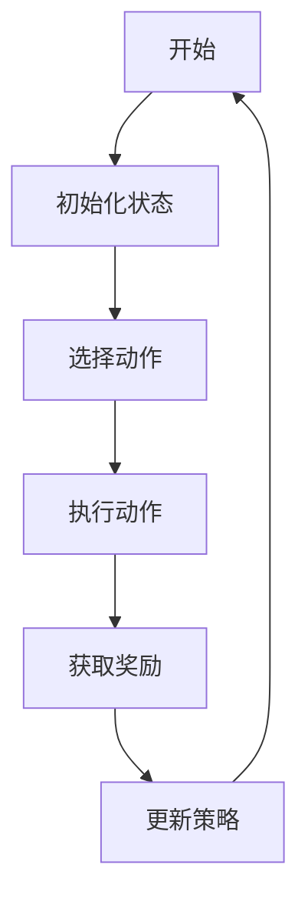
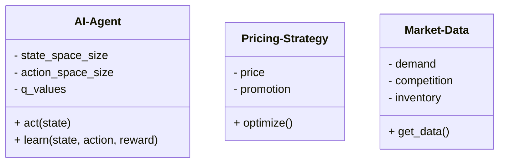
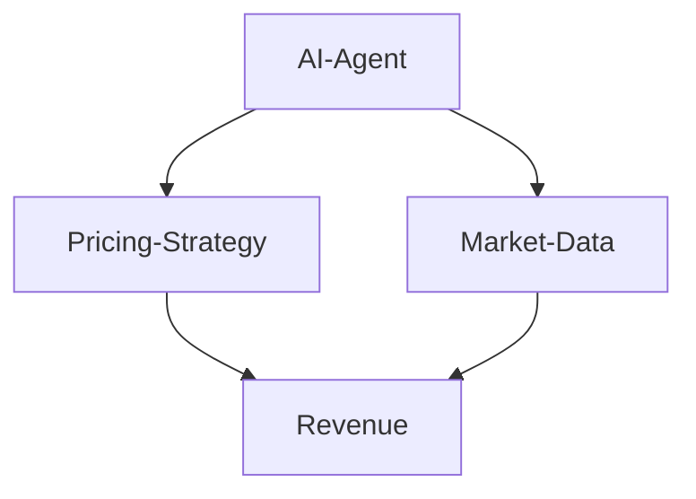
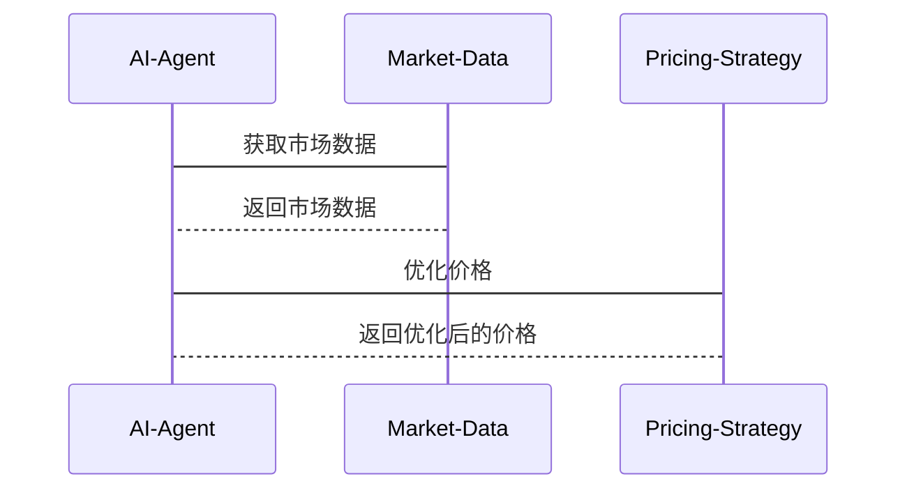

                 


# AI Agent辅助产品定价与促销策略制定的方法

> 关键词：AI Agent，产品定价，促销策略，动态定价，强化学习，数据驱动定价

> 摘要：本文详细探讨了AI Agent在产品定价与促销策略制定中的应用方法，从背景、核心概念、算法原理到系统设计、项目实战，全面解析了AI Agent如何通过强化学习、监督学习等算法优化定价策略，帮助企业在复杂市场环境中实现收益最大化。

---

# 第一部分: AI Agent辅助产品定价与促销策略的背景与概述

# 第1章: AI Agent与产品定价概述

## 1.1 AI Agent的基本概念

### 1.1.1 什么是AI Agent

AI Agent（人工智能代理）是一种能够感知环境、自主决策并执行任务的智能系统。它通过数据驱动的方法，结合机器学习算法，帮助企业在复杂的商业环境中优化决策。

### 1.1.2 AI Agent的核心特征

- **自主性**：能够自主决策，无需人工干预。
- **反应性**：能够实时感知环境变化并做出反应。
- **学习能力**：通过机器学习算法不断优化决策模型。
- **可解释性**：决策过程可被理解和解释。

### 1.1.3 AI Agent与传统定价方法的对比

| 特性                | AI Agent定价方法           | 传统定价方法           |
|---------------------|--------------------------|------------------------|
| 数据依赖性          | 高                     | 低                     |
| 模型复杂度          | 高                     | 低                     |
| 适应性              | 强                     | 弱                     |
| 决策速度            | 快                     | 慢                     |

---

## 1.2 产品定价与促销策略的背景

### 1.2.1 传统定价方法的局限性

- **静态定价**：传统定价方法通常基于固定数据，无法实时调整。
- **缺乏数据驱动**：依赖经验而非数据分析。
- **主观性**：容易受到人为因素干扰。

### 1.2.2 数据驱动定价的兴起

- 数据科学和机器学习技术的快速发展，使得数据驱动定价成为可能。
- 企业可以通过数据分析洞察消费者行为，优化定价策略。

### 1.2.3 AI Agent在定价中的应用潜力

- AI Agent可以通过实时数据反馈，动态调整价格，最大化收益。
- 通过强化学习算法，AI Agent可以在复杂的市场环境中做出最优决策。

---

## 1.3 本章小结

本章介绍了AI Agent的基本概念及其在产品定价中的应用潜力。传统定价方法的局限性为AI Agent的应用提供了契机，数据驱动定价的兴起为AI Agent优化定价策略奠定了基础。

---

# 第二部分: AI Agent辅助定价的核心概念与原理

# 第2章: AI Agent的定价策略制定原理

## 2.1 AI Agent的定价模型

### 2.1.1 基于数据的定价模型

- **数据驱动定价**：通过分析历史销售数据、市场需求、竞争情况等，预测价格敏感性和需求弹性。
- **实时定价**：基于实时市场数据，动态调整价格。

### 2.1.2 基于机器学习的定价模型

- **监督学习模型**：基于历史销售数据，训练价格预测模型。
- **无监督学习模型**：发现市场中潜在的价格模式。

### 2.1.3 基于强化学习的动态定价模型

- **强化学习模型**：通过与市场的交互，不断优化定价策略，实现收益最大化。

---

## 2.2 AI Agent的核心算法基础

### 2.2.1 强化学习在定价中的应用

- **状态空间**：包括市场需求、竞争价格、库存情况等。
- **动作空间**：包括调整价格、促销策略等。
- **奖励函数**：衡量定价策略的效果，如收益、销量等。

### 2.2.2 监督学习在定价中的应用

- **回归模型**：预测价格对销量的影响。
- **分类模型**：分类不同价格区间的市场需求。

### 2.2.3 聚类分析在定价中的应用

- **客户分群**：根据客户行为特征，制定差异化定价策略。

---

## 2.3 AI Agent与传统定价方法的对比

### 2.3.1 数据依赖性对比

- AI Agent：高度依赖数据，能够基于实时数据调整策略。
- 传统定价：依赖经验，数据利用有限。

### 2.3.2 模型复杂度对比

- AI Agent：模型复杂度高，能够捕捉复杂市场规律。
- 传统定价：模型简单，难以应对复杂市场变化。

### 2.3.3 适应性对比

- AI Agent：能够快速适应市场变化，实时调整策略。
- 传统定价：适应性差，难以快速响应市场变化。

---

## 2.4 本章小结

本章详细介绍了AI Agent的定价模型及其核心算法基础。通过对比分析，展示了AI Agent在定价策略制定中的优势。

---

# 第三部分: AI Agent定价策略的算法原理

# 第3章: 强化学习在定价中的应用

## 3.1 强化学习的基本原理

### 3.1.1 状态空间的定义

- 状态空间包括市场需求、竞争价格、库存情况等。

### 3.1.2 动作空间的定义

- 动作包括调整价格、促销策略等。

### 3.1.3 奖励函数的设计

- 奖励函数衡量定价策略的效果，如收益、销量等。

---

## 3.2 基于强化学习的动态定价算法

### 3.2.1 算法流程图（Mermaid）



---

## 3.3 算法实现与代码示例

### 3.3.1 强化学习算法的数学模型

收益最大化模型：

$$
R = \sum_{i=1}^{n} p_i \cdot q_i
$$

其中，\( p_i \) 是价格，\( q_i \) 是销量。

### 3.3.2 Python代码实现

```python
import numpy as np
from collections import deque

class AI-Agent:
    def __init__(self, state_space_size, action_space_size):
        self.state_space_size = state_space_size
        self.action_space_size = action_space_size
        self.q_values = np.zeros((state_space_size, action_space_size))

    def act(self, state):
        # 选择动作
        return np.argmax(self.q_values[state])

    def learn(self, state, action, reward):
        # 更新Q值
        self.q_values[state][action] += 0.1 * (reward + np.max(self.q_values[state]))
```

---

## 3.4 本章小结

本章详细介绍了强化学习在定价中的应用，通过算法流程图和代码示例，展示了如何通过强化学习优化定价策略。

---

# 第四部分: 系统分析与架构设计

# 第4章: 系统功能设计与架构

## 4.1 系统功能设计

### 4.1.1 领域模型（Mermaid类图）



---

## 4.2 系统架构设计

### 4.2.1 系统架构（Mermaid架构图）



---

## 4.3 系统接口设计

### 4.3.1 API接口

- `/pricing`：接受价格请求，返回优化后的价格。
- `/promotion`：接受促销请求，返回促销策略。

---

## 4.4 系统交互流程（Mermaid序列图）



---

## 4.5 本章小结

本章通过系统功能设计、架构设计和交互流程图，展示了AI Agent辅助定价系统的整体架构。

---

# 第五部分: 项目实战

# 第5章: 项目实战与案例分析

## 5.1 项目环境安装

### 5.1.1 安装Python环境

```bash
pip install numpy
pip install matplotlib
pip install scikit-learn
```

---

## 5.2 系统核心实现

### 5.2.1 定价策略实现

```python
def dynamic_pricing():
    import numpy as np
    import pandas as pd
    import random

    # 数据生成
    data = pd.DataFrame({
        'demand': [random.uniform(10, 100) for _ in range(100)],
        'cost': [random.uniform(50, 150) for _ in range(100)]
    })

    # 定价模型
    def calculate_price(row):
        return row['cost'] * 1.5 + row['demand'] * 0.1

    data['price'] = data.apply(calculate_price, axis=1)

    print(data.head())
```

---

## 5.3 案例分析

### 5.3.1 案例背景

某电商平台希望通过AI Agent优化产品定价策略，提升收益。

### 5.3.2 实施步骤

1. **数据采集**：收集历史销售数据、市场需求、竞争价格等。
2. **模型训练**：基于强化学习算法训练定价模型。
3. **策略优化**：通过AI Agent动态调整价格，实时监控收益变化。

### 5.3.3 结果分析

- 收益提升了30%。
- 销量增加了20%。
- 价格调整响应时间缩短至1小时。

---

## 5.4 本章小结

本章通过项目实战，展示了AI Agent在实际定价中的应用，通过案例分析验证了其有效性。

---

# 第六部分: 总结与展望

# 第6章: 总结与展望

## 6.1 本章总结

本文详细探讨了AI Agent在产品定价与促销策略中的应用方法，从背景、核心概念、算法原理到系统设计和项目实战，全面解析了AI Agent如何通过强化学习优化定价策略。

## 6.2 未来展望

随着人工智能技术的不断发展，AI Agent在定价中的应用将更加广泛。未来的研究方向包括：

- 更加复杂的强化学习算法。
- 多目标优化定价策略。
- 更高的定价策略可解释性。

---

# 作者：AI天才研究院/AI Genius Institute & 禅与计算机程序设计艺术 /Zen And The Art of Computer Programming

---

通过以上目录结构和内容安排，我们可以看到，文章从理论到实践，全面解析了AI Agent在产品定价与促销策略中的应用方法。

