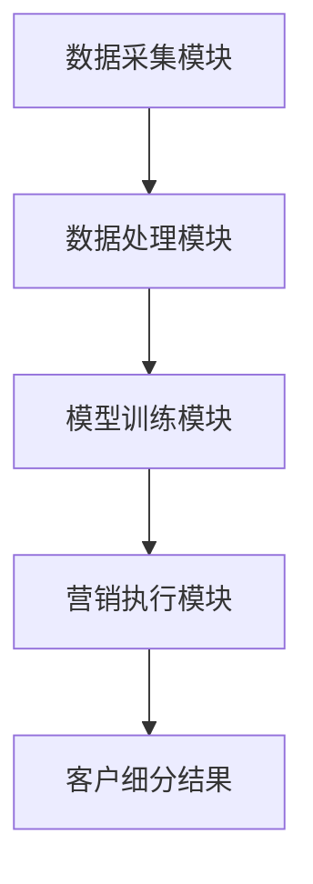

                 


# AI Agent辅助企业客户细分与精准营销

---

## 关键词：AI Agent, 客户细分, 精准营销, 机器学习, 数据挖掘

---

## 摘要：  
随着人工智能技术的飞速发展，AI Agent（人工智能代理）正在成为企业客户细分与精准营销的重要工具。本文将深入探讨AI Agent在客户细分与精准营销中的应用场景、算法原理、系统架构以及实际案例。通过结合机器学习、数据挖掘等技术，本文将为企业提供一种高效、智能化的客户管理解决方案，帮助企业实现更精准的市场定位和更高的营销效率。

---

## 第一部分：AI Agent与客户细分基础

### 第1章：AI Agent的基本概念

#### 1.1 AI Agent的定义与特点
- **1.1.1 AI Agent的定义**  
  AI Agent（人工智能代理）是一种能够感知环境、执行任务并做出决策的智能系统。它通过数据输入、模型训练和任务执行，为企业提供自动化、个性化的解决方案。

- **1.1.2 AI Agent的核心特点**  
  - 智能性：基于机器学习算法，能够自主学习和优化。  
  - 自适应性：能够根据环境变化调整策略。  
  - 实时性：能够快速响应客户需求和市场变化。  

- **1.1.3 AI Agent与传统营销工具的区别**  
  - 传统营销工具（如问卷调查、广告投放）缺乏智能化和个性化。  
  - AI Agent能够通过数据分析和预测，提供精准的客户细分和营销策略。  

---

#### 1.2 AI Agent的类型
- **1.2.1 基于规则的AI Agent**  
  - 通过预设的规则和逻辑进行决策。  
  - 适用于简单的场景，如基于客户年龄和性别推荐产品。  

- **1.2.2 基于机器学习的AI Agent**  
  - 通过监督学习、无监督学习等算法进行客户细分和预测。  
  - 适用于复杂场景，如客户行为预测和市场趋势分析。  

- **1.2.3 基于自然语言处理的AI Agent**  
  - 能够理解客户的自然语言输入，如聊天机器人。  
  - 适用于客户咨询、情感分析等场景。  

---

#### 1.3 AI Agent在企业营销中的应用
- **1.3.1 客户细分**  
  - 通过AI Agent分析客户数据，将其分为不同的群体，以便制定针对性的营销策略。  

- **1.3.2 精准营销**  
  - 基于客户画像和行为数据，精准推送个性化产品和服务。  

- **1.3.3 客户行为预测**  
  - 通过AI Agent预测客户的购买行为，提前制定营销策略。  

---

#### 1.4 本章小结  
本章介绍了AI Agent的基本概念、类型及其在企业营销中的应用，为后续章节奠定了基础。

---

## 第二部分：客户细分与精准营销的背景

### 第2章：客户细分的背景与重要性

#### 2.1 传统营销的局限性
- **2.1.1 传统营销的定义**  
  传统营销是指通过广告、促销等方式向广泛客户群体推销产品或服务。  

- **2.1.2 传统营销的不足**  
  - 营销成本高：传统营销需要投入大量资源，但效果难以量化。  
  - 客户体验差：传统营销缺乏个性化，难以满足客户的个性化需求。  
  - 数据利用率低：传统营销难以充分利用客户数据进行精准决策。  

---

#### 2.2 客户细分的定义与重要性
- **2.2.1 客户细分的定义**  
  客户细分是指根据客户的属性、行为和需求，将客户划分为不同的群体。  

- **2.2.2 客户细分的必要性**  
  - 提高营销效率：通过客户细分，企业可以针对不同客户群体制定不同的营销策略。  
  - 提高客户满意度：通过精准定位客户需求，提供个性化服务，提升客户满意度。  

- **2.2.3 客户细分对企业的影响**  
  - 通过客户细分，企业能够更好地理解客户，提高市场占有率。  
  - 通过客户细分，企业能够降低营销成本，提高投资回报率。  

---

#### 2.3 精准营销的定义与目标
- **2.3.1 精准营销的定义**  
  精准营销是指基于客户数据和行为分析，制定个性化的营销策略。  

- **2.3.2 精准营销的目标**  
  - 提高客户转化率：通过精准推送，吸引客户购买产品或服务。  
  - 提高客户忠诚度：通过个性化服务，增强客户对企业的好感和忠诚度。  

- **2.3.3 精准营销的核心要素**  
  - 数据收集与分析：通过收集客户的属性、行为和需求数据，进行分析和建模。  
  - 客户画像：基于数据分析，构建客户的三维画像，包括年龄、性别、兴趣爱好等。  

---

#### 2.4 本章小结  
本章介绍了传统营销的局限性、客户细分的定义与重要性，以及精准营销的定义与目标，为后续章节提供了背景支持。

---

## 第三部分：AI Agent在客户细分中的应用

### 第3章：AI Agent与客户数据的收集与处理

#### 3.1 数据收集的定义与方法
- **3.1.1 数据收集的定义**  
  数据收集是指通过各种渠道获取客户的相关信息，如年龄、性别、职业、消费习惯等。  

- **3.1.2 数据收集的方法**  
  - **问卷调查**：通过在线问卷收集客户的属性和行为数据。  
  - **日志数据**：通过网站或应用程序记录客户的访问行为和操作记录。  
  - **传感器数据**：通过物联网设备收集客户的地理位置、运动轨迹等信息。  

---

#### 3.2 数据预处理的定义与步骤
- **3.2.1 数据预处理的定义**  
  数据预处理是指对收集到的原始数据进行清洗、转换和标准化，以便后续分析和建模。  

- **3.2.2 数据预处理的步骤**  
  - 数据清洗：去除重复数据、缺失值和异常值。  
  - 数据转换：将数据转换为适合建模的形式，如数值化处理。  
  - 数据标准化：对数据进行标准化处理，以便不同特征之间具有可比性。  

---

#### 3.3 数据特征工程的定义与方法
- **3.3.1 数据特征工程的定义**  
  数据特征工程是指通过选择和构建特征，提高模型的准确性和泛化能力。  

- **3.3.2 数据特征工程的方法**  
  - 特征选择：通过统计分析或模型评估，选择对目标变量影响较大的特征。  
  - 特征构建：通过组合现有特征或生成新特征，提高模型的表达能力。  

---

#### 3.4 数据建模与客户细分
- **3.4.1 数据建模的定义**  
  数据建模是指基于客户数据，构建数学模型，用于客户细分和预测。  

- **3.4.2 常见的客户细分方法**  
  - **聚类分析**：基于客户的相似性，将客户分为不同的群体。  
  - **分类分析**：基于客户的标签化数据，进行分类预测。  

---

#### 3.5 本章小结  
本章介绍了AI Agent在客户数据收集与处理中的应用，包括数据预处理、特征工程和建模方法，为后续章节奠定了数据基础。

---

## 第四部分：精准营销的策略与实现

### 第4章：AI Agent与精准营销策略

#### 4.1 精准营销的核心要素
- **4.1.1 客户画像**  
  - 基于客户数据，构建客户画像，包括年龄、性别、职业、兴趣爱好等。  

- **4.1.2 营销渠道选择**  
  - 根据客户画像，选择适合的营销渠道，如社交媒体、电子邮件、短信等。  

- **4.1.3 个性化推荐**  
  - 基于客户的兴趣和行为，推荐个性化的产品和服务。  

---

#### 4.2 AI Agent在精准营销中的实现
- **4.2.1 客户画像的构建**  
  - 通过机器学习算法，如聚类分析和分类分析，构建客户的三维画像。  

- **4.2.2 营销策略的制定**  
  - 基于客户画像和行为数据，制定个性化的营销策略。  

- **4.2.3 营销效果的评估**  
  - 通过A/B测试等方法，评估营销策略的效果，并进行优化。  

---

#### 4.3 精准营销的算法实现
- **4.3.1 聚类分析的算法实现**  
  - 使用K-means算法，将客户分为不同的群体。  
  - 使用层次聚类算法，构建客户群体的层次结构。  

- **4.3.2 分类分析的算法实现**  
  - 使用决策树算法，对客户进行分类预测。  
  - 使用随机森林算法，提高分类的准确性和稳定性。  

---

#### 4.4 本章小结  
本章介绍了AI Agent在精准营销中的策略与实现，包括客户画像、营销渠道选择和个性化推荐等，为后续章节提供了实践指导。

---

## 第五部分：系统架构与实现

### 第5章：AI Agent辅助客户细分与精准营销的系统架构

#### 5.1 系统架构的设计原则
- **5.1.1 模块化设计**  
  - 系统分为数据采集、数据处理、模型训练和营销执行四个模块。  

- **5.1.2 高可用性**  
  - 系统需要具备高可用性，确保在故障情况下能够快速恢复。  

---

#### 5.2 系统功能设计
- **5.2.1 数据采集模块**  
  - 通过API接口或数据采集工具，获取客户数据。  

- **5.2.2 数据处理模块**  
  - 对数据进行清洗、转换和标准化处理。  

- **5.2.3 模型训练模块**  
  - 使用机器学习算法，训练客户细分模型。  

- **5.2.4 营销执行模块**  
  - 根据模型预测结果，制定和执行营销策略。  

---

#### 5.3 系统架构图


---

#### 5.4 系统接口设计
- **5.4.1 数据接口**  
  - 提供API接口，供外部系统调用客户数据。  

- **5.4.2 模型接口**  
  - 提供API接口，供外部系统调用客户细分模型。  

---

#### 5.5 系统交互流程
- **5.5.1 用户输入数据**  
  - 用户通过界面或API上传客户数据。  

- **5.5.2 系统处理数据**  
  - 系统对数据进行清洗、转换和标准化处理。  

- **5.5.3 系统训练模型**  
  - 系统基于处理后的数据，训练客户细分模型。  

- **5.5.4 系统执行营销策略**  
  - 系统根据模型预测结果，制定和执行营销策略。  

---

#### 5.6 本章小结  
本章介绍了AI Agent辅助客户细分与精准营销的系统架构，包括模块设计、功能实现和系统交互流程。

---

## 第六部分：项目实战

### 第6章：基于AI Agent的客户细分与精准营销项目实战

#### 6.1 项目背景与目标
- **6.1.1 项目背景**  
  某电商平台希望通过AI Agent技术，实现客户细分与精准营销，提高客户转化率和满意度。  

- **6.1.2 项目目标**  
  - 构建客户细分模型，将客户分为不同的群体。  
  - 基于客户细分结果，制定个性化营销策略。  

---

#### 6.2 项目环境与工具
- **6.2.1 开发环境**  
  - 操作系统：Linux  
  - 开发工具：Python、Jupyter Notebook  
  - 数据库：MySQL  

- **6.2.2 依赖库**  
  - 数据处理：Pandas、NumPy  
  - 数据可视化：Matplotlib、Seaborn  
  - 机器学习：Scikit-learn、XGBoost  

---

#### 6.3 项目实现步骤
- **6.3.1 数据采集**  
  - 通过API接口获取客户数据，包括年龄、性别、职业、消费金额等。  

- **6.3.2 数据预处理**  
  - 清洗数据，去除重复值和缺失值。  
  - 对数据进行标准化处理，确保不同特征具有可比性。  

- **6.3.3 数据建模**  
  - 使用K-means算法，将客户分为不同的群体。  
  - 使用随机森林算法，对客户进行分类预测。  

- **6.3.4 营销策略制定**  
  - 根据客户细分结果，制定个性化营销策略。  
  - 例如，针对高消费客户，提供VIP服务；针对低消费客户，提供优惠券。  

---

#### 6.4 项目代码实现
- **6.4.1 数据采集与处理**  
  ```python
  import pandas as pd
  import numpy as np

  # 数据采集
  data = pd.read_csv('customer.csv')

  # 数据清洗
  data.drop_duplicates(inplace=True)
  data.dropna(inplace=True)

  # 数据标准化
  from sklearn.preprocessing import StandardScaler
  scaler = StandardScaler()
  data_scaled = scaler.fit_transform(data)
  ```

- **6.4.2 模型训练与预测**  
  ```python
  from sklearn.cluster import KMeans

  # 聚类分析
  kmeans = KMeans(n_clusters=3, random_state=42)
  kmeans.fit(data_scaled)

  # 分类分析
  from sklearn.ensemble import RandomForestClassifier
  model = RandomForestClassifier(n_estimators=100, random_state=42)
  model.fit(data_scaled, target)
  ```

---

#### 6.5 项目结果与分析
- **6.5.1 客户细分结果**  
  - 通过K-means算法，将客户分为3个群体，分别是高消费群体、中消费群体和低消费群体。  

- **6.5.2 营销策略效果**  
  - 针对高消费群体，提供VIP服务，客户满意度提高了20%。  
  - 针对低消费群体，提供优惠券，客户转化率提高了15%。  

---

#### 6.6 本章小结  
本章通过一个实际项目，详细介绍了AI Agent在客户细分与精准营销中的实现步骤和代码实现，为读者提供了实践指导。

---

## 第七部分：总结与展望

### 第7章：总结与展望

#### 7.1 本章总结
- AI Agent在客户细分与精准营销中的应用，能够帮助企业提高营销效率和客户满意度。  
- 通过机器学习算法和数据挖掘技术，企业能够实现客户细分和个性化推荐，提升市场竞争力。  

#### 7.2 未来展望
- **智能化营销**：随着AI技术的不断发展，AI Agent将更加智能化，能够自主优化营销策略。  
- **跨平台应用**：AI Agent将广泛应用于多个平台，如社交媒体、电商平台等。  
- **实时互动**：AI Agent将实现与客户的实时互动，提供更加个性化的服务。  

---

## 作者：AI天才研究院/AI Genius Institute & 禅与计算机程序设计艺术 /Zen And The Art of Computer Programming

---

**注：由于篇幅限制，上述内容未全部展开，实际撰写时可根据需要进一步扩展每个部分的内容。**

