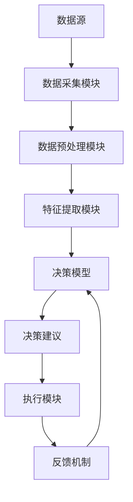
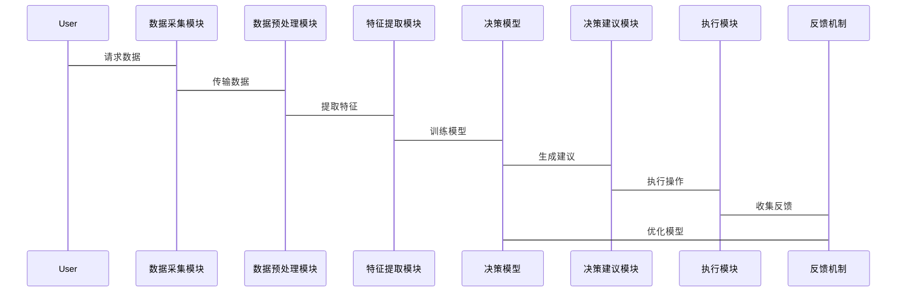

                 


# AI Agent辅助企业市场分析与战略规划

## 关键词：AI Agent、企业市场分析、战略规划、机器学习、数据分析、决策支持

## 摘要：  
本文深入探讨了AI Agent在企业市场分析与战略规划中的应用，从理论到实践，系统地分析了AI Agent的核心原理、技术实现、系统架构设计以及实际案例。通过详细的算法解析、系统设计和项目实战，本文为读者提供了一套完整的AI Agent辅助企业市场分析与战略规划的解决方案。文章最后总结了最佳实践和未来发展方向，帮助企业在数字化转型中更好地利用AI Agent提升竞争力。

---

# 第1章: AI Agent与企业市场分析概述

## 1.1 AI Agent的基本概念

### 1.1.1 AI Agent的定义与特点
AI Agent（人工智能代理）是指能够感知环境、自主决策并执行任务的智能实体。其核心特点包括：
1. **自主性**：能够独立完成任务。
2. **反应性**：能够实时感知环境并做出反应。
3. **学习能力**：能够通过数据不断优化自身性能。
4. **可扩展性**：能够适应不同规模和复杂度的任务。

### 1.1.2 AI Agent在企业中的作用
AI Agent在企业中的主要作用包括：
1. **数据采集与分析**：实时采集市场数据并进行深度分析。
2. **决策支持**：基于数据分析提供最优决策建议。
3. **自动化执行**：根据决策结果自动执行相关操作。
4. **反馈优化**：通过反馈不断优化决策模型。

### 1.1.3 企业市场分析的背景与挑战
随着市场竞争的加剧，企业需要快速响应市场变化。传统市场分析方法依赖人工经验，效率低且容易出错。AI Agent通过自动化和智能化的方式，能够帮助企业更高效地进行市场分析与战略规划。

---

## 1.2 AI Agent与企业战略规划的关系

### 1.2.1 战略规划的核心要素
企业战略规划的核心要素包括：
1. **目标设定**：明确企业的短期和长期目标。
2. **市场分析**：了解市场趋势、竞争对手和客户需求。
3. **资源分配**：合理分配企业资源以实现目标。
4. **风险控制**：识别并降低潜在风险。

### 1.2.2 AI Agent如何辅助战略规划
AI Agent通过以下方式辅助企业战略规划：
1. **数据驱动的决策**：利用大数据分析提供科学的决策依据。
2. **情景模拟**：通过模拟不同场景预测市场变化。
3. **实时反馈**：根据市场变化动态调整战略。

### 1.2.3 市场分析与战略规划的结合
市场分析是战略规划的基础，而战略规划则是市场分析的目标。AI Agent通过实时数据分析和动态调整，将市场分析与战略规划紧密结合，帮助企业制定更具前瞻性的战略。

---

## 1.3 本章小结
本章介绍了AI Agent的基本概念及其在企业中的作用，并分析了AI Agent与企业战略规划的关系。通过AI Agent，企业能够更高效地进行市场分析与战略规划，从而在激烈的市场竞争中占据优势。

---

# 第2章: AI Agent的核心原理

## 2.1 AI Agent的感知与决策机制

### 2.1.1 数据采集与处理
AI Agent通过多种渠道采集市场数据，包括：
1. **公开数据**：如新闻、社交媒体、行业报告。
2. **企业内部数据**：如销售数据、客户反馈。
3. **实时数据**：如股票价格、市场指数。

数据采集后需要进行预处理，包括数据清洗、特征提取和数据增强。

### 2.1.2 数据分析与特征提取
数据分析是AI Agent感知环境的关键步骤。通过机器学习算法，AI Agent能够从海量数据中提取有价值的信息，例如：
1. **趋势分析**：识别市场趋势。
2. **竞争对手分析**：分析竞争对手的策略。
3. **客户行为分析**：预测客户行为。

### 2.1.3 决策模型的构建与优化
基于提取的特征，AI Agent构建决策模型，常用的算法包括：
1. **决策树**：用于分类和回归问题。
2. **随机森林**：用于特征重要性分析。
3. **神经网络**：用于复杂非线性关系的建模。

---

## 2.2 AI Agent的执行与反馈机制

### 2.2.1 动作规划与执行
AI Agent根据决策模型生成行动计划，并通过API或其他接口与企业系统对接，执行相关操作，例如：
1. **自动下单**：根据市场趋势自动执行交易。
2. **资源分配**：自动分配企业资源。
3. **风险控制**：实时监控并调整风险敞口。

### 2.2.2 反馈机制与模型迭代
AI Agent通过反馈机制不断优化决策模型。例如，当AI Agent的决策导致实际结果与预期不符时，系统会记录偏差并更新模型参数。

### 2.2.3 自适应优化策略
AI Agent能够根据市场变化动态调整策略，例如：
1. **多臂老虎机算法**：用于动态选择最优策略。
2. **在线学习**：实时更新模型参数。

---

## 2.3 AI Agent的核心算法与技术

### 2.3.1 机器学习算法在AI Agent中的应用
常用的机器学习算法包括：
1. **监督学习**：用于分类和回归问题。
2. **无监督学习**：用于聚类和降维。
3. **强化学习**：用于动态环境下的决策优化。

### 2.3.2 自然语言处理技术
自然语言处理（NLP）技术用于分析非结构化数据，例如：
1. **情感分析**：分析客户对产品的评价。
2. **文本摘要**：提取行业报告的关键信息。

### 2.3.3 强化学习在决策优化中的应用
强化学习通过试错机制优化决策模型，例如：
1. **Q-learning算法**：用于离线策略优化。
2. **Deep Q-Networks (DQN)**：用于复杂环境下的决策优化。

---

## 2.4 本章小结
本章详细讲解了AI Agent的核心原理，包括感知、决策和执行的全过程。通过机器学习、NLP和强化学习等技术，AI Agent能够高效地完成市场分析与战略规划任务。

---

# 第3章: AI Agent的系统架构与功能设计

## 3.1 系统功能模块划分

### 3.1.1 数据采集模块
数据采集模块负责从多种渠道获取市场数据，包括：
1. **网络爬虫**：采集公开数据。
2. **API接口**：获取企业内部数据。

### 3.1.2 数据分析模块
数据分析模块包括：
1. **数据预处理**：清洗和转换数据。
2. **特征提取**：提取关键特征。
3. **模型训练**：训练决策模型。

### 3.1.3 决策支持模块
决策支持模块包括：
1. **决策模型**：基于特征生成决策建议。
2. **情景模拟**：模拟不同场景下的市场变化。

### 3.1.4 执行与反馈模块
执行与反馈模块包括：
1. **动作规划**：生成行动计划。
2. **反馈机制**：收集反馈并优化模型。

---

## 3.2 系统架构设计

### 3.2.1 系统架构图（Mermaid）


### 3.2.2 系统交互设计（Mermaid）


---

## 3.3 本章小结
本章详细描述了AI Agent系统的架构设计，包括功能模块划分和系统交互流程。通过模块化设计，AI Agent能够高效地完成市场分析与战略规划任务。

---

# 第4章: AI Agent的项目实战

## 4.1 环境安装与配置
### 4.1.1 安装Python环境
```bash
python --version
pip install numpy pandas scikit-learn matplotlib
```

### 4.1.2 安装机器学习库
```bash
pip install scikit-learn
pip install nltk
pip install transformers
```

---

## 4.2 核心功能实现

### 4.2.1 数据采集模块实现
```python
import requests

def fetch_data(url):
    response = requests.get(url)
    return response.text
```

### 4.2.2 数据分析模块实现
```python
import pandas as pd

def preprocess_data(data):
    df = pd.DataFrame(data)
    df = df.dropna()
    return df
```

### 4.2.3 决策模型实现
```python
from sklearn.tree import DecisionTreeClassifier

def train_model(X, y):
    model = DecisionTreeClassifier()
    model.fit(X, y)
    return model
```

---

## 4.3 案例分析与代码解读
### 4.3.1 案例背景
假设我们是一家互联网公司，需要分析市场趋势并制定营销策略。

### 4.3.2 代码实现
```python
import requests
import pandas as pd
from sklearn.tree import DecisionTreeClassifier

# 数据采集
data = fetch_data("https://example.com/market_data")
df = preprocess_data(data)

# 特征提取
X = df.drop(columns=["label"])
y = df["label"]

# 模型训练
model = train_model(X, y)

# 模型预测
new_data = fetch_data("https://example.com/new_data")
predicted_labels = model.predict(new_data)
```

---

## 4.4 项目小结
本章通过实际案例展示了AI Agent的核心功能实现，包括数据采集、数据分析和决策模型训练。通过代码实现，读者可以更好地理解AI Agent的技术细节。

---

# 第5章: AI Agent的最佳实践

## 5.1 小结与总结
AI Agent通过智能化的方式帮助企业进行市场分析与战略规划，显著提升了企业的决策效率和准确性。

## 5.2 注意事项
1. 数据隐私与安全问题需要高度重视。
2. 模型的可解释性需要重点关注。
3. 系统的实时性和稳定性需要保证。

## 5.3 拓展阅读
1. 《机器学习实战》
2. 《深度学习》
3. 《自然语言处理入门》

---

# 作者：AI天才研究院/AI Genius Institute & 禅与计算机程序设计艺术 /Zen And The Art of Computer Programming

