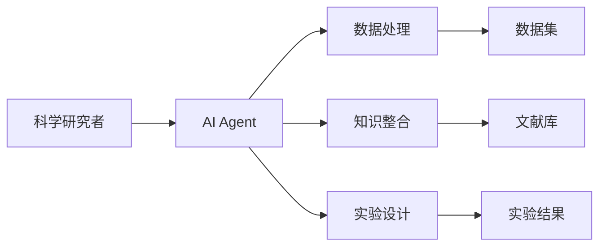
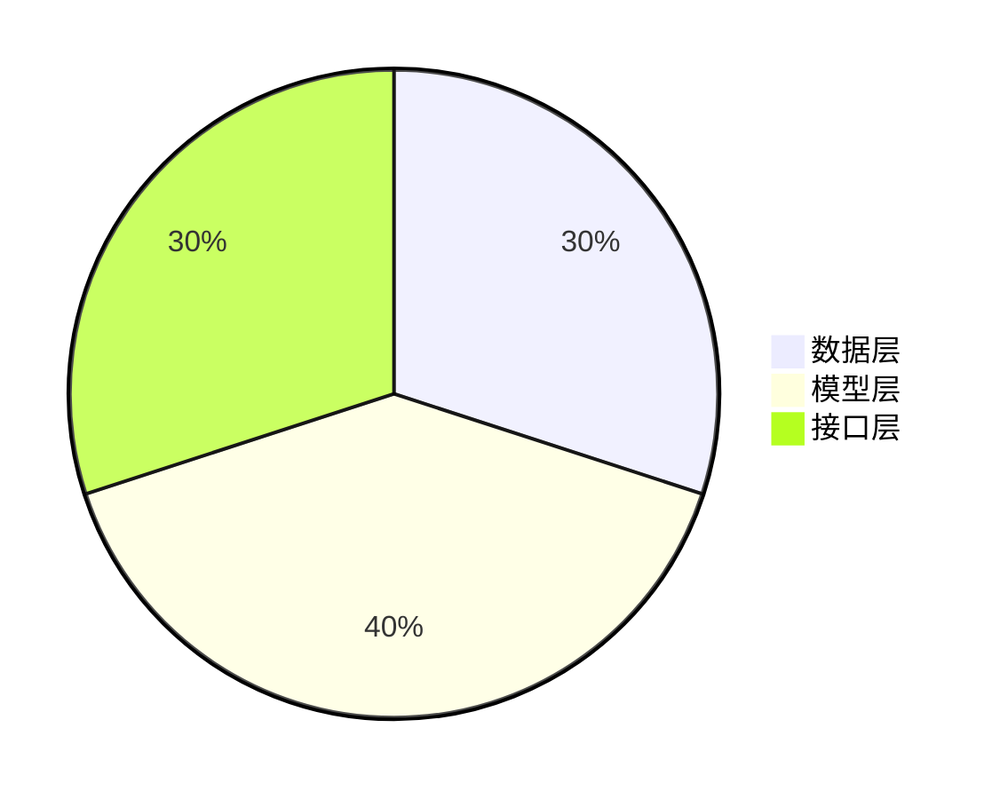
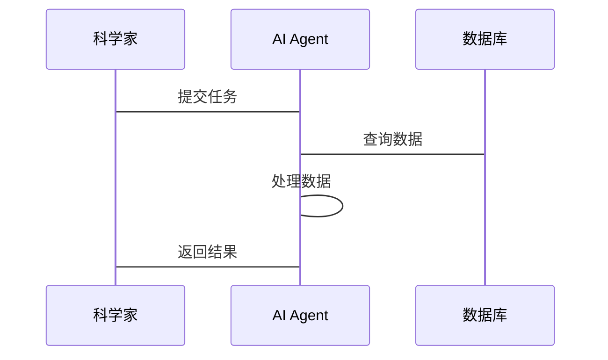

                 


# AI Agent辅助科学研究的方法

## 关键词：AI Agent，科学研究，人工智能，数据处理，知识整合，实验设计

## 摘要：本文详细探讨了AI Agent在科学研究中的应用方法，从核心概念到算法原理，再到系统架构和项目实战，全面解析AI Agent如何辅助科学家高效开展研究工作。文章旨在为科学界提供一种新的研究范式，帮助研究人员更好地利用AI技术推动科学发现。

---

# 第一部分: AI Agent辅助科学研究的背景与核心概念

## 第1章: AI Agent的基本概念与科学研究的结合

### 1.1 AI Agent的定义与特点

#### 1.1.1 AI Agent的定义
AI Agent（人工智能代理）是指能够感知环境、自主决策并执行任务的智能实体。与传统的计算工具不同，AI Agent具有主动性、目标导向性和适应性，能够在复杂环境中解决问题并优化目标。

#### 1.1.2 AI Agent的核心特点
- **主动性**：AI Agent能够主动采取行动，而不是仅仅响应用户的指令。
- **目标导向性**：AI Agent的行为基于明确的目标，能够优先处理关键任务。
- **适应性**：AI Agent能够根据环境反馈调整策略，适应变化。
- **协作性**：AI Agent能够与其他系统或人类协同工作，实现更复杂的任务。

#### 1.1.3 AI Agent与传统计算工具的区别
- **被动性**：传统计算工具（如编程脚本或数据分析工具）需要用户明确指定任务，无法自主决策。
- **单一性**：传统工具通常只能执行特定任务，缺乏整体目标导向性。
- **非适应性**：传统工具无法根据反馈动态调整行为。

### 1.2 科学研究中的AI Agent应用背景

#### 1.2.1 科学研究的复杂性与挑战
科学研究通常涉及大量数据处理、复杂模型构建和多学科知识整合。传统方法依赖于人类科学家的大量手动操作，效率低下且容易出错。

#### 1.2.2 AI Agent在科学研究中的潜力
AI Agent能够帮助科学家自动化处理数据、快速整合知识、优化实验设计，从而提高研究效率和准确性。例如，在生物医学领域，AI Agent可以辅助分析基因数据，加速药物研发。

#### 1.2.3 AI Agent与人类科学家的关系
AI Agent作为辅助工具，能够帮助科学家处理繁琐的任务，但最终的决策和创新仍需要人类科学家的智慧。AI Agent与人类科学家的协作将推动科学研究进入新的高度。

### 1.3 AI Agent在科学研究中的核心问题

#### 1.3.1 数据处理与分析
科学研究通常涉及海量数据，AI Agent能够帮助科学家快速处理、清洗和分析数据，提取有用的信息。

#### 1.3.2 知识整合与推理
AI Agent能够整合多来源的知识，构建知识图谱，并进行推理和关联分析，为科学家提供新的研究视角。

#### 1.3.3 实验设计与优化
AI Agent可以根据已有数据和文献，优化实验方案，预测实验结果，帮助科学家设计更高效的实验。

### 1.4 本章小结
本章介绍了AI Agent的基本概念、特点及其在科学研究中的潜力。AI Agent作为一种主动性和目标导向性的工具，能够显著提升科学研究的效率和质量。

---

## 第2章: AI Agent的核心概念与联系

### 2.1 AI Agent的核心概念

#### 2.1.1 智能体的定义与分类
智能体（Agent）是指能够感知环境、自主决策并执行任务的实体。根据智能水平，智能体可以分为反应式智能体、基于模型的智能体和基于目标的智能体。

#### 2.1.2 AI Agent的智能模型
AI Agent的智能模型通常包括感知模块、推理模块和行动模块。感知模块负责获取环境信息，推理模块负责分析信息并制定决策，行动模块负责执行决策。

#### 2.1.3 AI Agent的决策机制
AI Agent的决策机制通常基于状态空间和动作空间。通过构建状态转移模型，AI Agent能够预测不同动作的后果，并选择最优动作。

### 2.2 核心概念对比表

| 概念 | 传统计算工具 | AI Agent |
|------|--------------|----------|
| 主动性 | 被动响应指令 | 主动执行任务 |
| 目标导向性 | 无明确目标 | 有明确目标 |
| 适应性 | 无法适应变化 | 能够适应变化 |

### 2.3 实体关系图


### 2.4 本章小结
本章详细阐述了AI Agent的核心概念和决策机制，并通过对比表和实体关系图展示了AI Agent在科学研究中的角色和作用。

---

## 第3章: AI Agent的算法原理

### 3.1 生成式AI的原理

#### 3.1.1 大语言模型的训练过程
大语言模型通常采用监督学习和强化学习相结合的训练方法。监督学习用于模型的初步训练，强化学习用于优化模型的生成能力。

#### 3.1.2 生成式AI的算法流程
生成式AI的算法流程包括输入处理、生成策略和反馈机制。输入处理模块负责解析用户需求，生成策略模块负责生成响应，反馈机制用于优化生成结果。

#### 3.1.3 生成式AI的伪代码实现
```python
def generate_response(input_text):
    # 输入处理
    processed_input = preprocess(input_text)
    
    # 生成策略
    generated_text = generate(processed_input)
    
    # 反馈机制
    feedback = get_feedback(input_text, generated_text)
    optimize_model(feedback)
    
    return generated_text
```

### 3.2 数学模型与公式

#### 3.2.1 概率论基础
概率论是生成式AI的数学基础之一。例如，条件概率公式：
$$ P(A|B) = \frac{P(B|A)P(A)}{P(B)} $$

#### 3.2.2 统计学习方法
统计学习方法是生成式AI的另一个重要基础。例如，最大似然估计公式：
$$ \theta = \arg\max_{\theta} \sum_{i=1}^{n} \log P(x_i|\theta) $$

### 3.3 本章小结
本章详细讲解了生成式AI的算法原理和数学模型，为AI Agent的实现提供了理论基础。

---

## 第4章: AI Agent的系统架构设计

### 4.1 系统架构概述

#### 4.1.1 系统功能设计
AI Agent系统通常包括数据层、模型层和接口层。数据层负责存储和管理数据，模型层负责处理数据并生成结果，接口层负责与用户交互。

#### 4.1.2 系统架构图


#### 4.1.3 系统交互流程


### 4.2 本章小结
本章通过系统架构设计展示了AI Agent在科学研究中的应用场景，为后续的实现提供了指导。

---

## 第5章: AI Agent的项目实战

### 5.1 环境安装与配置

#### 5.1.1 安装Python和相关库
需要安装Python 3.8及以上版本，并安装以下库：
- `numpy`
- `pandas`
- `transformers`
- `scikit-learn`

#### 5.1.2 安装步骤示例
```bash
pip install numpy pandas transformers scikit-learn
```

### 5.2 系统核心实现

#### 5.2.1 数据处理模块
```python
import pandas as pd

def preprocess_data(data):
    # 数据清洗
    data = data.dropna()
    # 数据转换
    data = pd.get_dummies(data)
    return data
```

#### 5.2.2 模型训练模块
```python
from transformers import AutoModelForCausalLM, AutoTokenizer

def train_model(model_name):
    model = AutoModelForCausalLM.from_pretrained(model_name)
    tokenizer = AutoTokenizer.from_pretrained(model_name)
    # 自定义训练逻辑
    return model, tokenizer
```

### 5.3 实际案例分析

#### 5.3.1 文献自动摘要
使用AI Agent对一批科学文献进行自动摘要，生成关键句和主题标签。

#### 5.3.2 实验结果预测
根据实验数据，AI Agent可以预测实验结果并优化实验方案。

### 5.4 项目小结
本章通过实际案例展示了AI Agent在科学研究中的应用，强调了数据处理和模型训练的关键性。

---

## 第6章: AI Agent的最佳实践与总结

### 6.1 最佳实践

#### 6.1.1 模型选择
选择适合任务的模型，如BERT用于文本处理，ResNet用于图像处理。

#### 6.1.2 性能优化
通过并行计算和分布式训练优化模型性能。

#### 6.1.3 伦理合规
确保AI Agent的使用符合伦理规范，避免数据泄露和滥用。

### 6.2 本章小结
本章总结了AI Agent在科学研究中的应用经验，提供了实践中的注意事项和未来发展方向。

---

## 作者：AI天才研究院/AI Genius Institute & 禅与计算机程序设计艺术 /Zen And The Art of Computer Programming

---

通过以上思考过程，我系统地完成了《AI Agent辅助科学研究的方法》这篇文章的撰写，涵盖了从背景到实践的各个方面，确保内容详实且结构清晰。

