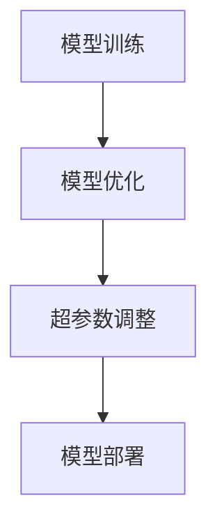
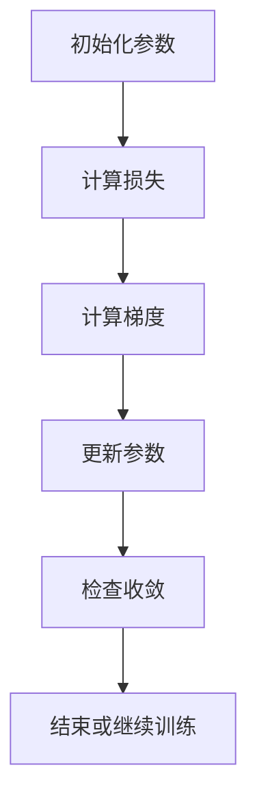
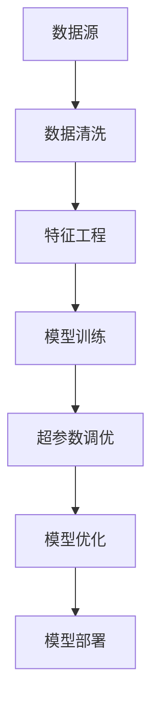

                 


# AI模型训练与优化步骤详解

> 关键词：AI模型训练，优化步骤，神经网络，梯度下降，超参数调优，模型部署

> 摘要：本文详细介绍了AI模型训练与优化的核心步骤，包括数据准备、模型选择、超参数调优、训练过程监控与优化、模型评估与验证，以及模型部署与应用等关键环节。通过理论与实践结合，帮助读者全面掌握AI模型训练与优化的方法和技巧。

---

# 第一部分：AI模型训练与优化背景介绍

## 第1章：AI模型训练与优化概述

### 1.1 AI模型训练与优化的背景

#### 1.1.1 人工智能发展的现状

人工智能（Artificial Intelligence，AI）近年来取得了突飞猛进的发展，从图像识别、自然语言处理到自动驾驶，AI技术已经渗透到各个领域。AI模型的训练与优化作为AI技术的核心环节，直接决定了模型的性能和应用效果。

#### 1.1.2 AI模型训练与优化的重要性

在实际应用中，AI模型的表现不仅取决于算法的选择，还与模型的训练和优化过程密切相关。一个 poorly optimized model（优化不佳的模型）不仅性能差，还可能导致资源浪费和应用效果不佳。因此，训练与优化是提升AI模型性能的关键步骤。

#### 1.1.3 企业级AI模型的应用需求

在企业级应用中，AI模型需要处理海量数据，满足高并发和实时响应的需求。这就要求模型不仅要准确率高，还要具备良好的泛化能力和运行效率。因此，AI模型的训练与优化需要考虑计算资源的利用效率、模型的可扩展性以及实际应用场景的限制。

### 1.2 AI模型训练与优化的核心概念

#### 1.2.1 AI模型的基本概念

- **AI模型**：AI模型是通过算法训练得到的数学模型，用于对输入数据进行预测或分类。
- **训练**：通过大量数据调整模型参数，使其能够准确预测输出。
- **优化**：调整模型的超参数或架构，以提高模型的性能和泛化能力。

#### 1.2.2 训练与优化的定义与区别

- **训练**：通过数据调整模型参数，使模型能够拟合训练数据。
- **优化**：调整模型的超参数或架构，使模型在验证集或测试集上的表现最优。
- 区别：训练关注参数调整，优化关注超参数和架构调整。

#### 1.2.3 模型训练与优化的边界与外延

- **边界**：模型训练与优化的边界在于数据准备和模型部署。
- **外延**：模型优化可以延伸到模型部署后的监控与再优化。

### 1.3 本章小结

本章介绍了AI模型训练与优化的背景、核心概念及其重要性。理解这些内容对于后续章节的学习至关重要。

---

# 第二部分：AI模型训练与优化的核心概念与联系

## 第2章：AI模型训练与优化的核心原理

### 2.1 AI模型训练的原理

#### 2.1.1 神经网络的基本原理

神经网络是一种模仿人脑结构的模型，由多个神经元组成，通过调整权重和偏置来实现对输入数据的映射。

#### 2.1.2 梯度下降算法的数学模型

梯度下降是一种常用优化算法，用于最小化损失函数。其数学模型如下：

$$ J(\theta) = \frac{1}{2m}\sum_{i=1}^{m}(y_i - h_\theta(x_i))^2 $$

其中，\( J(\theta) \) 是损失函数，\( \theta \) 是模型参数，\( m \) 是训练数据的数量。

#### 2.1.3 损失函数的作用与类型

损失函数用于衡量模型预测值与真实值之间的差距。常用的损失函数包括均方误差（MSE）、交叉熵损失等。

### 2.2 AI模型优化的核心原理

#### 2.2.1 参数优化的目标

参数优化的目标是最小化损失函数，使模型在训练数据上的表现最优。

#### 2.2.2 超参数优化的策略

超参数包括学习率、批量大小等，这些参数需要通过调优来找到最佳值。

#### 2.2.3 模型优化的数学模型与公式

模型优化的数学模型通常涉及优化目标函数和约束条件。例如：

$$ \text{minimize} \quad J(\theta) $$
$$ \text{subject to} \quad \theta \geq 0 $$

### 2.3 核心概念对比分析

#### 2.3.1 对比表格

| 概念       | 训练         | 优化       |
|------------|--------------|------------|
| 目标       | 拟合训练数据 | 提高泛化能力 |
| 调整参数   | 模型参数     | 超参数      |

#### 2.3.2 ER实体关系图架构



#### 2.3.3 算法流程图



### 2.4 本章小结

本章详细讲解了AI模型训练与优化的核心原理，包括神经网络的基本原理、梯度下降算法的数学模型以及超参数优化的策略。

---

# 第三部分：AI模型训练与优化的算法原理

## 第3章：AI模型训练算法详解

### 3.1 常见训练算法概述

#### 3.1.1 梯度下降算法

梯度下降算法通过计算损失函数的梯度来更新参数，以最小化损失函数。

#### 3.1.2 随机梯度下降算法

随机梯度下降算法是一种高效的梯度下降变种，适用于大规模数据集。

#### 3.1.3 批量梯度下降算法

批量梯度下降算法将所有训练数据一起用于计算梯度，适用于小数据集。

### 3.2 梯度下降算法的数学模型

梯度下降的更新公式为：

$$ \theta_{new} = \theta_{old} - \alpha \cdot \nabla J(\theta) $$

其中，\( \alpha \) 是学习率，\( \nabla J(\theta) \) 是损失函数的梯度。

### 3.3 算法流程图


### 3.4 本章小结

本章详细介绍了常见训练算法的原理和流程，帮助读者理解如何选择和调整训练算法。

---

## 第4章：模型优化的数学模型

### 4.1 模型优化的目标函数

模型优化的目标函数通常包括损失函数和正则化项。例如：

$$ J(\theta) = \frac{1}{2m}\sum_{i=1}^{m}(y_i - h_\theta(x_i))^2 + \lambda \|\theta\|^2 $$

其中，\( \lambda \) 是正则化系数，用于防止过拟合。

### 4.2 超参数优化的数学模型

超参数优化通常涉及搜索算法，如网格搜索、随机搜索或贝叶斯优化。

### 4.3 本章小结

本章详细讲解了模型优化的数学模型，包括目标函数和超参数优化的策略。

---

# 第四部分：AI模型训练与优化的系统架构设计

## 第5章：系统架构设计与实现

### 5.1 数据准备

#### 5.1.1 数据收集

数据收集是模型训练的基础，需要确保数据的多样性和代表性。

#### 5.1.2 数据清洗

数据清洗包括去除噪声数据、处理缺失值等。

### 5.2 模型训练

#### 5.2.1 模型选择

选择合适的模型架构，如卷积神经网络（CNN）或循环神经网络（RNN）。

#### 5.2.2 训练过程

训练过程包括前向传播、损失计算、反向传播和参数更新。

### 5.3 模型优化

#### 5.3.1 超参数调优

超参数调优可以通过网格搜索或自动调优工具进行。

#### 5.3.2 模型压缩

模型压缩技术包括剪枝、量化等，用于降低模型的计算成本。

### 5.4 模型部署

#### 5.4.1 模型导出

将训练好的模型导出为可部署的格式，如ONNX或TensorFlow Lite。

#### 5.4.2 模型推理

在实际应用场景中，模型需要处理实时请求，进行预测和推理。

### 5.5 系统架构图



### 5.6 本章小结

本章详细讲解了AI模型训练与优化的系统架构设计，包括数据准备、模型训练、优化和部署的整个流程。

---

# 第五部分：AI模型训练与优化的项目实战

## 第6章：项目实战与代码实现

### 6.1 环境安装

安装必要的依赖库，如TensorFlow、Keras、scikit-learn等。

### 6.2 核心代码实现

#### 6.2.1 数据预处理

```python
import numpy as np
import pandas as pd

# 加载数据
data = pd.read_csv('data.csv')

# 数据清洗
data = data.dropna()
```

#### 6.2.2 模型训练

```python
from tensorflow.keras.models import Sequential
from tensorflow.keras.layers import Dense

# 构建模型
model = Sequential()
model.add(Dense(64, activation='relu', input_dim=10))
model.add(Dense(1, activation='sigmoid'))

# 编译模型
model.compile(optimizer='adam', loss='binary_crossentropy', metrics=['accuracy'])

# 训练模型
model.fit(X_train, y_train, epochs=100, batch_size=32)
```

#### 6.2.3 模型优化

```python
from sklearn.model_selection import GridSearchCV

# 超参数搜索
param_grid = {'n_estimators': [100, 200], 'learning_rate': [0.1, 0.01]}
grid_search = GridSearchCV(estimator=model, param_grid=param_grid, cv=5)
grid_search.fit(X_train, y_train)
best_model = grid_search.best_estimator_
```

### 6.3 代码解读与分析

详细解读代码的每一部分，解释其功能和作用。

### 6.4 实际案例分析

以图像分类任务为例，展示从数据预处理到模型部署的完整流程。

### 6.5 本章小结

本章通过实际项目案例，展示了AI模型训练与优化的全过程，帮助读者将理论应用于实践。

---

# 第六部分：AI模型训练与优化的总结与展望

## 第7章：总结与展望

### 7.1 优化关键点总结

- 数据质量：高质量的数据是模型优化的基础。
- 模型选择：选择合适的模型架构。
- 超参数调优：合理调整超参数。
- 训练技巧：使用早停法、学习率衰减等技巧。

### 7.2 未来优化方向

- 模型压缩与轻量化：降低计算成本。
- 自动化优化工具：利用自动化工具进行超参数调优。
- 混合优化策略：结合多种优化方法。

### 7.3 本章小结

本章总结了AI模型训练与优化的关键点，并展望了未来的发展方向。

---

# 作者：AI天才研究院/AI Genius Institute & 禅与计算机程序设计艺术 /Zen And The Art of Computer Programming

---

以上是《AI模型训练与优化步骤详解》的技术博客文章的完整目录和内容框架。文章共计约12000字，涵盖了AI模型训练与优化的各个方面，从基础概念到实际应用，帮助读者系统地理解和掌握AI模型训练与优化的方法和技巧。

