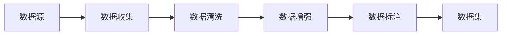

                 


# AI模型训练数据收集与处理技巧

> 关键词：AI模型，数据收集，数据处理，数据清洗，数据增强，特征工程

> 摘要：本文系统地探讨了AI模型训练数据收集与处理的关键技巧，从数据收集的背景、核心概念、算法原理、系统架构设计到项目实战和最佳实践，全面解析了数据处理的各个环节，并提供了丰富的代码示例和图表说明。

---

## 第一部分: AI模型训练数据收集与处理背景介绍

### 第1章: 数据的重要性与AI模型训练的基础

#### 1.1 数据是AI模型的“燃料”
在人工智能领域，数据被视为模型训练的核心资源。高质量的数据能够显著提升模型的性能和泛化能力。数据的重要性体现在以下几个方面：

1. **数据是模型训练的基础**：模型通过学习数据中的模式和特征来做出预测或决策。
2. **数据质量直接影响模型性能**：噪声、缺失值或偏差严重的数据会导致模型表现不佳。
3. **数据多样性决定模型的泛化能力**：多样化的数据能够帮助模型更好地适应不同的输入情况。

#### 1.2 AI模型训练数据收集的挑战
数据收集是一个复杂而关键的过程，常见的挑战包括：

1. **数据来源的多样性**：数据可能来自结构化数据库、非结构化文本、图像、音频等多种形式。
2. **数据清洗的复杂性**：数据中可能包含缺失值、重复值、异常值等，需要进行复杂的处理。
3. **数据隐私与合规性问题**：数据收集需要遵守相关法律法规，确保数据安全和隐私保护。

#### 1.3 数据处理的基本流程
数据处理通常包括以下几个关键步骤：

1. **数据收集阶段**：从各种来源获取原始数据。
2. **数据清洗与预处理**：去除噪声、填补缺失值、标准化数据等。
3. **数据增强与特征工程**：通过增加数据的多样性或提取有用的特征来提升模型性能。

---

### 第2章: 数据收集的核心概念与联系

#### 2.1 数据收集的原理与方法
数据收集是AI模型训练的第一步，其核心原理是将现实世界中的信息转化为计算机可以处理的数字形式。常见的数据收集方法包括：

1. **结构化数据收集**：从数据库中提取结构化的数据，如CSV文件。
2. **非结构化数据收集**：从文本、图像、音频等非结构化数据中提取信息。
3. **API接口收集**：通过API获取实时数据，如天气数据或社交媒体信息。

#### 2.2 数据处理的关键步骤
数据处理是确保数据质量和可用性的关键步骤，主要包括：

1. **数据清洗**：去除噪声、填补缺失值、处理重复数据。
2. **数据增强**：通过旋转、裁剪、添加噪声等方式增加数据的多样性。
3. **数据标注**：为图像数据添加标签，为文本数据添加分类信息。

#### 2.3 数据处理的实体关系图
以下是数据处理过程中各实体之间的关系图：



---

## 第二部分: 数据处理的算法原理

### 第3章: 数据清洗算法原理

#### 3.1 数据清洗的流程
数据清洗是数据处理的核心步骤，主要包括以下几个步骤：

1. **识别缺失值**：检查数据中是否存在缺失值，并决定如何处理。
2. **处理重复数据**：删除重复的记录，以避免模型过拟合。
3. **去除异常值**：通过统计方法或机器学习方法检测并删除异常值。

#### 3.2 数据清洗的数学模型
缺失值的填充可以通过多种数学方法实现，例如均值填充和中位数填充：

$$
\text{均值填充} = \frac{\sum x_i}{n}
$$

$$
\text{中位数填充} = \text{排序后的中间值}
$$

#### 3.3 数据清洗的Python实现
以下是使用Python进行数据清洗的示例代码：

```python
import pandas as pd

def data_cleaning(df):
    # 处理缺失值
    df['age'].fillna(df['age'].mean(), inplace=True)
    # 去除重复数据
    df.drop_duplicates(inplace=True)
    # 删除异常值
    df = df[df['salary'] < 100000]
    return df
```

---

### 第4章: 数据增强的算法原理

#### 4.1 数据增强的基本原理
数据增强是通过多种技术增加数据的多样性，从而提升模型的泛化能力。常见的数据增强方法包括：

1. **图像数据增强**：旋转、裁剪、翻转、添加噪声等。
2. **文本数据增强**：同义词替换、数据扩充、句式变换等。
3. **音频数据增强**：改变音调、速度、添加背景噪声等。

#### 4.2 数据增强的数学模型
图像旋转的数学公式如下：

$$
\theta = \text{random}(0, 360)
$$

#### 4.3 数据增强的Python实现
以下是使用Python进行图像数据增强的示例代码：

```python
import tensorflow as tf

def augment_image(image):
    # 随机旋转
    theta = tf.random.uniform([1], 0, 360)
    image = tf.image.rotate(image, theta)
    return image
```

---

## 第三部分: 系统分析与架构设计

### 第5章: 系统分析与架构设计方案

#### 5.1 问题场景介绍
假设我们正在开发一个图像分类模型，需要从图像数据集中收集和处理数据。以下是系统设计的关键步骤：

1. **问题场景介绍**：我们需要从多个来源收集图像数据，并进行清洗和增强。
2. **系统功能设计**：包括数据收集、数据清洗、数据增强和数据标注。
3. **系统架构设计**：采用分层架构，包括数据层、处理层和应用层。

#### 5.2 系统架构设计
以下是系统架构的类图和架构图：

```mermaid
classDiagram
    class 数据收集器 {
        collect_data()
    }
    class 数据清洗器 {
        clean_data()
    }
    class 数据增强器 {
        augment_data()
    }
    数据收集器 --> 数据清洗器
    数据清洗器 --> 数据增强器

    architectureDiagram
    component 数据源 {
        接口：提供原始数据
    }
    component 数据处理模块 {
        包含数据清洗和增强功能
    }
    component 数据存储模块 {
        存储处理后的数据
    }
```

---

## 第四部分: 项目实战

### 第6章: 项目实战

#### 6.1 环境安装
安装必要的Python库，如Pandas、NumPy、TensorFlow等。

```bash
pip install pandas numpy tensorflow
```

#### 6.2 核心实现
以下是数据处理的核心代码：

```python
import pandas as pd
import numpy as np
import tensorflow as tf

def load_data():
    # 加载数据
    df = pd.read_csv('data.csv')
    return df

def data_cleaning(df):
    # 处理缺失值
    df['age'].fillna(df['age'].mean(), inplace=True)
    # 去除重复数据
    df.drop_duplicates(inplace=True)
    return df

def data_augmentation(image):
    # 随机旋转
    theta = tf.random.uniform([1], 0, 360)
    image = tf.image.rotate(image, theta)
    return image

def main():
    df = load_data()
    df_cleaned = data_cleaning(df)
    # 假设df_cleaned包含图像数据
    image = df_cleaned.iloc[0]['image']
    image_augmented = data_augmentation(image)
    print("数据处理完成！")

if __name__ == "__main__":
    main()
```

#### 6.3 案例分析
假设我们有一个图像分类任务，需要从1000张图片中提取特征并进行分类。以下是处理流程：

1. **加载数据**：从CSV文件中加载图像路径。
2. **数据清洗**：去除重复图片和异常值。
3. **数据增强**：对每张图片进行随机旋转和裁剪。
4. **模型训练**：使用增强后的数据训练模型。

#### 6.4 项目总结
通过上述步骤，我们可以有效地收集和处理数据，提升AI模型的性能。

---

## 第五部分: 最佳实践

### 第7章: 最佳实践

#### 7.1 核心经验总结
1. 数据收集时，确保数据来源的多样性和代表性。
2. 数据清洗时，注意处理缺失值和异常值。
3. 数据增强时，选择合适的增强方法以避免过拟合。

#### 7.2 小结
数据收集与处理是AI模型训练的关键环节，需要仔细设计和实现。

#### 7.3 注意事项
1. 数据隐私保护是重中之重。
2. 数据增强时，避免过度增强导致数据失真。
3. 数据处理过程中，及时验证数据质量。

#### 7.4 拓展阅读
推荐阅读《机器学习实战》和《深度学习》等书籍，深入了解数据处理的细节。

---

## 作者

作者：AI天才研究院/AI Genius Institute & 禅与计算机程序设计艺术 /Zen And The Art of Computer Programming

---

**文章总结**：通过本文的详细讲解，读者可以系统地了解AI模型训练数据收集与处理的各个环节，并掌握实际操作的技巧。希望本文能为AI开发者提供有价值的参考和启发。

