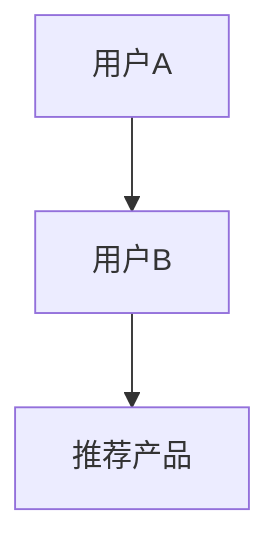
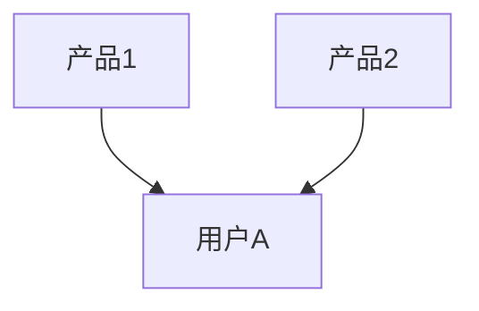
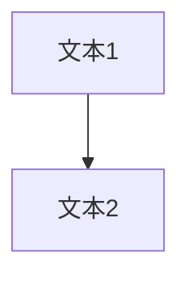
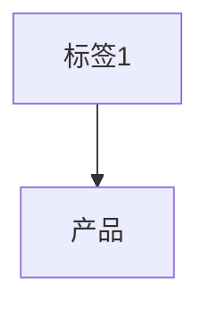
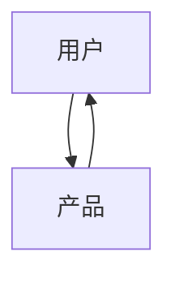
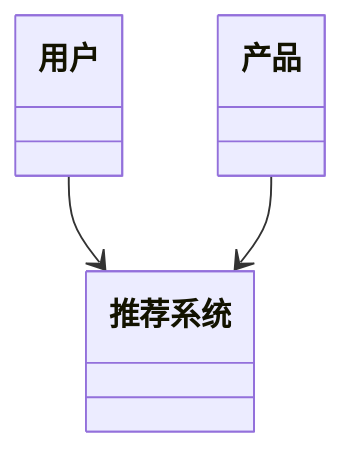
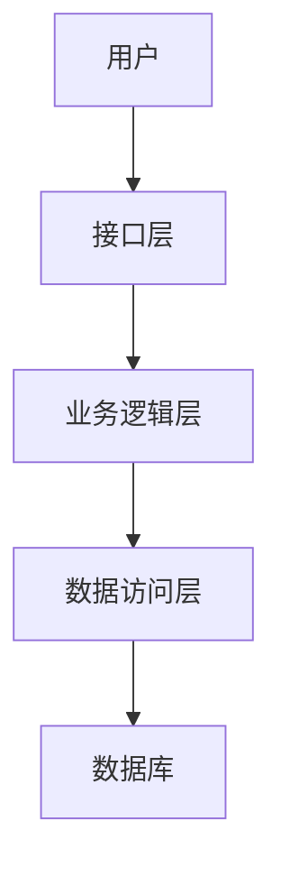

                 


---

# AI辅助产品推荐与个性化服务的算法与实现

> 关键词：AI推荐系统、个性化服务、协同过滤、机器学习、深度学习、推荐算法

> 摘要：本文系统地探讨了AI在产品推荐与个性化服务中的应用，从推荐系统的背景与核心概念出发，详细分析了协同过滤、基于内容的推荐、矩阵分解等算法的原理与实现。通过Mermaid流程图和LaTeX公式的辅助，深入讲解了推荐算法的数学模型。同时，结合实际项目案例，从系统分析到架构设计，再到代码实现，全面展示了AI辅助产品推荐与个性化服务的完整技术链条。本文旨在为技术专家和开发人员提供一份深入浅出的技术指南，帮助他们在实际应用中更好地理解和实现AI推荐系统。

---

## 第一部分: AI辅助产品推荐与个性化服务的背景与核心概念

### 第1章: 问题背景与问题描述

#### 1.1 问题背景

##### 1.1.1 传统推荐系统的局限性
传统推荐系统在处理大规模数据时存在计算效率低、实时性差、推荐结果不够精准等问题。此外，传统方法难以捕捉用户的隐含需求，导致推荐结果缺乏深度。

##### 1.1.2 AI技术在推荐系统中的应用优势
AI技术，特别是机器学习和深度学习，能够从海量数据中提取复杂的模式和特征，从而实现更精准和个性化的推荐。AI技术还可以处理实时数据流，提高推荐系统的实时性。

##### 1.1.3 个性化服务的市场需求与发展趋势
随着用户对个性化体验的需求日益增长，个性化服务已经成为企业竞争的核心优势。AI技术的引入使得个性化服务更加智能化和动态化，进一步推动了市场的快速发展。

#### 1.2 问题描述

##### 1.2.1 产品推荐的核心问题
如何从海量数据中找到与用户需求最匹配的产品，同时保证推荐结果的实时性和准确性。

##### 1.2.2 个性化服务的需求分析
用户期望获得与自身需求高度匹配的服务，同时希望服务能够根据自己的行为动态调整。

##### 1.2.3 现有推荐算法的不足与改进方向
现有推荐算法在数据稀疏性、实时性、冷启动问题等方面存在不足，需要结合多种算法和技术进行优化。

### 第2章: 核心概念与核心要素

#### 2.1 推荐系统与个性化服务的定义

##### 2.1.1 推荐系统的定义与分类
推荐系统是一种根据用户的行为和偏好，向用户推荐相关产品或服务的系统。根据推荐依据的不同，可以分为基于协同过滤、基于内容和基于机器学习的推荐系统。

##### 2.1.2 个性化服务的定义与特征
个性化服务是指根据用户的个性化需求，提供定制化的产品或服务。其特征包括动态性、定制化和智能化。

#### 2.2 核心概念的联系

##### 2.2.1 推荐系统与个性化服务的关系
推荐系统是实现个性化服务的重要技术手段，而个性化服务则是推荐系统的终极目标。

##### 2.2.2 数据、算法、用户三者的关系
数据是推荐系统的基础，算法是推荐的核心，用户是推荐的最终服务对象。三者相互关联，共同决定了推荐系统的性能和效果。

##### 2.2.3 推荐系统的评价指标与核心要素
推荐系统的评价指标包括准确率、召回率、F1值等。核心要素包括数据质量、算法选择和系统实现。

### 第3章: 核心概念的原理与特征对比

#### 3.1 推荐系统的原理

##### 3.1.1 协同过滤的基本原理
协同过滤基于用户之间的相似性，通过寻找与目标用户行为相似的用户，推荐这些用户喜欢的产品。

##### 3.1.2 基于内容的推荐算法
基于内容的推荐算法通过分析产品的属性特征，寻找与用户偏好相似的产品进行推荐。

##### 3.1.3 基于机器学习的推荐模型
基于机器学习的推荐模型通过训练用户行为数据，预测用户的偏好，从而推荐相关产品。

#### 3.2 个性化服务的特征

##### 3.2.1 个性化服务的核心特征
个性化服务的核心特征包括动态性、定制化和智能化，能够根据用户的实时行为和需求进行调整。

##### 3.2.2 个性化服务的实现方式
个性化服务可以通过推荐系统、动态内容生成和自适应交互等多种方式实现。

##### 3.2.3 个性化服务的评价标准
个性化服务的评价标准包括用户满意度、推荐准确率和系统的实时性等。

### 第4章: 核心概念的ER实体关系图

#### 4.1 推荐系统实体关系图

```mermaid
er
actor: 用户
object: 推荐系统
association: 使用
```

#### 4.2 个性化服务的实体关系图

```mermaid
er
actor: 用户
object: 个性化服务
association: 需求
```

---

## 第二部分: AI辅助产品推荐与个性化服务的算法原理

### 第5章: 推荐算法的原理与实现

#### 5.1 协同过滤算法

##### 5.1.1 基于用户的协同过滤算法



##### 5.1.2 基于物品的协同过滤算法



##### 5.1.3 协同过滤算法的优缺点
协同过滤的优点是简单易实现，缺点是计算效率低，难以处理大规模数据。

#### 5.2 基于内容的推荐算法

##### 5.2.1 基于文本相似度的推荐算法



##### 5.2.2 基于标签的推荐算法



##### 5.2.3 基于内容的推荐算法实现
基于内容的推荐算法通过计算产品之间的相似度，推荐与用户偏好相似的产品。

#### 5.3 基于机器学习的推荐算法

##### 5.3.1 基于矩阵分解的推荐算法



##### 5.3.2 基于深度学习的推荐算法
基于深度学习的推荐算法通过构建深度神经网络，学习用户和产品的复杂特征，实现更精准的推荐。

##### 5.3.3 机器学习推荐算法的优缺点
机器学习推荐算法的优点是推荐效果好，缺点是计算复杂度高，需要大量的计算资源。

### 第6章: 推荐算法的数学模型

#### 6.1 协同过滤的数学模型

$$ \text{相似度} = \frac{\sum (r_{u,i} - \bar{r_u})(r_{u,j} - \bar{r_u})}{\sqrt{\sum (r_{u,i} - \bar{r_u})^2} \cdot \sqrt{\sum (r_{u,j} - \bar{r_u})^2}} $$

#### 6.2 基于矩阵分解的数学模型

$$ P \cdot Q^T = R $$

其中，$P$是用户特征矩阵，$Q$是产品特征矩阵，$R$是评分矩阵。

#### 6.3 深度学习推荐算法的数学模型

$$ y = f(x; \theta) $$

其中，$x$是输入特征，$\theta$是模型参数，$f$是深度神经网络函数。

---

## 第三部分: AI辅助产品推荐与个性化服务的系统实现

### 第7章: 系统分析与架构设计

#### 7.1 系统功能设计

##### 7.1.1 系统功能模块
系统功能模块包括用户数据采集、推荐算法实现、推荐结果展示等。

##### 7.1.2 领域模型类图



#### 7.2 系统架构设计

##### 7.2.1 系统架构图



#### 7.3 系统接口设计

##### 7.3.1 接口定义
定义RESTful API接口，包括用户注册、登录、获取推荐结果等。

##### 7.3.2 接口交互流程图


### 第8章: 项目实战

#### 8.1 项目介绍

##### 8.1.1 项目目标
实现一个基于AI的电商推荐系统，能够根据用户的行为和偏好推荐相关产品。

##### 8.1.2 项目技术选型
使用Python、TensorFlow、Flask等技术实现推荐系统。

#### 8.2 核心代码实现

##### 8.2.1 环境安装
安装必要的依赖库，如TensorFlow、Flask等。

##### 8.2.2 核心代码实现

```python
import numpy as np
from sklearn.metrics.pairwise import cosine_similarity

# 示例协同过滤算法实现
def collaborative_filtering(user_data):
    user_similarity = cosine_similarity(user_data)
    return user_similarity.argmax(axis=1)
```

##### 8.2.3 代码解读与分析
协同过滤算法通过计算用户之间的相似度，找到与目标用户最相似的用户，推荐这些用户喜欢的产品。

#### 8.3 实际案例分析

##### 8.3.1 案例背景
以电商网站为例，用户通过浏览和购买行为生成推荐结果。

##### 8.3.2 案例分析
通过协同过滤算法，系统能够推荐与用户行为相似的其他用户喜欢的产品。

---

## 第四部分: 总结与展望

### 第9章: 总结与展望

#### 9.1 最佳实践 tips
- 数据质量是推荐系统的核心，确保数据的完整性和准确性。
- 组合多种推荐算法，提高推荐系统的准确率和召回率。
- 定期更新模型，适应用户需求的变化。

#### 9.2 小结
本文系统地介绍了AI辅助产品推荐与个性化服务的核心概念、算法原理和系统实现。通过实际案例的分析，展示了如何将理论应用于实践。

#### 9.3 注意事项
- 注意数据隐私和用户隐私的保护。
- 确保推荐系统的实时性和响应速度。
- 定期监控和优化推荐系统的性能。

#### 9.4 拓展阅读
推荐阅读《推荐系统实战》和《深度学习入门》等书籍，进一步深入学习推荐系统和深度学习技术。

---

## 作者：AI天才研究院/AI Genius Institute & 禅与计算机程序设计艺术 /Zen And The Art of Computer Programming

--- 

如果需要进一步扩展或具体章节内容的详细编写，请随时告知！

