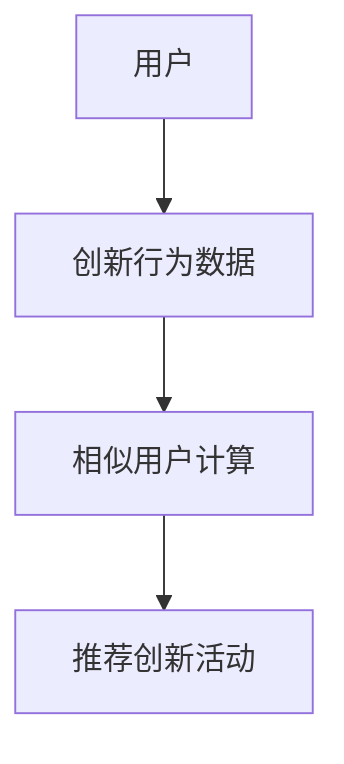
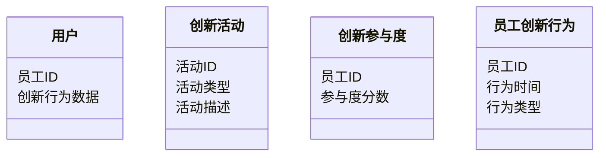
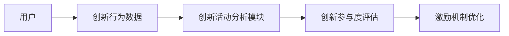
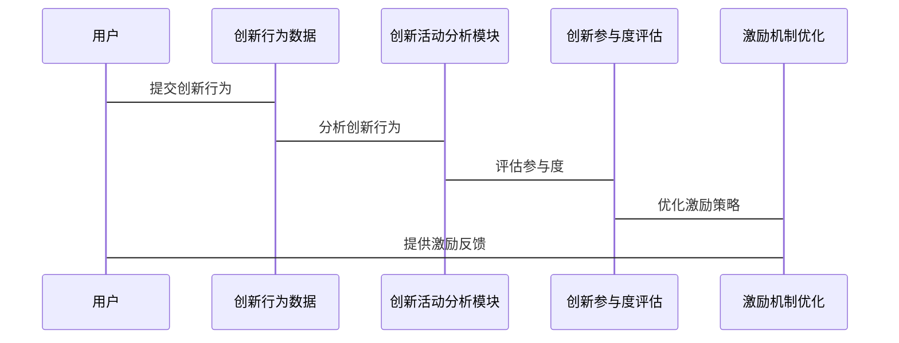

                 


# AI辅助企业创新文化培养：创新活动参与度分析与激励

---

## 关键词：
AI技术、企业创新文化、创新活动参与度、员工激励、数据驱动方法

---

## 摘要：
随着企业竞争的加剧，创新文化成为企业持续发展的核心竞争力。本文通过分析创新活动参与度，结合人工智能技术，提出了基于数据驱动的员工创新行为分析与激励机制设计。文章从背景、概念、算法、系统设计、项目实战等多维度展开，深入探讨如何利用AI技术提升企业创新文化，激发员工创新潜能，最终实现企业可持续发展。

---

# 第一部分: AI辅助企业创新文化培养的背景与核心概念

## 第1章: 问题背景与问题描述

### 1.1 问题背景
#### 1.1.1 企业创新文化的重要性
- 创新文化是企业核心竞争力的关键。
- 在数字化转型中，创新文化是企业适应变化的核心能力。
- 员工的创新行为是企业创新文化的核心驱动力。

#### 1.1.2 当前企业创新面临的挑战
- 创新活动参与度低。
- 员工创新行为缺乏有效激励。
- 创新文化评估缺乏数据支撑。

#### 1.1.3 AI技术在企业创新中的潜在作用
- AI技术可以高效分析员工创新行为数据。
- AI技术可以个性化激励员工创新行为。
- AI技术可以优化企业创新文化评估体系。

### 1.2 问题描述
#### 1.2.1 创新活动参与度的定义与测量
- 创新活动参与度是员工参与创新行为的频率和深度的量化指标。
- 创新活动包括提出新想法、参与创新项目、贡献创新成果等。

#### 1.2.2 员工创新行为的驱动因素
- 内在动机：兴趣、成就感。
- 外在激励：薪酬、奖励、晋升。
- 创新环境：企业支持、资源分配、文化氛围。

#### 1.2.3 企业创新文化的核心要素
- 价值观：鼓励创新、容错文化。
- 制度：创新激励机制、创新流程。
- 资源：资金、技术、团队。

### 1.3 问题解决与边界
#### 1.3.1 AI辅助创新文化的实现路径
- 数据采集：员工行为数据、创新成果数据。
- 数据分析：创新行为模式识别、创新潜力预测。
- 激励优化：个性化激励策略、创新文化评估。

#### 1.3.2 创新活动参与度分析的边界与外延
- 数据采集范围：仅限于员工创新行为数据。
- 数据分析范围：不涉及员工隐私。
- 激励机制优化：不改变企业现有制度框架。

#### 1.3.3 企业创新文化与员工激励的关系
- 创新文化是激励机制的基础。
- 激励机制是创新文化的催化剂。
- 二者相互促进，共同提升企业创新能力。

---

## 第2章: 核心概念与概念结构

### 2.1 核心概念的定义与属性
#### 2.1.1 创新活动参与度
- **定义**：员工参与创新活动的频率和深度的量化指标。
- **属性**：创新行为频率、创新成果数量、创新行为多样性。

#### 2.1.2 员工创新行为
- **定义**：员工在工作中表现出的创新思维和行为。
- **属性**：创新意识、创新能力、创新成果。

#### 2.1.3 企业创新文化
- **定义**：企业在长期发展中形成的鼓励创新的价值观和行为模式。
- **属性**：创新价值观、创新制度、创新资源。

### 2.2 概念属性对比表
| 概念 | 属性 | 描述 |
|------|------|------|
| 创新活动参与度 | 创新行为频率 | 员工参与创新活动的次数 |
| 员工创新行为 | 创新成果数量 | 员工在创新活动中产生的成果数量 |
| 企业创新文化 | 创新价值观 | 企业对创新的重视程度和态度 |

### 2.3 概念结构与ER实体关系图
```mermaid
er
actor: 员工
/----[参与]----/ 创新活动
创新活动 --[评估]--> 创新参与度
企业创新文化 --[影响]--> 员工创新行为
```

---

# 第三部分: AI辅助创新活动参与度分析的算法与模型

## 第3章: 算法原理与数学模型

### 3.1 协同过滤推荐算法
#### 3.1.1 算法原理
- **协同过滤**：基于用户行为数据的相似性推荐创新活动。
- **基于物品的协同过滤**：根据创新活动的相似性推荐。

#### 3.1.2 数学模型
- **相似度计算公式**：
  $$相似度 = \frac{\sum (x_i - \bar{x})(y_i - \bar{y})}{\sqrt{\sum (x_i - \bar{x})^2} \sqrt{\sum (y_i - \bar{y})^2}}$$
- **推荐公式**：
  $$推荐值 = \sum_{j \in 相似用户} 权重 \times 用户j的偏好$$

#### 3.1.3 算法流程


#### 3.1.4 代码实现
```python
import numpy as np

def cosine_similarity(user_vector, item_vector):
    numerator = np.sum(user_vector * item_vector)
    denominator = np.sqrt(np.sum(user_vector**2)) * np.sqrt(np.sum(item_vector**2))
    return numerator / denominator

# 示例数据
user_vector = np.array([1, 2, 3])
item_vector = np.array([2, 4, 6])

similarity = cosine_similarity(user_vector, item_vector)
print(f"相似度：{similarity}")
```

---

## 第4章: 系统分析与架构设计

### 4.1 问题场景介绍
- **问题场景**：企业需要分析员工创新活动参与度，制定个性化激励机制。
- **目标**：通过AI技术优化创新文化评估和激励机制。

### 4.2 系统功能设计
#### 4.2.1 领域模型


#### 4.2.2 系统架构设计


### 4.3 系统接口设计
- **数据接口**：员工行为数据接口。
- **分析接口**：创新活动参与度分析接口。
- **激励接口**：个性化激励策略接口。

### 4.4 系统交互设计


---

## 第5章: 项目实战

### 5.1 环境安装
- **工具**：Python、NumPy、Pandas、Scikit-learn。
- **数据集**：员工创新行为数据集。

### 5.2 核心代码实现
```python
import numpy as np
from sklearn.metrics.pairwise import cosine_similarity

# 示例数据
user_behaviors = np.array([[1, 2, 3], [4, 5, 6], [7, 8, 9]])
item_behaviors = np.array([[2, 3, 4], [5, 6, 7], [8, 9, 10]])

# 计算相似度矩阵
similarity_matrix = cosine_similarity(user_behaviors, item_behaviors)
print(f"相似度矩阵：\n{similarity_matrix}")
```

### 5.3 代码解读与分析
- **代码功能**：计算用户行为与创新活动的相似度。
- **实现细节**：使用cosine相似度算法。

### 5.4 案例分析
- **案例背景**：某科技公司员工创新行为分析。
- **分析结果**：员工A创新参与度高，员工B创新参与度低。
- **激励策略**：针对员工A提供晋升机会，针对员工B提供培训支持。

---

## 第6章: 总结与展望

### 6.1 最佳实践 Tips
- 数据隐私保护是关键。
- 激励机制要结合企业文化。
- 持续优化模型性能。

### 6.2 小结
- AI技术可以有效提升企业创新文化评估与激励机制。
- 通过数据分析优化创新活动参与度。
- 个性化激励策略可以激发员工创新潜能。

### 6.3 注意事项
- 数据采集要合法合规。
- 模型要持续优化。
- 激励机制要结合企业实际情况。

### 6.4 拓展阅读
- 《创新领导力》
- 《数据驱动的管理决策》

---

## 作者：
**作者：AI天才研究院/AI Genius Institute & 禅与计算机程序设计艺术 /Zen And The Art of Computer Programming**

