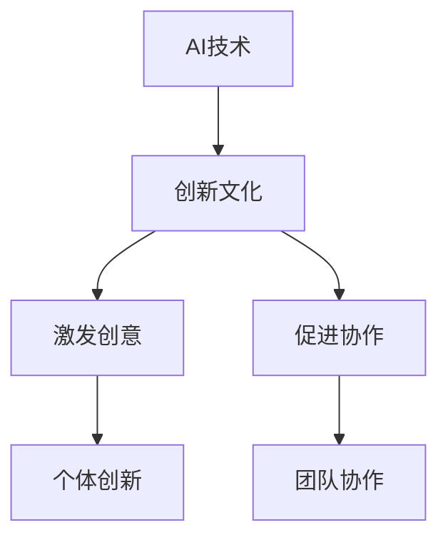
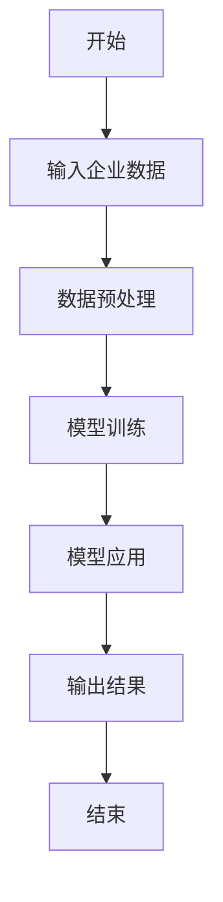
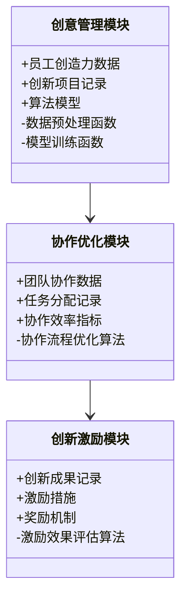
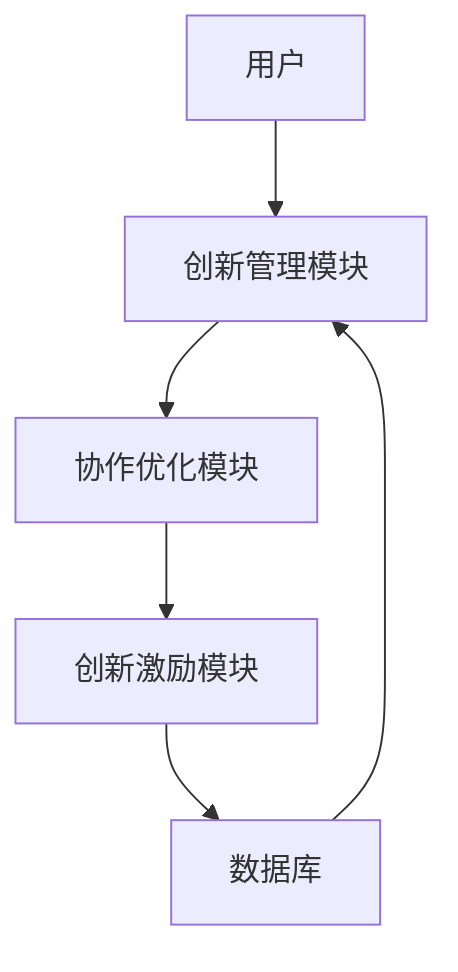
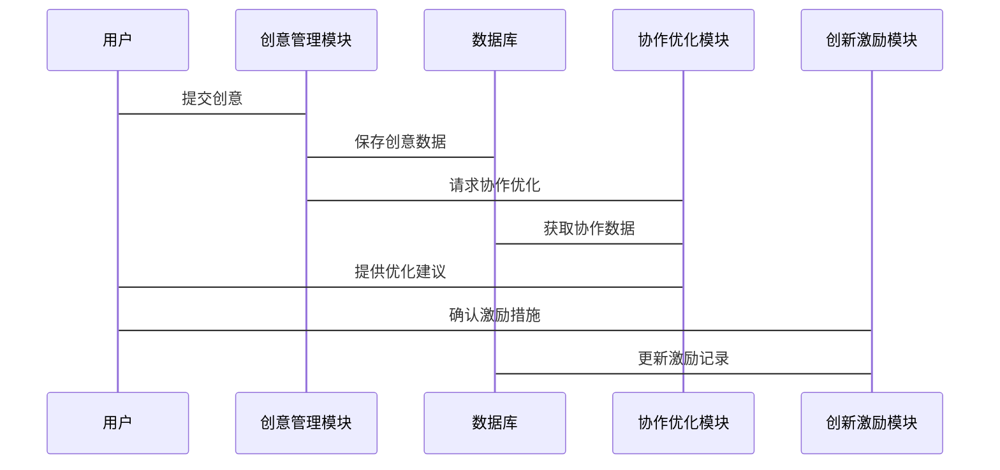

                 


# AI辅助企业创新文化建设：激发创意与促进协作

> 关键词：AI、企业创新、文化建设、协作、创意激发

> 摘要：本文探讨了人工智能（AI）如何辅助企业创新文化建设，通过激发员工创意和促进团队协作，从而提升企业的创新能力。文章结合实际案例和系统设计，详细阐述了AI在企业创新中的应用场景和实现方法，为企业的管理者和技术人员提供了理论和实践指导。

---

## 第一部分：引言

### 1.1 本书的目的与结构

本书旨在探讨AI技术在企业创新文化建设中的应用，通过理论分析和实践案例，帮助读者理解如何利用AI激发创意和促进协作。文章结构分为以下几个部分：

1. **背景介绍**：分析AI辅助企业创新文化建设的核心概念。
2. **核心概念与联系**：详细阐述AI在创新文化中的原理和应用。
3. **算法原理讲解**：通过流程图和数学模型，展示AI的算法实现。
4. **系统分析与架构设计**：从问题场景到系统架构，详细设计AI辅助系统。
5. **项目实战**：通过环境安装、代码实现和案例分析，展示AI的实际应用。
6. **最佳实践、小结、注意事项和拓展阅读**：总结经验，提供实用建议和进一步学习方向。

---

## 第二部分：背景介绍

### 2.1 AI辅助企业创新文化建设的核心概念

企业创新文化建设是企业发展的关键，而AI技术的应用为企业提供了新的工具和方法。以下是核心概念的详细说明：

- **AI技术**：利用机器学习、自然语言处理等技术，分析数据并提供创新建议。
- **创新文化**：一种鼓励员工创新、开放协作的企业氛围。
- **激发创意**：通过AI工具帮助员工打破思维定式，产生更多创新想法。
- **促进协作**：利用AI优化团队协作流程，提升沟通效率。

### 2.2 核心概念之间的关系

通过以下表格和ER图，展示核心概念之间的关系：

| 概念 | 属性 | 特征 |
|------|------|------|
| AI技术 | 技术性 | 数据驱动 |
| 创新文化 | 组织性 | 文化驱动 |
| 激发创意 | 个体性 | 思维驱动 |
| 促进协作 | 社会性 | 协同驱动 |



---

## 第三部分：核心概念与联系

### 3.1 核心概念原理

AI辅助企业创新文化建设的原理可以通过以下流程图展示：



### 3.2 算法原理数学模型

AI通过分析员工行为数据，计算创新概率的数学模型如下：

$$P(\text{创新} | \text{AI}) = \frac{P(\text{AI} | \text{创新}) \cdot P(\text{创新})}{P(\text{AI})}$$

例如，企业可以通过分析员工创造力数据，计算出员工在AI辅助下的创新概率。

---

## 第四部分：系统分析与架构设计方案

### 4.1 问题场景介绍

假设一家科技公司希望利用AI优化其创新文化，提升员工协作效率。公司面临的问题包括：员工创意难以量化、团队协作效率低下、创新激励不足。

### 4.2 系统功能设计

以下是系统功能设计的领域模型类图：



### 4.3 系统架构设计

系统架构设计如下：



### 4.4 系统接口设计

以下是关键接口：

1. `postDataToDB(data)`：将创意数据存入数据库。
2. `trainModel(data)`：训练创新预测模型。
3. `optimizeCollaboration(data)`：优化协作流程。
4. `calculateInnovationProbability(data)`：计算创新概率。

### 4.5 系统交互设计

以下是用户与系统的交互流程：



---

## 第五部分：项目实战

### 5.1 环境安装

需要安装以下工具：

- Python 3.8+
- TensorFlow 2.0+
- Scikit-learn 0.24+
- Mermaid CLI
- Jupyter Notebook

### 5.2 核心代码实现

以下是关键代码片段：

```python
# 数据预处理
import pandas as pd
data = pd.read_csv('employee_data.csv')
data = data.dropna()

# 模型训练
from sklearn.model import LogisticRegression
model = LogisticRegression()
model.fit(data[['创造力', '协作能力']], data['创新概率'])

# 模型应用
def predict_innovation_probability(employee_data):
    return model.predict([employee_data])[0]
```

### 5.3 代码解读与分析

- **数据预处理**：使用Pandas读取数据并处理缺失值。
- **模型训练**：使用逻辑回归模型，基于创造力和协作能力预测创新概率。
- **模型应用**：定义函数，根据员工数据预测创新概率。

### 5.4 案例分析与详细讲解

以某公司为例，假设员工A创造力得分为80，协作能力得分为75。模型预测其创新概率为85%。公司可以根据此结果提供针对性的激励措施，如项目资源倾斜。

### 5.5 项目小结

通过AI技术，公司能够量化员工创新潜力，优化协作流程，并制定有效的激励措施，从而提升整体创新能力。

---

## 第六部分：最佳实践、小结、注意事项和拓展阅读

### 6.1 最佳实践 tips

- **数据收集**：确保数据的多样性和代表性。
- **模型选择**：根据具体需求选择合适的算法。
- **持续优化**：定期更新模型，适应企业变化。

### 6.2 小结

AI技术为企业创新文化建设提供了强大工具，能够激发创意、促进协作，并提升整体创新能力。通过系统的架构设计和实际案例分析，读者可以掌握AI的应用方法。

### 6.3 注意事项

- **数据隐私**：确保员工数据的隐私和安全。
- **模型局限性**：AI模型无法完全替代人类判断，需结合实际情况使用。

### 6.4 拓展阅读

推荐阅读《人工智能：一种现代的方法》和《企业创新管理》，深入理解AI在企业创新中的应用。

---

## 作者：AI天才研究院 & 禅与计算机程序设计艺术

通过以上结构，文章系统地介绍了AI在企业创新文化建设中的应用，结合理论分析和实践案例，帮助读者全面理解AI的技术原理和实际应用。

