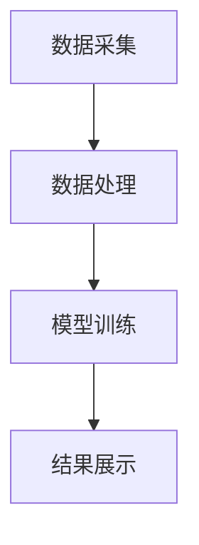

                 


# AI辅助企业创新文化评估：定量与定性指标分析的智能化

> 关键词：AI辅助、企业创新文化、定量指标、定性指标、智能化评估

> 摘要：本文探讨了如何利用人工智能技术对企业创新文化进行评估，结合定量和定性指标，构建智能化评估系统。通过分析创新文化的定义、评估方法、AI算法的应用、系统架构设计及实际案例，本文为企业的创新文化管理提供了理论支持和实践指导。

---

## 第一部分：AI辅助企业创新文化评估的背景与概念

### 第1章：企业创新文化评估的背景与定义

#### 1.1 企业创新文化的重要性

企业创新文化是企业在市场竞争中保持持续发展的核心动力。它不仅影响企业的创新能力，还影响员工的创造力和整体组织氛围。创新文化评估的目的是帮助企业识别优势和不足，优化创新环境，提升创新能力。

#### 1.2 AI在企业创新文化评估中的作用

人工智能技术的快速发展为企业创新文化评估提供了新的可能性。AI可以通过大数据分析、自然语言处理和机器学习等技术，实现对创新文化的定量与定性评估，帮助企业在复杂环境中快速识别和优化创新文化。

#### 1.3 创新文化评估的必要性

创新文化评估是企业战略管理的重要组成部分。通过评估，企业可以了解创新文化的现状，发现潜在问题，并制定相应的改进措施。同时，评估结果还可以为企业的创新战略提供数据支持。

---

### 第2章：定量与定性指标的结合

#### 2.1 定量指标的定义与特点

定量指标是通过具体数据进行衡量的指标，例如创新项目的数量、研发投入占比、专利申请数量等。这些指标能够直观反映企业的创新活动成果，但难以全面捕捉创新文化的复杂性。

#### 2.2 定性指标的定义与特点

定性指标是通过描述性信息进行评估的指标，例如员工满意度、创新氛围、团队协作能力等。这些指标能够揭示创新文化的深层次特征，但通常难以量化。

#### 2.3 定量与定性指标的结合

综合评估模型通过结合定量和定性指标，能够更全面地反映企业创新文化的现状。例如，可以将定量指标作为基础数据，结合定性指标进行权重调整，构建综合评估模型。

---

### 第3章：AI辅助创新文化评估的核心概念

#### 3.1 创新文化评估的AI模型

AI模型通过学习企业数据，识别创新文化的关键特征。例如，使用自然语言处理技术分析员工反馈，提取情感倾向，评估创新氛围。

#### 3.2 AI算法在创新文化评估中的应用

机器学习算法（如随机森林、支持向量机）可以用于分类和回归分析，帮助识别创新文化的关键影响因素。自然语言处理技术可以用于文本挖掘，提取创新文化相关的关键词和主题。

---

### 第4章：创新文化评估的系统架构

#### 4.1 系统功能模块设计

- 数据采集模块：收集企业创新活动数据，如专利申请、研发投入、员工反馈等。
- 数据处理模块：对数据进行清洗、转换和特征提取。
- 模型训练模块：构建AI模型，训练创新文化评估模型。
- 结果展示模块：输出评估结果，提供改进建议。

#### 4.2 系统架构设计

采用分层架构，包括数据层、业务逻辑层和展示层。数据层负责数据存储和管理，业务逻辑层负责模型训练和评估，展示层负责结果呈现。

---

## 第二部分：AI辅助创新文化评估的算法与模型

### 第5章：文本挖掘与自然语言处理

#### 5.1 文本挖掘技术

文本挖掘技术用于从非结构化数据中提取有用信息。例如，从员工反馈中提取情感倾向，识别创新文化的关键问题。

#### 5.2 自然语言处理技术

自然语言处理技术用于理解和生成人类语言。例如，使用情感分析模型评估员工对创新文化的满意度。

#### 5.3 机器学习模型

机器学习模型用于分类和回归分析。例如，使用随机森林模型预测企业的创新潜力。

---

### 第6章：数学模型与公式

#### 6.1 综合评估模型

综合评估模型可以通过加权平均的方式结合定量和定性指标。例如：

$$
\text{综合评分} = \sum_{i=1}^{n} w_i \cdot x_i
$$

其中，$w_i$是指标权重，$x_i$是指标得分。

#### 6.2 情感分析模型

情感分析模型用于评估员工对创新文化的看法。例如，使用LSTM模型进行情感分类：

$$
y = \text{sigmoid}(Wx + b)
$$

---

## 第三部分：系统架构与实现

### 第7章：系统架构设计

#### 7.1 系统功能模块

- 数据采集：从企业内部系统获取数据。
- 数据处理：清洗和转换数据，提取特征。
- 模型训练：训练AI模型，评估创新文化。
- 结果展示：可视化评估结果，提供改进建议。

#### 7.2 系统架构图



---

### 第8章：系统接口设计

#### 8.1 数据接口

- 数据输入接口：接收企业数据。
- 数据输出接口：输出评估结果。

#### 8.2 API设计

使用RESTful API进行数据交互。例如：

- POST /api/train：提交数据进行模型训练。
- GET /api/results：获取评估结果。

---

## 第四部分：项目实战与最佳实践

### 第9章：项目实战

#### 9.1 环境安装

安装必要的Python库，如scikit-learn、NLTK、TensorFlow。

#### 9.2 代码实现

```python
import numpy as np
from sklearn.ensemble import RandomForestClassifier

# 示例数据
X = np.array([[1, 2, 3], [4, 5, 6]])
y = np.array([0, 1])

# 训练模型
model = RandomForestClassifier()
model.fit(X, y)

# 预测结果
print(model.predict([[7, 8, 9]]))
```

#### 9.3 案例分析

通过实际案例分析，验证模型的有效性。例如，分析某企业的创新文化评估结果，提出改进建议。

---

### 第10章：最佳实践

#### 10.1 小结

本文详细介绍了AI辅助企业创新文化评估的方法，结合定量与定性指标，构建智能化评估系统。

#### 10.2 注意事项

- 数据质量：确保数据的准确性和完整性。
- 模型选择：根据实际需求选择合适的算法。
- 结果解释：清晰解释评估结果，提供具体建议。

#### 10.3 拓展阅读

推荐相关书籍和论文，进一步深入学习。

---

## 第五部分：总结

### 第11章：总结与展望

#### 11.1 总结

本文通过分析企业创新文化的定义、评估方法和AI技术的应用，构建了智能化评估系统。通过实际案例展示了系统的有效性。

#### 11.2 展望

未来，随着AI技术的发展，企业创新文化评估将更加智能化和个性化。可以通过引入更多数据源和优化模型算法，提升评估的准确性和实用性。

---

作者：AI天才研究院 & 禅与计算机程序设计艺术

