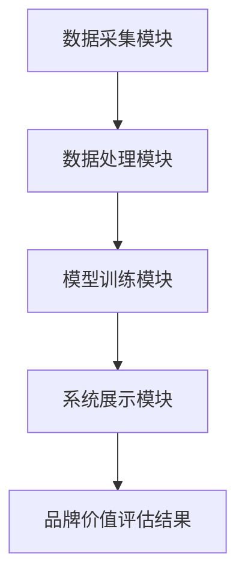
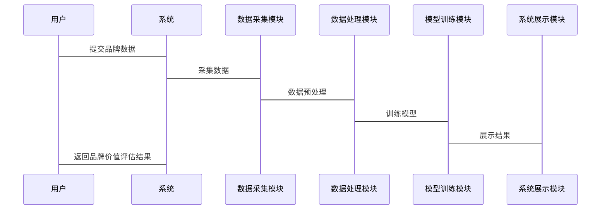

                 


# AI辅助企业品牌资产评估：多维度品牌价值量化与追踪

> 关键词：AI辅助，品牌资产评估，多维度量化，品牌价值追踪，自然语言处理，知识图谱，机器学习

> 摘要：随着人工智能技术的快速发展，企业品牌价值的评估和追踪变得越来越重要。本文将从AI辅助的角度，详细探讨品牌价值的多维度量化与追踪方法。通过结合自然语言处理（NLP）、知识图谱和机器学习等技术，本文将分析品牌资产的核心维度、构建品牌知识图谱、设计品牌价值预测模型，并提供系统架构设计与项目实战案例。最后，本文将总结AI在品牌资产评估中的应用价值，并展望未来的发展方向。

---

## 第1章: AI与品牌资产评估的背景

### 1.1 传统品牌资产评估的局限性

#### 1.1.1 传统品牌评估方法的不足
传统的品牌资产评估方法主要依赖于财务数据和市场调研，存在以下问题：
- 数据来源单一，难以覆盖品牌在市场中的多维度表现。
- 评估周期长，难以实时追踪品牌价值的变化。
- 人工分析为主，效率低下且容易受到主观因素影响。

#### 1.1.2 数据驱动评估的需求
随着大数据时代的到来，企业需要更加精准和实时的品牌价值评估方法。数据驱动的评估方法可以整合多种数据源（如社交媒体数据、销售数据等），提供更全面的品牌价值分析。

#### 1.1.3 AI技术在品牌评估中的优势
AI技术通过自然语言处理（NLP）、机器学习和知识图谱等技术，能够从海量数据中提取有用信息，帮助品牌实现多维度量化和实时追踪。

### 1.2 品牌价值的多维度量化

#### 1.2.1 品牌价值的定义与构成
品牌价值是品牌在市场中的综合表现，包括品牌知名度、美誉度、忠诚度等多个维度。

#### 1.2.2 多维度评估的核心维度
多维度评估包括：
- 品牌知名度：品牌在市场中的曝光度和认知度。
- 品牌美誉度：消费者对品牌的满意度和信任度。
- 品牌忠诚度：消费者对品牌的忠诚程度。

#### 1.2.3 数据驱动的品牌价值追踪
通过整合社交媒体数据、销售数据、行业报告等多源数据，构建品牌价值的动态评估模型。

### 1.3 本章小结
传统品牌资产评估方法存在数据来源单一、评估周期长、效率低下的问题。AI技术的引入为品牌价值的多维度量化和实时追踪提供了新的解决方案。

---

## 第2章: 品牌价值评估的核心维度

### 2.1 品牌资产的核心要素

#### 2.1.1 品牌知名度
品牌知名度是品牌在市场中的曝光度和认知度，可以通过社交媒体数据、搜索引擎数据等进行评估。

#### 2.1.2 品牌美誉度
品牌美誉度是消费者对品牌的满意度和信任度，可以通过情感分析技术从社交媒体评论中提取。

#### 2.1.3 品牌忠诚度
品牌忠诚度是消费者对品牌的忠诚程度，可以通过销售数据和用户行为数据进行分析。

### 2.2 多维度评估的指标体系

#### 2.2.1 数据来源与特征
品牌价值评估的数据来源包括：
- 社交媒体数据：社交媒体上的评论、点赞、分享等数据。
- 销售数据：销售额、市场份额等数据。
- 行业报告：行业分析报告、竞争对手分析等数据。

#### 2.2.2 指标权重与计算方法
通过构建指标体系，将品牌知名度、美誉度、忠诚度等指标赋予不同的权重，计算出综合品牌价值。

#### 2.2.3 综合评估模型
综合评估模型可以采用加权平均法、层次分析法（AHP）等方法，将多维度指标整合成一个综合品牌价值评分。

### 2.3 核心概念的ER实体关系图

```mermaid
er
    entity(品牌) {
        id
        名称
        行业
    }
    entity(资产) {
        id
        价值
        时间戳
    }
    entity(评估维度) {
        id
        名称
        权重
    }
    relation(属于, 品牌, 资产)
    relation(包含, 资产, 评估维度)
```

### 2.4 本章小结
品牌价值评估需要从多维度进行，包括品牌知名度、美誉度和忠诚度。通过构建指标体系和综合评估模型，可以更全面地衡量品牌价值。

---

## 第3章: 品牌价值评估的NLP技术原理

### 3.1 自然语言处理（NLP）基础

#### 3.1.1 NLP的核心任务
- 分词：将文本分割成词或短语。
- 实体识别：识别文本中的实体（如人名、地名、组织名）。
- 情感分析：分析文本的情感倾向（正面、负面、中性）。

#### 3.1.2 常见的NLP算法与模型
- 分词算法：如jieba、SnowballStemmer。
- 情感分析模型：如文本挖掘（Text Mining）、深度学习模型（如LSTM、BERT）。

### 3.2 品牌文本数据的特征提取

#### 3.2.1 分词与实体识别
通过分词和实体识别技术，从社交媒体评论中提取品牌名称和相关实体。

#### 3.2.2 情感分析与关键词提取
使用情感分析技术判断消费者对品牌的看法，并提取关键词以了解消费者关注的热点。

#### 3.2.3 文本相似度计算
通过计算品牌相关文本的相似度，分析品牌在市场中的竞争对手情况。

### 3.3 NLP技术在品牌价值评估中的应用

#### 3.3.1 品牌情感分析
通过情感分析技术，计算品牌在社交媒体上的正面、负面和中性评论比例，评估品牌美誉度。

#### 3.3.2 品牌关键词提取
通过关键词提取技术，找出品牌相关评论中的高频关键词，分析消费者关注的焦点。

#### 3.3.3 品牌文本相似度分析
通过计算品牌相关文本的相似度，分析品牌在市场中的竞争对手情况，评估品牌忠诚度。

### 3.4 本章小结
NLP技术在品牌价值评估中发挥着重要作用，可以通过情感分析、关键词提取和文本相似度计算等方法，提取品牌相关的文本特征，评估品牌价值。

---

## 第4章: 品牌价值评估的知识图谱构建

### 4.1 知识图谱的基本概念

#### 4.1.1 知识图谱的定义
知识图谱是一种结构化的数据表示方式，通过实体和关系描述现实世界中的知识。

#### 4.1.2 知识图谱的构建步骤
1. 数据清洗：去除噪音数据，提取有用信息。
2. 实体识别：识别文本中的实体。
3. 关系抽取：抽取实体之间的关系。
4. 知识图谱构建：将实体和关系整合到知识图谱中。

### 4.2 品牌知识图谱的构建

#### 4.2.1 品牌实体识别
通过分词和实体识别技术，从品牌相关文本中提取品牌名称、行业、竞争对手等实体。

#### 4.2.2 品牌关系抽取
通过关系抽取技术，分析品牌与其他实体之间的关系，如“属于”、“竞争对手”等。

#### 4.2.3 品牌知识图谱的构建
将品牌实体和关系整合到知识图谱中，形成品牌相关的知识网络。

### 4.3 知识图谱在品牌价值评估中的应用

#### 4.3.1 品牌关系分析
通过知识图谱分析品牌与其他实体之间的关系，评估品牌在市场中的位置。

#### 4.3.2 品牌竞争对手分析
通过知识图谱分析品牌竞争对手的情况，评估品牌在市场中的竞争优势。

### 4.4 本章小结
知识图谱的构建可以帮助企业更好地理解和分析品牌价值，通过品牌实体和关系的分析，评估品牌在市场中的位置和竞争优势。

---

## 第5章: 品牌价值预测模型的构建

### 5.1 机器学习模型概述

#### 5.1.1 机器学习的基本概念
机器学习是一种通过数据训练模型，实现预测和分类的技术。

#### 5.1.2 常见的机器学习算法
- 线性回归：用于回归问题。
- 支持向量机（SVM）：用于分类问题。
- 随机森林：用于分类和回归问题。
- 神经网络：用于复杂的非线性问题。

### 5.2 品牌价值预测模型的设计

#### 5.2.1 数据预处理
- 数据清洗：去除噪音数据，填充缺失值。
- 特征提取：提取品牌相关的特征，如品牌知名度、美誉度等。

#### 5.2.2 模型训练
通过机器学习算法，训练品牌价值预测模型。

#### 5.2.3 模型评估
通过测试数据评估模型的准确性和稳定性。

### 5.3 品牌价值预测模型的应用

#### 5.3.1 品牌价值的实时预测
通过模型实时预测品牌价值的变化。

#### 5.3.2 品牌价值的趋势分析
通过模型分析品牌价值的变化趋势，评估品牌的发展潜力。

### 5.4 本章小结
机器学习模型可以有效预测品牌价值，通过数据预处理、模型训练和评估，可以帮助企业更好地理解和预测品牌价值的变化。

---

## 第6章: 品牌价值评估系统的架构设计

### 6.1 系统功能设计

#### 6.1.1 系统模块划分
- 数据采集模块：采集品牌相关数据。
- 数据处理模块：处理数据，提取特征。
- 模型训练模块：训练品牌价值预测模型。
- 系统展示模块：展示品牌价值评估结果。

#### 6.1.2 系统功能设计
- 数据采集：从社交媒体、销售数据等多源数据中采集品牌相关数据。
- 数据处理：对数据进行清洗、特征提取和标注。
- 模型训练：训练品牌价值预测模型。
- 系统展示：展示品牌价值评估结果，提供可视化界面。

### 6.2 系统架构设计



### 6.3 系统接口设计

#### 6.3.1 数据接口
- 数据输入接口：接收品牌相关数据。
- 数据输出接口：输出品牌价值评估结果。

#### 6.3.2 模型接口
- 模型训练接口：训练品牌价值预测模型。
- 模型预测接口：预测品牌价值。

### 6.4 系统交互流程



### 6.5 本章小结
通过系统架构设计和接口设计，可以实现品牌价值的多维度量化和实时追踪。系统功能设计包括数据采集、数据处理、模型训练和系统展示四个模块，系统架构设计展示了模块之间的交互关系。

---

## 第7章: 项目实战：基于AI的品牌价值评估系统实现

### 7.1 环境搭建

#### 7.1.1 安装Python
安装Python和必要的Python库（如pandas、numpy、scikit-learn、jieba）。

#### 7.1.2 安装NLP工具
安装NLP相关工具，如jieba、spacy、nltk。

#### 7.1.3 安装机器学习库
安装机器学习库，如scikit-learn、xgboost、keras。

### 7.2 核心代码实现

#### 7.2.1 数据预处理
```python
import pandas as pd
import numpy as np

# 数据加载
data = pd.read_csv('brand_data.csv')

# 数据清洗
data.dropna()
data = data.drop_duplicates()

# 特征提取
from sklearn.preprocessing import OneHotEncoder
encoder = OneHotEncoder()
encoder.fit(data[['行业', '品牌']])

# 特征转换
X = encoder.transform(data[['行业', '品牌']])
```

#### 7.2.2 模型训练
```python
from sklearn.ensemble import RandomForestRegressor
from sklearn.model_selection import train_test_split
from sklearn.metrics import mean_squared_error

# 数据分割
X_train, X_test, y_train, y_test = train_test_split(X, data['价值'], test_size=0.2)

# 模型训练
model = RandomForestRegressor()
model.fit(X_train, y_train)

# 模型评估
y_pred = model.predict(X_test)
print(mean_squared_error(y_test, y_pred))
```

### 7.3 项目总结

#### 7.3.1 项目小结
通过项目实战，可以实现基于AI的品牌价值评估系统，从数据预处理、模型训练到系统展示，完整地展示了AI在品牌资产评估中的应用。

#### 7.3.2 最佳实践 tips
- 数据预处理是关键，需要确保数据的干净和准确性。
- 模型选择需要根据具体问题和数据特点进行调整。
- 系统设计需要考虑模块化和可扩展性。

### 7.4 本章小结
通过项目实战，读者可以掌握基于AI的品牌价值评估系统的实现方法，从数据预处理、模型训练到系统展示，完整地展示了AI在品牌资产评估中的应用。

---

## 第8章: 总结与展望

### 8.1 本章总结
本文详细探讨了AI在品牌资产评估中的应用，从多维度品牌价值量化到实时追踪，展示了AI技术在品牌资产评估中的巨大潜力。

### 8.2 未来展望
未来，随着AI技术的不断发展，品牌资产评估将更加精准和实时。通过结合区块链技术，可以实现品牌价值的去中心化评估。同时，随着深度学习技术的不断发展，品牌资产评估的模型将更加复杂和高效。

### 8.3 最佳实践 tips
- 在品牌资产评估中，需要结合多源数据，构建全面的指标体系。
- 在AI技术的应用中，需要关注数据质量和模型的可解释性。
- 在系统设计中，需要考虑模块化和可扩展性。

### 8.4 本章小结
AI技术在品牌资产评估中的应用前景广阔，未来将更加精准和实时。通过结合多源数据和先进算法，企业可以更好地理解和管理品牌价值。

---

## 作者：AI天才研究院/AI Genius Institute & 禅与计算机程序设计艺术 /Zen And The Art of Computer Programming

邮箱：contact@aitalentinstitute.com  
官网：https://www.aitalentinstitute.com

