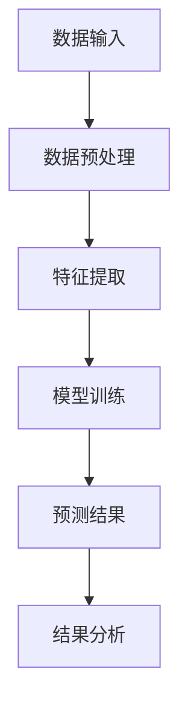
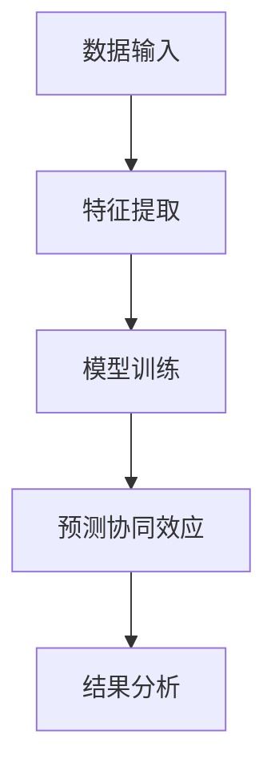
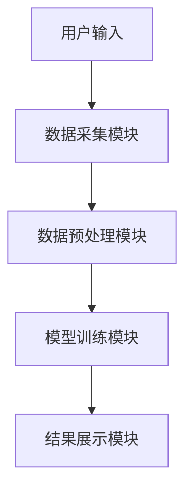

                 


# AI辅助企业并购决策：财务模型与协同效应分析

> 关键词：企业并购、人工智能、财务模型、协同效应、机器学习、并购决策

> 摘要：企业并购是企业战略发展的重要组成部分，而AI技术的引入为企业并购决策提供了新的可能性。本文将从企业并购的基本概念出发，探讨AI在财务模型与协同效应分析中的应用，详细讲解相关算法原理、系统架构设计及项目实战，为企业并购决策提供新的思路和解决方案。

---

## 第一部分: AI辅助企业并购决策的背景与概念

### 第1章: 企业并购的基本概念与挑战

#### 1.1 企业并购的定义与类型
企业并购（Mergers and Acquisitions, M&A）是指企业之间的合并或收购行为，是企业战略发展的重要手段之一。并购可以分为以下几种类型：
- **横向并购**：同一行业内的企业合并，旨在扩大市场份额。
- **纵向并购**：产业链上下游的企业合并，以增强垂直整合能力。
- **混合并购**：与企业主营业务无关的并购，通常是为了 diversification。

企业并购的主要驱动因素包括市场扩展、资源整合、成本节约、技术获取等。然而，并购也面临诸多挑战，如目标企业估值的不确定性、整合过程中的文化冲突以及潜在的法律和财务风险。

#### 1.2 并购中的财务模型与协同效应
财务模型是企业并购决策中的核心工具，用于评估目标企业的价值和并购后的预期收益。协同效应是并购后企业预期产生的额外价值，通常包括：
- **财务协同**：优化资本结构、降低融资成本。
- **战略协同**：增强市场地位、拓展业务范围。
- **运营协同**：提高效率、降低成本。

传统财务模型的局限性在于依赖人工分析，数据处理能力有限，且容易受到主观判断的影响。AI技术的应用可以显著提升财务模型的准确性和效率。

---

### 第2章: AI技术在企业并购中的应用潜力

#### 2.1 AI技术的核心优势
AI技术在企业并购中的应用主要体现在以下几个方面：
- **数据处理能力**：AI可以快速处理海量数据，提取关键信息。
- **智能分析能力**：通过机器学习算法，AI能够发现数据中的潜在规律。
- **预测与优化能力**：AI可以基于历史数据预测并购后的业绩表现，并优化并购策略。

#### 2.2 AI在企业并购中的应用场景
- **财务数据分析**：利用自然语言处理（NLP）技术提取财务报表中的关键数据。
- **协同效应评估**：通过机器学习模型预测并购后的协同效应。
- **风险预测与管理**：基于外部市场数据和内部数据，预测并购后的潜在风险。

#### 2.3 AI辅助并购的创新价值
- **提高决策效率**：AI能够快速分析大量数据，缩短决策时间。
- **减少人为误差**：通过算法优化，降低人为判断的偏差。
- **发现潜在价值**：AI可以帮助识别隐藏的市场机会和风险。

---

## 第二部分: 财务模型与协同效应分析的核心概念

### 第3章: 财务模型与企业并购的关系

#### 3.1 财务模型的定义与作用
财务模型是用于评估企业价值和预测财务表现的工具。在企业并购中，财务模型通常用于：
- 评估目标企业的价值。
- 预测并购后的财务表现。
- 分析并购的可行性和风险。

#### 3.2 并购中的关键财务指标
- **市盈率（P/E ratio）**：用于评估企业估值。
- **市净率（P/B ratio）**：用于评估企业资产价值。
- **收益与风险评估**：通过敏感性分析预测并购后的财务表现。

#### 3.3 财务模型的构建与评估
构建财务模型需要考虑以下几个步骤：
1. 数据收集与清洗。
2. 模型假设与参数设定。
3. 模型计算与结果分析。
4. 模型验证与优化。

---

### 第4章: 协同效应的定义与分类

#### 4.1 协同效应的定义与特征
协同效应是指并购后企业通过资源整合所产生的额外价值。其主要特征包括：
- **可量化**：协同效应可以通过财务指标进行衡量。
- **可实现性**：协同效应需要通过实际整合实现。
- **风险可控**：协同效应的实现需要考虑潜在风险。

#### 4.2 协同效应的实现路径
- **财务协同**：优化资本结构、降低融资成本。
- **战略协同**：增强市场地位、拓展业务范围。
- **运营协同**：提高效率、降低成本。

#### 4.3 协同效应的衡量标准
常用的协同效应衡量指标包括：
- **协同比率（Synergy Ratio）**：协同效应与并购成本的比率。
- **净现值（NPV）**：并购后的净现值。

---

## 第三部分: AI辅助财务模型与协同效应分析的算法原理

### 第5章: 基于AI的财务数据分析算法

#### 5.1 数据预处理与特征提取
- **数据清洗**：处理缺失值、异常值。
- **特征选择**：通过相关性分析选择关键特征。
- **数据增强**：通过数据合成技术扩展数据集。

#### 5.2 常见的AI算法及其应用
- **线性回归模型**：用于预测目标企业的估值。
- **支持向量机（SVM）**：用于分类问题，如评估并购成功的可能性。
- **神经网络模型（如LSTM）**：用于时间序列分析，预测并购后的财务表现。

#### 5.3 算法流程图（Mermaid）


#### 5.4 算法实现代码（Python）
```python
import pandas as pd
from sklearn.linear_model import LinearRegression
from sklearn.metrics import mean_squared_error

# 数据加载与预处理
data = pd.read_csv('并购数据.csv')
data = data.dropna()
X = data[[' revenue', 'profit', 'market share']]
y = data['valuation']

# 模型训练
model = LinearRegression()
model.fit(X, y)

# 预测与评估
predictions = model.predict(X)
print('均方误差:', mean_squared_error(y, predictions))
```

---

### 第6章: 协同效应预测的机器学习模型

#### 6.1 协同效应预测的数学模型
- **线性回归模型**：
  $$ y = \beta_0 + \beta_1x_1 + \beta_2x_2 + \ldots + \beta_nx_n + \epsilon $$
  其中，$y$ 是协同效应，$x_i$ 是影响协同效应的特征变量。

- **随机森林模型**：
  $$ y = \sum_{i=1}^{n} \text{Tree}(x_i) $$

#### 6.2 算法流程图（Mermaid）


#### 6.3 算法实现代码（Python）
```python
import pandas as pd
from sklearn.ensemble import RandomForestRegressor
from sklearn.metrics import r2_score

# 数据加载与预处理
data = pd.read_csv('并购数据.csv')
data = data.dropna()
X = data[[' revenue', 'profit', 'market share', 'risk']]
y = data['synergy']

# 模型训练
model = RandomForestRegressor()
model.fit(X, y)

# 预测与评估
predictions = model.predict(X)
print('R²得分:', r2_score(y, predictions))
```

---

## 第四部分: 系统架构与项目实战

### 第7章: 系统架构设计

#### 7.1 系统功能设计
- **数据采集模块**：从数据库中获取并购相关数据。
- **模型训练模块**：基于机器学习算法训练模型。
- **结果展示模块**：可视化分析结果。

#### 7.2 系统架构图（Mermaid）


---

### 第8章: 项目实战

#### 8.1 环境配置
- **Python版本**：3.8以上
- **依赖库**：pandas、scikit-learn、matplotlib

#### 8.2 数据处理与模型实现
```python
import pandas as pd
from sklearn.ensemble import RandomForestRegressor
from sklearn.metrics import r2_score

# 数据加载与预处理
data = pd.read_csv('并购数据.csv')
data = data.dropna()
X = data[[' revenue', 'profit', 'market share', 'risk']]
y = data['synergy']

# 模型训练
model = RandomForestRegressor()
model.fit(X, y)

# 预测与评估
predictions = model.predict(X)
print('R²得分:', r2_score(y, predictions))
```

#### 8.3 实际案例分析
以某企业并购案例为例，详细分析数据处理、模型训练和结果解读的过程。

---

## 第五部分: 总结与展望

### 第9章: 总结与最佳实践

#### 9.1 最佳实践
- 数据预处理是关键，确保数据质量。
- 选择合适的算法，根据数据特性进行调整。
- 结果分析时，结合业务背景进行解释。

#### 9.2 小结
AI技术的应用显著提升了企业并购决策的效率和准确性。通过合理的数据处理和算法选择，企业可以更好地评估目标企业价值和预测并购后的协同效应。

#### 9.3 注意事项
- 数据隐私与安全问题需要高度重视。
- 模型的可解释性是实际应用中的重要考量因素。

#### 9.4 拓展阅读
- 推荐阅读《企业并购的财务模型与估值》。
- 关注最新的AI在金融领域的应用研究。

---

## 作者

作者：AI天才研究院（AI Genius Institute） & 禅与计算机程序设计艺术（Zen And The Art of Computer Programming）

