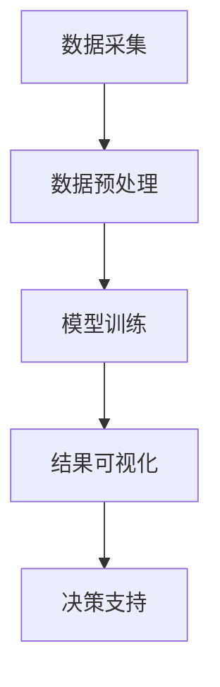
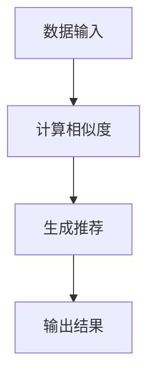

                 


# AI辅助企业并购协同效应分析与实现

> 关键词：企业并购、协同效应、人工智能、算法实现、系统架构

> 摘要：本文深入探讨了AI技术在企业并购协同效应分析中的应用，从理论基础到算法实现，从系统设计到项目实战，全面解析了如何利用AI技术提升企业并购的协同效应分析效率和准确性。

---

## 第1章: 企业并购与协同效应概述

### 1.1 企业并购的基本概念
#### 1.1.1 企业并购的定义与类型
企业并购（Mergers and Acquisitions, M&A）是指两个或多个企业之间的合并或收购行为。常见的并购类型包括：
- **横向并购**：同一行业内的企业合并。
- **纵向并购**：产业链上下游企业的合并。
- **混合并购**：跨行业或跨领域的企业合并。

#### 1.1.2 并购中的协同效应概念
协同效应（Synergy）是指并购后的企业通过资源整合、成本节约、市场扩展等方式实现的收益大于两家企业单独收益之和的现象。协同效应是企业并购的核心价值所在。

#### 1.1.3 协同效应的分类与特点
协同效应主要分为财务协同、经营协同和战略协同三大类。其特点包括：
- **价值性**：能够为企业创造额外价值。
- **系统性**：需要企业内部系统的协同配合。
- **风险性**：协同效应的实现存在不确定性。

### 1.2 AI技术的发展与应用
#### 1.2.1 AI技术的定义与现状
人工智能（Artificial Intelligence, AI）是指计算机系统模拟人类智能的能力，包括学习、推理、决策等。当前，AI技术已在多个领域得到广泛应用。

#### 1.2.2 AI在企业分析中的应用
AI技术在企业分析中的应用包括：
- **数据挖掘**：从海量数据中提取有价值的信息。
- **预测分析**：利用机器学习模型预测企业绩效和市场趋势。
- **自然语言处理**：分析企业文档和市场报告。

#### 1.2.3 从传统并购分析到智能化分析的转变
传统的企业并购分析依赖于人工经验和财务模型，而AI技术的引入使得分析更加高效、精准和全面。

---

## 第2章: 协同效应分析的核心概念与联系

### 2.1 协同效应分析的方法论
#### 2.1.1 数据采集与处理
协同效应分析需要采集企业的财务数据、市场数据、管理数据等，并进行清洗和预处理。

#### 2.1.2 分析模型的构建
构建协同效应分析模型需要考虑企业的业务模式、市场环境和战略目标。

#### 2.1.3 评估指标的设计
常见的协同效应评估指标包括：
- **协同收益**：并购后企业收益超过预期的部分。
- **协同成本**：实现协同效应所需投入的成本。
- **协同净现值**：协同收益的净现值。

### 2.2 协同效应分析的流程
#### 2.2.1 数据预处理
数据预处理包括数据清洗、数据标准化和数据特征提取。

#### 2.2.2 模型训练与优化
模型训练需要选择合适的算法（如机器学习或深度学习），并通过参数调优和验证提升模型性能。

#### 2.2.3 结果可视化与解读
通过可视化工具将分析结果以图表形式展示，便于企业理解和决策。

### 2.3 协同效应分析的流程图


---

## 第3章: 协同效应分析的算法原理与实现

### 3.1 协同过滤算法
#### 3.1.1 算法原理
协同过滤是一种基于用户行为或特征相似性推荐相关企业的算法。其核心思想是“用户的行为相似，结果也相似”。

#### 3.1.2 算法流程


#### 3.1.3 算法实现的数学模型
协同过滤的核心公式是计算用户之间的相似度，常用余弦相似度：
$$ \text{相似度} = \frac{\sum_{i=1}^{n} x_i y_i}{\sqrt{\sum_{i=1}^{n} x_i^2} \cdot \sqrt{\sum_{i=1}^{n} y_i^2}} $$

### 3.2 算法实现的代码示例
#### 3.2.1 环境安装
需要安装Python和相关库（如`pandas`、`numpy`、`scikit-learn`）。

#### 3.2.2 核心代码实现
```python
from sklearn.metrics.pairwise import cosine_similarity

# 示例数据
X = [[1, 2, 3],
     [4, 5, 6],
     [7, 8, 9]]

# 计算余弦相似度
similarity = cosine_similarity(X)
print(similarity)
```

#### 3.2.3 代码解读
上述代码通过`cosine_similarity`函数计算了数据矩阵中各样本之间的余弦相似度，结果是一个相似度矩阵。

---

## 第4章: 系统分析与架构设计

### 4.1 系统架构设计
#### 4.1.1 系统功能模块划分
- **数据管理模块**：负责数据的采集、存储和管理。
- **分析模块**：包括协同效应分析模型和算法实现。
- **可视化模块**：将分析结果以图表形式展示。

#### 4.1.2 系统架构图


### 4.2 系统功能设计
#### 4.2.1 数据管理模块
- 数据输入与存储
- 数据清洗与预处理

#### 4.2.2 分析模块
- 协同效应模型训练
- 算法优化与调优

#### 4.2.3 可视化模块
- 结果展示
- 报告生成

---

## 第5章: 项目实战与案例分析

### 5.1 项目实战
#### 5.1.1 环境安装
安装必要的Python库和工具。

#### 5.1.2 核心代码实现
```python
import pandas as pd
from sklearn.metrics.pairwise import cosine_similarity

# 示例数据
df = pd.DataFrame({
    '企业A': [1, 2, 3],
    '企业B': [4, 5, 6],
    '企业C': [7, 8, 9]
})

# 计算相似度
similarity = cosine_similarity(df.T)
print(similarity)
```

#### 5.1.3 案例分析
以某企业并购案例为例，展示如何利用AI技术分析协同效应，并生成可视化报告。

---

## 第6章: 最佳实践与总结

### 6.1 最佳实践
- 确保数据质量
- 选择合适的算法
- 定期优化模型

### 6.2 小结
本文详细介绍了AI技术在企业并购协同效应分析中的应用，从理论到实践，从算法到系统设计，为读者提供了一套完整的解决方案。

### 6.3 注意事项
- 数据隐私保护
- 模型的可解释性
- 算法的可扩展性

### 6.4 拓展阅读
- 《企业并购中的协同效应管理》
- 《人工智能在金融领域的应用》

---

作者：AI天才研究院/AI Genius Institute & 禅与计算机程序设计艺术 /Zen And The Art of Computer Programming

