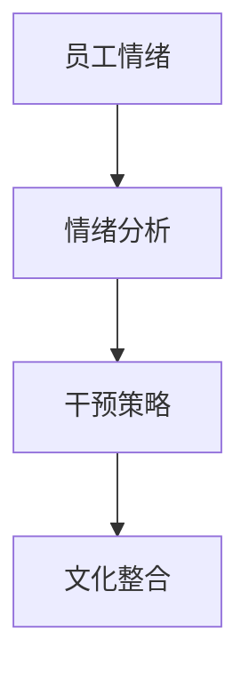
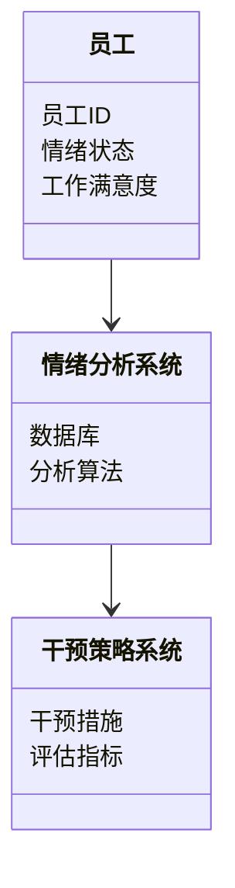

                 


# AI辅助企业并购后文化整合：员工情绪分析与干预策略

> 关键词：企业并购、文化整合、员工情绪分析、AI技术、干预策略

> 摘要：随着企业并购的频繁发生，文化整合成为并购后成功整合的关键因素。本文探讨如何利用AI技术对员工情绪进行分析与干预，以促进文化整合的顺利进行。通过分析员工情绪，企业可以制定有效的干预策略，提升员工满意度和团队凝聚力，确保并购后的长期成功。

---

# 第1章：企业并购与文化整合概述

## 1.1 企业并购的背景与挑战

### 1.1.1 企业并购的基本概念
企业并购（Mergers and Acquisitions, M&A）是指两个或多个企业之间的合并或收购行为。企业并购的目的是通过资源整合、优势互补，实现更大的市场竞争力和经济效益。

### 1.1.2 文化整合的重要性
文化整合是企业并购后成功运营的关键。文化整合不仅涉及企业规章制度的统一，更需要关注员工的文化认同感和归属感。如果文化整合失败，可能导致员工士气低落、工作效率下降，甚至引发员工流失。

### 1.1.3 并购后文化整合的常见问题
- 员工对新文化的不适应
- 信息不对称导致的误解
- 不同企业文化的冲突

## 1.2 员工情绪与文化整合的关系

### 1.2.1 员工情绪对企业文化的影响
员工情绪是企业文化整合的重要指标。积极的情绪有助于员工更好地适应新文化，而消极的情绪则可能阻碍文化的整合。

### 1.2.2 并购后员工情绪波动的表现形式
- 焦虑情绪：对新工作环境的不确定感
- 抵触情绪：对新企业文化的排斥
- 消极情绪：对工作前景的悲观态度

### 1.2.3 情绪分析在文化整合中的作用
通过分析员工情绪，企业可以及时发现文化整合中的问题，并采取相应的干预措施，确保文化整合的顺利进行。

---

# 第2章：员工情绪分析的核心概念

## 2.1 情绪分析的基本原理

### 2.1.1 文本挖掘与自然语言处理
文本挖掘是从大量文本数据中提取有用信息的过程，而自然语言处理（NLP）则是理解和分析人类语言的技术。结合这两种技术，可以对员工的情绪进行分析。

### 2.1.2 情感分类的数学模型
情感分类是通过机器学习算法对文本进行分类的过程。常用的情感分类算法包括朴素贝叶斯、支持向量机（SVM）和深度学习模型（如LSTM）。

### 2.1.3 基于深度学习的情感分析
深度学习模型，如LSTM和Transformer，能够处理复杂的文本数据，提高情感分析的准确性。

## 2.2 干预策略的设计原则

### 2.2.1 干预策略的分类
干预策略可以分为预防性干预和治疗性干预两类。预防性干预旨在预防员工情绪问题的发生，而治疗性干预则是在情绪问题出现后进行干预。

### 2.2.2 干预策略的实施步骤
1. **情绪识别**：通过员工反馈、绩效数据等手段识别情绪问题。
2. **问题分析**：分析情绪问题的根源。
3. **制定干预计划**：根据问题制定具体的干预措施。
4. **实施干预**：执行干预计划。
5. **效果评估**：评估干预效果并进行调整。

### 2.2.3 干预策略的有效性评估
通过员工满意度调查、绩效数据分析等方法，评估干预策略的有效性。

---

# 第3章：员工情绪分析与干预策略的关联性分析

## 3.1 核心概念的属性特征对比
下表展示了员工情绪分析与干预策略的核心要素对比：

| 核心要素       | 员工情绪分析           | 干预策略           |
|----------------|----------------------|-------------------|
| 目标           | 分析员工情绪状态       | 改善员工情绪状态   |
| 方法           | 文本挖掘、自然语言处理 | 心理辅导、培训等    |
| 实施步骤       | 数据收集、分析、分类   | 识别问题、制定计划、实施、评估 |

## 3.2 实体关系图
下图展示了员工情绪分析与干预策略的实体关系：



---

# 第4章：员工情绪分析的算法原理

## 4.1 文本挖掘与自然语言处理

### 4.1.1 基于规则的文本分析
基于规则的文本分析通过预定义的规则对文本进行分类。例如，可以通过关键词匹配来判断文本的情感倾向。

### 4.1.2 基于统计的文本分析
基于统计的文本分析通过统计文本中的特征词出现的频率来判断情感倾向。例如，可以使用TF-IDF方法提取关键词。

### 4.1.3 基于深度学习的文本分析
深度学习模型，如LSTM和Transformer，能够自动提取文本特征并进行情感分类。

## 4.2 情感分类的数学模型

### 4.2.1 朴素贝叶斯分类器
朴素贝叶斯分类器是一种基于概率论的分类方法。其基本思想是通过计算每个类别的概率，选择概率最大的类别作为结果。

### 4.2.2 支持向量机（SVM）
SVM是一种监督学习算法，通过构建超平面将数据点分为不同的类别。

### 4.2.3 循环神经网络（RNN）
RNN是一种适用于序列数据的深度学习模型，能够捕捉文本中的上下文信息。

---

# 第5章：系统分析与架构设计

## 5.1 问题场景介绍

### 5.1.1 并购后文化整合的场景描述
企业并购后，员工需要适应新的企业文化。在这个过程中，员工的情绪波动可能会影响文化整合的效果。

### 5.1.2 员工情绪分析的系统目标
系统的目标是通过分析员工情绪，制定有效的干预策略，促进文化整合。

### 5.1.3 系统的输入输出描述
- **输入**：员工反馈、绩效数据
- **输出**：情绪分析结果、干预策略

## 5.2 系统功能设计

### 5.2.1 领域模型类图
下图展示了领域模型类图：



---

# 第6章：项目实战

## 6.1 环境安装

### 6.1.1 安装Python环境
建议使用Anaconda作为Python环境管理工具。

### 6.1.2 安装必要的库
安装以下Python库：
- `numpy`
- `pandas`
- `scikit-learn`
- `tensorflow`

## 6.2 核心代码实现

### 6.2.1 数据预处理
```python
import pandas as pd
import numpy as np

# 读取数据
data = pd.read_csv('employee_survey.csv')

# 数据清洗
data.dropna(inplace=True)
```

### 6.2.2 情感分类模型
```python
from sklearn.model_selection import train_test_split
from sklearn.feature_extraction.text import TfidfVectorizer
from sklearn.naive_bayes import MultinomialNB

# 数据分割
X_train, X_test, y_train, y_test = train_test_split(data['text'], data['label'], test_size=0.2)

# 特征提取
vectorizer = TfidfVectorizer()
X_train_vec = vectorizer.fit_transform(X_train)
X_test_vec = vectorizer.transform(X_test)

# 训练模型
model = MultinomialNB()
model.fit(X_train_vec, y_train)

# 模型评估
score = model.score(X_test_vec, y_test)
print(f'模型准确率：{score}')
```

## 6.3 代码解读与分析
上述代码实现了基于TF-IDF向量化的情感分类模型。首先，使用`TfidfVectorizer`对文本数据进行向量化处理，然后使用`MultinomialNB`进行情感分类。

---

# 第7章：最佳实践与总结

## 7.1 小结
通过本文的分析，我们可以看到，AI技术在企业并购后文化整合中的应用具有重要意义。通过分析员工情绪，企业可以制定有效的干预策略，促进文化的顺利整合。

## 7.2 注意事项
- 数据隐私保护
- 情绪分析的准确性
- 干预策略的可行性

## 7.3 拓展阅读
- 《深度学习实战》
- 《自然语言处理入门》

---

作者：AI天才研究院/AI Genius Institute & 禅与计算机程序设计艺术/Zen And The Art of Computer Programming

