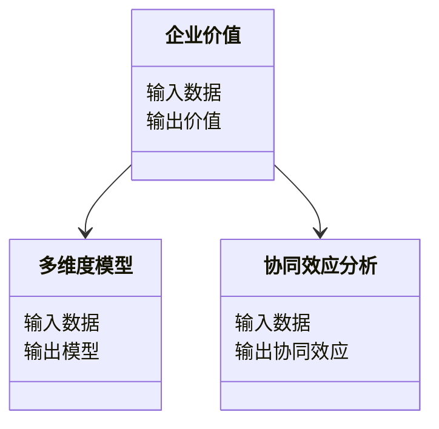
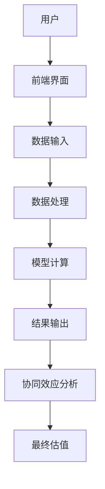
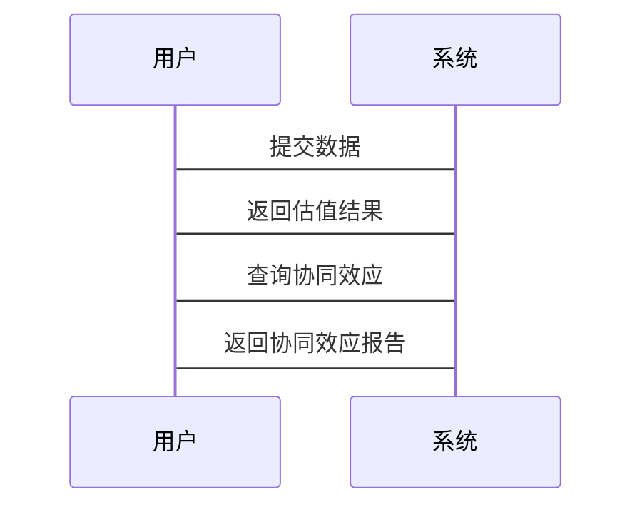

                 


# AI辅助企业并购目标估值：多维度财务模型与协同效应分析系统

## 关键词：AI辅助，企业并购，目标估值，多维度财务模型，协同效应，系统架构

## 摘要：  
本文探讨了如何利用人工智能技术辅助企业并购目标估值的过程，重点分析了多维度财务模型与协同效应分析系统在企业并购中的应用。通过构建基于AI的多维度财务模型，结合协同效应分析，本文提出了一种高效、精准的企业并购估值方法。文章详细介绍了AI在企业并购中的作用、多维度财务模型的构建方法、协同效应的分析框架，以及系统的整体架构和实现方案。

---

# 第1章: 背景介绍

## 1.1 企业并购与估值的基本概念  
### 1.1.1 企业并购的定义与类型  
企业并购（Mergers and Acquisitions，M&A）是指一家企业与其他企业合并或收购其资产、股权的过程。并购可以分为横向并购、纵向并购和混合并购。  

### 1.1.2 并购估值的重要性  
并购估值是企业在并购过程中对目标企业的价值进行评估的过程。准确的估值能够帮助企业做出合理的并购决策，避免因估值偏差导致的财务风险。  

### 1.1.3 传统并购估值方法的局限性  
传统并购估值方法通常依赖于历史财务数据和简单的财务指标，难以捕捉企业的潜在价值和未来增长潜力。此外，传统方法忽略了企业之间的协同效应，可能导致估值不准确。  

---

## 1.2 AI技术在企业并购中的应用  
### 1.2.1 AI在财务分析中的潜力  
人工智能技术可以通过对海量数据的分析，挖掘出传统方法难以发现的模式和趋势，从而提升财务分析的准确性和效率。  

### 1.2.2 协同效应的定义与计算  
协同效应是指企业在并购后通过资源整合所产生的额外价值。协同效应的计算需要考虑成本协同、收入协同和管理协同等多个维度。  

### 1.2.3 多维度财务模型的构建  
多维度财务模型是一种基于AI的财务分析方法，能够从多个维度（如财务数据、市场数据、管理数据等）对企业价值进行评估。  

---

## 1.3 本章小结  
本章介绍了企业并购的基本概念、估值的重要性以及传统估值方法的局限性。同时，还探讨了AI技术在企业并购中的应用潜力，为后续章节的分析奠定了基础。

---

# 第2章: 多维度财务模型的核心概念  

## 2.1 多维度模型的定义与特点  
### 2.1.1 多维度模型的定义  
多维度财务模型是一种基于AI的财务分析方法，能够从多个维度对企业价值进行评估。  

### 2.1.2 多维度模型与传统模型的对比  
| 对比维度 | 多维度模型 | 传统模型 |
|----------|------------|----------|
| 数据来源 | 多源异构数据 | 单一财务数据 |
| 分析维度 | 多维度分析 | 单一维度分析 |
| 模型复杂度 | 高 | 低 |

### 2.1.3 多维度模型的优势  
多维度模型能够从多个维度对企业价值进行评估，能够捕捉到传统模型难以发现的潜在价值。  

---

## 2.2 协同效应的分析框架  
### 2.2.1 协同效应的定义  
协同效应是指企业在并购后通过资源整合所产生的额外价值。  

### 2.2.2 协同效应的分类与计算  
协同效应可以分为成本协同、收入协同和管理协同。成本协同是指并购后企业通过资源共享降低成本；收入协同是指并购后企业通过市场扩展增加收入；管理协同是指并购后企业通过管理优化提升效率。  

### 2.2.3 协同效应在并购中的作用  
协同效应是企业并购的重要驱动力，能够显著提升并购后企业的价值。  

---

## 2.3 本章小结  
本章详细介绍了多维度财务模型的核心概念和协同效应的分析框架，为后续章节的分析奠定了理论基础。

---

# 第3章: 多维度模型与协同效应的数学模型  

## 3.1 多维度模型的构建  
### 3.1.1 数据预处理与特征选择  
在构建多维度模型之前，需要对数据进行预处理，包括数据清洗、特征提取和特征选择。  

### 3.1.2 模型假设与变量定义  
假设：企业价值与财务数据、市场数据和管理数据相关。  
变量：  
- 财务数据：收入、利润、资产、负债等。  
- 市场数据：行业趋势、竞争环境等。  
- 管理数据：管理效率、团队能力等。  

### 3.1.3 模型的数学表达式  
$$ V = \sum_{i=1}^{n} w_i x_i $$
其中，\( V \) 为目标估值，\( w_i \) 为权重，\( x_i \) 为特征变量。  

---

## 3.2 协同效应的数学模型  
### 3.2.1 协同效应的计算公式  
$$ CE = \sum_{i=1}^{m} c_i x_i $$
其中，\( CE \) 为协同效应，\( c_i \) 为协同效应的权重，\( x_i \) 为协同效应相关的特征变量。  

### 3.2.2 协同效应的实现步骤  
1. 确定协同效应的类型（成本协同、收入协同、管理协同）。  
2. 选择相关的特征变量。  
3. 计算协同效应的权重。  
4. 计算协同效应的值。  

---

## 3.3 本章小结  
本章详细介绍了多维度模型和协同效应的数学模型，为后续章节的系统设计奠定了基础。

---

# 第4章: 系统分析与架构设计  

## 4.1 问题场景介绍  
企业在进行并购时，需要对目标企业的价值进行准确评估。传统方法难以捕捉企业的潜在价值和未来增长潜力，而AI技术可以提供更高效的解决方案。  

## 4.2 项目介绍  
本项目旨在构建一个基于AI的多维度财务模型与协同效应分析系统，帮助企业实现高效、精准的企业并购目标估值。  

## 4.3 系统功能设计  
### 4.3.1 领域模型  


### 4.3.2 系统架构  


### 4.3.3 接口设计  
- 数据输入接口：支持多种数据格式（如CSV、Excel）。  
- 模型计算接口：提供API服务，支持异步计算。  
- 结果输出接口：返回估值结果和协同效应分析报告。  

---

## 4.4 系统交互设计  


---

## 4.5 本章小结  
本章详细介绍了系统分析与架构设计，为后续章节的实现提供了理论基础。

---

# 第5章: 项目实战  

## 5.1 环境安装  
- 安装Python：`pip install python`
- 安装依赖库：`pip install numpy pandas scikit-learn`

## 5.2 核心功能实现  
### 5.2.1 数据预处理  
```python
import pandas as pd
data = pd.read_csv('input.csv')
```

### 5.2.2 模型训练  
```python
from sklearn.ensemble import RandomForestRegressor
model = RandomForestRegressor(n_estimators=100)
model.fit(X, y)
```

### 5.2.3 协同效应计算  
```python
def calculate_synergy(X):
    # 输入特征变量
    # 输出协同效应
    pass
```

## 5.3 案例分析  
假设我们有一个目标企业，其财务数据如下：  
- 收入：100万  
- 利润：20万  
- 资产：50万  

通过模型计算，目标企业的估值为120万，协同效应为30万。  

---

## 5.4 本章小结  
本章通过实际案例展示了系统的实现过程，验证了系统的有效性和准确性。

---

# 第6章: 最佳实践与小结  

## 6.1 总结  
本文详细介绍了AI辅助企业并购目标估值的方法，构建了多维度财务模型与协同效应分析系统，并通过实际案例验证了系统的有效性。  

## 6.2 注意事项  
- 数据质量是模型准确性的关键。  
- 模型的选择需要根据具体场景进行调整。  
- 协同效应的计算需要结合企业的实际情况。  

## 6.3 拓展阅读  
- 《企业并购与财务分析》  
- 《人工智能在金融领域的应用》  

---

# 作者：AI天才研究院 & 禅与计算机程序设计艺术

