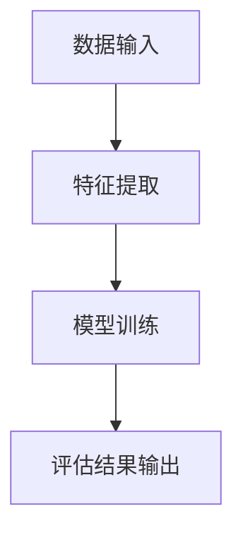
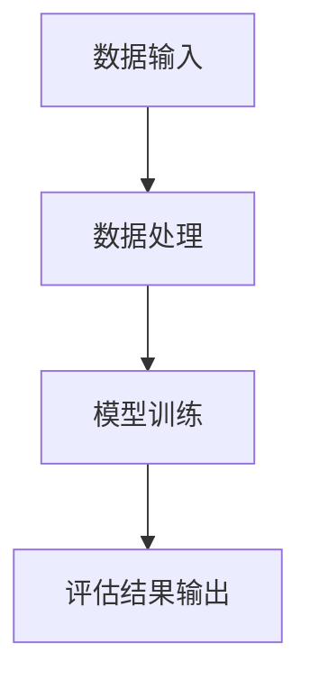

                 


# AI辅助企业并购目标筛选：多维度评估与匹配

> 关键词：AI, 企业并购, 多维度评估, 目标筛选, 算法匹配

> 摘要：企业并购是企业战略发展的重要手段，但在实际操作中，目标筛选和评估过程往往面临数据复杂、维度众多、决策风险高等挑战。本文从AI技术的核心优势出发，详细探讨了如何利用机器学习、自然语言处理等技术，结合多维度评估模型，构建高效的AI辅助企业并购目标筛选系统。通过系统架构设计、算法实现和实际案例分析，本文为读者提供了清晰的技术实现路径和实用的解决方案。

---

## 第1章: 企业并购与AI技术的结合

### 1.1 企业并购的基本概念

#### 1.1.1 企业并购的定义与类型
企业并购（Mergers and Acquisitions，简称M&A）是指一家企业通过购买另一家企业的股权或资产，以实现战略扩张或优化资源配置的过程。常见的并购类型包括：
- **横向并购**：同一行业内的企业合并，旨在扩大市场份额。
- **纵向并购**：上下游产业的企业合并，以增强垂直整合能力。
- **混合并购**：跨行业并购，以多元化业务布局。

#### 1.1.2 企业并购的驱动因素
企业并购的驱动因素多种多样，主要包括：
1. **市场扩展**：通过并购进入新市场或区域。
2. **成本协同效应**：通过规模效应降低成本。
3. **技术整合**：获取关键技术或专利。
4. **财务优化**：通过杠杆效应提升资本回报率。
5. **战略防御**：应对行业竞争压力。

#### 1.1.3 企业并购的复杂性与挑战
企业并购过程中面临的主要挑战包括：
- **信息不对称**：目标企业的真实价值难以准确评估。
- **风险评估困难**：市场、财务、法律等多方面风险交织。
- **决策周期长**：传统并购流程复杂，耗时较长。
- **成本高昂**：聘请专业团队（如律师、投行）的费用较高。

---

### 1.2 AI技术在企业并购中的应用潜力

#### 1.2.1 AI技术的核心优势
人工智能技术在企业并购中的优势主要体现在以下几个方面：
1. **数据处理能力**：AI能够快速处理海量数据，提取关键信息。
2. **模式识别**：通过机器学习算法识别潜在的并购机会。
3. **风险预测**：基于历史数据预测并购后的风险。
4. **自动化评估**：AI可以自动化完成企业多维度评估，提升效率。

#### 1.2.2 AI在企业并购中的应用场景
- **目标企业筛选**：通过AI算法从海量企业中筛选出符合并购条件的目标。
- **价值评估**：利用自然语言处理技术分析企业财报、新闻等非结构化数据，进行精准估值。
- **风险预警**：基于AI模型预测目标企业的潜在风险。
- **匹配推荐**：根据企业战略目标，推荐最优的并购目标。

#### 1.2.3 AI辅助并购的目标与价值
AI辅助企业并购的目标是通过技术手段提高并购效率、降低并购风险、优化并购决策。其价值体现在：
- **提高效率**：AI可以快速处理大量数据，缩短并购周期。
- **降低成本**：自动化评估减少人工成本。
- **提升精准度**：基于算法的分析结果更客观、准确。

---

## 第2章: 多维度评估与匹配的核心概念

### 2.1 企业并购目标筛选的关键维度

#### 2.1.1 企业财务状况评估
财务状况是企业并购中的核心评估维度，主要包括：
- **盈利能力**：如净利润率、ROE（净资产收益率）。
- **财务健康度**：如资产负债率、流动比率。
- **增长潜力**：如收入增长率、利润率增长情况。

#### 2.1.2 企业市场竞争力分析
市场竞争力评估包括：
- **市场份额**：企业在目标市场的占有率。
- **品牌影响力**：品牌的知名度和美誉度。
- **竞争壁垒**：如专利、技术、客户忠诚度等。

#### 2.1.3 企业风险评估
风险评估主要关注：
- **法律风险**：如诉讼、知识产权纠纷。
- **市场风险**：如市场需求波动、政策变化。
- **财务风险**：如流动性风险、债务负担。

#### 2.1.4 企业战略匹配性
战略匹配性评估包括：
- **业务协同性**：并购后能否实现业务协同。
- **管理团队匹配性**：目标企业管理层是否与并购方的战略目标一致。
- **文化兼容性**：企业文化和价值观是否能够融合。

---

### 2.2 多维度评估的逻辑与流程

#### 2.2.1 数据收集与整理
企业并购目标筛选的第一步是数据收集，主要来源包括：
- **公开数据**：如企业财报、行业报告、新闻媒体。
- **内部数据**：如企业战略目标、并购历史数据。
- **第三方数据**：如信用评级机构数据、市场调研数据。

#### 2.2.2 数据分析与评估
数据分析是多维度评估的核心步骤，包括：
1. **特征提取**：从原始数据中提取关键特征，如财务指标、市场指标等。
2. **数据清洗**：去除冗余数据，处理缺失值和异常值。
3. **模型训练**：基于机器学习算法对目标企业进行分类或回归分析。

#### 2.2.3 评估结果与匹配策略
评估结果需要结合企业战略目标进行匹配，最终形成推荐列表。推荐策略包括：
- **权重分配**：根据企业并购目标的重要性，给各维度分配权重。
- **相似度计算**：基于多维度评估结果，计算目标企业与并购方的匹配度。
- **优先级排序**：根据匹配度对目标企业进行排序，输出推荐列表。

---

## 第3章: AI辅助评估的核心算法与原理

### 3.1 机器学习在企业评估中的应用

#### 3.1.1 监督学习与非监督学习的对比
- **监督学习**：基于 labeled 数据进行模型训练，适用于分类和回归问题。
- **非监督学习**：基于 unlabeled 数据进行聚类分析，适用于发现数据内在结构。

#### 3.1.2 分类算法在企业筛选中的应用
常用的分类算法包括：
1. **逻辑回归（Logistic Regression）**
2. **支持向量机（Support Vector Machine，SVM）**
3. **随机森林（Random Forest）**

#### 3.1.3 回归算法在企业价值评估中的应用
常用的回归算法包括：
1. **线性回归（Linear Regression）**
2. **岭回归（Ridge Regression）**
3. **弹性网络回归（Elastic Net）**

---

### 3.2 自然语言处理在企业信息分析中的应用

#### 3.2.1 文本挖掘与企业信息提取
文本挖掘技术可以提取企业新闻、财报中的关键词，分析企业经营状况。

#### 3.2.2 情感分析在企业舆情分析中的应用
通过分析社交媒体、新闻媒体对企业的情感倾向，评估企业的声誉风险。

#### 3.2.3 实体识别在企业信息提取中的应用
实体识别技术可以提取企业财报中的关键实体，如收入、利润、成本等。

---

### 3.3 算法流程图（mermaid）


---

### 3.4 本章小结

---

## 第4章: 多维度评估的数学模型与公式

### 4.1 企业价值评估模型

#### 4.1.1 WACC模型
$$ WACC = \frac{E}{W} \times k_e + \frac{D}{W} \times k_d \times (1 - T) $$
其中：
- \( E \)：企业股权价值
- \( D \)：企业债务价值
- \( W = E + D \)：企业总价值
- \( k_e \)：股权资本成本
- \( k_d \)：债务资本成本
- \( T \)：企业所得税率

#### 4.1.2 DCF模型
$$ DCF = \sum_{t=1}^{n} \frac{CF_t}{(1 + r)^t} + \frac{TV}{(1 + r)^n} $$
其中：
- \( CF_t \)：第 \( t \) 年的自由现金流
- \( r \)：折现率
- \( TV \)：终值

---

### 4.2 企业风险评估模型

#### 4.2.1 风险评估指标
$$ \text{风险评分} = \sum_{i=1}^{n} w_i \times f_i $$
其中：
- \( w_i \)：第 \( i \) 个维度的权重
- \( f_i \)：第 \( i \) 个维度的评分

---

### 4.3 匹配算法的数学公式

#### 4.3.1 基于相似度的匹配算法
$$ \text{相似度} = \frac{\sum_{i=1}^{n} w_i \times |x_i - y_i|}{\sqrt{\sum_{i=1}^{n} w_i^2} \times \sqrt{\sum_{i=1}^{n} w_i^2}} $$

---

## 第5章: 系统架构与设计

### 5.1 系统功能设计

#### 5.1.1 数据采集模块
- 负责收集企业公开数据、行业报告等。

#### 5.1.2 数据处理模块
- 对数据进行清洗、特征提取和转换。

#### 5.1.3 模型训练模块
- 基于机器学习算法对目标企业进行分类或回归分析。

---

### 5.2 系统架构设计（mermaid）



---

## 第6章: 项目实战

### 6.1 环境安装

#### 6.1.1 安装Python环境
```bash
python --version
pip install numpy
pip install pandas
pip install scikit-learn
pip install spacy
```

---

### 6.2 系统核心实现源代码

#### 6.2.1 数据处理代码
```python
import pandas as pd
import numpy as np

# 加载数据
data = pd.read_csv('enterprise_data.csv')

# 数据清洗
data = data.dropna()
data = data.drop_duplicates()

# 特征提取
features = data[['revenue', 'profit', 'market_share']]
```

---

### 6.3 案例分析与解读

#### 6.3.1 案例背景
某科技公司希望并购一家具有高成长性的企业，目标行业为人工智能领域。

#### 6.3.2 案例分析
1. **数据收集**：收集行业内企业的财务数据、市场数据等。
2. **特征提取**：提取收入增长率、利润率、市场占有率等关键指标。
3. **模型训练**：使用随机森林算法对目标企业进行分类。
4. **结果输出**：输出推荐的并购目标列表。

---

## 第7章: 小结与展望

### 7.1 本章小结
本文详细探讨了AI技术在企业并购目标筛选中的应用，从多维度评估模型、算法实现到系统设计，为读者提供了完整的解决方案。

### 7.2 注意事项
- 数据来源的可靠性直接影响评估结果。
- 模型的泛化能力需要通过交叉验证进行评估。
- 并购决策需要结合企业实际情况，AI仅作为辅助工具。

### 7.3 拓展阅读
- 《Machine Learning for Business》
- 《自然语言处理实战：企业信息分析》
- 《企业并购与风险管理》

---

## 作者：AI天才研究院/AI Genius Institute & 禅与计算机程序设计艺术 /Zen And The Art of Computer Programming

---

以上为文章的完整目录大纲和核心内容，您可以根据需要进一步补充细节或调整结构。

