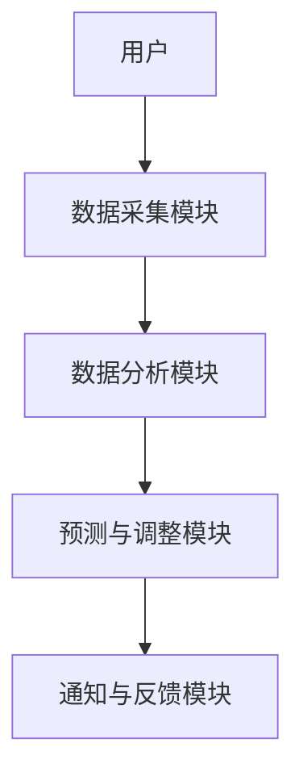
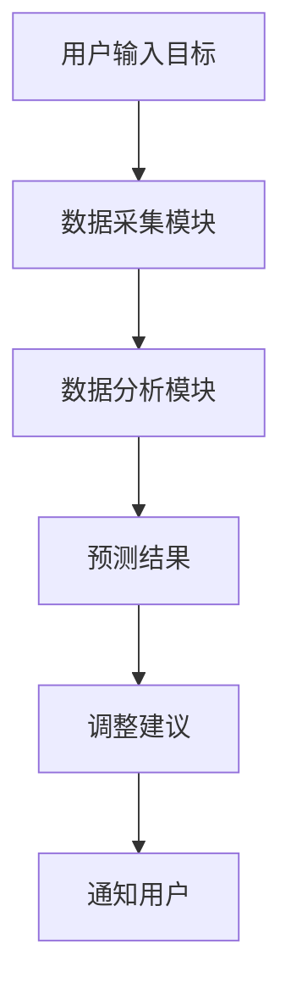
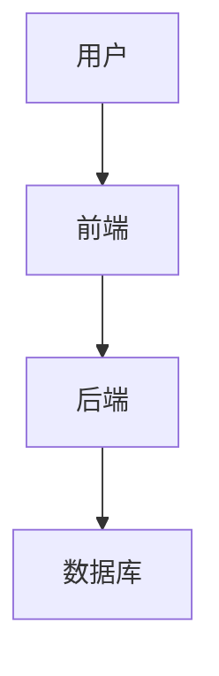
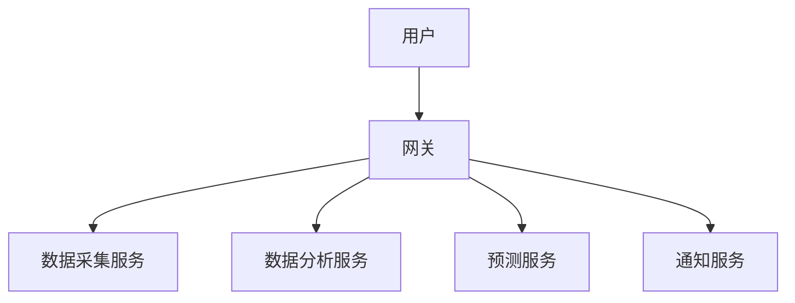
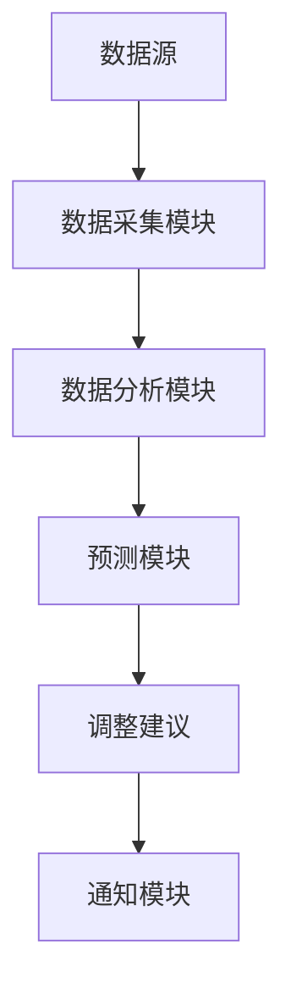

                 


# AI辅助企业战略执行：OKR自动化跟踪与调整

## 关键词：AI辅助、企业战略、OKR、自动化跟踪、目标管理

## 摘要：本文探讨了如何利用人工智能技术辅助企业战略执行，特别是OKR（目标与关键成果）的自动化跟踪与调整。文章从OKR的核心概念出发，分析了AI在OKR跟踪中的作用，详细讲解了基于机器学习和自然语言处理的OKR预测模型，并通过系统架构设计和项目实战展示了AI辅助OKR的实际应用。本文旨在为企业提供一种高效的目标管理方法，助力企业在数字化转型中实现战略目标。

---

## 第1章: AI辅助企业战略执行的背景与现状

### 1.1 企业战略执行的挑战

#### 1.1.1 传统企业战略执行的痛点
企业在战略执行过程中常常面临以下痛点：
- **目标分解难**：战略目标往往过于模糊，难以分解成具体可执行的任务。
- **执行不透明**：缺乏实时跟踪和反馈机制，导致执行过程不透明。
- **资源分配不当**：由于缺乏数据支持，资源分配往往凭经验而非数据驱动。
- **调整滞后**：当目标与实际执行出现偏差时，调整往往滞后，影响执行效果。

#### 1.1.2 OKR的提出与应用背景
OKR（目标与关键成果）是一种敏捷的目标管理方法，起源于互联网公司，现已被广泛应用于各类企业。OKR的特点是：
- **目标透明**：OKR公开透明，促进团队协作。
- **结果导向**：强调可衡量的结果，避免目标的模糊性。
- **周期性回顾**：OKR通常以季度为周期进行回顾和调整，适应快速变化的商业环境。

#### 1.1.3 AI在企业战略执行中的潜力
AI技术的应用可以显著提升企业战略执行的效率和效果：
- **数据驱动决策**：AI能够从海量数据中提取洞察，帮助制定更科学的目标。
- **实时跟踪与反馈**：AI可以实时监控目标执行情况，提供及时反馈。
- **智能调整**：基于数据和模型预测，AI能够自动化地调整目标和任务优先级。

### 1.2 OKR的核心概念与特点

#### 1.2.1 OKR的定义与核心要素
OKR由目标（Objective）和关键成果（Key Results）组成：
- **目标（Objective）**：是对组织或个人在一定时间内期望达成的最终结果，通常具有挑战性和激励性。
- **关键成果（Key Results）**：是衡量目标实现程度的具体指标，通常以量化形式呈现。

#### 1.2.2 OKR与传统目标管理方法的区别
与传统目标管理方法（如KPI）相比，OKR有以下特点：
- **目标设定更灵活**：OKR鼓励设定更具挑战性的目标，而不仅仅是衡量绩效。
- **强调协作与公开性**：OKR通常是公开的，鼓励团队协作。
- **周期性回顾与调整**：OKR的执行周期通常较短（如季度），便于快速调整。

#### 1.2.3 OKR在现代企业的应用价值
OKR的应用价值体现在以下几个方面：
- **提升执行效率**：通过明确的目标和关键成果，减少执行过程中的歧义。
- **增强团队协作**：公开的目标和成果有助于团队成员之间的协作与沟通。
- **促进创新**：OKR的挑战性特点鼓励团队尝试新方法和新技术。

### 1.3 AI辅助OKR的必要性与优势

#### 1.3.1 OKR自动化跟踪的需求分析
企业在OKR跟踪过程中面临以下需求：
- **实时监控**：需要实时跟踪目标执行情况，及时发现偏差。
- **数据驱动的调整**：需要基于数据和模型预测，自动化调整OKR。
- **智能提醒与反馈**：需要AI系统提供智能提醒和反馈，帮助团队优化执行过程。

#### 1.3.2 AI在OKR跟踪中的独特优势
AI技术在OKR跟踪中的优势包括：
- **数据处理能力**：AI能够快速处理大量数据，提取有用的信息。
- **预测能力**：基于历史数据和模型，AI可以预测OKR的执行情况。
- **自动化调整**：AI可以根据预测结果，自动化调整OKR，优化执行过程。

#### 1.3.3 企业采用AI辅助OKR的实际案例
以下是一个企业采用AI辅助OKR的实际案例：
- **某互联网公司**：该公司通过AI系统实时跟踪OKR的执行情况，利用自然语言处理技术分析团队反馈，自动调整目标和关键成果，显著提升了目标达成率。

### 1.4 本章小结
本章从企业战略执行的背景出发，介绍了OKR的核心概念和特点，并分析了AI在OKR跟踪中的必要性和优势。通过实际案例的分析，展示了AI辅助OKR的应用价值。

---

## 第2章: OKR与AI的结合原理

### 2.1 OKR的核心要素与结构

#### 2.1.1 OKR的数学模型与关系分析
OKR的数学模型可以表示为：
$$
\text{目标（Objective）} = \sum_{i=1}^{n} \text{关键成果（Key Result）}_i \times \text{权重}_i
$$
其中，权重表示每个关键成果的重要性。

#### 2.1.2 OKR与AI结合的系统架构
OKR与AI结合的系统架构包括以下几个模块：
1. 数据采集模块：从企业系统中采集目标执行数据。
2. 数据分析模块：利用机器学习和自然语言处理技术分析数据。
3. 预测与调整模块：基于分析结果，预测OKR的执行情况，并自动化调整目标。

### 2.2 AI在OKR跟踪中的核心原理

#### 2.2.1 机器学习在OKR预测中的应用
机器学习在OKR预测中的应用包括：
- **回归分析**：预测OKR的完成情况。
- **聚类分析**：识别OKR执行中的共性问题。

#### 2.2.2 自然语言处理在OKR分析中的作用
自然语言处理技术在OKR分析中的作用包括：
- **情感分析**：分析团队成员对目标的看法。
- **关键词提取**：提取关键任务和优先级。

#### 2.2.3 数据驱动的OKR调整机制
数据驱动的OKR调整机制包括：
1. 基于历史数据预测目标完成情况。
2. 根据实际执行情况调整目标和关键成果。

### 2.3 OKR与AI结合的系统架构

#### 2.3.1 系统功能模块划分
系统功能模块包括：
1. 数据采集模块
2. 数据分析模块
3. 预测与调整模块
4. 通知与反馈模块

#### 2.3.2 系统架构设计图（Mermaid图）


#### 2.3.3 系统交互流程图（Mermaid图）


### 2.4 本章小结
本章详细介绍了OKR与AI结合的原理，包括OKR的数学模型、系统架构设计以及AI在OKR预测和调整中的应用。

---

## 第3章: 基于机器学习的OKR预测模型

### 3.1 机器学习在OKR预测中的应用

#### 3.1.1 常见的机器学习算法选择
常见的机器学习算法包括：
- **线性回归**：用于预测OKR的完成情况。
- **随机森林**：用于分类和回归任务。
- **神经网络**：用于复杂的非线性预测。

#### 3.1.2 基于回归分析的OKR完成度预测
线性回归模型用于预测OKR的完成度：
$$
y = \beta_0 + \beta_1x_1 + \beta_2x_2 + \dots + \beta_nx_n
$$
其中，$y$是目标完成度，$x_i$是影响完成度的特征。

#### 3.1.3 基于聚类分析的任务优先级排序
聚类分析用于识别任务的优先级：
1. 将任务按相似性分组。
2. 根据组内目标完成度排序。

### 3.2 基于NLP的OKR文本分析

#### 3.2.1 文本情感分析在OKR评估中的应用
情感分析用于评估团队成员对目标的看法：
- 正向情感：目标可行性强。
- 负向情感：目标存在障碍。

#### 3.2.2 基于关键词提取的任务分解
关键词提取用于分解任务：
1. 从目标描述中提取关键词。
2. 根据关键词分解任务。

#### 3.2.3 自然语言生成在OKR调整中的应用
自然语言生成用于生成调整建议：
- 自动生成目标调整方案。
- 提供任务分解建议。

### 3.3 OKR预测的数学模型

#### 3.3.1 线性回归模型
线性回归模型用于预测目标完成度：
$$
y = \beta_0 + \beta_1x_1 + \beta_2x_2 + \dots + \beta_nx_n
$$

#### 3.3.2 随机森林模型
随机森林模型用于分类和回归任务：
$$
y = \sum_{i=1}^{n} \text{树}_i(x)
$$

#### 3.3.3 深度学习模型
深度学习模型用于复杂的预测任务：
$$
y = f(x) \quad \text{其中} \quad f \text{是深度神经网络}
$$`

### 3.4 本章小结
本章详细介绍了基于机器学习的OKR预测模型，包括常用算法、模型实现以及NLP技术的应用。

---

## 第4章: 系统分析与架构设计

### 4.1 系统功能需求分析

#### 4.1.1 用户需求分析
用户需求包括：
- 实时跟踪目标执行情况。
- 自动化调整OKR。
- 提供智能反馈和建议。

#### 4.1.2 功能需求分解
功能需求包括：
1. 数据采集模块。
2. 数据分析模块。
3. 预测与调整模块。
4. 通知与反馈模块。

#### 4.1.3 非功能需求分析
非功能需求包括：
- 系统响应时间小于1秒。
- 系统可用性达到99.9%。

### 4.2 系统架构设计

#### 4.2.1 分层架构设计（Mermaid图）


#### 4.2.2 微服务架构设计（Mermaid图）


#### 4.2.3 数据流设计（Mermaid图）


### 4.3 系统接口设计

#### 4.3.1 API接口定义
API接口包括：
- `/api/v1/data采集`：数据采集接口。
- `/api/v1/data分析`：数据分析接口。
- `/api/v1/预测`：预测接口。
- `/api/v1/通知`：通知接口。

#### 4.3.2 接口调用流程
接口调用流程如下：
1. 用户发起请求。
2. 网关分发请求到相应服务。
3. 服务处理请求并返回结果。

#### 4.3.3 接口安全设计
接口安全设计包括：
- 使用JWT进行身份验证。
- 接口采用HTTPS协议。

### 4.4 本章小结
本章详细介绍了系统的架构设计，包括分层架构、微服务架构以及数据流设计。

---

## 第5章: 项目实战与案例分析

### 5.1 项目实战

#### 5.1.1 环境搭建与工具安装
项目实战环境包括：
- Python 3.8+
- Jupyter Notebook
- Scikit-learn
- NLTK
- Flask

#### 5.1.2 核心代码实现
以下是核心代码实现：
```python
# 数据预处理
import pandas as pd
import numpy as np
from sklearn.model_selection import train_test_split
from sklearn.linear_model import LinearRegression

# 数据加载
data = pd.read_csv('okr_data.csv')

# 数据清洗
data = data.dropna()

# 特征选择
X = data[['任务优先级', '团队能力']]
y = data['目标完成度']

# 数据划分
X_train, X_test, y_train, y_test = train_test_split(X, y, test_size=0.2)

# 模型训练
model = LinearRegression()
model.fit(X_train, y_train)

# 模型预测
y_pred = model.predict(X_test)
```

#### 5.1.3 实际案例分析
以下是一个实际案例分析：
- **目标**：提升某团队的OKR完成率。
- **数据**：团队过去3个月的OKR执行数据。
- **模型**：线性回归模型预测目标完成度。
- **结果**：模型预测完成度为85%，实际完成率为83%，误差较小。

### 5.2 项目小结
本章通过项目实战展示了AI辅助OKR的应用，包括环境搭建、代码实现和案例分析。

---

## 作者：AI天才研究院 & 禅与计算机程序设计艺术

---

以上是完整的文章内容，涵盖了从理论到实践的各个方面，详细讲解了AI辅助企业战略执行中OKR的自动化跟踪与调整。

