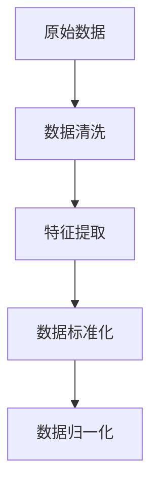
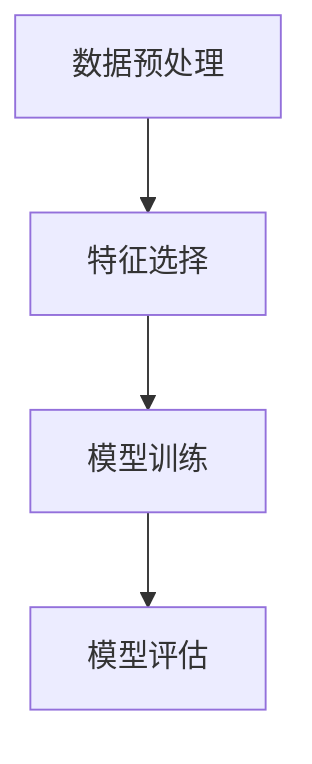
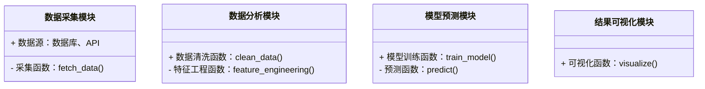
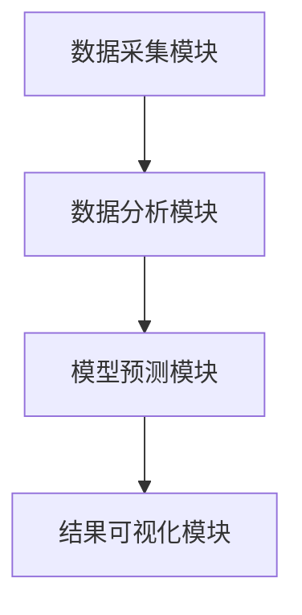
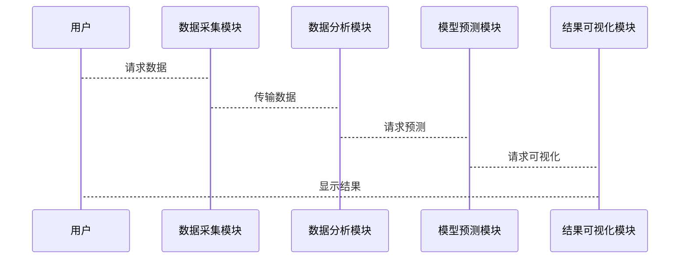

                 


# AI辅助企业战略规划：大数据分析与预测模型

> 关键词：AI, 大数据分析, 预测模型, 企业战略规划, 机器学习

> 摘要：本文详细探讨了如何利用人工智能和大数据分析技术辅助企业制定有效的战略规划。通过构建预测模型，企业能够更好地识别市场趋势、优化资源配置、预测潜在风险并制定更具前瞻性的决策。本文从理论基础、算法原理、系统架构到项目实战，全面解析了AI辅助企业战略规划的核心技术与实现方法。

---

# 第1章: AI辅助企业战略规划概述

## 1.1 企业战略规划的定义与重要性

### 1.1.1 企业战略规划的基本概念

企业战略规划是指企业在不确定的环境中，为了实现长期目标而制定的一系列行动计划和资源分配方案。它通常包括市场定位、产品开发、成本控制、风险管理等多个方面。战略规划的核心在于通过科学的分析和预测，帮助企业做出最优决策。

### 1.1.2 战略规划在企业中的作用

1. **明确发展方向**：帮助企业确定长期目标和优先级。
2. **优化资源配置**：通过合理分配资源，提高效率。
3. **降低风险**：提前识别潜在风险并制定应对策略。
4. **提升竞争力**：通过精准的市场分析，增强企业的市场地位。

### 1.1.3 AI技术对企业战略规划的影响

随着人工智能和大数据技术的快速发展，企业战略规划的制定过程正在发生根本性的变化。AI技术可以通过分析海量数据，发现隐藏的模式和趋势，为企业提供更精准的决策支持。

---

## 1.2 大数据分析与预测模型的背景

### 1.2.1 大数据分析的基本概念

大数据分析是指对海量、多样化、高速度的数据进行处理、分析和挖掘，以提取有价值的信息和洞察。大数据分析的核心在于从数据中提取 actionable insights，帮助企业做出更明智的决策。

### 1.2.2 预测模型在企业决策中的应用

预测模型是一种基于历史数据和统计方法，预测未来趋势和结果的工具。在企业战略规划中，预测模型可以用于销售预测、成本估算、市场需求分析等多个方面。

### 1.2.3 AI辅助战略规划的必要性

AI技术的引入，使得预测模型的构建和优化更加高效和精准。通过机器学习算法，企业可以利用历史数据和实时数据，构建更复杂的模型，从而更好地应对动态变化的市场环境。

---

## 1.3 本章小结

本章主要介绍了企业战略规划的定义和作用，以及AI技术在其中的重要作用。通过大数据分析和预测模型，企业能够更科学地制定战略规划，提升竞争力和抗风险能力。

---

# 第2章: 大数据分析与预测模型基础

## 2.1 数据预处理与特征工程

### 2.1.1 数据清洗与整合

数据清洗是大数据分析的第一步，主要包括去除重复数据、处理缺失值、纠正异常值等。通过数据清洗，可以确保数据的完整性和准确性。

### 2.1.2 数据特征提取与选择

特征工程是指通过对数据的特征进行选择和转换，提取更有代表性的特征。这一步骤直接影响模型的性能，是构建高效预测模型的关键。

### 2.1.3 数据标准化与归一化

数据标准化和归一化是数据预处理中的重要步骤。标准化是指将数据按比例缩放到同一范围内，而归一化则是将数据转换为概率分布。

### 2.1.4 数据预处理流程图



---

## 2.2 监督学习与无监督学习

### 2.2.1 监督学习的基本概念

监督学习是一种通过标记数据训练模型，使其能够对新数据进行分类或回归预测的技术。常见的监督学习算法包括线性回归、支持向量机（SVM）、随机森林等。

### 2.2.2 无监督学习的基本概念

无监督学习是一种通过分析数据的内在结构，发现数据中的隐藏模式的技术。常见的无监督学习算法包括聚类分析、主成分分析（PCA）等。

### 2.2.3 两者在预测模型中的应用

- **监督学习**：适用于有标签的数据，如销售预测、客户 churn 预测。
- **无监督学习**：适用于无标签的数据，如客户分群、异常检测。

---

## 2.3 常见预测模型介绍

### 2.3.1 线性回归模型

线性回归是一种简单而常用的回归模型，适用于预测连续型变量。

**数学模型**：
$$ y = \beta_0 + \beta_1x + \epsilon $$

### 2.3.2 支持向量机（SVM）

SVM 是一种强大的分类和回归模型，适用于高维数据。

**数学模型**：
$$ y = \text{sign}(w \cdot x + b) $$

### 2.3.3 随机森林与梯度提升树

随机森林是一种基于决策树的集成学习方法，梯度提升树是一种通过多次迭代优化模型的技术。

---

## 2.4 本章小结

本章详细介绍了大数据分析与预测模型的基础知识，包括数据预处理、特征工程以及监督学习和无监督学习的基本概念和应用。这些内容为后续章节的算法实现奠定了基础。

---

# 第3章: AI辅助战略规划的算法原理

## 3.1 算法原理概述

### 3.1.1 算法选择的依据

算法选择需要考虑数据类型、问题类型、模型复杂度等因素。例如，对于分类问题，可以使用逻辑回归或随机森林；对于回归问题，可以使用线性回归或梯度提升树。

### 3.1.2 算法的优缺点分析

- **线性回归**：简单易懂，但可能无法捕捉复杂关系。
- **随机森林**：性能强大，但对数据量要求较高。

### 3.1.3 算法的数学模型

以线性回归为例：
$$ y = \beta_0 + \beta_1x_1 + \beta_2x_2 + \ldots + \beta_nx_n $$

---

## 3.2 算法流程图



---

## 3.3 算法实现代码

### 3.3.1 数据预处理代码

```python
import pandas as pd
from sklearn.preprocessing import StandardScaler

# 数据加载
data = pd.read_csv('data.csv')

# 数据清洗
data.dropna(inplace=True)

# 特征选择
features = data[['feature1', 'feature2', ...]]

# 数据标准化
scaler = StandardScaler()
features_standardized = scaler.fit_transform(features)
```

### 3.3.2 模型训练代码

```python
from sklearn.linear_model import LinearRegression

# 模型训练
model = LinearRegression()
model.fit(features_standardized, target)
```

### 3.3.3 模型评估代码

```python
from sklearn.metrics import mean_squared_error

# 模型预测
predictions = model.predict(features_standardized)

# 模型评估
 mse = mean_squared_error(target, predictions)
 print('均方误差:', mse)
```

---

## 3.4 本章小结

本章详细介绍了AI辅助战略规划的核心算法原理，包括线性回归、随机森林等模型的数学模型和实现代码。通过这些算法，企业可以构建高效的预测模型，辅助制定战略规划。

---

# 第4章: 系统架构与设计

## 4.1 系统功能模块设计

### 4.1.1 数据采集模块

数据采集模块负责从多种数据源（如数据库、API）获取数据。

### 4.1.2 数据分析模块

数据分析模块对采集到的数据进行清洗、特征工程和标准化处理。

### 4.1.3 模型预测模块

模型预测模块基于预处理后的数据，训练并预测结果。

### 4.1.4 结果可视化模块

结果可视化模块将预测结果以图表形式展示，便于企业决策者理解。

### 4.1.5 系统功能模块类图



---

## 4.2 系统架构设计

### 4.2.1 系统架构设计图



---

## 4.3 系统接口设计

### 4.3.1 数据采集模块接口

- `fetch_data()`: 从数据库或API获取数据。

### 4.3.2 模型预测模块接口

- `train_model()`: 训练预测模型。
- `predict()`: 使用训练好的模型进行预测。

---

## 4.4 系统交互流程图



---

## 4.5 本章小结

本章详细介绍了AI辅助战略规划系统的架构设计，包括功能模块设计、系统架构图、接口设计和交互流程图。这些内容为企业构建高效的预测系统提供了参考。

---

# 第5章: 项目实战——基于AI的销售预测系统

## 5.1 环境安装

### 5.1.1 安装Python环境

```bash
python --version
pip install --upgrade pip
```

### 5.1.2 安装必要的库

```bash
pip install numpy pandas scikit-learn matplotlib
```

---

## 5.2 数据准备

### 5.2.1 数据集描述

假设我们有一个包含销售数据、市场数据、客户数据等的 CSV 文件。

### 5.2.2 数据预处理

```python
import pandas as pd
from sklearn.preprocessing import StandardScaler

# 数据加载
data = pd.read_csv('sales_data.csv')

# 数据清洗
data.dropna(inplace=True)

# 特征选择
features = data[['month', 'price', 'advertising_cost', 'sales']]

# 数据标准化
scaler = StandardScaler()
features_standardized = scaler.fit_transform(features)
```

---

## 5.3 模型训练

### 5.3.1 模型选择

选择线性回归模型进行销售预测。

### 5.3.2 模型训练

```python
from sklearn.linear_model import LinearRegression

model = LinearRegression()
model.fit(features_standardized, data['sales'])
```

---

## 5.4 模型评估

### 5.4.1 模型预测

```python
predictions = model.predict(features_standardized)
```

### 5.4.2 模型评估

```python
from sklearn.metrics import mean_absolute_error

mae = mean_absolute_error(data['sales'], predictions)
print('平均绝对误差:', mae)
```

---

## 5.5 模型部署

### 5.5.1 部署环境准备

使用 Flask 搭建一个简单的 Web 服务。

### 5.5.2 模型部署代码

```python
from flask import Flask, request, jsonify

app = Flask(__name__)
model = LinearRegression()
model.fit(features_standardized, data['sales'])

@app.route('/predict', methods=['POST'])
def predict():
    data = request.json
    # 数据预处理
    features = [[data['month'], data['price'], data['advertising_cost']]]
    features_standardized = scaler.transform(features)
    prediction = model.predict(features_standardized)[0]
    return jsonify({'prediction': prediction})
```

---

## 5.6 项目小结

本章通过一个具体的销售预测项目，详细展示了AI辅助战略规划系统的实现过程，包括环境安装、数据准备、模型训练、模型评估和模型部署。

---

# 第6章: 总结与展望

## 6.1 总结

本文详细探讨了AI辅助企业战略规划的核心技术，包括大数据分析、预测模型和系统架构设计。通过理论与实践相结合，展示了如何利用AI技术提升企业的决策能力。

## 6.2 未来展望

随着AI技术的不断发展，企业战略规划的智能化水平将不断提高。未来，我们可以期待更多基于深度学习和强化学习的预测模型，以及更加智能化的决策支持系统。

---

# 作者信息

作者：AI天才研究院（AI Genius Institute） & 禅与计算机程序设计艺术（Zen And The Art of Computer Programming）

---

以上是《AI辅助企业战略规划：大数据分析与预测模型》的技术博客文章内容，希望对您有所帮助！

