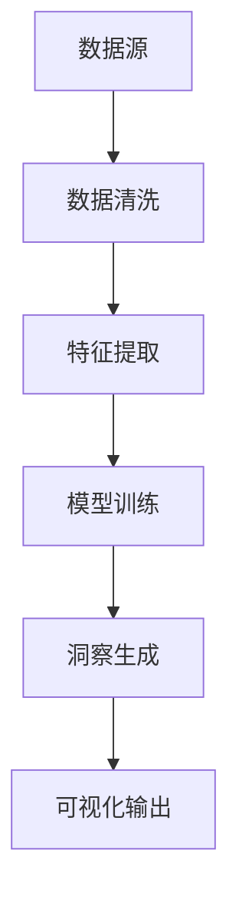
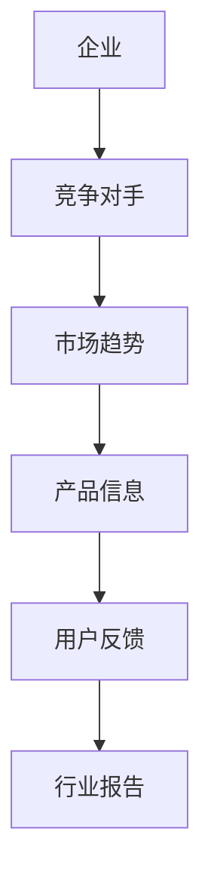
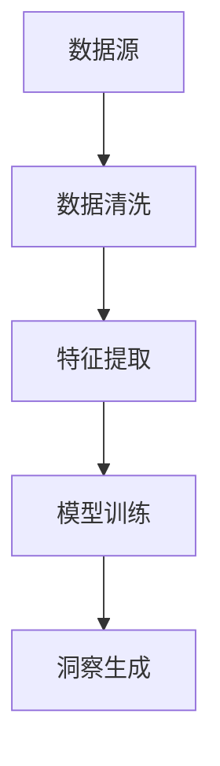
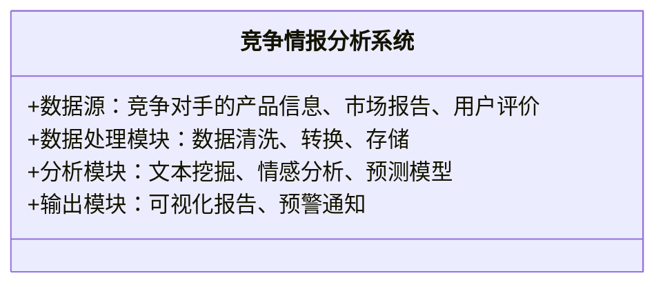
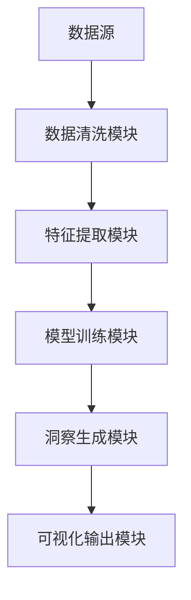

                 


# AI辅助企业竞争情报分析：自动化数据收集与洞察生成

---

## 关键词：
- 人工智能（AI）
- 竞争情报分析
- 数据收集
- 自动化
- 洞察生成

---

## 摘要：
随着企业竞争的日益激烈，竞争情报分析在帮助企业制定战略决策中的作用越来越重要。然而，传统的情报分析方法依赖于大量的人工数据收集和复杂的分析过程，效率低下且成本高昂。为了应对这一挑战，人工智能（AI）技术的引入为竞争情报分析带来了革命性的变化。本文将详细探讨AI在竞争情报分析中的应用，重点分析自动化数据收集和智能化洞察生成的关键技术、算法原理、系统架构及实际案例。通过本文的阐述，读者将能够理解如何利用AI技术提升企业竞争情报分析的效率和准确性。

---

# 第一部分: AI辅助企业竞争情报分析概述

## 第1章: 背景与问题背景

### 1.1 问题背景

#### 1.1.1 企业竞争情报分析的定义
竞争情报分析是指通过收集、处理和分析竞争对手及其市场环境的相关信息，为企业制定竞争策略提供支持的过程。其核心目标是帮助企业识别市场机会、规避风险、优化产品和服务，从而在竞争中占据优势地位。

#### 1.1.2 竞争情报分析的重要性
在当今快速变化的商业环境中，企业需要及时了解竞争对手的动态、市场趋势以及行业动态。竞争情报分析能够为企业提供关键的决策支持，帮助企业快速响应市场变化，提升竞争力。

#### 1.1.3 当前竞争情报分析的痛点
1. **数据收集效率低**：传统的情报分析依赖人工收集数据，效率低下且容易遗漏重要信息。
2. **数据处理复杂**：海量数据的清洗、整理和分析需要大量的人力和时间。
3. **洞察生成困难**：从大量数据中提取有价值的洞察需要复杂的分析方法，且容易受到主观因素的影响。

### 1.2 问题描述

#### 1.2.1 数据收集的挑战
1. 数据来源多样化：企业需要从多种渠道（如社交媒体、新闻网站、行业报告等）收集数据，数据格式和结构各不相同。
2. 数据质量参差不齐：收集的数据可能存在噪声、重复或不完整的问题，需要进行复杂的清洗和预处理。

#### 1.2.2 数据处理的复杂性
1. 数据清洗：需要处理缺失值、异常值等问题。
2. 数据转换：将数据转换为适合分析的格式，例如文本数据的分词、数值数据的归一化等。
3. 数据存储：需要构建高效的数据存储方案，支持快速查询和处理。

#### 1.2.3 洞察生成的效率问题
1. 数据分析方法单一：传统的方法依赖统计分析，难以从非结构化数据中提取深层洞察。
2. 洞察生成的主观性：分析结果容易受到分析师的主观影响，缺乏客观性和全面性。

### 1.3 问题解决

#### 1.3.1 AI在竞争情报分析中的作用
1. **自动化数据收集**：AI技术可以通过自然语言处理（NLP）和机器学习算法，从多种数据源自动收集和整理竞争情报。
2. **智能化数据处理**：AI能够自动清洗、转换和存储数据，减少人工干预，提高数据处理效率。
3. **自动化洞察生成**：AI可以通过深度学习和自然语言处理技术，从海量数据中提取有价值的洞察，帮助企业在竞争中制定更明智的决策。

#### 1.3.2 自动化数据收集的优势
1. 提高数据收集效率：AI可以自动从多种数据源收集数据，减少人工操作的时间和成本。
2. 扩大数据覆盖范围：AI能够处理多种数据格式和语言，覆盖更多的数据源，提供更全面的竞争情报。

#### 1.3.3 智能化洞察生成的实现
1. 利用自然语言处理技术：AI可以通过文本挖掘和情感分析，从非结构化数据中提取关键信息。
2. 基于机器学习的预测：AI可以通过训练模型，预测竞争对手的市场行为和趋势。

### 1.4 边界与外延

#### 1.4.1 竞争情报分析的边界
1. 数据范围：竞争情报分析通常关注竞争对手的产品、市场策略、客户反馈等方面，不涉及企业的内部数据。
2. 时间范围：竞争情报分析关注的是实时或近期的市场动态，而不是长期的历史数据。

#### 1.4.2 AI辅助的适用范围
1. 数据收集：AI适用于从多种数据源自动收集和整理竞争情报。
2. 数据分析：AI适用于从海量数据中提取关键洞察，尤其是非结构化数据的分析。
3. 洞察生成：AI适用于通过机器学习模型预测市场趋势和竞争对手行为。

#### 1.4.3 竞争情报分析与商业智能的区别
竞争情报分析关注的是竞争对手的动态和市场趋势，而商业智能（BI）关注的是企业自身的经营数据和内部管理。竞争情报分析更注重外部环境的分析，而商业智能更注重内部数据的分析。

### 1.5 核心概念结构

#### 1.5.1 核心要素组成
1. 数据源：包括竞争对手的产品信息、市场报告、社交媒体数据等。
2. 数据处理：包括数据清洗、转换、存储等步骤。
3. 分析模型：包括文本挖掘、情感分析、预测模型等。
4. 洞察生成：包括市场趋势分析、竞争对手行为预测等。

#### 1.5.2 系统架构的核心模块
1. 数据收集模块：负责从多种数据源收集竞争情报。
2. 数据处理模块：负责对收集的数据进行清洗和转换。
3. 分析模块：负责对数据进行深度分析，生成洞察。
4. 输出模块：负责将分析结果以可视化的方式呈现给用户。

#### 1.5.3 竞争情报分析的流程图


---

## 第2章: 核心概念与联系

### 2.1 AI与竞争情报分析的结合

#### 2.1.1 AI在数据收集中的应用
1. 自动化数据抓取：AI可以通过爬虫技术从网页、社交媒体等数据源自动抓取竞争情报。
2. 多语言处理：AI能够处理多种语言的数据，扩大数据覆盖范围。

#### 2.1.2 AI在数据处理中的应用
1. 自动化清洗：AI可以通过自然语言处理技术自动识别和处理数据中的噪声。
2. 数据转换：AI可以将数据转换为适合分析的格式，例如文本数据的分词、数值数据的归一化等。

#### 2.1.3 AI在洞察生成中的应用
1. 文本挖掘：AI可以通过自然语言处理技术从文本数据中提取关键信息。
2. 情感分析：AI可以分析用户对竞争对手产品的评价，帮助企业了解市场情绪。

### 2.2 核心概念对比

#### 2.2.1 AI与传统数据分析的对比

| 对比维度 | AI辅助的竞争情报分析 | 传统竞争情报分析 |
|----------|------------------------|-------------------|
| 数据处理效率 | 高，自动化处理          | 低，依赖人工处理  |
| 数据覆盖范围 | 广，支持多源数据         | 有限，主要依赖有限数据源 |
| 分析深度 | 深，基于机器学习模型       | 浅，主要依赖统计分析 |
| 灵活性 | 高，支持实时分析          | 低，分析周期长     |

#### 2.2.2 竞争情报分析与市场调研的对比

| 对比维度 | 竞争情报分析 | 市场调研 |
|----------|--------------|----------|
| 数据来源 | 竞争对手数据   | 市场数据   |
| 分析目标 | 分析竞争对手行为 | 分析市场趋势 |
| 数据处理 | 自动化        | 人工为主   |
| 分析深度 | 深入          | 一般       |

#### 2.2.3 自动化数据收集与人工数据收集的对比

| 对比维度 | 自动化数据收集 | 人工数据收集 |
|----------|----------------|--------------|
| 效率 | 高              | 低            |
| 成本 | 低              | 高            |
| 覆盖范围 | 广，支持多源数据 | 有限          |
| 准确性 | 高，基于算法    | 易受主观影响  |

### 2.3 ER实体关系图



---

## 第3章: 算法原理与实现

### 3.1 竞争情报分析的算法流程



### 3.2 算法实现代码

#### 3.2.1 数据清洗代码示例

```python
import pandas as pd
import numpy as np

# 示例数据
data = {
    'text': ['This is a test', 'clean this data', 'remove noise', ''],
    'label': [1, 0, 1, np.nan]
}

df = pd.DataFrame(data)

# 删除包含空值的行
df = df.dropna()

# 去除停用词（示例）
stop_words = {'is', 'a', 'the', 'this', 'remove'}

def remove_stopwords(text):
    words = text.split()
    filtered_words = [word for word in words if word not in stop_words]
    return ' '.join(filtered_words)

df['text_clean'] = df['text'].apply(remove_stopwords)

print(df)
```

#### 3.2.2 特征提取代码示例

```python
from sklearn.feature_extraction.text import TfidfVectorizer

vectorizer = TfidfVectorizer()
X = vectorizer.fit_transform(df['text_clean'])
```

### 3.3 算法原理的数学模型和公式

#### 3.3.1 文本预处理
文本预处理是竞争情报分析中的关键步骤，主要包括分词、去停用词和词干提取等。例如，中文分词可以使用jieba库：

```python
import jieba

text = "这个产品真的很好用"
words = jieba.lcut(text)
print(words)
```

#### 3.3.2 分类模型
分类模型用于将数据分为不同的类别，例如竞争对手的产品评价分为正面、负面和中性。常用的分类算法包括支持向量机（SVM）和随机森林（Random Forest）。

支持向量机（SVM）的数学模型如下：

$$
\text{目标函数：} \quad \min_{w, b, \xi} \frac{1}{2}||w||^2 + C \sum_{i=1}^n \xi_i
$$

$$
\text{约束条件：} \quad y_i (w \cdot x_i + b) \geq 1 - \xi_i, \quad \xi_i \geq 0
$$

其中，$w$ 是权重向量，$b$ 是偏置项，$C$ 是惩罚参数，$\xi_i$ 是松弛变量。

---

## 第4章: 系统分析与架构设计方案

### 4.1 问题场景介绍

#### 4.1.1 竞争情报分析的典型场景
1. **竞争对手产品分析**：分析竞争对手的产品特点、市场定位和用户评价。
2. **市场趋势预测**：基于历史数据和当前市场动态，预测未来的市场趋势。
3. **客户行为分析**：分析客户对竞争对手产品的购买行为和偏好。

#### 4.1.2 系统需求
1. 实时数据收集：能够从多种数据源实时收集竞争情报。
2. 自动化数据处理：能够自动清洗、转换和存储数据。
3. 智能化分析：能够基于机器学习模型生成竞争情报分析报告。

### 4.2 系统功能设计

#### 4.2.1 领域模型（Mermaid 类图）



#### 4.2.2 系统架构设计（Mermaid 架构图）



#### 4.2.3 系统接口设计
1. 数据源接口：支持多种数据格式的输入，例如CSV、JSON等。
2. 数据处理接口：提供数据清洗和转换的API。
3. 分析接口：提供文本挖掘和情感分析的API。
4. 输出接口：提供可视化报告和预警通知的API。

#### 4.2.4 系统交互设计（Mermaid 序列图）

```mermaid
sequenceDiagram
    participant 用户
    participant 数据源
    participant 数据清洗模块
    participant 分析模块
    participant 输出模块

    用户 -> 数据源：请求数据
    数据源 -> 用户：返回数据
    用户 -> 数据清洗模块：提交数据
    数据清洗模块 -> 分析模块：传递清洗后的数据
    分析模块 -> 输出模块：生成洞察报告
    输出模块 -> 用户：展示报告
```

---

## 第5章: 项目实战

### 5.1 环境安装

#### 5.1.1 安装Python环境
```bash
python --version
pip install --upgrade pip
```

#### 5.1.2 安装所需库
```bash
pip install pandas numpy scikit-learn jieba
```

### 5.2 核心实现

#### 5.2.1 数据收集模块
```python
import requests
from bs4 import BeautifulSoup

def collect_data(url):
    response = requests.get(url)
    soup = BeautifulSoup(response.text, 'html.parser')
    # 提取文本内容
    text = soup.get_text()
    return text

data = collect_data('https://example.com')
print(data)
```

#### 5.2.2 数据处理模块
```python
import pandas as pd
import numpy as np

def preprocess_data(data):
    df = pd.DataFrame({'text': data})
    # 去除空值
    df = df.dropna()
    # 分词
    from jieba import lcut
    df['tokens'] = df['text'].apply(lambda x: lcut(x))
    return df

df = preprocess_data(data)
print(df)
```

#### 5.2.3 分析模块
```python
from sklearn.feature_extraction.text import TfidfVectorizer
from sklearn.svm import SVC
from sklearn.pipeline import Pipeline

pipeline = Pipeline([
    ('tfidf', TfidfVectorizer()),
    ('clf', SVC())
])

pipeline.fit(df['tokens'], df['label'])
```

### 5.3 案例分析

#### 5.3.1 竞争对手产品信息分析
1. 数据收集：从竞争对手的产品页面收集产品信息。
2. 数据清洗：去除无效数据，提取有效字段。
3. 文本挖掘：分析产品描述，提取关键词。
4. 情感分析：分析用户评价，判断产品口碑。

#### 5.3.2 市场趋势预测
1. 数据收集：收集历史销售数据和市场报告。
2. 数据预处理：清洗和转换数据。
3. 建立预测模型：使用时间序列模型预测未来趋势。
4. 结果可视化：生成趋势图和预测报告。

### 5.4 项目小结

#### 5.4.1 核心代码实现
1. 数据收集模块：实现从多种数据源自动收集竞争情报。
2. 数据处理模块：实现数据清洗、转换和存储。
3. 分析模块：实现文本挖掘、情感分析和预测模型。
4. 输出模块：生成可视化报告和预警通知。

#### 5.4.2 实战经验总结
1. 数据质量是分析结果的关键，需要重视数据清洗和预处理。
2. 选择合适的算法和模型，能够显著提高分析的准确性和效率。
3. 可视化是传达分析结果的重要手段，需要设计直观易懂的报告。

---

## 第6章: 最佳实践

### 6.1 小结

#### 6.1.1 核心内容回顾
1. AI在竞争情报分析中的应用：自动化数据收集、智能化数据处理和自动化洞察生成。
2. 关键技术：自然语言处理、机器学习、数据挖掘。
3. 实际应用案例：竞争对手产品分析、市场趋势预测、客户行为分析。

### 6.2 注意事项

#### 6.2.1 数据隐私和合规性
1. 遵守数据隐私法规，确保数据收集和处理的合法性。
2. 注意数据来源的合法性，避免侵犯竞争对手的知识产权。

#### 6.2.2 模型的可解释性
1. 选择可解释性较高的模型，确保分析结果的透明性和可信度。
2. 对模型进行充分的验证和测试，避免黑箱模型的误用。

#### 6.2.3 持续优化
1. 定期更新模型和算法，以应对市场的变化和新的数据挑战。
2. 监测系统的性能和效果，及时调整和优化。

### 6.3 拓展阅读

#### 6.3.1 推荐书籍
1. 《竞争情报分析：方法与实践》
2. 《人工智能：一种现代方法》

#### 6.3.2 推荐工具
1. Python：数据处理和分析的首选工具。
2. Scikit-learn：机器学习库。
3. Jieba：中文分词工具。
4. Tableau：数据可视化工具。

---

## 作者信息

作者：AI天才研究院/AI Genius Institute & 禅与计算机程序设计艺术 /Zen And The Art of Computer Programming

---

# 结语

通过本文的详细阐述，我们了解了AI在竞争情报分析中的应用，包括自动化数据收集、智能化数据处理和自动化洞察生成的关键技术。希望本文能够为企业的竞争情报分析提供新的思路和方法，帮助企业利用AI技术提升竞争力。

