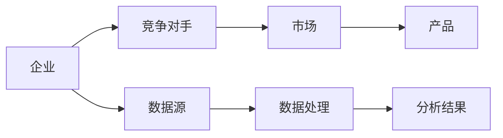
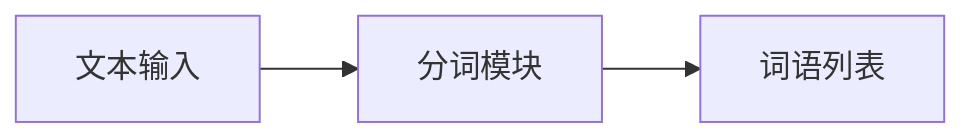
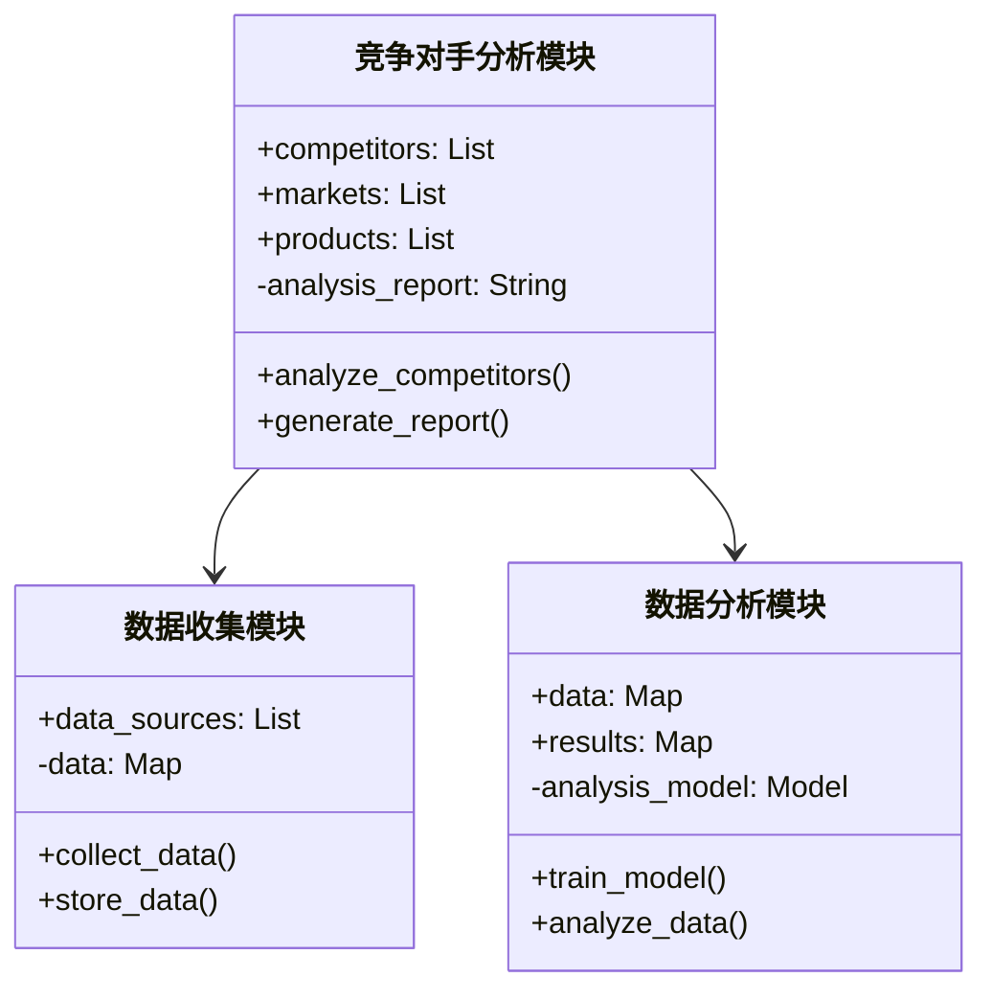
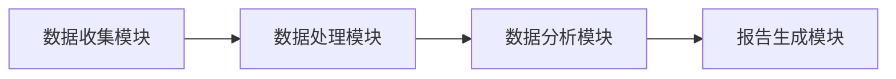

                 


# AI辅助企业竞争情报分析：自动化数据收集与洞察生成系统

> **关键词**: AI, 竞争情报分析, 自动化数据收集, 洞察生成系统, 企业情报分析

> **摘要**: 本文深入探讨了AI在企业竞争情报分析中的应用，重点分析了自动化数据收集与洞察生成系统的实现方法。通过详细的技术分析和案例研究，阐述了该系统的核心算法、数学模型、系统架构设计以及实际项目实现。本文旨在为企业提供一套高效、智能的竞争情报分析解决方案。

---

# 第1章: 问题背景与问题描述

## 1.1 问题背景

### 1.1.1 企业竞争情报分析的重要性

企业竞争情报分析是企业在激烈的市场竞争中获取竞争优势的关键手段。通过收集、分析竞争对手的产品、市场、技术等信息，企业能够制定更有效的市场策略，优化产品开发和资源配置。

### 1.1.2 当前竞争情报分析的痛点

传统的竞争情报分析依赖人工数据收集和分析，效率低、成本高且容易遗漏重要信息。随着市场竞争的加剧，企业需要更高效、更智能的解决方案来应对海量数据和复杂信息。

### 1.1.3 AI技术如何解决这些问题

人工智能技术的快速发展为企业竞争情报分析提供了新的解决方案。通过自然语言处理、机器学习等技术，AI能够自动化地收集、整理和分析海量数据，快速生成有价值的商业洞察。

## 1.2 问题描述

### 1.2.1 竞争情报分析的主要任务

竞争情报分析的主要任务包括竞争对手分析、市场趋势分析、产品对标分析等。这些任务需要从多种来源（如新闻、社交媒体、行业报告等）收集数据，并进行深度分析。

### 1.2.2 数据收集与处理的挑战

数据收集面临的挑战包括数据来源多样、数据格式不统一、数据质量和完整性难以保证等问题。此外，如何高效地处理海量数据也是一个关键挑战。

### 1.2.3 洞察生成的复杂性

洞察生成需要从数据中提取有价值的信息，并转化为可操作的商业建议。这需要复杂的算法和模型支持，同时需要考虑数据的多维度关联性。

## 1.3 问题解决与边界

### 1.3.1 AI辅助的解决方案概述

通过AI技术，企业可以实现竞争情报分析的自动化，包括数据收集、清洗、分析和洞察生成的全流程。

### 1.3.2 系统的边界与外延

本系统专注于企业竞争情报分析的核心任务，不涉及企业的内部数据分析和市场预测任务。

### 1.3.3 核心要素与组成结构

系统的核心要素包括数据收集模块、数据处理模块、数据分析模块和洞察生成模块。

---

# 第2章: 核心概念与联系

## 2.1 核心概念

### 2.1.1 AI技术在竞争情报分析中的应用

AI技术的应用包括自然语言处理、机器学习模型、文本挖掘等，这些技术可以帮助企业快速分析海量文本数据。

### 2.1.2 自动化数据收集的实现方式

自动化数据收集可以通过爬虫技术、API接口调用等方式实现，能够从多种数据源获取数据。

### 2.1.3 洞察生成的系统架构

洞察生成系统通过数据分析模块，利用机器学习模型和统计分析方法，从数据中提取有价值的信息，并生成商业洞察。

## 2.2 核心概念的属性对比

### 2.2.1 AI与传统数据分析的对比

| 特性 | AI技术 | 传统数据分析 |
|------|--------|--------------|
| 数据处理能力 | 可处理非结构化数据 | 主要处理结构化数据 |
| 分析深度 | 可进行深度学习和模式识别 | 主要进行统计分析 |

### 2.2.2 数据收集与数据处理的差异

| 特性 | 数据收集 | 数据处理 |
|------|----------|-----------|
| 输入 | 原始数据 | 清洗后的数据 |
| 输出 | 数据库存储 | 分析结果 |

### 2.2.3 洞察生成的模式演变

洞察生成从简单的数据汇总逐步发展到基于机器学习的深度分析。

## 2.3 实体关系图



---

# 第3章: 算法原理讲解

## 3.1 文本挖掘算法

### 3.1.1 分词算法

分词算法用于将文本分割成词语或短语，常用的算法包括正向最大匹配法和逆向最大匹配法。



### 3.1.2 实现代码

```python
def word_segmentation(text):
    # 示例：正向最大匹配法
    dictionary = {"中国", "企业", "竞争", "情报", "分析"}
    result = []
    i = 0
    while i < len(text):
        max_length = min(4, len(text) - i)
        for j in range(max_length, 0, -1):
            candidate = text[i:i+j]
            if candidate in dictionary:
                result.append(candidate)
                i += j
                break
        else:
            # 如果没有匹配到任何词，取一个字符作为分词
            result.append(text[i])
            i += 1
    return result
```

### 3.1.3 文本相似度计算

文本相似度计算可以使用余弦相似度。

$$\text{余弦相似度} = \frac{\vec{A} \cdot \vec{B}}{\|\vec{A}\| \|\vec{B}\|}$$

---

## 3.2 机器学习模型

### 3.2.1 竞争对手识别模型

使用LSTM进行序列建模，识别竞争对手的产品信息。

```python
import tensorflow as tf
from tensorflow.keras import layers

model = tf.keras.Sequential([
    layers.Embedding(input_dim=10000, output_dim=100),
    layers.LSTM(64),
    layers.Dense(1, activation='sigmoid')
])
```

### 3.2.2 模型训练与优化

使用训练数据对模型进行训练，并通过交叉验证优化模型参数。

---

# 第4章: 数学模型与公式

## 4.1 文本相似度计算

文本相似度计算可以使用余弦相似度。

$$\text{余弦相似度} = \frac{\vec{A} \cdot \vec{B}}{\|\vec{A}\| \|\vec{B}\|}$$

其中，$\vec{A}$和$\vec{B}$是两个文本的向量表示。

## 4.2 竞争情报分析中的主题模型

使用LDA主题模型对文本数据进行主题提取。

$$\text{LDA模型} = \text{Dirichlet}(α) \times \text{Multinomial}(θ)$$

---

# 第5章: 系统分析与架构设计

## 5.1 问题场景介绍

系统需要实现企业竞争情报分析的自动化，包括数据收集、清洗、分析和洞察生成。

## 5.2 系统功能设计

### 5.2.1 领域模型类图



## 5.3 系统架构设计

### 5.3.1 系统架构图



---

# 第6章: 项目实战

## 6.1 环境安装

安装必要的Python库：

```bash
pip install numpy pandas scikit-learn tensorflow
```

## 6.2 核心代码实现

### 6.2.1 数据收集模块

```python
import requests
from bs4 import BeautifulSoup

def collect_data(url):
    response = requests.get(url)
    soup = BeautifulSoup(response.text, 'html.parser')
    # 提取数据并存储
    return data
```

### 6.2.2 数据分析模块

```python
from sklearn.feature_extraction.text import TfidfVectorizer
from sklearn.cluster import KMeans

vectorizer = TfidfVectorizer()
X = vectorizer.fit_transform(documents)
km = KMeans(n_clusters=5).fit(X)
```

## 6.3 案例分析与解读

通过分析竞争对手的产品信息，生成市场分析报告。

---

# 第7章: 最佳实践与总结

## 7.1 小结

本文详细介绍了AI辅助企业竞争情报分析的实现方法，包括算法原理、系统架构设计和项目实战。

## 7.2 注意事项

在实际应用中，需要注意数据隐私和合规性问题。

## 7.3 拓展阅读

推荐阅读《机器学习实战》和《自然语言处理入门》。

---

# 作者

**作者：AI天才研究院/AI Genius Institute & 禅与计算机程序设计艺术 /Zen And The Art of Computer Programming**

