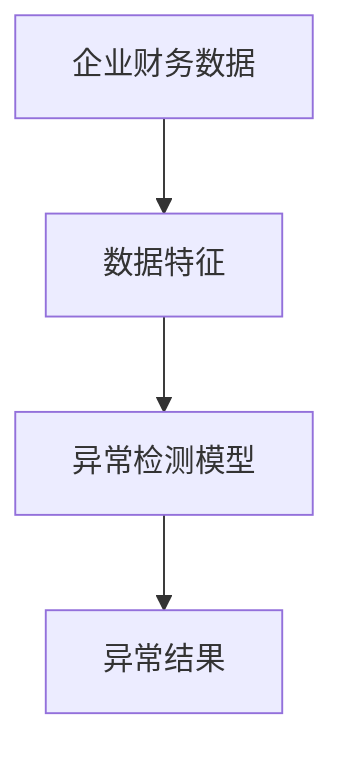
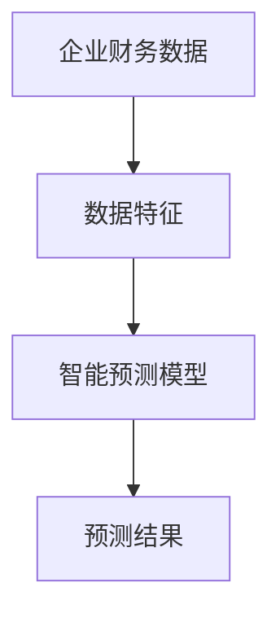

                 


# AI辅助企业财务分析：异常检测与智能财务预测

> 关键词：AI技术，企业财务分析，异常检测，智能财务预测，数据驱动决策

> 摘要：本文详细探讨了AI技术在企业财务分析中的应用，重点介绍了异常检测与智能财务预测的核心概念、算法原理、系统设计以及实际应用。通过结合理论与实践，本文为读者提供了从数据收集、模型训练到系统实现的完整解决方案，帮助企业在数字化转型中提升财务分析效率与准确性。

---

## 第1章 AI在企业财务分析中的应用背景

### 1.1 企业财务分析的数字化转型

#### 1.1.1 传统财务分析的局限性
传统财务分析依赖人工处理，存在效率低、易出错、难以及时发现异常等问题。企业财务数据量的快速增长使得人工分析难以应对复杂场景。

#### 1.1.2 数字化转型对企业财务分析的影响
数字化转型推动企业财务分析从人工模式向自动化、智能化转变。AI技术的应用为企业提供了更高效的工具，能够快速处理大量数据并生成精准的预测结果。

#### 1.1.3 AI技术在财务分析中的应用前景
AI技术在财务分析中的应用前景广阔，尤其是在异常检测和预测领域。通过AI辅助，企业能够更好地识别财务风险、优化资源配置，提升整体财务管理水平。

### 1.2 异常检测与智能预测的核心概念

#### 1.2.1 异常检测的定义与作用
异常检测是指通过分析数据，识别出与正常模式不符的异常数据或行为。在企业财务分析中，异常检测可以帮助发现潜在的财务风险，如欺诈行为、数据错误等。

#### 1.2.2 智能财务预测的定义与目标
智能财务预测是利用AI技术，基于历史数据和业务规则，预测未来的财务状况。其目标是为企业提供更准确的财务预期，支持决策者制定更科学的财务策略。

#### 1.2.3 企业财务分析中的异常检测与预测的边界与外延
异常检测与预测在企业财务分析中的应用范围包括但不限于：财务报表分析、现金流预测、风险评估、成本控制等。

### 1.3 AI辅助企业财务分析的核心要素

#### 1.3.1 数据来源与特征
企业财务分析的数据来源包括财务报表、交易记录、市场数据等。数据特征包括时间性、关联性、周期性等。

#### 1.3.2 AI算法的选择与应用
根据具体应用场景选择合适的AI算法，如聚类分析、回归分析、时间序列分析等。

#### 1.3.3 企业财务分析的业务流程
企业财务分析的业务流程包括数据收集、数据预处理、模型训练、结果分析与优化。

### 1.4 本章小结
本章介绍了AI技术在企业财务分析中的应用背景，重点阐述了异常检测与智能预测的核心概念，为后续章节的深入分析奠定了基础。

---

## 第2章 异常检测的原理与方法

### 2.1 异常检测的基本原理

#### 2.1.1 异常检测的定义与分类
异常检测是一种通过分析数据，识别出异常数据点或模式的技术。根据应用场景的不同，异常检测可以分为监督式和无监督式两类。

#### 2.1.2 异常检测的核心算法原理
无监督式异常检测算法包括聚类分析、主成分分析等；监督式异常检测算法包括支持向量机、随机森林等。

#### 2.1.3 异常检测的数学模型与公式
聚类分析是一种常用的无监督异常检测方法，其数学模型可以表示为：
$$
\text{目标函数} = \sum_{i=1}^{n} \sum_{j=1}^{k} w_{ij}d(x_i, c_j)
$$
其中，\( w_{ij} \) 是数据点 \( x_i \) 属于簇 \( c_j \) 的权重，\( d(x_i, c_j) \) 是数据点 \( x_i \) 到簇中心 \( c_j \) 的距离。

### 2.2 异常检测的关键特征对比

#### 2.2.1 数据特征的对比分析
从数据特征的角度，对比分析不同算法在处理不同类型数据时的表现。

#### 2.2.2 算法性能的对比分析
通过实验对比不同算法在异常检测任务中的准确率、召回率、F1分数等指标。

#### 2.2.3 企业财务数据的特征分析
企业财务数据具有高维性、时序性、关联性等特点，这些特征对异常检测算法的选择和优化具有重要影响。

### 2.3 异常检测的ER实体关系图



### 2.4 本章小结
本章详细介绍了异常检测的基本原理与方法，通过对比分析和图示化展示，帮助读者更好地理解异常检测在企业财务分析中的应用。

---

## 第3章 智能财务预测的算法原理

### 3.1 智能预测的基本原理

#### 3.1.1 智能预测的定义与目标
智能财务预测是通过AI技术，基于历史财务数据，预测未来的财务状况。其目标是为企业提供更准确的财务预期，支持决策者制定更科学的财务策略。

#### 3.1.2 智能预测的核心算法原理
智能预测的核心算法包括时间序列分析、回归分析、支持向量机等。这些算法可以通过训练模型，预测未来的财务数据。

#### 3.1.3 智能预测的数学模型与公式
时间序列分析是一种常用的智能预测方法，其数学模型可以表示为：
$$
\text{ARIMA模型} = \text{Autoregressive}(p) + \text{Integrated}(d) + \text{Moving Average}(q)
$$
其中，\( p \) 是自回归阶数，\( d \) 是差分阶数，\( q \) 是移动平均阶数。

### 3.2 智能预测的关键特征对比

#### 3.2.1 数据特征的对比分析
从数据特征的角度，对比分析不同算法在处理不同类型数据时的表现。

#### 3.2.2 算法性能的对比分析
通过实验对比不同算法在智能预测任务中的准确率、召回率、F1分数等指标。

#### 3.2.3 企业财务数据的特征分析
企业财务数据具有高维性、时序性、关联性等特点，这些特征对智能预测算法的选择和优化具有重要影响。

### 3.3 智能预测的ER实体关系图



### 3.4 本章小结
本章详细介绍了智能预测的基本原理与方法，通过对比分析和图示化展示，帮助读者更好地理解智能预测在企业财务分析中的应用。

---

## 第4章 系统分析与架构设计

### 4.1 问题场景介绍

#### 4.1.1 项目介绍
本项目旨在开发一个基于AI的企业财务分析系统，实现对企业财务数据的异常检测与智能预测。

#### 4.1.2 系统功能设计
系统功能包括数据收集、数据预处理、模型训练、结果分析与优化。

### 4.2 系统架构设计

#### 4.2.1 系统架构图


#### 4.2.2 系统接口设计
系统接口包括数据接口、模型接口、结果接口等。

#### 4.2.3 系统交互流程图


### 4.3 本章小结
本章详细介绍了基于AI的企业财务分析系统的系统架构设计，为后续章节的实现提供了理论基础。

---

## 第5章 项目实战与代码实现

### 5.1 环境安装与配置

#### 5.1.1 安装Python与相关库
安装Python 3.8及以上版本，安装Pandas、Scikit-learn、XGBoost等库。

### 5.2 系统核心实现

#### 5.2.1 异常检测代码实现
```python
import pandas as pd
from sklearn.cluster import KMeans

# 数据预处理
data = pd.read_csv('financial_data.csv')
X = data[['revenue', 'profit', 'expenses']]
model = KMeans(n_clusters=2)
model.fit(X)
# 获取异常数据
outliers = model.fit_predict(X)
data['is_outlier'] = outliers
```

#### 5.2.2 智能预测代码实现
```python
import pandas as pd
from sklearn.ensemble import RandomForestRegressor

# 数据预处理
data = pd.read_csv('financial_data.csv')
X = data[['revenue', 'profit', 'expenses']]
y = data['forecast']
model = RandomForestRegressor()
model.fit(X, y)
# 预测结果
predictions = model.predict(X)
data['predicted_forecast'] = predictions
```

### 5.3 代码应用解读与分析

#### 5.3.1 异常检测代码解读
上述代码实现了一个基于KMeans算法的异常检测模型，通过聚类分析识别出异常数据点。

#### 5.3.2 智能预测代码解读
上述代码实现了一个基于随机森林回归算法的智能预测模型，通过训练模型预测未来的财务数据。

### 5.4 实际案例分析

#### 5.4.1 案例背景介绍
以某制造企业的财务数据为例，分析其异常检测与智能预测的应用场景。

#### 5.4.2 数据分析与结果解读
通过对企业的财务数据进行分析，识别出异常交易，并预测未来的财务状况。

### 5.5 项目小结
本章通过实际案例分析，详细讲解了基于AI的企业财务分析系统的实现过程，帮助读者更好地理解理论与实践的结合。

---

## 第6章 最佳实践与总结

### 6.1 小结
本文详细探讨了AI技术在企业财务分析中的应用，重点介绍了异常检测与智能预测的核心概念、算法原理、系统设计以及实际应用。

### 6.2 注意事项
在实际应用中，需要注意数据质量、模型选择、结果解释等问题，确保AI技术的有效应用。

### 6.3 拓展阅读
推荐阅读相关领域的书籍与论文，进一步深入学习AI技术在财务分析中的应用。

---

## 作者：AI天才研究院/AI Genius Institute & 禅与计算机程序设计艺术 /Zen And The Art of Computer Programming

