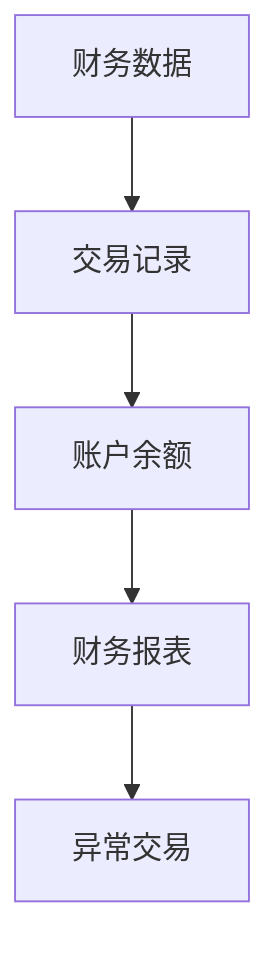
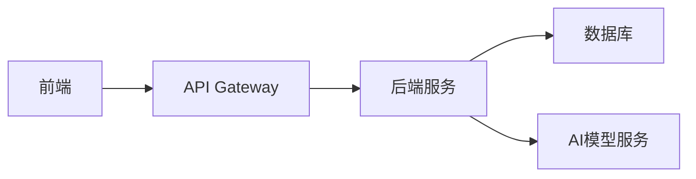
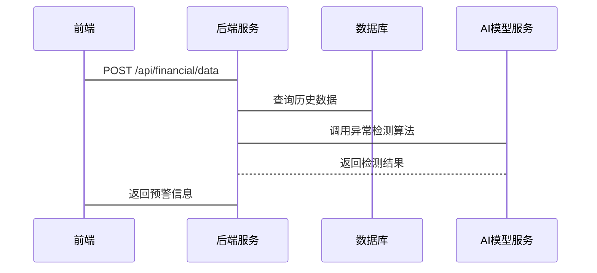

                 


# AI辅助企业财务异常检测：实时监控与风险预警

## 关键词：AI、财务异常检测、风险预警、实时监控、企业财务、异常检测

## 摘要：本文探讨了如何利用人工智能技术提升企业财务异常检测的效率与准确性。通过分析财务数据，运用机器学习、深度学习等算法，实时监控财务状况，实现风险预警。文章从背景、技术原理、系统设计到项目实战，全面解析了AI在财务异常检测中的应用。

---

## 第1章 财务异常检测的背景与挑战

### 1.1 企业财务异常检测的重要性

#### 1.1.1 财务异常检测的定义与目标
财务异常检测是指通过分析企业的财务数据，识别出与正常情况不符的异常行为或趋势。其目标是及时发现潜在的财务风险，如欺诈、舞弊、资金链断裂等，从而帮助企业采取预防措施。

#### 1.1.2 传统财务分析的局限性
传统财务分析依赖人工审查和经验判断，存在效率低、主观性强、覆盖面有限等问题。例如，审计人员需要手动检查大量财务报表，容易遗漏复杂或隐蔽的异常情况。

#### 1.1.3 引入AI技术的必要性
人工智能技术能够处理海量数据，发现隐藏的模式和异常，显著提高了财务分析的效率和准确性。AI还能实时监控财务数据，实现风险预警，帮助企业在问题发生前采取措施。

### 1.2 企业财务风险预警的现状

#### 1.2.1 传统财务风险预警方法的不足
传统方法通常基于简单的财务指标（如比率分析），难以捕捉复杂场景下的异常情况。此外，这些方法往往滞后，无法实现实时监控。

#### 1.2.2 AI技术在财务风险预警中的优势
AI技术能够实时分析财务数据，利用机器学习算法预测潜在风险，并通过深度学习模型识别复杂模式。例如，使用LSTM（长短期记忆网络）可以有效捕捉时间序列数据中的异常波动。

#### 1.2.3 当前市场中的AI辅助财务分析工具
目前，市场上涌现出许多AI辅助财务分析工具，如基于NLP的财务文本分析工具，能够从财务报告中提取关键信息；基于机器学习的异常检测工具，能够实时监控交易数据。

---

## 第2章 AI在财务异常检测中的核心作用

### 2.1 AI技术如何提升财务分析效率

#### 2.1.1 自然语言处理在财务文本分析中的应用
NLP技术可以自动解析财务报告、新闻文章等文本数据，提取关键财务指标和风险信号。例如，使用BERT模型分析财务报表，识别潜在的财务问题。

#### 2.1.2 机器学习在财务数据预测中的优势
机器学习算法（如随机森林、支持向量机）能够通过历史数据训练模型，预测未来的财务状况。例如，使用随机森林算法分析企业的财务数据，预测其是否存在olvency风险。

#### 2.1.3 深度学习在复杂财务模式识别中的作用
深度学习模型（如卷积神经网络、LSTM）能够处理复杂的财务数据，识别传统方法难以发现的模式。例如，使用LSTM分析时间序列数据，预测企业的销售趋势。

### 2.2 AI辅助财务异常检测的关键技术

#### 2.2.1 数据预处理与特征提取
财务数据通常包含缺失值、噪声等，需要进行清洗和标准化处理。特征提取方面，可以使用主成分分析（PCA）降低维度，提取关键特征。

#### 2.2.2 异常检测算法的选择与优化
选择合适的异常检测算法取决于数据类型和应用场景。例如，Isolation Forest适合处理高维数据，而K-Means适合聚类分析。

#### 2.2.3 风险预警模型的构建与评估
构建风险预警模型时，需要选择合适的评估指标，如精确率、召回率、F1分数等。同时，通过交叉验证优化模型参数，提高预测准确性。

---

## 第3章 财务异常检测的核心概念与联系

### 3.1 财务数据特征与异常检测类型

#### 3.1.1 财务数据的特征分析
财务数据具有时间序列特性、空间分布特征、关联性与波动性。例如，企业的销售数据可能具有季节性波动，而关联交易可能隐藏潜在风险。

#### 3.1.2 异常检测的主要类型
- **点异常**：单个数据点的异常，如某天销售额突然下降。
- **关系异常**：数据点之间关系的异常，如供应商交易突然增加。
- **集群异常**：一个数据集中的异常，如多个账户同时出现异常交易。

#### 3.1.3 财务异常检测的实体关系图
```

```

### 3.2 异常检测算法原理与流程

#### 3.2.1 基于统计的异常检测方法
- **马尔可夫链**：用于分析时间序列数据，识别异常状态转移。
- **Z-score**：通过标准化数据，识别偏离均值的异常值。

#### 3.2.2 基于机器学习的异常检测方法
- **随机森林**：通过特征重要性识别关键异常点。
- **支持向量机**：用于分类任务，识别正常与异常类别。

#### 3.2.3 深度学习在异常检测中的应用
- **LSTM**：用于时间序列数据，捕捉长期依赖关系。
- **AE（自动编码器）**：通过重构数据，识别异常点。

### 3.3 异常检测算法的数学模型

#### 3.3.1 马尔可夫链模型
状态转移概率矩阵P，计算状态i到j的概率：
$$ P_{i,j} = \frac{N_{i,j}}{\sum_{k} N_{i,k}} $$
其中，$N_{i,j}$为状态i转移到j的次数。

#### 3.3.2 LSTM模型
LSTM的单元结构包括输入门、遗忘门和输出门，用于记忆长期信息。其核心公式如下：
$$
i = \sigma(W_i x + U_i h_{prev})
$$
$$
f = \sigma(W_f x + U_f h_{prev})
$$
$$
o = \sigma(W_o x + U_o h_{prev})
$$
$$
h = o \cdot \cosh(W_c x + U_c h_{prev})
$$

---

## 第4章 系统分析与架构设计方案

### 4.1 问题场景介绍
企业需要实时监控财务数据，及时发现异常交易和潜在风险。例如，某企业可能面临供应商异常付款、客户交易突增等情况。

### 4.2 系统功能设计

#### 4.2.1 领域模型
```

```

### 4.3 系统架构设计

#### 4.3.1 系统架构图
```

```

### 4.4 系统接口设计

#### 4.4.1 API接口
- **GET /api/financial/data**：获取财务数据
- **POST /api/anomaly/detect**：提交数据进行异常检测
- **GET /api/risk/warning**：获取风险预警信息

### 4.5 系统交互序列图

```

```

---

## 第5章 项目实战

### 5.1 环境安装
安装必要的库：
```
pip install numpy pandas scikit-learn tensorflow
```

### 5.2 核心代码实现

#### 5.2.1 数据预处理
```python
import pandas as pd
import numpy as np

# 加载数据
df = pd.read_csv('financial_data.csv')

# 数据清洗
df.dropna(inplace=True)
df['date'] = pd.to_datetime(df['date'])
```

#### 5.2.2 异常检测模型实现
```python
from sklearn.ensemble import IsolationForest

model = IsolationForest(n_estimators=100, random_state=42)
model.fit(df[['revenue', 'expenses', 'profit']])

# 预测异常点
outliers = model.predict(df[['revenue', 'expenses', 'profit']])
outliers[outliers == -1] = 1
outliers[outliers == 1] = 0
```

### 5.3 案例分析
以某企业为例，分析其财务数据，发现异常交易，并生成风险预警报告。

### 5.4 项目小结
通过该项目，展示了如何利用AI技术实现企业财务异常检测，提高了风险预警的效率和准确性。

---

## 第6章 最佳实践与小结

### 6.1 最佳实践
- 数据预处理是关键，确保数据质量。
- 选择合适的算法，结合业务需求。
- 实时监控和预警是提升效率的重要手段。

### 6.2 小结
本文详细介绍了AI在企业财务异常检测中的应用，从技术原理到系统设计，再到项目实战，为读者提供了全面的指导。

### 6.3 注意事项
- 数据隐私和安全问题需高度重视。
- 模型需要定期更新，以适应数据分布的变化。
- 异常检测结果需结合业务背景进行解释。

### 6.4 拓展阅读
- 《深度学习》- Ian Goodfellow
- 《机器学习实战》- 周志华

---

## 作者：AI天才研究院/AI Genius Institute & 禅与计算机程序设计艺术 /Zen And The Art of Computer Programming

