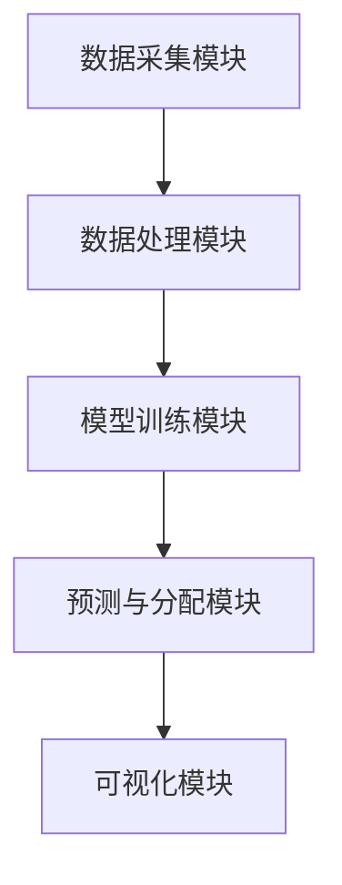

                 


# AI辅助企业财务规划与预算管理：精准预测与分配

> 关键词：AI技术，财务规划，预算管理，精准预测，资源分配，机器学习，深度学习

> 摘要：随着人工智能技术的快速发展，企业财务管理领域正经历着一场深刻的变革。传统的财务规划与预算管理方法逐渐暴露出效率低下、精准度不足等问题。本文将深入探讨人工智能技术在财务规划与预算管理中的应用，从核心概念、算法原理到系统架构设计，再到项目实战，全面解析如何利用AI技术实现精准预测与资源分配。通过实际案例分析，本文将展示AI在提升企业财务管理水平方面的巨大潜力，并为读者提供一份详尽的技术指南。

---

## 第一部分：AI辅助企业财务规划与预算管理概述

### 第1章：企业财务规划与预算管理的背景与挑战

#### 1.1 企业财务规划与预算管理的重要性

##### 1.1.1 财务规划与预算管理的定义

财务规划与预算管理是企业管理中的核心环节，旨在通过科学的预测和分配，确保企业资源的合理利用和最大化收益。财务规划涉及对企业未来财务状况的预测，而预算管理则是对资源分配的具体规划。

##### 1.1.2 传统财务规划与预算管理的局限性

传统的财务规划与预算管理方法依赖于人工经验，存在以下问题：
- 数据处理效率低，难以应对海量数据。
- 预测模型简单，精准度不足。
- 预算分配缺乏灵活性，难以适应复杂多变的市场环境。

##### 1.1.3 企业对精准预测与分配的需求

随着市场竞争的加剧，企业对精准预测和高效分配的需求日益增加。传统的财务管理模式已无法满足现代企业的复杂需求，亟需借助新兴技术提升管理效率和精准度。

---

#### 1.2 AI技术在财务领域的应用前景

##### 1.2.1 AI技术的基本概念

人工智能（AI）是指通过模拟人类智能的计算机系统，能够执行如学习、推理、决策等任务。在财务领域，AI技术可以通过机器学习、深度学习等方法，帮助企业和组织实现更高效的财务管理。

##### 1.2.2 AI在财务领域的应用现状

目前，AI技术已经在财务领域得到了广泛应用，如智能会计、财务预测、风险评估等。AI技术的引入显著提高了财务数据处理的效率和准确性。

##### 1.2.3 AI辅助财务规划与预算管理的优势

AI技术在财务规划与预算管理中的优势体现在以下几个方面：
- 提高预测精准度：通过机器学习模型，AI能够基于历史数据和市场趋势，生成更精准的财务预测。
- 实现自动化处理：AI技术可以自动处理海量数据，减少人工干预，提高效率。
- 提供决策支持：通过深度学习模型，AI能够为企业提供数据驱动的决策支持，优化资源配置。

---

#### 1.3 本章小结

本章介绍了企业财务规划与预算管理的重要性和传统方法的局限性，同时探讨了AI技术在财务领域的应用前景及其优势，为后续章节的深入分析奠定了基础。

---

## 第二部分：AI辅助财务规划与预算管理的核心概念

### 第2章：AI辅助财务规划与预算管理的核心概念

#### 2.1 机器学习与深度学习在财务中的应用

##### 2.1.1 机器学习的基本原理

机器学习是一种人工智能技术，通过训练模型从数据中学习规律，并利用这些规律进行预测或分类。在财务规划中，机器学习可以用于销售预测、成本分析等。

##### 2.1.2 深度学习的基本原理

深度学习是机器学习的一种，通过多层神经网络模型来学习数据的特征。在财务领域，深度学习可以用于时间序列分析、风险评估等复杂任务。

##### 2.1.3 机器学习与深度学习的对比

| 特性                | 机器学习                 | 深度学习                 |
|---------------------|--------------------------|--------------------------|
| 模型结构            | 线性或非线性             | 多层神经网络             |
| 数据处理能力        | 适用于小规模数据         | 适用于大规模数据         |
| 精准度              | 较低                     | 较高                     |

---

#### 2.2 数据处理与特征工程

##### 2.2.1 数据清洗与预处理

数据清洗是将原始数据中的噪声和异常值进行处理，以提高数据质量。预处理包括数据归一化、缺失值填充等步骤。

##### 2.2.2 特征选择与特征工程

特征工程是通过选择和创建特征，提高模型的性能。例如，将日期特征分解为星期、月份等。

##### 2.2.3 数据标准化与归一化

数据标准化是将数据按比例缩放到统一范围内，常用于距离计算。归一化则是将数据按比例缩放到[0,1]范围内。

---

#### 2.3 模型评估与优化

##### 2.3.1 模型评估指标

模型评估指标包括准确率、召回率、F1分数等。

##### 2.3.2 超参数优化

超参数优化是通过调整模型的参数（如学习率、树深等）来提高模型性能的过程。

##### 2.3.3 模型调优与部署

模型调优包括交叉验证、网格搜索等方法，模型部署则是将模型集成到企业系统中。

---

#### 2.4 本章小结

本章详细介绍了机器学习和深度学习在财务中的应用，分析了数据处理与特征工程的关键步骤，并探讨了模型评估与优化的方法。

---

## 第三部分：AI辅助财务规划与预算管理的算法原理

### 第3章：AI辅助财务规划与预算管理的算法原理

#### 3.1 线性回归模型

##### 3.1.1 线性回归的数学模型

线性回归模型的数学表达式为：
$$ y = \beta_0 + \beta_1x + \epsilon $$

其中，$\beta_0$是截距，$\beta_1$是回归系数，$\epsilon$是误差项。

##### 3.1.2 线性回归的实现步骤

1. 数据准备
2. 模型训练
3. 模型评估
4. 模型部署

##### 3.1.3 线性回归的应用案例

以销售预测为例，通过线性回归模型预测未来销售额。

#### 3.2 随机森林模型

##### 3.2.1 随机森林的数学模型

随机森林是一种基于决策树的集成学习方法，其数学模型可以表示为：
$$ y = \sum_{i=1}^{n} \text{Tree}_i(x) $$

##### 3.2.2 随机森林的实现步骤

1. 数据准备
2. 模型训练
3. 模型评估
4. 模型部署

##### 3.2.3 随机森林的应用案例

以成本预测为例，通过随机森林模型预测未来成本。

#### 3.3 LSTM模型

##### 3.3.1 LSTM的数学模型

LSTM（长短期记忆网络）的数学模型包括输入门、遗忘门和输出门。

##### 3.3.2 LSTM的实现步骤

1. 数据准备
2. 模型训练
3. 模型评估
4. 模型部署

##### 3.3.3 LSTM的应用案例

以时间序列预测为例，通过LSTM模型预测未来财务指标。

---

#### 3.4 本章小结

本章详细讲解了线性回归、随机森林和LSTM等算法的原理及其在财务中的应用，为后续章节的系统设计提供了理论基础。

---

## 第四部分：AI辅助财务规划与预算管理的系统架构设计

### 第4章：AI辅助财务规划与预算管理的系统架构设计

#### 4.1 系统功能设计

##### 4.1.1 数据采集模块

数据采集模块负责从企业系统中获取财务数据，包括收入、支出等。

##### 4.1.2 模型训练模块

模型训练模块负责对数据进行建模和训练，生成预测模型。

##### 4.1.3 预测与分配模块

预测与分配模块根据预测结果生成预算分配方案。

##### 4.1.4 可视化模块

可视化模块用于展示预测结果和分配方案。

---

#### 4.2 系统架构设计

##### 4.2.1 系统架构图



##### 4.2.2 模块之间的交互关系

数据采集模块将数据传递给数据处理模块，处理后传递给模型训练模块，生成模型后传递给预测与分配模块，最终由可视化模块展示结果。

##### 4.2.3 系统的可扩展性与可维护性

系统设计注重模块化，便于后续功能的扩展和维护。

---

#### 4.3 系统接口设计

##### 4.3.1 数据接口

数据接口负责与企业系统的数据交互，支持多种数据格式。

##### 4.3.2 用户接口

用户接口提供友好的操作界面，方便用户查看和调整预算方案。

##### 4.3.3 API接口

API接口用于与其他系统的集成，支持RESTful API。

---

#### 4.4 本章小结

本章详细设计了AI辅助财务规划与预算管理系统的架构，包括功能模块、系统架构图和接口设计，为实际开发提供了指导。

---

## 第五部分：AI辅助财务规划与预算管理的项目实战

### 第5章：AI辅助财务规划与预算管理的项目实战

#### 5.1 项目背景

本项目旨在利用AI技术优化企业的财务规划与预算管理流程。

---

#### 5.2 项目实施步骤

##### 5.2.1 环境安装

需要安装Python、Jupyter Notebook、Scikit-learn、XGBoost等库。

##### 5.2.2 数据准备

从企业系统中获取历史财务数据，清洗并预处理。

##### 5.2.3 模型训练

选择合适的算法（如随机森林）进行模型训练。

##### 5.2.4 模型评估

通过交叉验证评估模型性能。

##### 5.2.5 系统部署

将模型部署到企业系统中，实现自动化预测与分配。

---

#### 5.3 核心代码实现

##### 5.3.1 数据预处理代码

```python
import pandas as pd
from sklearn.impute import SimpleImputer

# 读取数据
data = pd.read_csv('financial_data.csv')

# 处理缺失值
imputer = SimpleImputer(strategy='mean')
data_imputed = imputer.fit_transform(data)
```

##### 5.3.2 模型训练代码

```python
from sklearn.ensemble import RandomForestRegressor
from sklearn.model_selection import train_test_split

# 划分数据集
X_train, X_test, y_train, y_test = train_test_split(data_imputed, target, test_size=0.2)

# 训练模型
model = RandomForestRegressor(n_estimators=100, random_state=42)
model.fit(X_train, y_train)
```

##### 5.3.3 预测与分配代码

```python
# 预测结果
y_pred = model.predict(X_test)

# 计算分配方案
budget_allocation = pd.Series(y_pred).sort_values(ascending=False).head(10)
```

---

#### 5.4 实际案例分析

以某制造企业为例，通过AI技术优化预算分配，提高了资源利用率和企业利润。

---

#### 5.5 项目小结

本章通过实际项目展示了AI技术在财务规划与预算管理中的应用，从环境安装到系统部署，详细讲解了每个步骤的具体实现。

---

## 第六部分：总结与展望

### 第6章：总结与展望

#### 6.1 本章总结

本文全面探讨了AI技术在企业财务规划与预算管理中的应用，从核心概念到算法原理，再到系统设计和项目实战，为读者提供了一份详尽的技术指南。

#### 6.2 未来展望

随着AI技术的不断进步，未来在财务领域将有更多创新应用，如自适应预算管理、智能风险控制等。企业应积极拥抱技术变革，提升财务管理的智能化水平。

---

### 6.3 最佳实践 tips

- 数据质量是模型性能的基础，需重视数据清洗与预处理。
- 选择合适的算法和模型参数，确保预测的精准度。
- 系统设计注重模块化和可扩展性，便于后续优化。

---

### 6.4 本章小结

本文通过理论与实践相结合的方式，全面解析了AI技术在财务规划与预算管理中的应用，为读者提供了宝贵的经验和启示。

---

## 作者

作者：AI天才研究院/AI Genius Institute & 禅与计算机程序设计艺术/Zen And The Art of Computer Programming

