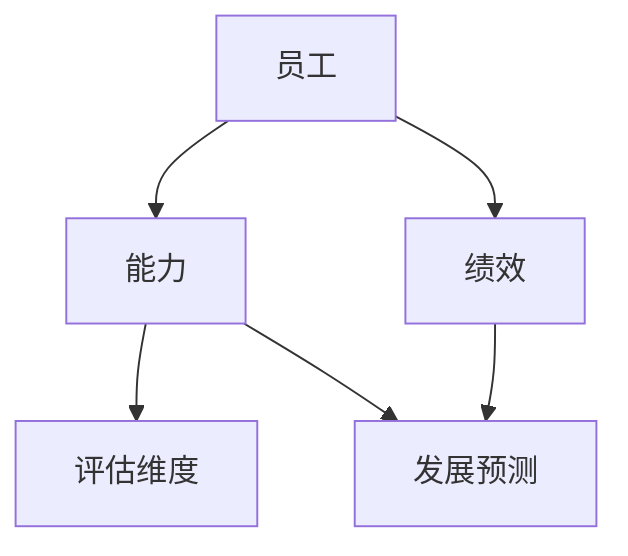
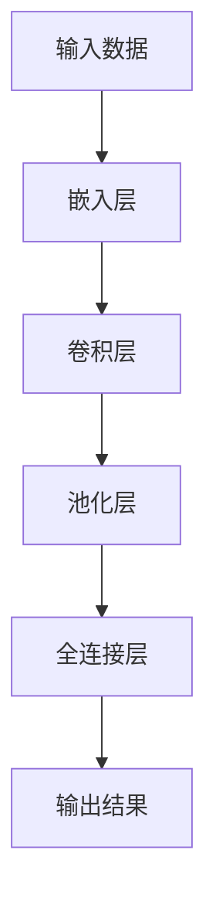
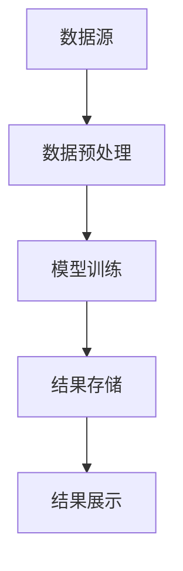
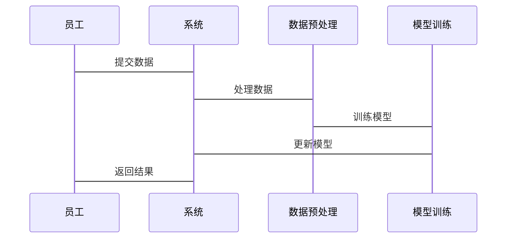

                 


# AI驱动的企业人才画像系统：多维度能力评估与发展预测

> 关键词：AI驱动，人才画像，能力评估，发展预测，多维度分析，机器学习，深度学习

> 摘要：随着企业对人才管理的需求日益增长，AI驱动的企业人才画像系统通过多维度能力评估与发展预测，为企业提供了智能化的人才管理解决方案。本文将从系统背景、核心原理、算法实现、系统架构、项目实战等多个维度详细阐述AI驱动的人才画像系统的构建过程，探讨其在企业中的应用价值与前景。

---

# 第一部分: 企业人才画像系统背景与问题背景

## 第1章: 企业人才画像系统背景与问题背景

### 1.1 企业人才画像的定义与核心概念

#### 1.1.1 什么是企业人才画像
企业人才画像是基于大数据和AI技术构建的，对员工的能力、潜力、行为特征等多维度进行分析和建模，形成的可视化人才模型。它能够帮助企业更精准地识别和管理人才。

#### 1.1.2 人才画像的核心要素
- **能力评估**：包括专业技能、通用能力、创新能力等。
- **行为特征**：工作习惯、团队协作能力、问题解决能力等。
- **发展潜力**：职业发展方向、学习能力、适应能力等。
- **绩效表现**：历史业绩、目标达成情况、贡献度等。

#### 1.1.3 人才画像的构建目标
- 提供数据驱动的决策支持。
- 优化人才招聘、培养和晋升策略。
- 提高组织效率和员工满意度。

### 1.2 问题背景与挑战

#### 1.2.1 传统人才评估的局限性
传统的人才评估方法主要依赖主观判断，存在以下问题：
- **主观性**：评估结果受评估者主观因素影响。
- **片面性**：难以全面覆盖员工的多维度能力。
- **滞后性**：评估结果往往基于过去的表现，难以预测未来。

#### 1.2.2 数据驱动的人才管理需求
随着企业数据化的推进，企业需要利用数据来优化人才管理：
- **数据化决策**：通过数据分析发现人才规律。
- **个性化管理**：基于数据为员工提供个性化的职业发展建议。
- **实时监控**：实时跟踪员工表现，及时调整管理策略。

#### 1.2.3 AI在人才管理中的应用潜力
AI技术在人才管理中的应用前景广阔：
- **自动化分析**：利用AI快速处理大量数据，生成人才画像。
- **精准预测**：通过机器学习模型预测员工的发展潜力。
- **智能匹配**：根据岗位需求智能匹配合适的人才。

### 1.3 问题解决与边界

#### 1.3.1 AI驱动人才画像的解决方案
通过AI技术，构建多维度能力评估模型和未来发展预测模型，为企业提供智能化的人才管理工具。

#### 1.3.2 系统的边界与外延
- **边界**：专注于人才画像的构建与分析，不涉及具体的人才管理系统集成。
- **外延**：人才画像的结果可以与其他系统（如CRM、HRMS）集成，用于招聘、培训、绩效管理等场景。

#### 1.3.3 核心要素与功能模块
- **数据采集**：收集员工的多维度数据。
- **模型构建**：构建能力评估和预测模型。
- **结果可视化**：将分析结果以可视化形式呈现。

### 1.4 本章小结
本章介绍了企业人才画像的定义、核心要素以及构建目标，分析了传统人才评估的局限性和数据驱动的人才管理需求，最后提出了AI驱动的人才画像解决方案及其边界和核心要素。

---

# 第二部分: 人才画像系统的核心概念与联系

## 第2章: 核心概念与原理

### 2.1 人才画像系统的核心原理

#### 2.1.1 数据驱动的画像构建
通过收集和分析员工的行为数据、绩效数据、能力测试数据等，构建数据驱动的人才画像。

#### 2.1.2 多维度能力评估模型
基于机器学习算法，构建多维度能力评估模型，包括：
- **专业技能评估**：通过技术测试和项目经验评估员工的专业能力。
- **通用能力评估**：通过行为面试和团队协作能力评估员工的通用能力。
- **创新能力评估**：通过创意任务和成果评估员工的创新能力。

#### 2.1.3 发展预测算法
通过时间序列分析、回归分析等算法，预测员工的未来发展潜力。

### 2.2 核心概念属性对比表

| **维度**       | **传统评估方法**           | **AI驱动评估方法**             |
|----------------|----------------------------|------------------------------|
| **评估对象**   | 个人表现                   | 个体与群体数据对比             |
| **评估维度**   | 单一维度                   | 多维度分析                     |
| **评估结果**   | 主观判断                   | 数据驱动的客观结果             |
| **评估频率**   | 定期评估                   | 实时更新                       |

### 2.3 ER实体关系图



### 2.4 本章小结
本章详细阐述了人才画像系统的核心原理，对比了传统评估方法与AI驱动评估方法的差异，并通过ER实体关系图展示了系统的数据关系。

---

# 第三部分: 人才画像系统的算法原理

## 第3章: 多维度能力评估算法

### 3.1 数据预处理与特征提取

#### 3.1.1 数据清洗与标准化
- **数据清洗**：去除无效数据、填充缺失值。
- **数据标准化**：将数据归一化，便于模型训练。

#### 3.1.2 特征选择与降维
- **特征选择**：通过相关性分析选择重要特征。
- **降维处理**：使用主成分分析（PCA）降低数据维度。

#### 3.1.3 文本数据的特征提取
- 使用自然语言处理（NLP）技术提取文本数据的特征，如TF-IDF、Word2Vec等。

### 3.2 深度学习模型构建

#### 3.2.1 模型结构


#### 3.2.2 模型训练
- 使用深度学习框架（如TensorFlow、PyTorch）训练模型。
- 通过反向传播和优化器（如Adam）更新模型参数。

#### 3.2.3 模型评估
- 使用准确率、召回率、F1分数等指标评估模型性能。

### 3.3 算法实现代码

```python
import torch
import torch.nn as nn
import torch.optim as optim

class TalentClassifier(nn.Module):
    def __init__(self, input_size, hidden_size, output_size):
        super(TalentClassifier, self).__init__()
        self.fc1 = nn.Linear(input_size, hidden_size)
        self.fc2 = nn.Linear(hidden_size, output_size)
        self.relu = nn.ReLU()
        self.softmax = nn.Softmax(dim=1)

    def forward(self, x):
        x = self.fc1(x)
        x = self.relu(x)
        x = self.fc2(x)
        x = self.softmax(x)
        return x

# 模型训练
model = TalentClassifier(input_size=10, hidden_size=20, output_size=3)
criterion = nn.CrossEntropyLoss()
optimizer = optim.Adam(model.parameters(), lr=0.001)

for epoch in range(100):
    inputs = torch.randn(8, 10)
    labels = torch.tensor([1, 2, 0, 0, 1, 2, 1, 0])
    
    outputs = model(inputs)
    loss = criterion(outputs, labels)
    optimizer.zero_grad()
    loss.backward()
    optimizer.step()
```

### 3.4 本章小结
本章详细讲解了多维度能力评估算法的实现过程，包括数据预处理、特征提取、深度学习模型构建与训练等内容。

---

# 第四部分: 系统分析与架构设计方案

## 第4章: 系统分析与架构设计

### 4.1 问题场景介绍

#### 4.1.1 项目背景
假设某企业希望利用AI技术构建人才画像系统，以提升人才招聘、培养和晋升的效率。

### 4.2 系统功能设计

#### 4.2.1 领域模型
```mermaid
classDiagram
    class 员工 {
        姓名
        岗位
        绩效
        能力评估
        发展预测
    }
    class 系统 {
        数据采集
        模型构建
        结果输出
    }
    employee -> 系统: 提交数据
    系统 -> 员工: 返回结果
```

#### 4.2.2 系统架构


### 4.3 系统接口设计

#### 4.3.1 API接口
- **输入接口**：接受员工数据，包括绩效、能力测试结果等。
- **输出接口**：返回员工能力评估结果和未来发展预测。

#### 4.3.2 数据格式
- 输入数据格式：JSON
- 输出数据格式：JSON或可视化图表。

### 4.4 系统交互流程

#### 4.4.1 交互流程图


### 4.5 本章小结
本章详细描述了人才画像系统的功能设计、系统架构和接口设计，为后续的系统实现提供了理论基础。

---

# 第五部分: 项目实战

## 第5章: 项目实战

### 5.1 环境安装

#### 5.1.1 安装Python
- 安装Python 3.8及以上版本。

#### 5.1.2 安装依赖库
```bash
pip install numpy pandas scikit-learn tensorflow matplotlib
```

### 5.2 系统核心实现源代码

#### 5.2.1 数据预处理
```python
import pandas as pd
import numpy as np

def preprocess_data(data):
    # 去除缺失值
    data = data.dropna()
    # 标准化处理
    from sklearn.preprocessing import StandardScaler
    scaler = StandardScaler()
    scaled_data = scaler.fit_transform(data)
    return scaled_data
```

#### 5.2.2 模型实现
```python
from sklearn.ensemble import RandomForestClassifier
from sklearn.metrics import accuracy_score

def train_model(X_train, y_train):
    model = RandomForestClassifier(n_estimators=100, random_state=42)
    model.fit(X_train, y_train)
    return model

# 示例数据
X_train = np.random.rand(100, 10)
y_train = np.random.randint(0, 3, 100)

model = train_model(X_train, y_train)
print("模型训练完成！")
```

#### 5.2.3 案例分析
```python
# 预测示例
X_test = np.random.rand(1, 10)
y_pred = model.predict(X_test)
print("预测结果:", y_pred)
```

### 5.3 项目总结

#### 5.3.1 项目成果
- 成功构建了多维度能力评估模型。
- 实现了AI驱动的人才画像系统。

#### 5.3.2 经验与教训
- 数据质量对模型性能影响重大。
- 模型调参和优化是关键。

### 5.4 本章小结
本章通过实际案例展示了AI驱动的人才画像系统的实现过程，包括环境安装、代码实现和案例分析。

---

# 第六部分: 最佳实践与扩展阅读

## 第6章: 最佳实践与扩展阅读

### 6.1 最佳实践Tips

#### 6.1.1 数据收集
- 确保数据的全面性和多样性。
- 处理数据偏差，避免模型过拟合。

#### 6.1.2 模型优化
- 使用交叉验证优化模型。
- 调整超参数提高模型性能。

#### 6.1.3 系统集成
- 将人才画像系统与企业现有系统集成，提升管理效率。

### 6.2 小结

#### 6.2.1 核心要点回顾
- 人才画像系统的核心是多维度能力评估和未来发展预测。
- AI技术的应用大大提升了人才管理的效率和精准度。

#### 6.2.2 未来展望
- 结合更多数据源，提升模型的预测精度。
- 开发更智能化的人才管理工具，推动企业数字化转型。

### 6.3 注意事项

#### 6.3.1 数据隐私保护
- 确保员工数据的安全和隐私。

#### 6.3.2 模型解释性
- 提供可解释的模型结果，方便企业理解和应用。

### 6.4 扩展阅读

#### 6.4.1 推荐书籍
- 《机器学习实战》
- 《深度学习入门：基于Python和Keras》

#### 6.4.2 推荐博客
- https://towardsdatascience.com/
- https://medium.com/ai-in-action

### 6.5 本章小结
本章总结了人才画像系统的最佳实践，提出了未来的发展方向和注意事项，并推荐了相关的扩展阅读资料。

---

# 作者：AI天才研究院 & 禅与计算机程序设计艺术

---

以上是完整的文章目录和内容框架，希望对您有所帮助！

