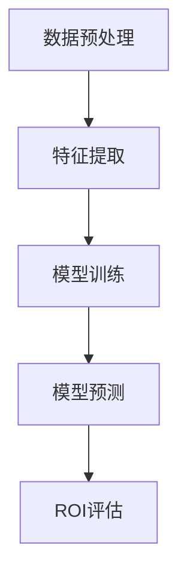
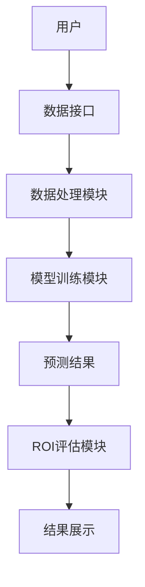
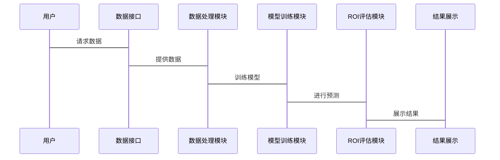

                 


# AI驱动的企业创新ROI评估：量化创新投资回报

> 关键词：人工智能，创新评估，投资回报率，量化分析，企业创新

> 摘要：本文详细探讨了AI驱动的企业创新ROI评估方法，通过系统分析和量化模型，为企业创新投资回报的评估提供了一种新的视角和解决方案。文章从背景介绍、核心概念、算法原理、系统架构设计、项目实战到最佳实践，全面解析了AI在创新ROI评估中的应用，帮助企业更好地量化创新投资的回报，优化资源配置，提升创新效率。

---

## 第一部分：AI驱动的企业创新ROI评估背景与基础

### 第1章：AI驱动的企业创新ROI评估概述

#### 1.1 问题背景与重要性

##### 1.1.1 传统企业创新评估的局限性
传统的企业创新评估方法通常依赖于主观判断和定性分析，难以量化创新的实际价值和投资回报。这种方式不仅效率低下，还可能导致评估结果的不准确。

##### 1.1.2 AI驱动创新评估的必要性
随着人工智能技术的快速发展，AI在数据分析、模式识别和预测建模方面的优势为企业创新评估提供了新的可能性。通过AI技术，企业可以更精准地量化创新项目的 ROI（投资回报率）。

##### 1.1.3 ROI评估的核心价值
ROI评估是企业创新决策的重要依据。通过量化创新项目的 ROI，企业可以优化资源配置，选择最有潜力的创新项目，提升整体创新效率。

#### 1.2 问题描述与目标

##### 1.2.1 企业创新投资回报的定义
创新 ROI = （创新项目带来的净收益） / （创新项目的投资成本） × 100%

##### 1.2.2 AI在创新评估中的应用场景
- 数据驱动的创新预测
- ROI的量化分析
- 创新项目的风险评估

##### 1.2.3 量化评估的目标与意义
目标：通过AI技术，建立一个可量化、可预测的创新 ROI 评估模型。

意义：帮助企业更科学地评估创新项目的价值，优化创新资源配置，提升创新效率。

#### 1.3 解决方案与边界

##### 1.3.1 AI驱动创新评估的主要方法
- 数据驱动的 ROI 预测模型
- 基于机器学习的创新项目筛选
- 创新项目的风险评估与优化

##### 1.3.2 评估模型的边界与外延
- 数据范围：仅限于可量化的创新项目数据
- 适用场景：适用于数据驱动的创新项目评估

##### 1.3.3 核心要素与组成结构
- 数据采集与处理
- 模型训练与优化
- ROI 预测与分析

---

### 第2章：核心概念与联系

#### 2.1 核心概念原理

##### 2.1.1 AI驱动的创新评估模型
创新 ROI 评估模型通过机器学习算法，利用历史数据预测创新项目的 ROI。

##### 2.1.2 ROI计算的关键因素
- 投资成本
- 净收益
- 预测准确性

##### 2.1.3 数据驱动的评估方法
通过数据分析提取创新项目的特征，构建 ROI 预测模型。

#### 2.2 概念对比与ER图

##### 2.2.1 创新评估方法的对比分析
| 方法类型 | 描述 | 优点 | 缺点 |
|----------|------|------|------|
| 传统定性评估 | 主观判断 | 易操作 | 不准确 |
| 数据驱动评估 | 客观量化 | 准确性高 | 数据依赖性强 |

##### 2.2.2 实体关系图（ER图）
```mermaid
erd
  entity 创新项目 {
    id
    名称
    投资成本
    预测 ROI
  }
  entity 数据源 {
    id
    数据类型
    时间戳
  }
  创新项目 --> 数据源：使用数据源进行预测
```

---

## 第3章：算法原理讲解

### 3.1 算法原理概述

#### 3.1.1 机器学习模型在ROI评估中的应用
- 使用回归算法预测 ROI
- 使用分类算法评估项目风险

#### 3.1.2 算法选择与优化策略
- 线性回归：简单易用，适合线性关系
- 随机森林：适合非线性关系，抗噪声能力强

#### 3.1.3 算法流程图（Mermaid）


### 3.2 算法实现与代码

#### 3.2.1 Python实现的创新评估模型
```python
import pandas as pd
from sklearn.model_selection import train_test_split
from sklearn.linear_model import LinearRegression
from sklearn.metrics import mean_squared_error

# 数据加载与预处理
data = pd.read_csv('innovation_projects.csv')
X = data[['投资成本', '净收益']]
y = data['ROI']

# 数据分割
X_train, X_test, y_train, y_test = train_test_split(X, y, test_size=0.2, random_state=42)

# 模型训练
model = LinearRegression()
model.fit(X_train, y_train)

# 模型预测
y_pred = model.predict(X_test)

# 模型评估
mse = mean_squared_error(y_test, y_pred)
print(f"均方误差：{mse}")
```

#### 3.2.2 代码解读与功能分析
- 数据预处理：加载数据并提取特征
- 模型训练：使用线性回归算法训练模型
- 模型预测：对测试数据进行 ROI 预测
- 模型评估：计算均方误差，评估模型性能

#### 3.2.3 算法优化与调参技巧
- 调整模型参数（如正则化系数）
- 使用交叉验证优化模型

### 3.3 数学模型与公式

#### 3.3.1 ROI计算公式
$$ ROI = \frac{净收益}{投资成本} \times 100\% $$

#### 3.3.2 创新投资回报的数学模型
$$ ROI_{\text{预测}} = \beta_0 + \beta_1 \times \text{投资成本} + \beta_2 \times \text{净收益} + \epsilon $$

---

## 第4章：系统分析与架构设计

### 4.1 系统架构设计

#### 4.1.1 项目介绍
构建一个基于AI的创新 ROI 评估系统，帮助企业量化创新项目的投资回报。

#### 4.1.2 系统功能设计（领域模型类图）
```mermaid
classDiagram
    class 创新项目 {
        id
        名称
        投资成本
        ROI预测值
    }
    class 数据源 {
        id
        数据类型
        时间戳
    }
    创新项目 --> 数据源：使用数据源进行预测
```

#### 4.1.3 系统架构设计（架构图）


#### 4.1.4 系统接口设计
- 数据接口：数据输入与输出
- 模型接口：模型训练与预测

#### 4.1.5 系统交互流程图（序列图）


---

## 第5章：项目实战

### 5.1 环境安装与配置

#### 5.1.1 安装Python环境
- 使用Anaconda或虚拟环境

#### 5.1.2 安装依赖库
```bash
pip install pandas scikit-learn
```

### 5.2 核心代码实现

#### 5.2.1 数据预处理
```python
import pandas as pd

data = pd.read_csv('innovation_projects.csv')
data = data.dropna()
```

#### 5.2.2 特征工程
```python
from sklearn.preprocessing import StandardScaler

scaler = StandardScaler()
X_scaled = scaler.fit_transform(X)
```

#### 5.2.3 模型训练
```python
from sklearn.linear_model import LinearRegression
from sklearn.model_selection import train_test_split

X_train, X_test, y_train, y_test = train_test_split(X_scaled, y, test_size=0.2, random_state=42)
model = LinearRegression()
model.fit(X_train, y_train)
```

#### 5.2.4 模型预测与评估
```python
y_pred = model.predict(X_test)
mse = mean_squared_error(y_test, y_pred)
print(f"均方误差：{mse}")
```

### 5.3 实际案例分析与解读

#### 5.3.1 案例背景
某企业计划投资开发一个新项目，希望通过AI模型预测 ROI。

#### 5.3.2 数据准备
加载项目数据，提取投资成本和净收益作为特征。

#### 5.3.3 模型预测
使用训练好的模型预测 ROI，评估投资价值。

#### 5.3.4 结果分析
根据预测结果，评估项目是否值得投资。

### 5.4 项目小结

#### 5.4.1 成功经验总结
- 数据准备充分
- 模型选择合理
- 评估结果准确

#### 5.4.2 遇到的挑战与解决方案
- 数据不足：通过数据增强技术解决
- 模型精度低：通过调参优化模型性能

---

## 第6章：最佳实践、小结、注意事项与拓展阅读

### 6.1 最佳实践

#### 6.1.1 数据准备
- 确保数据的完整性和准确性
- 进行数据清洗和特征工程

#### 6.1.2 模型选择
- 根据数据特点选择合适的算法
- 多算法对比，选择性能最佳的模型

#### 6.1.3 模型部署
- 将模型部署到生产环境
- 定期更新模型，保持预测精度

### 6.2 小结

通过本文的系统分析和实战案例，我们展示了如何利用AI技术量化企业创新项目的 ROI。通过数据驱动的方法，企业可以更科学地评估创新项目的价值，优化资源配置，提升创新效率。

### 6.3 注意事项

- 数据隐私与安全问题
- 模型的可解释性
- 模型的实时更新与维护

### 6.4 拓展阅读

- 《机器学习实战》
- 《深度学习》
- 《数据分析与挖掘实用技术》

---

作者：AI天才研究院/AI Genius Institute & 禅与计算机程序设计艺术 /Zen And The Art of Computer Programming

