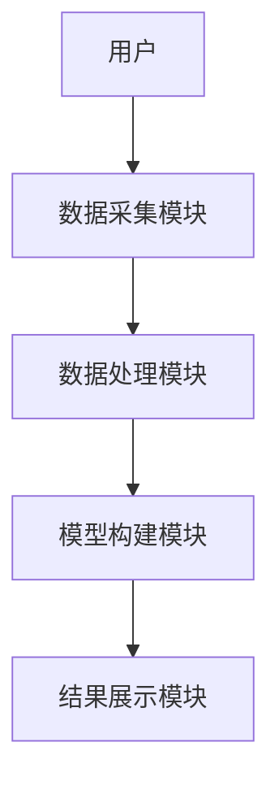
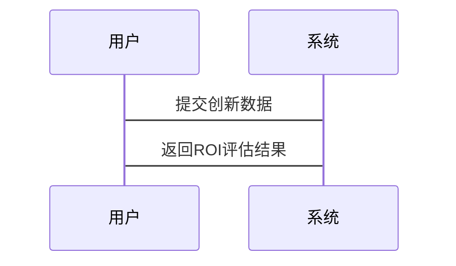

                 


# AI驱动的企业创新ROI评估：量化创新投资回报的多维度模型

**关键词**：企业创新、AI驱动、ROI评估、投资回报、多维度模型、量化分析

**摘要**：  
随着人工智能技术的快速发展，企业创新的评估方式正在经历一场深刻变革。传统的ROI（投资回报率）评估方法依赖于经验和主观判断，难以量化创新投资的多维度影响。本文提出了一种基于AI的多维度模型，通过整合财务、市场、技术等多个维度的数据，帮助企业更准确地评估创新投资的回报。文章详细介绍了模型的构建过程，包括数据预处理、特征提取、模型训练与优化，以及实际案例分析，展示了AI技术在ROI评估中的巨大潜力。

---

# 第一部分: 企业创新与ROI评估的背景

## 第1章: 企业创新的现状与挑战

### 1.1 企业创新的定义与重要性  
企业创新是指企业在产品、服务、技术、商业模式等方面的变革与优化。它是企业保持竞争优势的核心驱动力。在数字化时代，创新的速度和质量对企业生存至关重要。然而，创新投入的回报往往难以量化，传统评估方法难以满足现代企业的需求。

### 1.2 ROI评估的核心问题  
ROI（Return on Investment）是衡量创新投资回报的关键指标。传统ROI评估主要依赖财务数据，难以涵盖创新活动的复杂性。例如，研发投入的周期长、风险高，且其影响可能体现在市场占有率、品牌价值等多个方面。

### 1.3 AI驱动ROI评估的必要性  
AI技术的引入为ROI评估提供了新的可能性。通过分析海量数据，AI可以识别创新活动的潜在影响，构建多维度的评估模型，从而帮助企业做出更科学的投资决策。

---

# 第二部分: 多维度ROI评估模型

## 第2章: 多维度模型的构建原理  

### 2.1 模型的核心要素  
多维度模型包括以下关键要素：  
1. **财务指标**：如研发投入、收入增长、净收益等。  
2. **市场因素**：如市场份额、品牌价值、客户满意度等。  
3. **技术参数**：如专利数量、技术先进性、研发团队效率等。  
4. **时间维度**：创新活动的周期性与阶段性。  

### 2.2 多维度模型的属性特征对比表  
| 维度 | 属性 | 描述 |  
|------|------|------|  
| 财务 | 投入 | 研发成本、人力成本 |  
|      | 回报 | 收入增长、利润提升 |  
| 市场 | 占据率 | 市场份额变化 |  
|      | 竞争力 | 产品差异化程度 |  
| 技术 | 创新性 | 技术领先性 |  
|      | 可行性 | 技术实现难度 |  

### 2.3 ER实体关系图（Mermaid流程图）  
```mermaid
erDiagram
    user创新活动} o- 1创新项目}  
    创新项目} o- 1创新团队}  
    创新团队} o- 1创新成果}  
    创新成果} o- 1创新指标}  
    创新指标} o- 1 ROI评估结果}
```

---

## 第3章: AI驱动的模型构建  

### 3.1 数据预处理与特征提取  
1. 数据清洗：去除无效数据，处理缺失值。  
2. 特征提取：从财务、市场、技术等数据中提取关键特征，如研发投入占总收入比例、市场份额增长率等。  

### 3.2 模型训练与优化  
1. 选择合适的算法：如线性回归、随机森林、神经网络等。  
2. 数据分割：将数据分为训练集、验证集和测试集。  
3. 模型训练：使用训练数据优化模型参数。  
4. 模型评估：通过验证集和测试集评估模型的准确性和稳定性。  

### 3.3 模型评估与验证  
1. 指标选择：如准确率、召回率、F1分数等。  
2. 模型调优：通过超参数优化提升模型性能。  

### 3.4 数学公式  
1. 损失函数：  
   $$ L = \frac{1}{n}\sum_{i=1}^{n}(y_i - \hat{y_i})^2 $$  
   其中，$y_i$ 是真实值，$\hat{y_i}$ 是预测值。  

2. 优化算法：  
   使用梯度下降优化：  
   $$ \theta = \theta - \alpha \frac{\partial L}{\partial \theta} $$  
   其中，$\alpha$ 是学习率。  

---

# 第三部分: 系统架构与实现  

## 第4章: 系统架构设计  

### 4.1 系统功能模块  
1. 数据采集模块：从企业内部系统获取创新相关数据。  
2. 数据处理模块：清洗、转换和特征提取。  
3. 模型构建模块：训练和优化评估模型。  
4. 结果展示模块：可视化ROI评估结果。  

### 4.2 系统架构图（Mermaid流程图）  


### 4.3 系统接口设计  
1. API接口：提供数据输入和结果输出的标准接口。  
2. 数据格式：如JSON格式的输入数据。  

### 4.4 系统交互流程图（Mermaid序列图）  


---

# 第四部分: 项目实战与应用  

## 第5章: 项目实战  

### 5.1 实验环境安装  
1. 安装Python、TensorFlow、Pandas等工具。  
2. 数据集获取：从公开数据集或企业内部数据中获取创新相关数据。  

### 5.2 核心代码实现  

```python
import pandas as pd
import numpy as np
from sklearn.model import LinearRegression
from sklearn.metrics import mean_squared_error

# 数据加载
data = pd.read_csv('创新数据.csv')

# 数据预处理
X = data.drop('ROI', axis=1)
y = data['ROI']

# 划分训练集和测试集
X_train, X_test, y_train, y_test = train_test_split(X, y, test_size=0.2, random_state=42)

# 模型训练
model = LinearRegression()
model.fit(X_train, y_train)

# 模型预测
y_pred = model.predict(X_test)

# 模型评估
mse = mean_squared_error(y_test, y_pred)
print(f"均方误差：{mse}")
```

### 5.3 实际案例分析  
以某科技公司为例，分析其研发投入与实际ROI的关系，验证模型的有效性。  

### 5.4 项目总结与优化  
通过实验，验证模型的准确性和稳定性，并提出优化建议，如引入更复杂的算法或增加更多维度的数据。  

---

# 第五部分: 总结与展望  

## 第6章: 总结与最佳实践  

### 6.1 总结  
本文提出了一种基于AI的多维度ROI评估模型，为企业创新投资评估提供了新的思路。通过数据驱动的方法，模型能够更准确地量化创新活动的回报。  

### 6.2 最佳实践  
1. 数据质量是关键：确保数据的完整性和准确性。  
2. 模型选择要灵活：根据实际需求选择合适的算法。  
3. 结果可视化：通过图表直观展示评估结果，便于决策者理解。  

### 6.3 展望  
未来，随着AI技术的不断发展，ROI评估将更加智能化和精细化。企业可以利用AI技术实时监控创新活动的进展，动态调整投资策略，进一步提升创新效率。

---

**作者：AI天才研究院/AI Genius Institute & 禅与计算机程序设计艺术/Zen And The Art of Computer Programming**

