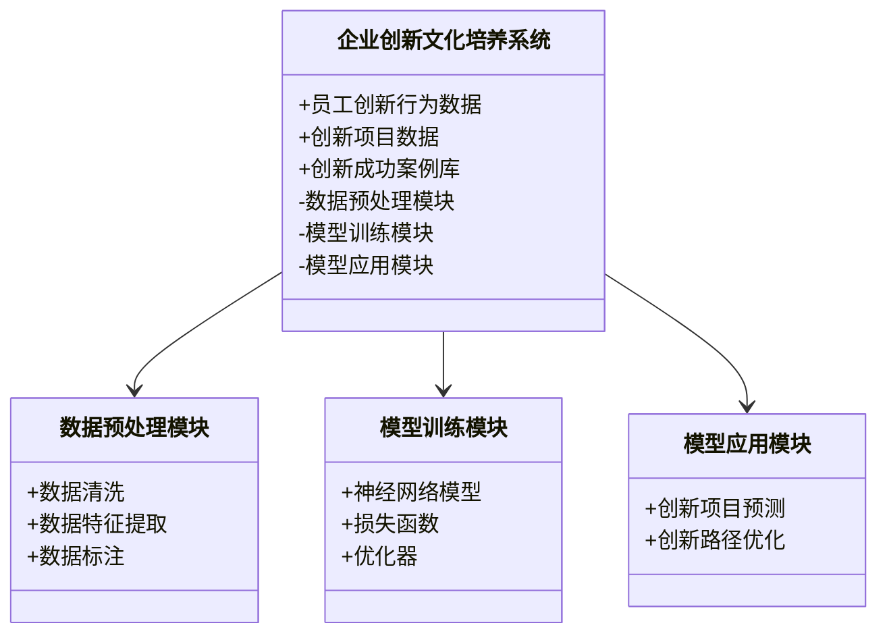
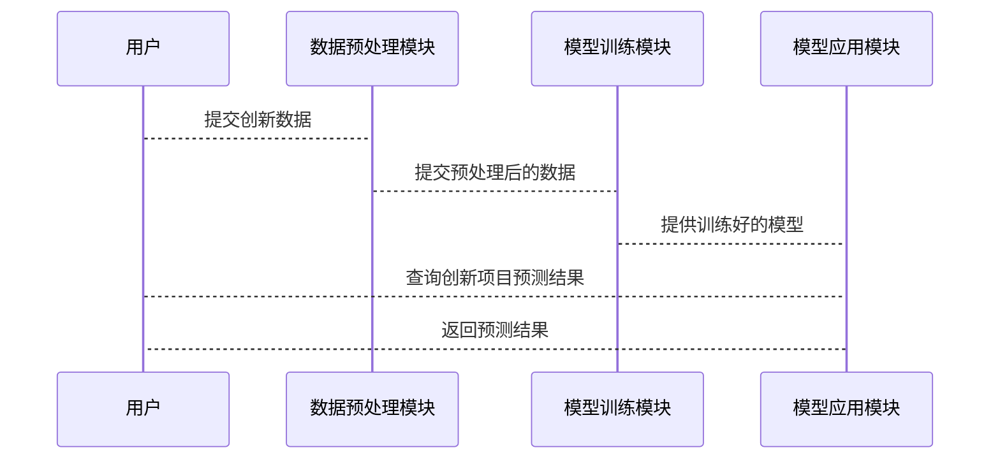

                 


# AI驱动的企业创新文化培养与管理

> 关键词：AI，企业创新，文化管理，创新文化，人工智能，企业文化

> 摘要：本文系统地探讨了AI技术如何驱动企业创新文化的发展与管理。通过分析AI技术的核心原理、创新文化培养的算法实现，以及企业创新文化的系统架构设计，本文为读者提供了从理论到实践的全面指导。文章最后通过一个具体的案例分析，展示了AI驱动的企业创新文化培养与管理的实际应用效果。

---

# 第1章: AI驱动的企业创新文化概述

## 1.1 企业创新文化的核心概念

### 1.1.1 什么是企业创新文化
企业创新文化是指企业在经营过程中，通过鼓励创新思维、激发员工创造力、优化管理模式等方式，形成的一种以创新为核心驱动力的企业文化。创新文化不仅包括技术创新，还包括管理创新、产品创新、服务创新等多个方面。

### 1.1.2 创新文化的核心要素
创新文化的核心要素包括：
1. **创新意识**：企业员工对创新的敏感性和主动性。
2. **创新机制**：企业内部的创新激励机制、资源分配机制等。
3. **创新氛围**：企业内部支持创新的文化氛围，包括开放的沟通、包容失败的态度等。

### 1.1.3 企业创新文化的边界与外延
企业创新文化的边界在于企业的核心业务范围和管理模式。其外延则包括企业外部的合作伙伴、客户群体等，创新文化不仅影响企业内部管理，还会影响企业的外部关系。

---

## 1.2 AI与企业创新文化的关系

### 1.2.1 AI如何驱动企业创新
AI技术通过自动化数据处理、智能化决策支持等方式，为企业的创新提供了新的工具和方法。例如，AI可以通过数据分析帮助企业发现新的市场机会，或者通过自动化流程优化企业的创新效率。

### 1.2.2 AI对企业管理模式的影响
AI技术的应用使得企业管理模式从传统的“人治”向“数治”转变。AI可以通过数据驱动的方式优化企业的组织结构、流程管理和资源配置。

### 1.2.3 AI驱动创新文化的特点与优势
AI驱动的创新文化具有数据驱动、智能化、个性化等特点。AI技术可以帮助企业更好地捕捉创新机会，降低创新成本，提高创新效率。

---

## 1.3 本章小结
本章通过对企业创新文化的核心概念和AI技术的影响进行分析，明确了AI在企业创新文化培养与管理中的重要作用。接下来的章节将从算法原理、系统设计等方面进一步探讨AI驱动企业创新文化的具体实现方法。

---

# 第2章: AI驱动企业创新文化培养的算法原理

## 2.1 数据预处理

### 2.1.1 数据清洗与标准化
在AI驱动的企业创新文化培养中，首先需要对企业的历史数据进行清洗和标准化处理。例如，将企业的历史创新案例、员工绩效数据等进行清洗和标准化，以便后续的模型训练。

### 2.1.2 数据特征提取
通过数据特征提取，可以从企业的历史数据中提取出与创新相关的特征，例如员工创新行为的频率、创新项目的成功概率等。

### 2.1.3 数据标注与分类
数据标注是将企业的历史创新案例进行分类，例如将创新成功的案例标记为“成功”，创新失败的案例标记为“失败”。这有助于模型学习创新成功的特征。

---

## 2.2 模型训练

### 2.2.1 神经网络模型构建
在模型训练阶段，可以使用深度学习模型（如LSTM、Transformer等）对企业的创新数据进行建模。例如，可以使用LSTM模型对企业的创新项目序列进行建模，预测未来创新项目的成功率。

### 2.2.2 损失函数与优化器
模型的损失函数可以采用交叉熵损失函数，优化器可以采用Adam优化器。以下是交叉熵损失函数的数学表达式：

$$
L = -\frac{1}{N}\sum_{i=1}^{N} y_i \log(p_i) + (1 - y_i)\log(1 - p_i)
$$

其中，\( y_i \) 是真实标签，\( p_i \) 是模型预测的概率。

### 2.2.3 模型训练与评估
模型训练完成后，需要通过测试数据对模型进行评估。评估指标可以包括准确率、召回率、F1分数等。例如，使用混淆矩阵对模型的分类性能进行评估。

---

## 2.3 模型应用

### 2.3.1 创新项目预测
通过训练好的模型，可以对企业的未来创新项目进行预测，例如预测某个创新项目的成功率。

### 2.3.2 创新路径优化
模型还可以帮助企业优化创新路径，例如通过推荐系统为企业推荐最优的创新方向或合作伙伴。

---

## 2.4 本章小结
本章从算法原理的角度，详细介绍了AI驱动企业创新文化培养的过程，包括数据预处理、模型训练和模型应用。接下来的章节将从系统设计的角度，进一步探讨AI驱动企业创新文化培养的实现方法。

---

# 第3章: AI驱动企业创新文化的系统架构设计

## 3.1 问题场景介绍
企业创新文化培养的系统设计需要解决以下问题：
1. 如何利用AI技术优化企业的创新流程？
2. 如何通过数据驱动的方式提高企业的创新效率？
3. 如何设计一个支持AI驱动的创新文化培养的系统架构？

---

## 3.2 系统功能设计

### 3.2.1 领域模型设计
以下是企业创新文化培养的领域模型：



### 3.2.2 系统架构设计
以下是系统的整体架构设计：


---

## 3.3 系统接口设计

### 3.3.1 数据接口
- 数据输入接口：接收企业的创新数据（如员工创新行为数据、创新项目数据等）。
- 数据输出接口：输出模型训练的结果（如预测的创新项目成功率等）。

### 3.3.2 交互接口
- 用户界面：供企业管理员输入数据和查看模型预测结果。
- API接口：供其他系统调用模型预测结果。

---

## 3.4 系统交互流程

### 3.4.1 系统交互序列图
以下是系统的交互序列图：



---

## 3.5 本章小结
本章从系统设计的角度，详细介绍了AI驱动企业创新文化培养的系统架构设计，包括领域模型、系统架构、接口设计和交互流程。接下来的章节将通过一个具体的案例，展示AI驱动企业创新文化培养的实际应用。

---

# 第4章: AI驱动企业创新文化培养的项目实战

## 4.1 环境安装与配置

### 4.1.1 安装Python环境
建议使用Anaconda环境，安装步骤如下：
```bash
conda create -n aichuginnovation python=3.8
conda activate aichuginnovation
pip install numpy pandas scikit-learn tensorflow
```

### 4.1.2 安装其他依赖库
安装Mermaid和Plotly等可视化库：
```bash
pip install graphviz
pip install plotly
```

---

## 4.2 核心代码实现

### 4.2.1 数据预处理代码
```python
import pandas as pd
from sklearn.preprocessing import StandardScaler

# 数据加载
data = pd.read_csv('innovation_data.csv')

# 数据清洗
data.dropna(inplace=True)
data = data[~data.duplicated()]

# 特征提取
features = data[['员工创新行为', '创新项目数', '创新成功率']]
labels = data['创新文化指数']

# 数据标准化
scaler = StandardScaler()
features_scaled = scaler.fit_transform(features)
```

### 4.2.2 模型训练代码
```python
import tensorflow as tf
from tensorflow.keras import layers

# 模型构建
model = tf.keras.Sequential([
    layers.Dense(64, activation='relu'),
    layers.Dense(1, activation='sigmoid')
])

# 模型编译
model.compile(optimizer='adam', loss='binary_crossentropy', metrics=['accuracy'])

# 模型训练
model.fit(features_scaled, labels, epochs=100, batch_size=32)
```

---

## 4.3 案例分析与结果解读

### 4.3.1 案例背景
假设某企业希望通过AI技术优化其创新文化培养。企业提供了过去5年的创新数据，包括员工创新行为、创新项目数、创新成功率等。

### 4.3.2 模型训练与结果
通过上述代码训练模型后，可以得到一个预测创新文化指数的模型。例如，模型预测某创新项目的创新文化指数为0.8，说明该项目具有较高的创新潜力。

### 4.3.3 案例小结
通过AI技术的应用，企业可以更高效地识别创新机会，优化创新流程，从而提升企业的创新文化水平。

---

## 4.4 本章小结
本章通过一个具体的案例，展示了AI驱动企业创新文化培养的实际应用。通过环境安装、代码实现和案例分析，读者可以更好地理解AI在企业创新文化培养中的具体作用。

---

# 第5章: 结论与展望

## 5.1 结论
本文系统地探讨了AI技术在企业创新文化培养与管理中的应用。通过算法原理、系统设计和项目实战的分析，本文为读者提供了从理论到实践的全面指导。

## 5.2 展望
未来，随着AI技术的不断发展，企业创新文化培养将更加智能化、个性化。例如，AI可以通过实时数据分析为企业提供动态的创新管理建议，或者通过自然语言处理技术帮助企业更好地理解和管理创新文化。

---

# 作者信息

作者：AI天才研究院（AI Genius Institute） & 禅与计算机程序设计艺术（Zen And The Art of Computer Programming）

---

以上是《AI驱动的企业创新文化培养与管理》的技术博客文章的完整目录大纲和核心内容。

