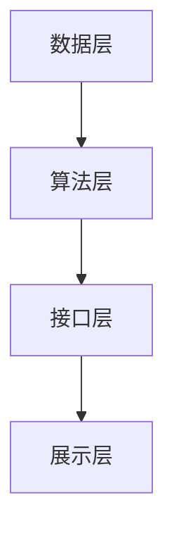
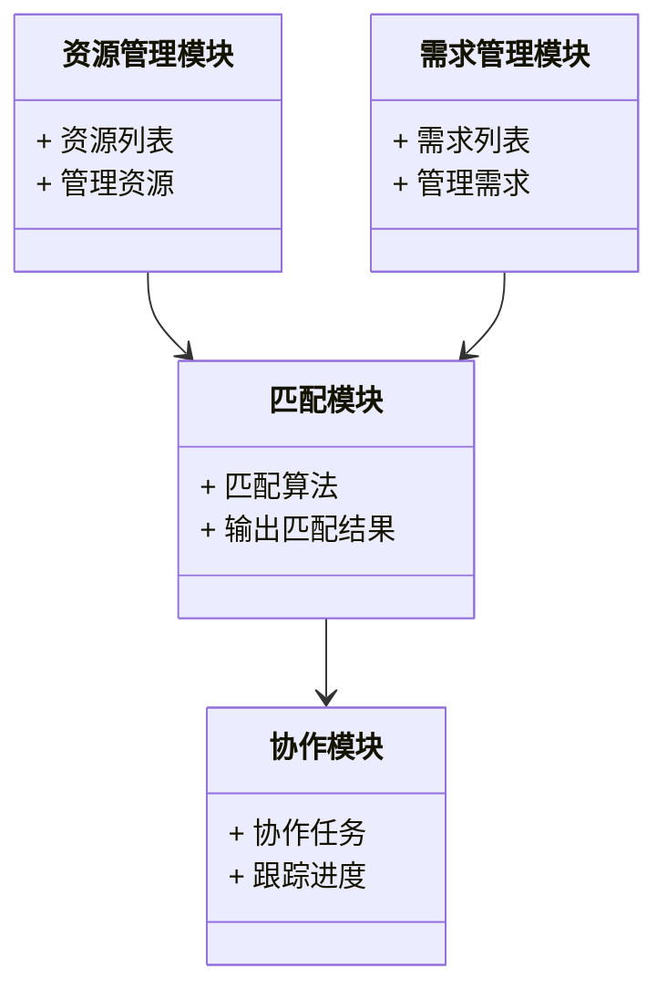
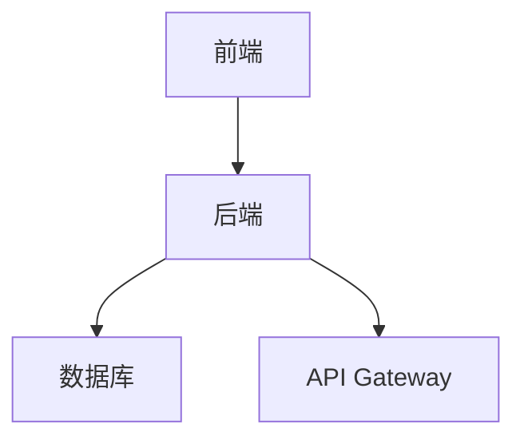
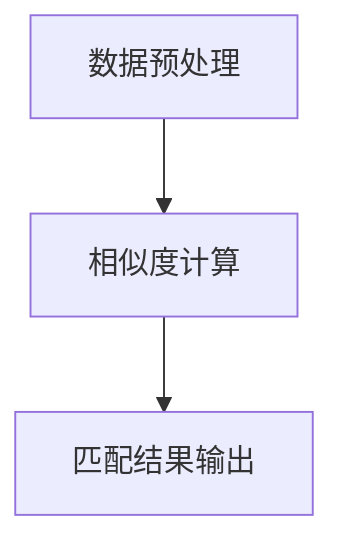

                 


# AI驱动的企业创新生态系统构建：内外部资源智能匹配与协作平台

> **关键词**：AI驱动，企业创新，生态系统，资源匹配，协作平台

> **摘要**：本文详细探讨了AI驱动的企业创新生态系统构建，重点分析了内外部资源的智能匹配与协作平台的构建过程。通过系统化的分析和实践，本文为企业的创新生态系统构建提供了理论支持和实践指导，帮助企业在数字化转型中实现资源的高效匹配与协作。

---

## 第1章：AI驱动的企业创新生态系统概述

### 1.1 问题背景与核心概念

#### 1.1.1 问题背景

在数字化转型的浪潮中，企业面临着前所未有的挑战。传统的线性创新模式已经无法满足快速变化的市场需求，企业需要更加灵活、高效、协同的创新方式。AI技术的快速发展为企业创新生态系统提供了新的可能性。

#### 1.1.2 核心概念

- **企业创新生态系统**：由企业内部资源、外部资源（如合作伙伴、供应商、客户、第三方服务提供商等）以及创新网络中的各种要素构成，通过智能匹配与协作实现创新目标的生态系统。
- **资源匹配**：通过AI技术，将内外部资源进行高效匹配，确保资源的最优利用。
- **协作平台**：为企业内外部资源提供协作的平台，通过智能化的工具和算法，实现资源的协同工作。

### 1.2 内部资源与外部资源的定义

#### 1.2.1 内部资源

内部资源包括企业内部的人才、技术、数据、资金等。这些资源是企业创新的基础，但往往存在资源分配不均、协作效率低下的问题。

#### 1.2.2 外部资源

外部资源包括合作伙伴、供应商、客户、第三方服务提供商等。外部资源的引入可以为企业带来新的视角、技术、市场机会，但如何高效匹配和协作是一个挑战。

### 1.3 资源匹配与协作机制

#### 1.3.1 匹配机制

通过AI算法，将企业的需求与资源进行智能匹配，确保资源的最优利用。

#### 1.3.2 协作机制

通过协作平台，实现资源的协同工作，确保创新过程的高效推进。

---

## 第2章：AI驱动的资源智能匹配模型

### 2.1 资源匹配模型构建

#### 2.1.1 模型构建

资源匹配模型的核心是通过AI算法，将企业的需求与资源进行智能匹配。模型需要考虑资源的属性、需求的特征以及两者之间的关联性。

**资源属性**：包括资源的类型、数量、质量、可用性等。

**需求特征**：包括需求的类型、规模、优先级、时间要求等。

**关联性**：资源与需求之间的匹配程度，可以通过相似度、相关性等指标来衡量。

### 2.2 资源匹配算法

#### 2.2.1 算法选择

常用的资源匹配算法包括：

1. **基于相似度的匹配算法**：通过计算资源与需求的相似度，选择最匹配的资源。
2. **基于聚类的匹配算法**：将资源和需求进行聚类，找到最相关的资源。
3. **基于图的匹配算法**：通过构建资源和需求的关系图，找到最优匹配。

**基于相似度的匹配算法**的实现步骤如下：

1. **数据预处理**：对资源和需求进行特征提取和标准化。
2. **相似度计算**：使用余弦相似度、欧氏距离等方法计算资源与需求的相似度。
3. **匹配结果输出**：根据相似度排序，选择最匹配的资源。

### 2.3 平台设计

#### 2.3.1 平台架构

资源匹配平台的架构设计需要考虑以下方面：

1. **数据层**：存储资源和需求的详细信息。
2. **算法层**：实现资源匹配算法的核心逻辑。
3. **接口层**：提供API接口，供外部系统调用。
4. **展示层**：提供用户友好的界面，展示匹配结果。

**平台架构图**如下：



### 2.4 本章小结

本章详细介绍了AI驱动的资源智能匹配模型的构建过程，包括模型构建、算法选择以及平台设计。通过这些步骤，企业可以实现资源的高效匹配。

---

## 第3章：协作平台系统架构设计

### 3.1 系统功能设计

#### 3.1.1 功能模块

协作平台的功能模块包括：

1. **资源管理模块**：管理企业内外部资源。
2. **需求管理模块**：管理企业的创新需求。
3. **匹配模块**：实现资源与需求的智能匹配。
4. **协作模块**：实现资源的协同工作。

**功能模块类图**如下：



### 3.2 系统架构设计

#### 3.2.1 系统架构

协作平台的系统架构设计需要考虑以下方面：

1. **前端架构**：采用响应式设计，适配不同设备。
2. **后端架构**：采用微服务架构，确保系统的可扩展性。
3. **数据库设计**：采用关系型数据库和非关系型数据库结合的方式，存储结构化和非结构化数据。
4. **API接口设计**：提供RESTful API，供外部系统调用。

**系统架构图**如下：



### 3.3 系统接口设计

#### 3.3.1 接口定义

协作平台需要定义以下接口：

1. **资源接口**：用于资源的增删改查。
2. **需求接口**：用于需求的增删改查。
3. **匹配接口**：用于资源与需求的匹配。
4. **协作接口**：用于协作任务的管理。

### 3.4 本章小结

本章详细介绍了协作平台的系统架构设计，包括功能设计、架构设计和接口设计。通过这些设计，企业可以实现内外部资源的高效协作。

---

## 第4章：资源匹配算法实现

### 4.1 算法原理

#### 4.1.1 算法流程

资源匹配算法的流程如下：

1. **数据预处理**：对资源和需求进行特征提取和标准化。
2. **相似度计算**：使用余弦相似度、欧氏距离等方法计算资源与需求的相似度。
3. **匹配结果输出**：根据相似度排序，选择最匹配的资源。

**算法流程图**如下：



### 4.2 算法实现

#### 4.2.1 代码实现

以下是资源匹配算法的Python代码示例：

```python
import numpy as np
from sklearn.metrics.pairwise import cosine_similarity

# 示例数据：资源特征向量和需求特征向量
resources = np.array([[0.5, 0.3, 0.2], [0.4, 0.5, 0.1]])
demands = np.array([[0.6, 0.2, 0.2], [0.3, 0.5, 0.2]])

# 计算相似度矩阵
similarity_matrix = cosine_similarity(resources, demands)

# 输出相似度结果
print("相似度矩阵：")
print(similarity_matrix)

# 根据相似度排序，选择最匹配的资源
sorted_indices = np.argsort(similarity_matrix, axis=0)

print("匹配结果：")
for i in range(similarity_matrix.shape[0]):
    print(f"需求{i}匹配资源{sorted_indices[i][0]}，相似度为{similarity_matrix[i][sorted_indices[i][0]]}")
```

### 4.3 本章小结

本章详细介绍了资源匹配算法的实现过程，包括算法原理和代码实现。通过这些实现，企业可以高效地进行资源匹配。

---

## 第5章：协作平台项目实战

### 5.1 项目环境安装

#### 5.1.1 环境配置

协作平台的开发环境配置如下：

- **操作系统**：Linux/MacOS/Windows
- **编程语言**：Python 3.8+
- **开发工具**：PyCharm/VS Code
- **依赖库**：Flask、Django、Pandas、NumPy

### 5.2 系统核心实现

#### 5.2.1 核心代码

以下是协作平台的核心代码示例：

```python
from flask import Flask, request, jsonify
from sklearn.metrics.pairwise import cosine_similarity

app = Flask(__name__)

resources = [
    {"id": 1, "name": "开发团队", "skills": ["Python", "AI"]},
    {"id": 2, "name": "设计团队", "skills": ["UI", "UX"]},
]

@app.route('/match', methods=['POST'])
def match():
    data = request.json
    demand_skills = data['skills']
    resource_matrix = np.array([[1 if skill in resource['skills'] else 0 for skill in demand_skills] for resource in resources])
    demand_vector = np.array([1 if skill in demand_skills else 0 for skill in demand_skills])
    similarity = cosine_similarity(resource_matrix, demand_vector.reshape(1, -1))
    max_index = np.argmax(similarity, axis=0)
    return jsonify({"matched_resource": resources[max_index[0]]})

if __name__ == '__main__':
    app.run(debug=True)
```

### 5.3 功能解读与分析

#### 5.3.1 功能分析

协作平台的功能包括：

1. **资源管理**：管理企业内外部资源。
2. **需求管理**：管理企业的创新需求。
3. **资源匹配**：实现资源与需求的智能匹配。
4. **协作管理**：实现资源的协同工作。

### 5.4 本章小结

本章通过项目实战，详细介绍了协作平台的环境配置和核心代码实现。通过这些实现，企业可以高效地进行资源匹配和协作。

---

## 第6章：最佳实践与注意事项

### 6.1 最佳实践

#### 6.1.1 实践建议

1. **数据质量**：确保资源和需求的数据质量，避免数据噪声。
2. **算法选择**：根据具体场景选择合适的算法，避免盲目使用复杂算法。
3. **平台设计**：采用模块化设计，确保系统的可扩展性。

### 6.2 注意事项

#### 6.2.1 风险提示

1. **数据隐私**：注意数据隐私问题，确保数据安全。
2. **算法可解释性**：确保算法的可解释性，避免黑箱操作。
3. **系统稳定性**：确保系统的稳定性，避免因系统故障导致业务中断。

### 6.3 本章小结

本章总结了协作平台的最佳实践和注意事项，帮助企业在实际应用中避免常见的问题。

---

## 第7章：未来展望与总结

### 7.1 未来发展趋势

#### 7.1.1 技术趋势

随着AI技术的不断发展，企业创新生态系统将更加智能化和自动化。未来的协作平台将更加注重数据驱动和自动化协作。

### 7.2 总结与反思

#### 7.2.1 总结

本文详细探讨了AI驱动的企业创新生态系统构建，重点分析了内外部资源的智能匹配与协作平台的构建过程。通过系统化的分析和实践，本文为企业的创新生态系统构建提供了理论支持和实践指导。

### 7.3 本章小结

本章总结了本文的核心内容，并展望了未来的发展趋势。

---

## 作者：AI天才研究院 & 禅与计算机程序设计艺术

本文由AI天才研究院（AI Genius Institute）与“禅与计算机程序设计艺术”（Zen And The Art of Computer Programming）联合撰写，转载请注明出处。

