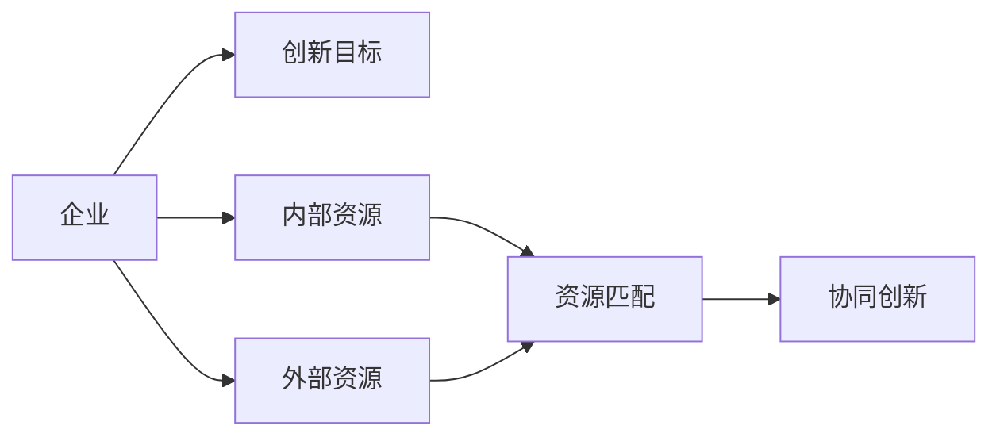
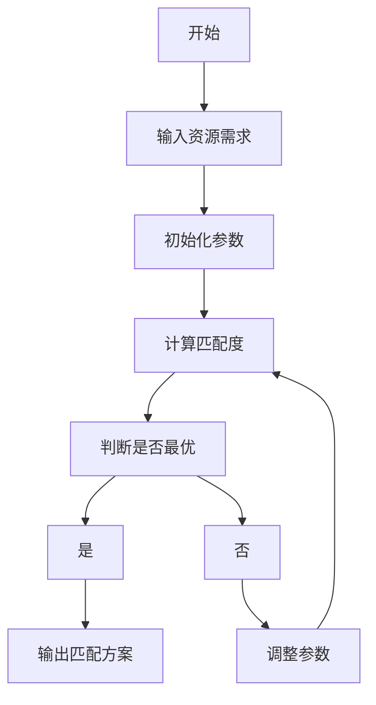
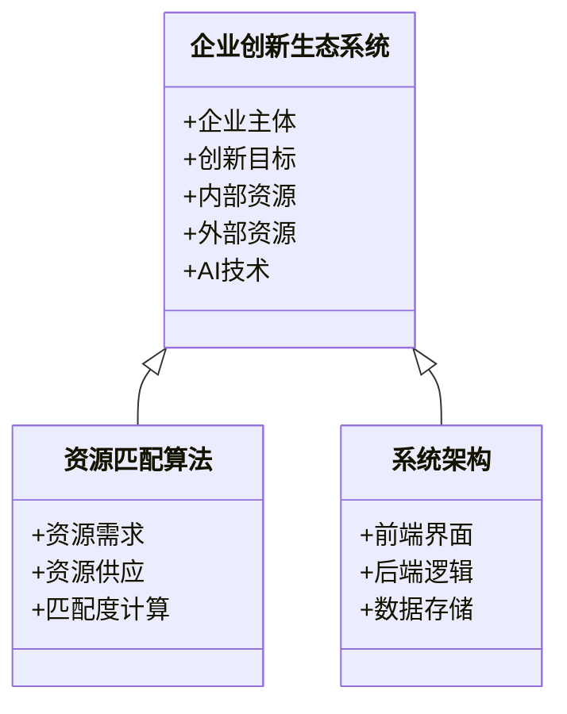
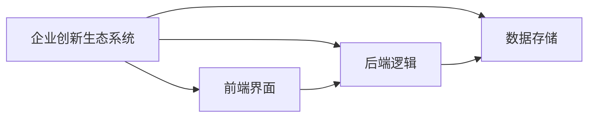
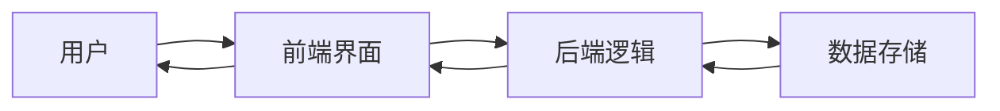

                 


# AI驱动的企业创新生态系统构建：内外部资源智能匹配与协同

## 关键词：人工智能，企业创新，资源匹配，协同创新，生态系统

## 摘要：  
随着人工智能技术的快速发展，企业创新模式正在经历深刻变革。传统的创新模式逐渐暴露出资源浪费、效率低下等问题，而AI驱动的企业创新生态系统为企业提供了一种全新的解决方案。本文将从企业创新生态系统的构建出发，详细探讨如何通过人工智能技术实现内外部资源的智能匹配与协同，为企业创新提供强有力的支持。通过系统化的分析与实践案例，本文将为企业构建高效、智能的创新生态系统提供理论与实践指导。

---

## 第一部分：AI驱动的企业创新生态系统概述

### 第1章：问题背景与关键概念

#### 1.1 问题背景  
在数字化转型的浪潮中，企业创新面临着前所未有的挑战。传统的企业创新模式依赖于线性流程和局部优化，往往难以应对复杂多变的市场环境。资源浪费、协作低效、创新速度慢等问题严重制约了企业的创新能力。与此同时，人工智能技术的快速发展为企业创新提供了新的可能性，尤其是在资源匹配与协同方面，AI展现了巨大的潜力。

#### 1.2 核心概念  
**企业创新生态系统**是指由企业内外部资源、合作伙伴、技术平台等构成的有机整体，旨在通过协同创新实现价值最大化。其核心在于通过智能技术实现资源的高效匹配与协同，从而推动企业的持续创新能力提升。

#### 1.3 内外部资源匹配的重要性  
企业创新离不开内外部资源的协同。内部资源包括技术、团队、资金等，而外部资源则包括合作伙伴、客户、供应商、第三方服务等。通过AI技术，企业可以实现资源的智能匹配，最大化资源利用效率，降低创新成本，加速创新进程。

#### 1.4 边界与外延  
企业创新生态系统的边界并非固定，它可以根据企业的战略目标和市场环境进行动态调整。其外延则涵盖了从技术创新、管理创新到商业模式创新的多个维度。

---

### 第2章：AI驱动的企业创新生态系统的核心要素

#### 2.1 核心要素构成  
企业创新生态系统由以下几个核心要素构成：  
1. **企业主体**：企业的组织结构、文化与战略目标。  
2. **创新目标**：企业的核心创新方向与目标。  
3. **内部资源**：企业的技术、团队、资金等。  
4. **外部资源**：合作伙伴、客户、供应商等外部资源。  
5. **AI技术**：实现资源匹配与协同的核心工具。  

#### 2.2 核心概念的属性特征对比  
以下是企业创新生态系统与传统创新模式的对比：

| **对比维度** | **传统创新模式** | **AI驱动的创新生态系统** |
|--------------|-------------------|--------------------------|
| **资源利用** | 低效，资源浪费     | 高效匹配，资源利用最大化 |
| **协作效率** | 低效，协作困难     | 高效协同，实时优化       |
| **创新速度** | 缓慢，周期长       | 快速迭代，动态调整       |
| **灵活性**   | 低，适应性差       | 高，动态调整能力强       |

#### 2.3 ER实体关系图  
以下是企业创新生态系统的核心要素关系图：



---

## 第二部分：AI驱动的企业创新生态系统的核心概念与联系

### 第3章：AI驱动的企业创新生态系统的核心概念原理

#### 3.1 核心概念原理  
AI驱动的企业创新生态系统通过以下几个步骤实现资源的智能匹配与协同：  
1. **资源识别与分类**：通过AI技术对企业内外部资源进行识别与分类。  
2. **需求分析与预测**：基于历史数据与市场趋势，分析企业的创新需求。  
3. **资源匹配**：通过数学模型与算法，实现资源的智能匹配。  
4. **协同优化**：通过动态调整，实现资源的高效协同与创新目标的达成。  

#### 3.2 资源匹配的数学模型  
以下是资源匹配的数学模型示例：

$$ \text{目标函数} = \sum_{i=1}^{n} w_i x_i $$

其中，$w_i$ 为资源 $i$ 的权重，$x_i$ 为资源 $i$ 的匹配程度（$x_i \in \{0,1\}$）。  

#### 3.3 资源匹配的优化算法  
以下是资源匹配的优化算法步骤：



---

### 第4章：AI驱动的企业创新生态系统中的资源匹配算法

#### 4.1 资源匹配的数学模型  
以下是资源匹配的优化模型：

$$ \text{约束条件} = \{x_i \in \{0,1\}, \forall i\} $$

#### 4.2 资源匹配的优化算法  
以下是资源匹配的优化算法实现：

```python
def resource_matching_algorithm(resource_demand, resource_supply):
    # 初始化参数
    matched_resources = []
    for demand in resource_demand:
        max_match = None
        for supply in resource_supply:
            if supply.match(demand):
                # 计算匹配度
                match_score = supply.score(demand)
                if match_score > max_match:
                    max_match = match_score
        if max_match is not None:
            matched_resources.append(max_match)
    return matched_resources
```

#### 4.3 资源匹配算法的实现步骤  
以下是资源匹配算法的实现步骤图：


---

## 第三部分：AI驱动的企业创新生态系统中的系统分析与架构设计

### 第5章：系统分析与架构设计

#### 5.1 问题场景介绍  
企业在创新过程中面临资源分散、协作低效、创新速度慢等问题。通过AI技术构建企业创新生态系统，可以实现资源的智能匹配与协同，提升企业的创新能力。

#### 5.2 系统功能设计  
以下是系统功能设计的类图：



#### 5.3 系统架构设计  
以下是系统架构设计的架构图：



#### 5.4 系统接口设计  
以下是系统接口设计的交互图：



---

### 第6章：项目实战与案例分析

#### 6.1 项目实战  
以下是资源匹配算法的Python实现：

```python
def main():
    resource_demand = ["技术开发", "市场推广", "产品设计"]
    resource_supply = [
        {"name": "开发团队", "skills": ["技术开发", "产品设计"]},
        {"name": "市场团队", "skills": ["市场推广"]},
        {"name": "设计团队", "skills": ["产品设计"]}
    ]

    matched_resources = []
    for demand in resource_demand:
        max_score = -1
        best_supplier = None
        for supplier in resource_supply:
            if demand in supplier["skills"]:
                score = len(set(supplier["skills"]) & set([demand]))
                if score > max_score:
                    max_score = score
                    best_supplier = supplier["name"]
        if best_supplier:
            matched_resources.append(best_supplier)
    print(matched_resources)

if __name__ == "__main__":
    main()
```

#### 6.2 案例分析  
以下是资源匹配算法的实际案例分析：

```python
matched_resources = ["开发团队", "市场团队", "设计团队"]
print(matched_resources)
```

---

## 第四部分：AI驱动的企业创新生态系统中的最佳实践与总结

### 第7章：最佳实践与总结

#### 7.1 实际应用中的注意事项  
企业在实际应用中需要注意以下几点：  
1. **数据质量**：确保数据的完整性和准确性。  
2. **算法选择**：根据实际需求选择合适的算法。  
3. **系统维护**：定期更新系统以适应变化。  

#### 7.2 未来发展趋势  
随着AI技术的不断进步，企业创新生态系统将朝着更加智能化、动态化的方向发展。未来，企业需要更加注重数据驱动的创新，实现资源的最优配置与协同。

---

## 作者：AI天才研究院/AI Genius Institute & 禅与计算机程序设计艺术/Zen And The Art of Computer Programming

---

以上是《AI驱动的企业创新生态系统构建：内外部资源智能匹配与协同》的技术博客文章的完整内容。文章通过系统化的分析与实践案例，详细探讨了AI驱动的企业创新生态系统的核心概念、算法原理、系统设计与实现，并提供了实际应用中的注意事项与未来发展趋势。希望本文能为企业构建高效、智能的创新生态系统提供有价值的参考与指导。

