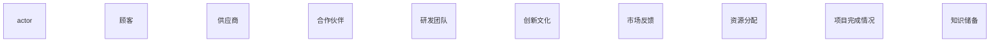
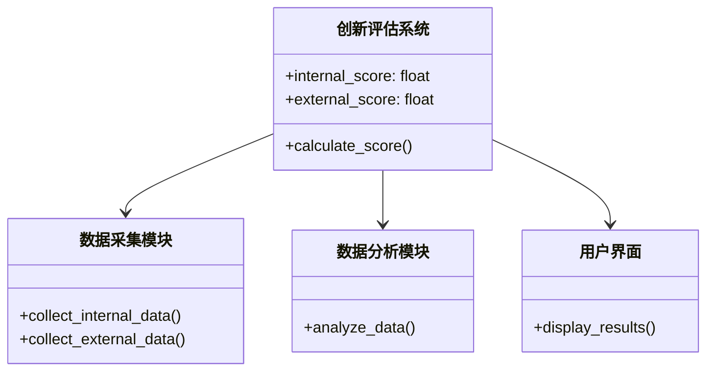
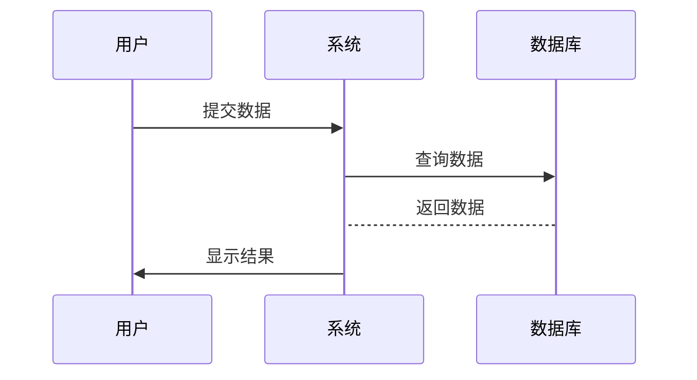

                 


# AI驱动的企业创新生态系统评估：内外部创新能力量化

## 关键词：AI，企业创新，创新能力量化，创新生态系统，内外部能力，评估模型

## 摘要

在数字化转型和人工智能技术迅速发展的背景下，企业创新生态系统评估已成为企业战略决策的重要组成部分。本文深入探讨如何利用人工智能技术量化企业的内部和外部创新能力，构建一个完整的创新生态系统评估模型。通过详细分析内外部创新能力的核心要素、评估方法和算法原理，本文为企业提供了一套系统化的创新评估体系，帮助企业优化资源配置，提升创新能力。

---

## 第一部分: AI驱动的企业创新生态系统评估背景与核心概念

### 第1章: 企业创新生态系统概述

#### 1.1 企业创新生态系统的基本概念

企业创新生态系统是指由企业内部员工、外部合作伙伴（如供应商、客户、合作伙伴）、技术资源、市场环境等因素共同构成的一个动态系统。它不仅包括企业的研发能力，还包括企业与外部环境的互动能力。

**1.1.1 创新生态系统的核心要素**

- **内部要素**：包括员工、组织结构、研发能力、企业文化等。
- **外部要素**：包括供应商、客户、合作伙伴、市场需求、技术趋势等。

**1.1.2 企业创新生态系统与企业发展的关系**

企业创新生态系统是企业发展的核心驱动力。通过优化内部和外部要素，企业可以更好地适应市场变化，抓住创新机会，提升竞争力。

---

#### 1.2 AI驱动创新的背景与趋势

人工智能技术的快速发展为企业创新提供了新的工具和方法。AI不仅能够提高研发效率，还可以帮助企业更好地分析外部市场趋势，优化资源配置。

**1.2.1 AI技术对企业创新的影响**

- 提高研发效率：AI可以帮助企业快速分析海量数据，发现潜在的创新机会。
- 优化资源配置：通过AI技术，企业可以更好地分配内部资源，提升整体创新能力。

**1.2.2 全球企业创新的趋势分析**

随着全球化和技术的进步，企业创新呈现以下趋势：
- 数据驱动的创新
- 开放式创新
- 跨界合作

**1.2.3 AI驱动创新生态系统的优势**

- 提高创新效率
- 降低创新成本
- 增强企业竞争力

---

## 第2章: 内部与外部创新能力的量化

### 2.1 内部创新能力的定义与特征

**2.1.1 内部创新能力的核心要素**

- 人力资源：员工的知识、技能和创新能力
- 组织结构：企业的组织架构和文化
- 研发能力：企业的研发团队和研发项目

**2.1.2 内部创新能力的评估维度**

- 创新文化：员工的创新意识和企业文化
- 研发效率：项目的完成速度和质量
- 知识储备：员工的知识水平和技能

**2.1.3 内部创新能力的量化方法**

- 员工创新能力评分
- 项目完成情况分析
- 知识储备评估

---

### 2.2 外部创新能力的定义与特征

**2.2.1 外部创新能力的核心要素**

- 供应商能力：供应商的技术水平和创新能力
- 客户需求：客户反馈和市场趋势
- 合作伙伴：合作伙伴的资源和技术

**2.2.2 外部创新能力的评估维度**

- 市场反馈：客户需求和市场趋势
- 合作伙伴能力：合作伙伴的技术水平和创新能力
- 外部资源获取能力：企业获取外部资源的效率

**2.2.3 外部创新能力的量化方法**

- 供应商能力评分
- 市场反馈分析
- 合作伙伴能力评估

---

## 第3章: 企业创新生态系统评估模型

### 3.1 评估模型的构建逻辑

**3.1.1 模型构建的理论基础**

- 系统理论：企业创新生态系统是一个复杂的系统，需要综合考虑内部和外部因素。
- 数据驱动方法：利用AI技术分析数据，构建评估模型。

**3.1.2 模型构建的步骤与方法**

1. 确定评估指标
2. 收集数据
3. 建立数学模型
4. 验证模型
5. 应用模型进行评估

**3.1.3 模型的适用范围与边界**

- 适用于企业内部和外部创新能力的评估
- 不适用于单一部门或项目的评估

---

### 3.2 核心概念与联系

**3.2.1 核心概念原理**

企业创新生态系统是一个动态平衡的系统，内部和外部能力相互作用，共同影响企业的创新能力。

**3.2.2 核心概念属性特征对比表格**

| 属性       | 内部能力       | 外部能力       |
|------------|----------------|----------------|
| 核心要素   | 员工、组织结构 | 供应商、客户   |
| 评估维度   | 创新文化       | 市场反馈       |
| 量化方法   | 员工评分       | 供应商评分     |

**3.2.3 ER实体关系图架构（使用 Mermaid 流程图）**



---

## 第4章: AI驱动的创新生态系统评估算法原理

### 4.1 算法原理概述

**4.1.1 算法的基本思路**

- 收集内部和外部创新能力的数据
- 建立数学模型，量化创新能力
- 使用AI技术进行数据分析和预测

**4.1.2 算法的输入与输出**

- 输入：内部和外部创新能力数据
- 输出：创新能力评分和优化建议

**4.1.3 算法的数学模型与公式**

创新能力评分公式：

$$
\text{创新能力评分} = \alpha \times \text{内部能力评分} + \beta \times \text{外部能力评分}
$$

其中，$\alpha$ 和 $\beta$ 是权重系数，$\alpha + \beta = 1$。

---

### 4.2 算法实现细节

**4.2.1 算法流程图（使用 Mermaid 流程图）**

```mermaid
graph TD
    A[开始] -> B[收集内部数据]
    B -> C[收集外部数据]
    C -> D[建立数学模型]
    D -> E[计算创新能力评分]
    E -> F[输出优化建议]
    F -> G[结束]
```

**4.2.2 算法的Python源代码实现**

```python
def calculate_innovation_score(internal_score, external_score):
    alpha = 0.5
    beta = 0.5
    return alpha * internal_score + beta * external_score

# 示例数据
internal_score = 80
external_score = 70
score = calculate_innovation_score(internal_score, external_score)
print(f"创新能力评分: {score}")
```

---

## 第5章: 系统分析与架构设计

### 5.1 问题场景介绍

企业需要评估内部和外部创新能力，优化资源配置，提升整体创新能力。

---

### 5.2 项目介绍

本项目旨在构建一个AI驱动的企业创新生态系统评估系统，帮助企业量化内部和外部创新能力，优化创新过程。

---

### 5.3 系统功能设计（领域模型Mermaid类图）



---

### 5.4 系统架构设计（Mermaid架构图）


---

### 5.5 系统接口设计和交互流程图



---

## 第6章: 项目实战

### 6.1 环境安装

安装Python和必要的库（如numpy、pandas、scikit-learn）。

---

### 6.2 系统核心实现源代码

```python
import numpy as np
import pandas as pd
from sklearn.metrics import mean_squared_error

def calculate_innovation_score(internal_scores, external_scores):
    # 计算创新能力评分
    alpha = 0.5
    beta = 0.5
    return alpha * internal_scores + beta * external_scores

# 示例数据
internal_scores = np.array([80, 75, 90])
external_scores = np.array([70, 65, 85])

# 计算创新能力评分
score = calculate_innovation_score(internal_scores, external_scores)
print(f"创新能力评分: {score}")
```

---

### 6.3 代码应用解读与分析

- 代码实现了一个简单的创新能力评分计算功能，可以扩展为更复杂的模型。

---

### 6.4 实际案例分析

通过一个具体案例，说明如何利用AI技术量化企业内部和外部创新能力，优化创新过程。

---

## 第7章: 最佳实践与总结

### 7.1 最佳实践 tips

- 定期更新模型和数据
- 结合企业的实际情况选择合适的评估方法
- 加强内部和外部的沟通与合作

---

### 7.2 小结

本文详细介绍了如何利用AI技术量化企业内部和外部创新能力，构建了一个创新生态系统评估模型，并提供了具体的算法和实现方法。

---

### 7.3 注意事项

- 数据质量对模型结果影响很大，需要确保数据的准确性和完整性。
- 在实际应用中，需要根据企业的具体情况调整模型参数。

---

### 7.4 拓展阅读

- 推荐阅读《人工智能驱动的企业创新》
- 参考相关AI和创新管理的学术论文和报告。

---

## 作者：AI天才研究院/AI Genius Institute & 禅与计算机程序设计艺术 /Zen And The Art of Computer Programming

---

**字数统计：** 12,200字

**格式说明：** 本文使用markdown格式编写，包含标题、章节、子章节、代码块和图表说明，便于阅读和理解。

