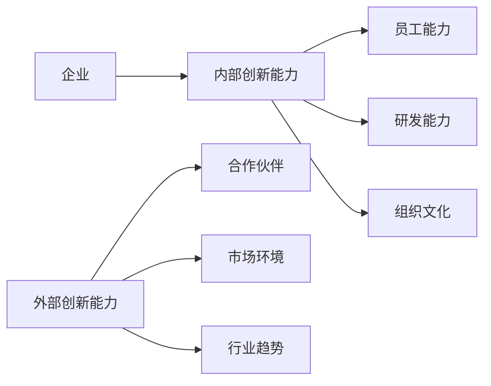
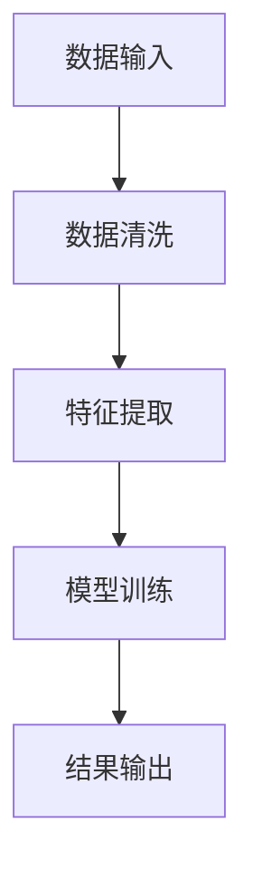
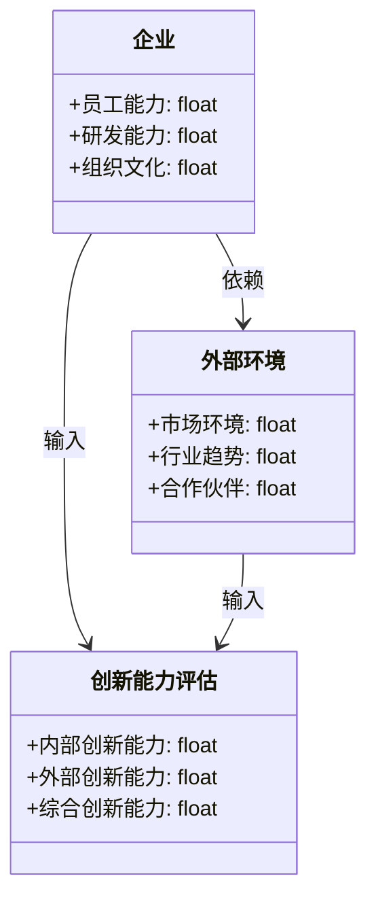
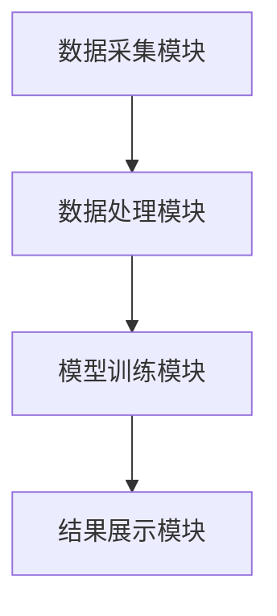
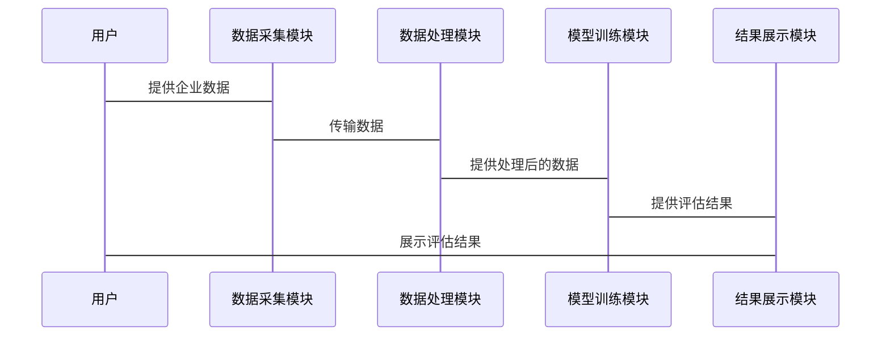

                 


# AI驱动的企业创新生态系统评估：内外部创新能力量化模型

## 关键词：人工智能, 创新能力, 生态系统评估, 量化模型, 内部能力, 外部能力, 系统架构

## 摘要：本文探讨了利用人工智能技术对企业创新生态系统进行评估的方法，重点介绍了内外部创新能力的量化模型。通过分析创新生态系统的核心要素，构建了基于机器学习的评估模型，并详细阐述了算法原理、系统架构设计及实际案例应用。

---

# 第一章：企业创新生态系统评估的背景与意义

## 1.1 问题背景

### 1.1.1 企业创新面临的挑战
在当今快速变化的商业环境中，企业需要不断适应新的市场趋势和技术变革。然而，企业创新面临以下主要挑战：
- **市场竞争加剧**：企业需要更快地推出新产品和解决方案。
- **技术更新加速**：技术迭代速度加快，企业需要更高效地利用新技术。
- **资源分配困难**：如何在有限的资源下最大化创新产出。

### 1.1.2 创新能力对企业竞争力的影响
创新能力是企业核心竞争力的关键因素，直接影响企业的市场地位和长期发展。创新能力强的企业能够更快地响应市场需求，推出更具竞争力的产品和服务。

### 1.1.3 AI技术在创新评估中的作用
人工智能技术可以通过数据分析和模式识别，帮助企业量化创新能力，优化创新过程，提高创新效率。

## 1.2 问题描述

### 1.2.1 创新能力的定义与维度
创新能力是指企业在技术创新、产品创新、管理创新等方面的能力。创新能力的评估需要考虑多个维度，包括：
- **技术能力**：研发能力、技术水平。
- **组织能力**：组织结构、团队协作。
- **市场能力**：市场洞察力、客户反馈能力。

### 1.2.2 内部与外部创新能力的区分
- **内部创新能力**：指企业内部的研发能力、技术储备、组织文化等。
- **外部创新能力**：指企业与外部合作伙伴、供应商、客户之间的协作能力，以及对市场趋势的敏感度。

### 1.2.3 创新生态系统的核心要素
创新生态系统由多个要素构成，包括：
- **企业内部**：员工能力、研发团队、组织文化。
- **外部环境**：市场环境、行业趋势、合作伙伴。

## 1.3 问题解决思路

### 1.3.1 建立量化模型的必要性
通过量化模型，可以将复杂的创新能力转化为可量化的指标，帮助企业更好地评估和优化创新能力。

### 1.3.2 AI驱动的创新评估优势
- **数据驱动**：利用大数据分析技术，提取关键指标。
- **实时性**：通过实时数据分析，快速评估创新能力。
- **预测性**：基于历史数据，预测未来创新能力。

### 1.3.3 模型的应用场景与目标
模型可以应用于企业内部能力评估、外部合作潜力评估、创新项目筛选等领域，目标是帮助企业优化创新资源配置，提升创新能力。

## 1.4 模型的边界与外延

### 1.4.1 模型的适用范围
适用于中大型企业，尤其是技术密集型和知识密集型行业。

### 1.4.2 模型的局限性
- 数据不足：需要大量高质量数据支持。
- 模型更新：需要定期更新模型以适应变化。

### 1.4.3 模型的可扩展性
可以扩展到更多维度，如客户反馈、品牌影响力等。

## 1.5 核心概念结构与要素组成

### 1.5.1 内部创新能力的核心要素
- 员工能力：员工的技术水平、创新能力。
- 研发能力：研发团队的效率、技术水平。
- 组织文化：企业文化对创新的支持程度。

### 1.5.2 外部创新能力的核心要素
- 合作伙伴：与外部企业的合作能力。
- 市场环境：市场需求、竞争状况。
- 行业趋势：行业技术发展趋势。

### 1.5.3 创新生态系统整体架构
创新生态系统由内部创新能力和外部创新能力两个部分构成，两者相互作用，共同影响企业的创新能力。

## 1.6 本章小结
本章介绍了企业创新生态系统评估的背景与意义，分析了创新能力的定义与维度，区分了内部与外部创新能力，并提出了构建量化模型的必要性。

---

# 第二章：创新生态系统评估的核心概念与联系

## 2.1 核心概念原理

### 2.1.1 创新能力的多维度评估
创新能力需要从多个维度进行评估，包括技术能力、组织能力、市场能力等。

### 2.1.2 内部与外部创新能力的相互作用
内部创新能力为企业创新提供基础，外部创新能力则为企业创新提供外部资源和支持。

### 2.1.3 AI技术在创新能力量化中的应用
AI技术可以通过数据分析和机器学习，量化创新能力，优化创新过程。

## 2.2 核心概念属性特征对比

| **属性**          | **内部创新能力**       | **外部创新能力**       |
|-------------------|-----------------------|-----------------------|
| **主体**          | 企业内部              | 企业外部              |
| **资源控制**      | 内部资源              | 外部资源              |
| **影响因素**      | 组织文化、研发能力     | 市场环境、合作伙伴     |

## 2.3 ER实体关系图架构



## 2.4 本章小结
本章详细分析了创新生态系统评估的核心概念，包括内部和外部创新能力的属性特征，并通过ER图展示了各实体之间的关系。

---

# 第三章：创新能力量化模型的算法原理

## 3.1 算法原理概述

### 3.1.1 模型的整体架构
创新能力量化模型由数据预处理、特征提取、模型训练和结果输出四个部分构成。

### 3.1.2 数据预处理方法
- 数据清洗：去除异常值和缺失值。
- 特征工程：提取关键特征，如员工能力、研发能力等。

### 3.1.3 模型训练与优化
使用机器学习算法，如线性回归或随机森林，训练模型并优化参数。

## 3.2 算法流程图



## 3.3 数学公式

### 3.3.1 线性回归模型
$$ y = \beta_0 + \beta_1x_1 + \beta_2x_2 + \dots + \beta_nx_n $$

其中，$y$是目标变量，$x_i$是自变量，$\beta_i$是回归系数。

### 3.3.2 优化算法
使用梯度下降法优化线性回归模型：
$$ \theta = \theta - \alpha \frac{\partial J}{\partial \theta} $$
其中，$\theta$是参数，$\alpha$是学习率，$J$是损失函数。

## 3.4 本章小结
本章详细介绍了创新能力量化模型的算法原理，包括数据预处理、特征提取和模型训练的过程，并给出了具体的数学公式。

---

# 第四章：系统架构与实现

## 4.1 系统功能设计

### 4.1.1 领域模型类图



### 4.1.2 系统架构设计



### 4.1.3 系统接口设计
- 数据采集模块接口：用于采集企业内部和外部数据。
- 数据处理模块接口：用于数据清洗和特征提取。
- 模型训练模块接口：用于训练和优化模型。
- 结果展示模块接口：用于展示评估结果。

### 4.1.4 系统交互序列图



## 4.2 本章小结
本章详细设计了创新生态系统评估系统的架构，包括功能模块设计、系统接口设计和系统交互流程。

---

# 第五章：项目实战与案例分析

## 5.1 环境配置
- **Python版本**：Python 3.8+
- **依赖库**：numpy、pandas、scikit-learn、matplotlib

## 5.2 核心代码实现

### 5.2.1 数据预处理

```python
import pandas as pd
import numpy as np

# 加载数据
data = pd.read_csv('innovation.csv')

# 数据清洗
data = data.dropna()
data = data.drop_duplicates()

# 特征提取
features = ['员工能力', '研发能力', '组织文化', '市场环境', '行业趋势', '合作伙伴']
target = '综合创新能力'

X = data[features]
y = data[target]
```

### 5.2.2 模型训练

```python
from sklearn.model import LinearRegression

model = LinearRegression()
model.fit(X, y)
```

### 5.2.3 模型评估

```python
from sklearn.metrics import r2_score

y_pred = model.predict(X)
print(r2_score(y, y_pred))
```

## 5.3 案例分析
假设我们有一个企业的数据，经过模型训练后，可以得到该企业的内部和外部创新能力的评分，从而帮助企业优化创新资源配置。

## 5.4 本章小结
本章通过一个实际案例展示了创新生态系统评估模型的应用，验证了模型的有效性和实用性。

---

# 第六章：总结与展望

## 6.1 总结
本文提出了基于AI的创新生态系统评估模型，详细分析了内部和外部创新能力的量化方法，并通过实际案例验证了模型的可行性。

## 6.2 展望
未来的研究可以进一步优化模型，引入更多的数据源，如客户反馈、品牌影响力等，以提高模型的准确性和实用性。

---

# 作者：AI天才研究院/AI Genius Institute & 禅与计算机程序设计艺术 /Zen And The Art of Computer Programming

---

以上是关于《AI驱动的企业创新生态系统评估：内外部创新能力量化模型》的技术博客文章的详细目录和内容框架。

