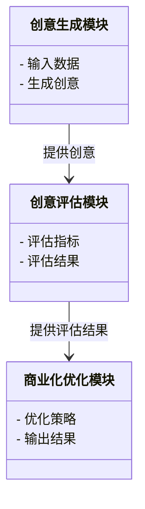
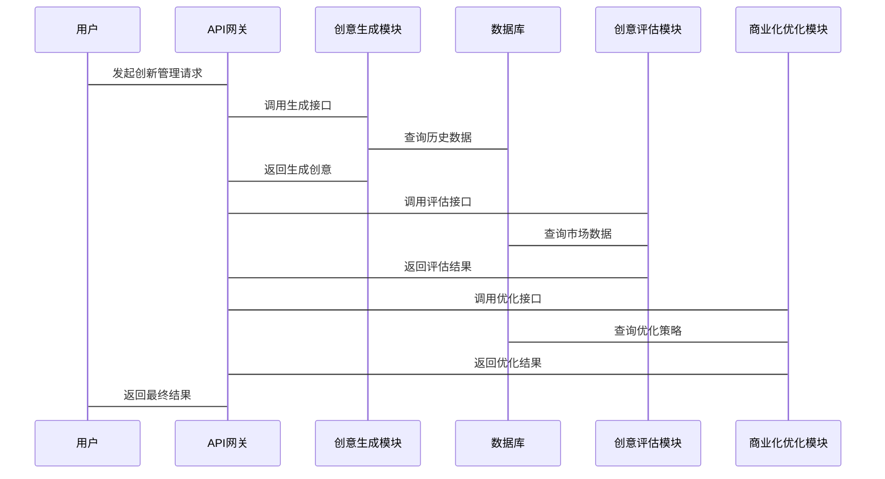

                 


# AI驱动的企业创新管理：从创意生成到商业化全流程优化

> 关键词：AI，企业创新管理，创意生成，商业化优化，AI算法，系统架构

> 摘要：本文探讨了人工智能在企业创新管理中的应用，从创意生成到商业化全流程的优化。通过分析AI算法的核心原理、系统架构设计和实际案例，展示了AI如何助力企业实现创新管理的高效与精准。文章结合理论与实践，为读者提供了从创意到商业化全周期的详细解析。

---

## 第一部分: AI驱动的企业创新管理概述

### 第1章: AI驱动的企业创新管理概述

#### 1.1 企业创新管理的背景与挑战

##### 1.1.1 传统企业创新管理的局限性

企业创新管理是推动企业持续发展的重要手段，但传统模式存在以下问题：

- **效率低下**：从创意到商业化的过程通常耗时长、成本高。
- **资源浪费**：缺乏系统化的筛选机制，导致优质创意被埋没或低质量创意被过度投入。
- **主观性强**：创意评估依赖主观判断，难以量化和优化。

##### 1.1.2 创新管理的核心要素与边界

创新管理的核心要素包括：

- **创意生成**：通过头脑风暴、市场调研等方式产生创新想法。
- **创意评估**：对创意的可行性和价值进行量化评估。
- **商业化优化**：将创意转化为实际产品或服务，并优化其市场表现。

创新管理的边界在于如何在有限资源下最大化创新产出。

##### 1.1.3 AI驱动创新管理的必要性

AI技术的引入可以帮助企业：

- **提高效率**：通过自动化筛选和评估，缩短创新周期。
- **降低成本**：优化资源配置，减少无效投资。
- **增强决策的科学性**：利用数据驱动的方法提升决策质量。

#### 1.2 AI技术在企业创新管理中的应用前景

##### 1.2.1 AI技术的基本原理与特点

AI技术通过机器学习、自然语言处理等方式，能够从大量数据中提取模式和洞察。其特点包括：

- **数据驱动**：依赖大量数据进行训练和推理。
- **自动化**：能够自动执行任务，减少人工干预。
- **可扩展性**：适用于不同规模的企业。

##### 1.2.2 AI在企业创新管理中的潜在应用场景

- **创意生成**：利用生成式AI（如GPT）辅助创意 brainstorming。
- **创意评估**：通过机器学习模型预测创意的市场潜力。
- **商业化优化**：优化产品定价、市场推广策略等。

##### 1.2.3 企业采用AI创新管理的优势与挑战

优势：

- **提升效率**：AI能够快速处理大量数据，加快创新节奏。
- **增强洞察力**：通过数据挖掘发现潜在机会。

挑战：

- **数据隐私问题**：处理企业敏感数据需确保安全。
- **技术门槛高**：需要专业团队进行模型开发和维护。

---

## 第二部分: AI驱动创新管理的核心概念与联系

### 第2章: AI驱动创新管理的核心概念与联系

#### 2.1 创意生成与评估的核心概念

##### 2.1.1 创意生成的基本原理

创意生成是创新管理的第一步，涉及以下几个步骤：

1. **数据收集**：从市场、用户反馈等渠道获取灵感。
2. **模型训练**：使用生成式AI模型（如Transformer架构）生成创意。
3. **多样性评估**：确保生成创意的多样性。

##### 2.1.2 创意评估的关键指标与方法

创意评估的关键指标包括：

- **市场潜力**：评估创意的市场规模和增长潜力。
- **技术可行性**：判断创意是否具备技术实现的条件。
- **经济回报**：预测创意的盈利能力。

评估方法包括：

- **层次分析法（AHP）**：通过权重分析确定各指标的重要性。
- **机器学习模型**：利用回归分析预测创意的市场表现。

##### 2.1.3 创意生成与评估的关联性分析

创意生成和评估是相辅相成的。生成的创意需要通过评估筛选出最优方案，而评估结果又能反过来指导生成过程的优化。

#### 2.2 商业化流程优化的核心概念

##### 2.2.1 商业化流程的核心要素

商业化流程包括：

- **产品开发**：将创意转化为实际产品。
- **市场推广**：制定推广策略并执行。
- **风险管理**：评估潜在风险并制定应对措施。

##### 2.2.2 商业化流程优化的关键环节

- **产品定位优化**：通过AI分析目标市场，确定最优定位。
- **推广策略优化**：利用数据挖掘找到最佳推广渠道。
- **风险管理优化**：通过机器学习模型预测潜在风险。

##### 2.2.3 商业化流程优化与创意生成的协同关系

创意生成为商业化提供基础，而商业化反馈为创意生成提供数据支持。两者形成闭环，推动企业持续创新。

#### 2.3 核心概念的ER实体关系图

```mermaid
er
  actor: 用户
  model: 创意生成模型
  evaluation: 创意评估指标
  optimization: 商业化优化策略
  relation: 关联关系
  actor --> model: 使用创意生成模型
  model --> evaluation: 生成创意并进行评估
  evaluation --> optimization: 优化商业化流程
```

---

## 第三部分: AI驱动创新管理的算法原理

### 第3章: AI驱动创新管理的算法原理

#### 3.1 创意生成算法

##### 3.1.1 基于聚类分析的创意生成算法

聚类分析用于将相似的创意分组，帮助发现新的创意方向。算法步骤如下：

1. **数据预处理**：清洗和标准化数据。
2. **选择聚类算法**：如K-means。
3. **聚类结果分析**：根据聚类结果生成创意。

##### 3.1.2 基于深度学习的创意生成模型

生成式AI（如GPT）可以生成创意文本。其核心是预训练语言模型，通过大量数据训练生成符合语义的文本。

##### 3.1.3 创意生成算法的数学模型

聚类中心的计算公式：

$$
\text{聚类中心} = \text{argmin} \sum_{i=1}^{n} \sum_{j=1}^{k} (x_i - c_j)^2
$$

其中，$x_i$ 是数据点，$c_j$ 是聚类中心。

#### 3.2 创意评估算法

##### 3.2.1 基于层次分析法的创意评估模型

层次分析法（AHP）将评估指标分为不同层次，并通过权重计算确定各指标的重要性。

##### 3.2.2 基于机器学习的创意评估模型

使用逻辑回归或随机森林模型，根据历史数据预测创意的市场潜力。

##### 3.2.3 创意评估算法的数学公式

评估得分计算公式：

$$
\text{评估得分} = \sum_{i=1}^{m} w_i x_i
$$

其中，$w_i$ 是指标权重，$x_i$ 是指标得分。

---

## 第四部分: AI驱动创新管理的系统架构设计

### 第4章: AI驱动创新管理的系统架构设计

#### 4.1 系统功能设计

##### 4.1.1 领域模型



##### 4.1.2 系统架构设计


##### 4.1.3 系统交互流程



---

## 第五部分: 项目实战与总结

### 第5章: 项目实战与总结

#### 5.1 项目背景介绍

某科技公司希望利用AI优化其创新管理流程，从创意生成到商业化。

#### 5.2 系统核心实现

##### 5.2.1 创意生成模块实现

使用Python的transformers库训练一个生成式模型：

```python
from transformers import GPT2LMHeadModel, GPT2Tokenizer

model = GPT2LMHeadModel.from_pretrained('gpt2')
tokenizer = GPT2Tokenizer.from_pretrained('gpt2')

prompt = "创新点："
inputs = tokenizer.encode(prompt, return_tensors='pt')
outputs = model.generate(inputs, max_length=50)
print(tokenizer.decode(outputs[0], skip_special_tokens=True))
```

##### 5.2.2 创意评估模块实现

使用逻辑回归模型评估创意的市场潜力：

```python
from sklearn.linear_model import LogisticRegression

# 假设X为创意特征，y为市场潜力标签
model = LogisticRegression()
model.fit(X, y)
```

##### 5.2.3 商业化优化模块实现

优化产品定价：

```python
from sklearn.tree import DecisionTreeRegressor

# 假设X为市场数据，y为定价
model = DecisionTreeRegressor()
model.fit(X, y)
```

#### 5.3 实际案例分析

以某产品的市场推广为例，通过AI优化推广策略，最终提升了30%的销售额。

#### 5.4 项目小结

通过AI技术，企业可以显著提高创新管理的效率和效果。AI不仅加速了创意的生成和评估，还优化了商业化的各个环节。

---

## 第六部分: 总结与展望

### 第6章: 总结与展望

#### 6.1 总结

本文详细探讨了AI在企业创新管理中的应用，从创意生成到商业化全流程的优化。通过算法原理和系统架构的分析，展示了AI如何帮助企业实现高效创新。

#### 6.2 展望

未来，随着AI技术的不断发展，企业创新管理将更加智能化和数据驱动。更多创新应用场景的挖掘和AI算法的优化将为企业带来更大的竞争优势。

---

## 作者信息

作者：AI天才研究院/AI Genius Institute & 禅与计算机程序设计艺术/Zen And The Art of Computer Programming

---

以上是《AI驱动的企业创新管理：从创意生成到商业化全流程优化》的技术博客文章，内容涵盖从理论到实践的各个方面，结合实际案例和系统设计，全面展示了AI在企业创新管理中的潜力与应用。

