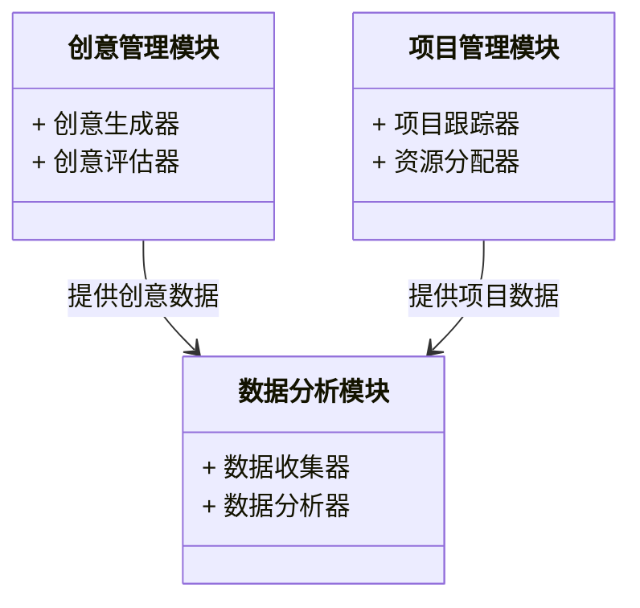

                 


# AI驱动的企业创新管理：从创意筛选到商业化全流程智能化

> 关键词：AI, 创新管理, 创意筛选, 商业化流程, 智能化系统

> 摘要：本文详细探讨了AI技术在企业创新管理中的应用，从创意筛选到商业化全流程的智能化管理。通过分析AI在创意生成、项目管理、风险评估等环节的作用，结合实际案例和系统架构设计，展示了如何利用AI技术优化企业创新流程，提升创新效率和成功率。

---

## 第一部分：背景与概念

### 第1章：AI驱动创新管理的背景与概述

#### 1.1 企业创新管理的背景

在当今快速变化的商业环境中，企业创新管理的重要性日益凸显。传统的企业创新管理依赖于人工经验和主观判断，存在效率低、覆盖面窄、风险评估不准确等问题。随着AI技术的快速发展，企业创新管理迎来了智能化转型的新机遇。

**核心概念术语说明：**

- **创新管理**：指企业通过系统化的方法，识别、评估和实施创新项目，以实现业务目标的过程。
- **AI驱动**：利用人工智能技术（如机器学习、自然语言处理等）辅助或替代传统的人工操作，提升效率和准确性。

**问题背景：**

- 传统创新管理流程效率低下，难以应对海量创意的筛选和评估。
- 创意到商业化的过程复杂，涉及多个环节，存在信息孤岛和资源浪费。
- 创新项目的成功率难以预测，风险管理能力不足。

**问题解决：**

- 引入AI技术，通过自动化处理和数据分析，提高创意筛选的效率和准确性。
- 建立智能化系统，整合创意生成、项目管理、市场分析等环节，实现全流程优化。

**边界与外延：**

- 创新管理的边界包括创意生成、筛选、评估、实施和商业化。
- 外延涉及企业战略、市场营销、技术研发等多个领域。

**概念结构与核心要素组成：**

| 核心要素 | 描述 |
|----------|------|
| 创意生成 | 通过AI生成创意，结合市场趋势和用户需求。 |
| 创意筛选 | 使用算法评估创意的可行性和潜力。 |
| 项目管理 | 利用AI优化项目进度和资源分配。 |
| 风险评估 | 基于AI的市场分析预测潜在风险。 |
| 商业化支持 | 利用AI优化产品定位和市场推广。 |

---

## 第二部分：AI在创意筛选中的应用

### 第2章：AI在创意筛选中的应用

#### 2.1 创意筛选的流程与挑战

传统创意筛选流程通常包括创意收集、初步筛选、深度评估和最终决策四个阶段。然而，这一过程耗时长、成本高，且容易受到主观因素的影响。

**挑战：**

- 创意数量多，人工筛选效率低。
- 创意评估缺乏客观标准。
- 数据分散，难以有效整合和分析。

**基于AI的解决方案：**

- 使用生成式AI生成创意，减少人工劳动。
- 建立多维度评估模型，确保筛选的客观性和全面性。

#### 2.2 基于AI的创意生成与评估

**创意生成：**

- 利用生成式AI（如GPT模型）根据市场趋势和用户需求生成创意。
- 示例：通过分析关键词生成产品创意，如“智能健康手环”。

**创意评估：**

- 使用机器学习模型评估创意的可行性和潜力。
- 示例：基于市场数据分析，评估创意的市场规模和竞争情况。

**实例分析：**

- 某科技企业的创意筛选实践：通过AI生成创意并评估其可行性，缩短筛选时间并提高准确性。

---

## 第三部分：AI在项目管理与商业化中的应用

### 第3章：AI在项目管理与商业化中的应用

#### 3.1 项目管理的智能化转型

**项目进度预测：**

- 使用机器学习模型预测项目进度，优化资源分配。
- 示例：基于历史数据训练模型，预测项目完成时间。

**风险预警机制：**

- 利用AI分析项目数据，识别潜在风险并及时预警。
- 示例：通过NLP分析项目文档，识别潜在风险点。

**数据驱动的决策支持：**

- 基于AI生成的数据报告，辅助项目决策。
- 示例：根据市场分析报告调整项目方向。

#### 3.2 商业化流程的智能化

**市场需求预测：**

- 使用AI分析市场数据，预测产品需求。
- 示例：通过时间序列分析预测市场需求波动。

**产品定位优化：**

- 利用AI分析竞争对手和用户需求，优化产品定位。
- 示例：基于NLP分析用户反馈，确定产品功能优先级。

**市场反馈分析：**

- 利用自然语言处理技术分析用户反馈，优化产品设计。
- 示例：通过情感分析识别用户满意度。

---

## 第四部分：系统架构与功能设计

### 第4章：系统架构与功能设计

#### 4.1 系统架构概述

**模块划分：**

- 创意管理模块：负责创意的生成、筛选和评估。
- 项目管理模块：负责项目的进度跟踪和资源分配。
- 数据分析模块：负责数据的收集、处理和分析。

**模块交互关系：**

- 创意管理模块与项目管理模块共享创意评估结果。
- 数据分析模块为其他模块提供数据支持。

**可扩展性设计：**

- 系统采用模块化设计，便于功能扩展和升级。

---

## 第五部分：AI驱动创新管理的算法与实现

### 第5章：AI驱动创新管理的算法与实现

#### 5.1 算法原理讲解

**机器学习模型：**

- 使用随机森林算法对创意进行分类，评估其可行性。
- 示例代码：

```python
from sklearn.ensemble import RandomForestClassifier
from sklearn.model_selection import train_test_split

# 数据预处理
X = ...  # 特征向量
y = ...  # 标签

X_train, X_test, y_train, y_test = train_test_split(X, y, test_size=0.2)

# 训练模型
model = RandomForestClassifier()
model.fit(X_train, y_train)

# 预测
y_pred = model.predict(X_test)
```

**自然语言处理技术：**

- 使用TF-IDF提取创意文本关键词，进行情感分析。
- 示例代码：

```python
from sklearn.feature_extraction.text import TfidfVectorizer
from sklearn.decomposition import PCA

vectorizer = TfidfVectorizer()
tfidf = vectorizer.fit_transform(texts)
```

---

## 第六部分：系统分析与架构设计

### 第6章：系统分析与架构设计

#### 6.1 问题场景介绍

- **问题场景**：企业需要从海量创意中筛选出可行的创新项目，并优化其商业化流程。

**系统功能设计：**

- **领域模型**：使用Mermaid类图展示系统模块之间的关系。



**系统架构设计：**

- **架构图**：展示系统的整体架构。


---

## 第七部分：项目实战

### 第7章：项目实战

#### 7.1 环境安装

```bash
pip install scikit-learn
pip install tensorflow
pip install python-mermaid
```

#### 7.2 核心代码实现

**创意筛选模块代码：**

```python
import numpy as np
from sklearn.ensemble import RandomForestClassifier

# 示例数据
X = np.array([[1, 2, 3], [4, 5, 6], [7, 8, 9]])
y = np.array([0, 1, 0])

# 训练模型
model = RandomForestClassifier()
model.fit(X, y)

# 预测
new_X = np.array([[10, 11, 12]])
print(model.predict(new_X))
```

**数据分析模块代码：**

```python
import pandas as pd
from sklearn.decomposition import PCA

df = pd.read_csv('data.csv')
pca = PCA(n_components=2)
principal_components = pca.fit_transform(df)
```

---

## 第八部分：总结与展望

### 第8章：总结与展望

#### 8.1 总结

AI技术在企业创新管理中的应用显著提升了创意筛选和商业化流程的效率。通过智能化系统，企业能够更快速、准确地识别和实施创新项目，降低风险，提高成功率。

#### 8.2 未来展望

- **技术发展**：随着AI算法的不断进步，创新管理系统的智能化水平将进一步提升。
- **应用拓展**：AI技术将在更多领域得到应用，推动企业创新管理的全面数字化转型。

---

## 作者：AI天才研究院（AI Genius Institute） & 禅与计算机程序设计艺术（Zen And The Art of Computer Programming）

---

**提示：**

- 本文内容涉及AI技术在企业创新管理中的具体应用，结合实际案例和系统设计，提供了详细的代码实现和系统架构设计。通过本文的学习，读者可以掌握如何利用AI技术优化企业创新流程，提升创新效率和成功率。

