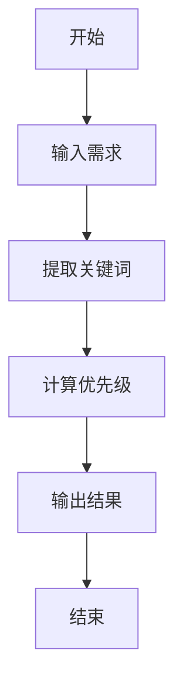
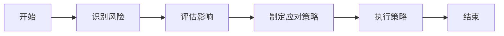
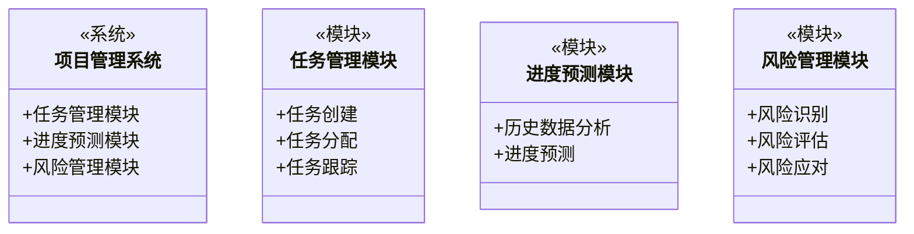

                 


# AI驱动的企业创新项目管理：敏捷方法与AI的结合

## 关键词：AI, 项目管理, 敏捷方法, 企业创新, 系统架构

## 摘要：  
本文探讨了AI技术如何与敏捷方法相结合，优化企业创新项目的管理流程。通过分析AI在任务优先级、进度预测和风险管理中的应用，结合系统架构设计和实际案例，展示了AI驱动的项目管理系统的实现与优势。

---

# 第一部分: AI驱动的企业创新项目管理概述

## 第1章: AI与敏捷方法的背景与概念

### 1.1 企业创新项目管理的背景

#### 1.1.1 传统项目管理的局限性
- 传统瀑布模型的线性流程难以应对需求变化。
- 项目周期长，客户反馈滞后，难以快速响应市场变化。
- 团队协作效率低，沟通不畅导致资源浪费。

#### 1.1.2 创新项目管理的独特挑战
- 创新项目具有高度不确定性，需求频繁变更。
- 团队成员技能多样化，协作难度大。
- 项目目标模糊，难以量化。

#### 1.1.3 企业创新项目管理的核心目标
- 提高项目执行效率和团队协作能力。
- 降低项目风险，确保按时交付高质量产品。
- 实现快速迭代，适应市场变化。

### 1.2 敏捷方法的基本概念

#### 1.2.1 敏捷方法的起源与核心理念
- 敏捷方法起源于2001年的《敏捷宣言》。
- 核心理念：个体互动高于流程，客户合作高于合同，响应变化高于遵循计划。

#### 1.2.2 敏捷方法与传统项目管理的对比
| 特性 | 敏捷方法 | 传统项目管理 |
|------|----------|--------------|
| 流程 | 迭代式开发 | 线性瀑布模型   |
| 计划 | 灵活调整 | 严格遵循计划   |
| 团队 | 小团队协作 | 大团队分层次   |

#### 1.2.3 敏捷方法在企业中的应用现状
- 软件开发领域的广泛应用。
- 逐步扩展到其他行业的项目管理。

### 1.3 AI技术在项目管理中的应用前景

#### 1.3.1 AI技术的基本概念与特点
- AI技术：模拟人类智能的计算机系统。
- 特点：数据驱动、自我学习、自动化决策。

#### 1.3.2 AI在项目管理中的潜在应用场景
- 任务优先级排序。
- 项目进度预测。
- 风险管理与问题解决。

#### 1.3.3 AI驱动项目管理的优势与挑战
- 优势：提高效率、降低风险、增强决策能力。
- 挑战：数据质量、算法复杂性、实施成本。

---

## 第2章: 敏捷方法与AI的结合

### 2.1 敏捷方法的核心流程

#### 2.1.1 敏捷开发的迭代模型
- 迭代开发：短周期交付，持续改进。
- 迭代周期：需求分析、设计、实现、测试。

#### 2.1.2 敏捷团队的组织结构
- 团队角色：Scrum Master、Product Owner、开发人员。
- 团队文化：鼓励协作、自我管理、持续改进。

#### 2.1.3 敏捷项目的交付方式
- 迭代交付：每个迭代周期交付可用的产品增量。
- 客户参与：持续与客户沟通，确保需求一致。

### 2.2 AI在敏捷项目管理中的应用

#### 2.2.1 AI驱动的任务优先级排序
- 算法：基于优先级评分（如MoSCoW法）和团队能力。
- 实现：使用自然语言处理（NLP）分析需求描述，自动生成优先级排序。

#### 2.2.2 AI辅助的项目进度预测
- 算法：基于历史数据和当前进度预测剩余时间。
- 工具：机器学习模型（如线性回归、随机森林）预测任务完成时间。

#### 2.2.3 AI支持的风险管理与问题解决
- 风险识别：通过数据分析识别潜在风险。
- 风险评估：使用概率-影响矩阵评估风险优先级。
- 问题解决：基于知识库推荐解决方案。

### 2.3 AI与敏捷方法的深度融合

#### 2.3.1 数据驱动的决策支持
- 数据来源：项目日志、任务完成情况、团队反馈。
- 分析工具：BI工具、数据可视化平台。

#### 2.3.2 智能化的任务分配与协作
- 算法：基于团队成员技能和当前负载分配任务。
- 工具：AI驱动的任务分配系统（如Jira插件）。

#### 2.3.3 自适应的项目规划与调整
- 自动调整迭代计划：基于实时数据动态调整。
- 增强预测能力：通过反馈不断优化预测模型。

---

## 第3章: AI驱动的项目管理系统架构

### 3.1 系统架构设计

#### 3.1.1 系统功能模块划分
| 模块 | 功能描述 |
|------|----------|
| 任务管理 | 任务创建、分配、跟踪。 |
| 进度预测 | 基于历史数据预测任务完成时间。 |
| 风险管理 | 识别和评估潜在风险。 |

#### 3.1.2 系统数据流设计
- 数据输入：用户输入任务需求、团队能力。
- 数据处理：AI算法处理数据，生成预测结果。
- 数据输出：展示预测结果和建议。

#### 3.1.3 系统交互流程设计
1. 用户输入任务需求。
2. 系统分析需求，生成优先级排序。
3. 用户确认优先级，系统分配任务。
4. 开发团队执行任务，系统实时跟踪进度。
5. 系统根据进度调整预测，输出最终结果。

### 3.2 核心算法与技术实现

#### 3.2.1 任务优先级排序算法



#### 3.2.2 项目进度预测模型
- 算法实现：
  ```python
  import pandas as pd
  from sklearn.linear_model import LinearRegression

  # 数据预处理
  data = pd.read_csv('project_data.csv')
  X = data[['task_count', 'team_size']]
  y = data['completion_time']

  # 训练模型
  model = LinearRegression()
  model.fit(X, y)

  # 预测新项目
  new_project = [[5, 3]]  # 5任务，3人团队
  prediction = model.predict(new_project)
  print(f'预测完成时间：{int(prediction[0])}天')
  ```

#### 3.2.3 风险评估与应对策略



### 3.3 系统实现的数学模型

#### 3.3.1 任务优先级排序的数学公
$$优先级 = \sum_{i=1}^{n} (重要性_i \times 依赖性_i)$$

#### 3.3.2 项目进度预测的数学公
$$完成时间 = a \cdot 任务数 + b \cdot 团队规模 + c$$

---

## 第4章: 项目实战

### 4.1 项目背景与需求分析

#### 4.1.1 项目背景
- 项目目标：开发一个在线教育平台。
- 项目规模：3个月，5人团队。

#### 4.1.2 需求分析
- 功能需求：用户注册、课程管理、在线学习。
- 非功能需求：系统稳定性、用户体验。

### 4.2 系统设计与实现

#### 4.2.1 系统功能设计



#### 4.2.2 系统实现
- 前端：React框架。
- 后端：Django框架。
- 数据库：MySQL。
- AI算法：使用scikit-learn库。

### 4.3 项目实施与优化

#### 4.3.1 环境安装
```bash
pip install django
pip install react
pip install scikit-learn
```

#### 4.3.2 系统核心实现源代码
```python
# 任务优先级排序
def calculate_priority(tasks):
    priority = 0
    for task in tasks:
        priority += task['importance'] * task['dependency']
    return priority

# 项目进度预测
def predict_completion_time(tasks, team_size):
    model = LinearRegression()
    model.fit(X, y)
    return model.predict([[len(tasks), team_size]])
```

### 4.4 项目小结
- 成功实现了AI驱动的项目管理系统。
- 提高了任务分配和进度预测的效率。
- 减少了项目风险，按时交付了高质量的产品。

---

## 第5章: 最佳实践与未来展望

### 5.1 最佳实践

#### 5.1.1 数据质量管理
- 数据清洗：确保数据准确性和完整性。
- 数据标注：提高模型训练效果。

#### 5.1.2 团队协作
- 建立良好的沟通机制。
- 鼓励团队成员参与决策。

### 5.2 未来展望

#### 5.2.1 技术发展
- 更加智能化的AI算法。
- 自适应学习能力的增强。

#### 5.2.2 应用拓展
- AI在更多行业中的应用。
- 结合其他技术（如区块链）提升项目管理的透明度。

### 5.3 小结

---

# 作者：AI天才研究院 & 禅与计算机程序设计艺术

