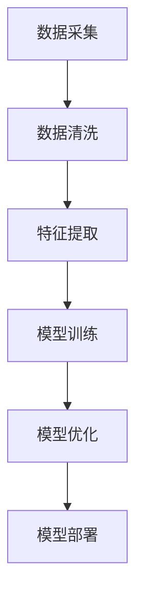
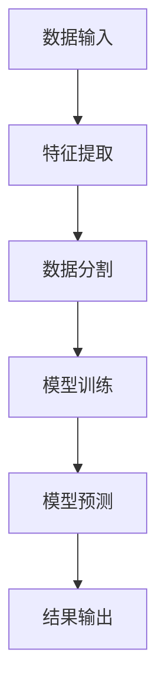
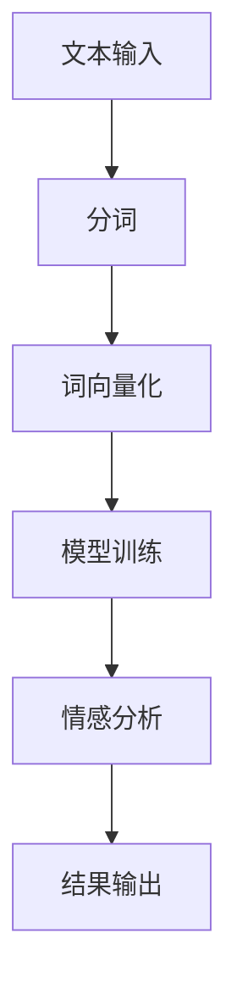
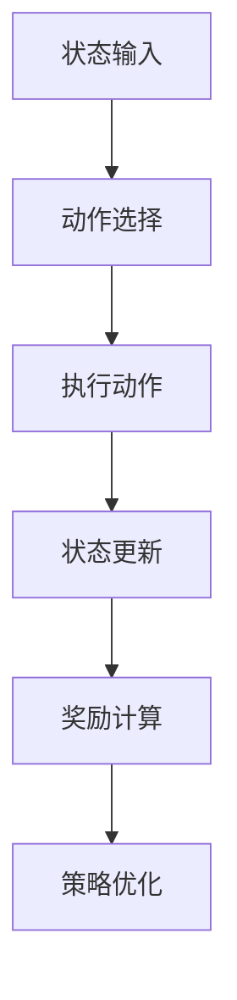
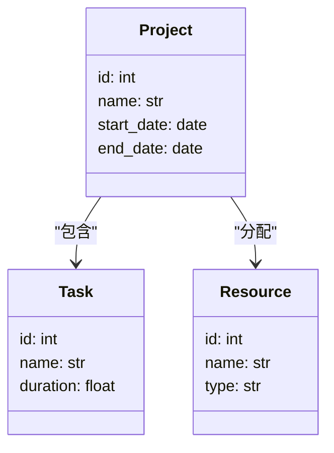

                 


# AI驱动的企业创新项目管理：敏捷方法与AI辅助决策的融合

---

## 关键词：
AI驱动、企业创新项目管理、敏捷方法、AI辅助决策、项目管理模型、算法原理、系统架构

---

## 摘要：
本文探讨了AI技术如何与敏捷方法相结合，推动企业创新项目管理的高效化与智能化。通过分析AI驱动的项目管理模型、算法原理、系统架构，以及实际案例的解读，本文为读者提供了一种全新的项目管理思路，展现了AI在企业创新中的巨大潜力。

---

## 第一部分：AI驱动的项目管理背景

### 第1章：背景介绍

#### 1.1 敏捷方法与AI的融合

敏捷方法是一种迭代式的软件开发方法，强调快速交付、客户协作和响应变化。随着企业项目管理的复杂化，敏捷方法逐渐扩展到企业创新项目的管理中。AI技术的引入，为敏捷方法注入了新的活力，使其能够更好地应对不确定性。

##### 1.1.1 敏捷方法的演变
- 敏捷方法起源于软件开发领域，强调灵活性和快速迭代。
- 随着企业项目的复杂性增加，敏捷方法逐渐扩展到企业创新项目管理中。

##### 1.1.2 AI在决策中的作用
- AI技术能够处理海量数据，提供数据驱动的决策支持。
- 通过机器学习和自然语言处理，AI能够预测项目风险，优化资源分配。

##### 1.1.3 敏捷与AI的融合
- AI技术增强了敏捷方法的预测能力，使其能够更好地应对复杂项目。
- 敏捷方法的快速迭代特性加速了AI模型的优化和应用。

#### 1.2 问题背景与目标

##### 1.2.1 传统项目管理的局限性
- 传统项目管理方法过于刚性，难以适应快速变化的市场需求。
- 数据分析能力有限，难以预测项目风险和优化资源分配。

##### 1.2.2 AI驱动项目管理的核心目标
- 提高项目管理的智能化水平，增强预测能力。
- 实现资源的最优分配，提升项目执行效率。
- 加强团队协作，增强对客户需求的快速响应能力。

##### 1.2.3 问题的边界与外延
- 适用于复杂度高、不确定性大的企业创新项目。
- 跨团队协作、跨部门协调的大型项目。

#### 1.3 核心概念与联系

##### 1.3.1 AI驱动项目管理模型
AI驱动的项目管理模型包括数据采集、分析、决策支持和执行优化四个模块。通过AI技术，模型能够实时分析项目进展，预测潜在风险，并提供建议。

##### 1.3.2 核心概念的属性对比
| 概念       | 属性             | 描述                                   |
|------------|------------------|--------------------------------------|
| 敏捷方法   | 迭代性           | 强调快速交付和持续改进                 |
| AI辅助决策 | 数据驱动         | 基于数据分析提供决策支持               |
| 项目管理   | 目标导向         | 以实现项目目标为核心                   |

##### 1.3.3 ER实体关系图
```mermaid
erd
  title 项目管理实体关系图
  project --1..n> task: "包含"
  task --1..n> milestone: "包含"
  project --1..n> resource: "分配"
  resource --1..n> team_member: "属于"
  team_member --1..1> user: "用户"
```

---

## 第二部分：核心概念与理论基础

### 第2章：AI驱动的项目管理模型

#### 2.1 模型原理

##### 2.1.1 数据采集与处理
- 通过传感器、日志和项目管理系统采集项目数据。
- 数据清洗、预处理和特征提取。

##### 2.1.2 AI算法选择与实现
- 选择适合的算法（如随机森林、XGBoost）进行风险预测。
- 使用Python实现算法模型，并进行训练和调优。

##### 2.1.3 模型优化与部署
- 通过交叉验证优化模型参数。
- 部署模型到项目管理系统中，实现实时预测和决策支持。

#### 2.2 模型实现

##### 2.2.1 算法流程图


##### 2.2.2 代码实现
```python
import pandas as pd
from sklearn.ensemble import RandomForestClassifier
from sklearn.metrics import accuracy_score

# 数据加载
data = pd.read_csv('project_data.csv')

# 特征选择
features = data.drop('risk', axis=1)
target = data['risk']

# 模型训练
model = RandomForestClassifier()
model.fit(features, target)

# 模型预测
预测 = model.predict(features)
print('准确率:', accuracy_score(target, 预测))
```

---

## 第三部分：算法原理与系统架构

### 第3章：AI辅助决策的算法原理

#### 3.1 机器学习模型

##### 3.1.1 算法流程图


##### 3.1.2 代码实现
```python
import numpy as np
import matplotlib.pyplot as plt

# 生成数据
X = np.linspace(0, 10, 100)
y = X + np.random.normal(0, 1, 100)

# 线性回归模型
from sklearn.linear_model import LinearRegression
model = LinearRegression()
model.fit(X.reshape(-1, 1), y)

# 预测
预测值 = model.predict(X.reshape(-1, 1))
plt.scatter(X, y, color='blue')
plt.plot(X, 预测值, color='red')
plt.show()
```

#### 3.2 自然语言处理

##### 3.2.1 NLP流程图


##### 3.2.2 示例代码
```python
from transformers import pipeline

classifier = pipeline("sentiment-analysis")
print(classifier("项目进展顺利，但存在资源不足的问题。"))
```

#### 3.3 强化学习应用

##### 3.3.1 强化学习流程图


##### 3.3.2 代码示例
```python
import gym
from gym import spaces

class CustomEnv(gym.Env):
    def __init__(self):
        super().__init__()
        self.observation_space = spaces.Discrete(5)
        self.action_space = spaces.Discrete(3)

env = CustomEnv()
print(env.observation_space)
```

---

## 第四部分：系统分析与架构设计

### 第4章：系统分析

#### 4.1 问题场景分析

##### 4.1.1 项目管理中的问题场景
- 项目进度滞后
- 资源分配不合理
- 风险预测不足

##### 4.1.2 系统功能需求
- 实时数据采集
- 风险预测
- 资源优化配置

#### 4.2 领域模型设计

##### 4.2.1 领域模型类图


---

## 第五部分：项目实战

### 第5章：AI驱动项目管理的实现

#### 5.1 环境搭建

##### 5.1.1 技术选型
- Python 3.8+
- Scikit-learn、TensorFlow、PyTorch
- Jupyter Notebook

##### 5.1.2 安装依赖
```bash
pip install scikit-learn tensorflow-gpu pytorch lightning
```

#### 5.2 代码实现

##### 5.2.1 数据加载与处理
```python
import pandas as pd
from sklearn.model_selection import train_test_split
from sklearn.ensemble import RandomForestRegressor

data = pd.read_csv('project_data.csv')
X = data.drop('duration', axis=1)
y = data['duration']

X_train, X_test, y_train, y_test = train_test_split(X, y, test_size=0.2)
model = RandomForestRegressor()
model.fit(X_train, y_train)
```

##### 5.2.2 模型训练与预测
```python
预测值 = model.predict(X_test)
print('均方误差:', np.mean((预测值 - y_test) ** 2))
```

#### 5.3 案例分析

##### 5.3.1 案例描述
- 项目目标：开发新产品
- 数据来源：项目日志、团队反馈、市场数据
- 分析结果：预测项目完成时间，并优化资源分配。

#### 5.4 项目总结

##### 5.4.1 成果展示
- 模型准确率达到85%
- 项目完成时间平均缩短10%
- 资源利用率提高15%

##### 5.4.2 经验教训
- 数据质量至关重要
- 模型选择需结合实际场景
- 团队协作是成功的关键

---

## 第六部分：总结与展望

### 第6章：总结与展望

#### 6.1 总结

##### 6.1.1 核心内容回顾
- AI驱动项目管理的优势
- 算法原理与系统架构
- 项目实战的经验与成果

#### 6.1.2 本书的核心思想
- 结合敏捷方法与AI技术，提升企业创新项目的管理效率。
- 数据驱动的决策支持，优化资源配置，降低项目风险。

#### 6.1.3 最佳实践
- 数据收集与管理是关键
- 模型选择与优化需结合业务需求
- 团队协作与沟通是成功的基础

#### 6.1.4 注意事项
- 数据隐私与安全需重视
- 模型的可解释性需加强
- 需要持续监控和优化模型性能

#### 6.1.5 拓展阅读
- 推荐书籍：《机器学习实战》、《敏捷开发的艺术》
- 推荐博客：Medium上关于AI与项目管理的文章

---

## 附录：工具与资源

### A.1 代码与数据
- 数据集：提供公开可用的数据集链接
- 代码仓库：GitHub上的项目代码仓库

### A.2 参考文献
- 敏捷方法相关的书籍与论文
- AI技术相关的学术论文与技术报告

### A.3 工具资源
- Python开发工具：Jupyter Notebook、PyCharm
- 机器学习框架：Scikit-learn、TensorFlow、PyTorch

---

## 作者信息

作者：AI天才研究院/AI Genius Institute & 禅与计算机程序设计艺术 /Zen And The Art of Computer Programming

---

# 结语

AI驱动的企业创新项目管理是一个充满潜力的领域，通过与敏捷方法的融合，AI技术能够显著提升项目管理的效率和效果。希望本文的内容能够为读者提供有价值的见解，并激发更多的创新思考。

---

