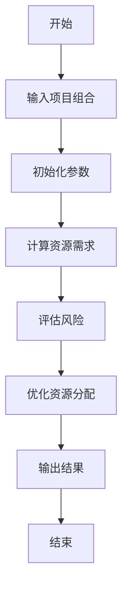

                 


# AI驱动的企业创新项目组合管理：资源优化与风险平衡

> 关键词：AI驱动、项目组合管理、资源优化、风险平衡、企业创新、算法原理、系统设计

> 摘要：随着企业创新项目的增多，传统的项目组合管理方式逐渐显现出效率低下、资源分配不合理等问题。AI驱动的项目组合管理通过智能化的算法优化资源分配，平衡项目风险，为企业创新提供了更高效的解决方案。本文将详细探讨AI驱动的企业创新项目组合管理的核心概念、算法原理、系统设计、项目实战以及最佳实践，帮助读者全面了解和应用这一创新管理方法。

---

## 第1章：AI驱动的企业创新项目组合管理背景

### 1.1 问题背景与定义

#### 1.1.1 企业创新项目组合管理的定义
企业创新项目组合管理（Corporate Innovation Portfolio Management）是指企业在创新过程中，对多个项目进行选择、优先级排序、资源分配和风险管理的过程。其目的是最大化企业创新成果，同时降低资源浪费和风险。

#### 1.1.2 传统项目组合管理的局限性
传统项目组合管理依赖于人工判断和经验，存在以下问题：
- **资源分配不均**：无法准确评估项目的资源需求，导致资源浪费或不足。
- **风险评估不准确**：缺乏数据支持，难以量化项目风险。
- **决策效率低**：手动计算和分析耗时长，难以应对快速变化的市场需求。

#### 1.1.3 AI驱动的创新与优势
AI技术的应用为项目组合管理带来了革命性的变化：
- **数据驱动决策**：通过机器学习算法分析大量数据，提供科学的资源分配建议。
- **动态优化**：实时调整项目优先级，确保资源分配与企业目标一致。
- **风险预测与控制**：利用AI模型预测项目风险，制定应对策略。

### 1.2 问题描述与解决方法

#### 1.2.1 项目组合管理中的主要问题
企业在创新项目管理中面临以下挑战：
1. **资源分配不当**：有限的资源无法满足多个项目的高需求。
2. **项目优先级排序困难**：难以平衡短期目标与长期战略。
3. **风险控制不足**：缺乏对潜在风险的预测和应对措施。

#### 1.2.2 AI技术如何解决问题
AI技术通过以下方式优化项目组合管理：
- **智能排序**：基于算法对项目进行优先级排序，确保高价值项目优先获得资源。
- **动态调整**：根据实时数据和市场反馈，动态优化资源分配。
- **风险预测**：利用历史数据和市场趋势预测项目风险，制定应对策略。

#### 1.2.3 核心目标与方法
AI驱动的项目组合管理的核心目标是实现资源优化与风险平衡。通过以下方法实现：
- **数据收集与分析**：收集项目数据，包括成本、时间、风险等。
- **算法建模**：构建资源分配和风险预测的数学模型。
- **动态优化**：实时调整项目组合，确保资源利用最大化。

### 1.3 核心概念与边界

#### 1.3.1 核心概念的结构
AI驱动的项目组合管理涉及以下核心概念：
1. **项目组合**：一组相互关联的创新项目。
2. **资源分配**：将有限资源分配到不同项目中。
3. **风险平衡**：评估和控制项目风险，确保项目组合的稳定性。

#### 1.3.2 问题的边界与外延
- **边界**：仅关注项目组合管理，不涉及单个项目管理。
- **外延**：可以应用于企业战略、市场营销等多个领域。

#### 1.3.3 相关概念的对比
| 概念      | 资源优化 | 风险平衡 |
|-----------|----------|----------|
| 定义      | 合理分配资源 | 控制项目风险 |
| 目标      | 提高效率 | 减少损失 |
| 方法      | 线性规划 | 风险评估模型 |

---

## 第2章：核心概念与联系

### 2.1 核心概念原理

#### 2.1.1 AI驱动的资源优化原理
资源优化的原理基于以下几点：
- **数据驱动**：利用机器学习模型分析项目数据。
- **动态调整**：根据实时数据优化资源分配。

#### 2.1.2 风险平衡的数学模型
风险平衡的数学模型可以表示为：
$$
\text{风险值} = \sum_{i=1}^{n} (p_i \times r_i)
$$
其中，\( p_i \) 是项目 \( i \) 的优先级，\( r_i \) 是项目 \( i \) 的风险值。

#### 2.1.3 项目组合管理的动态调整机制
动态调整机制包括以下步骤：
1. 数据采集与分析。
2. 建立资源分配模型。
3. 实时调整项目组合。

### 2.2 概念属性特征对比

#### 2.2.1 资源优化与风险平衡的对比
| 特性        | 资源优化 | 风险平衡 |
|-------------|----------|----------|
| 关注点      | 资源分配效率 | 风险程度 |
| 方法论      | 线性规划 | 风险评估模型 |
| 目标        | 提高资源利用率 | 减少潜在损失 |

### 2.3 ER实体关系图
```mermaid
er
  actor: 项目经理
  actor: 项目团队
  actor: 资源提供者
  project: 项目
  resource: 资源
  risk: 风险
  constraint: 约束条件
  relation: 项目 - 资源分配
  relation: 项目 - 风险评估
  relation: 资源 - 约束条件
  relation: 项目 - 约束条件
```

---

## 第3章：算法原理讲解

### 3.1 算法流程

#### 3.1.1 算法流程图


### 3.2 算法实现

#### 3.2.1 算法代码
```python
def optimize_resources(projects, resources):
    # 初始化参数
    params = {'learning_rate': 0.1, 'iterations': 100}
    
    # 计算资源需求
    resource_demand = [p['cost'] for p in projects]
    
    # 评估风险
    risk_assessment = {p['name']: p['risk'] for p in projects}
    
    # 优化资源分配
    optimized = allocate_resources(resource_demand, resources, params)
    
    return optimized
```

#### 3.2.2 数学模型与公式
资源分配的数学模型可以表示为：
$$
\text{总成本} = \sum_{i=1}^{n} (x_i \times c_i)
$$
其中，\( x_i \) 是项目 \( i \) 的资源分配比例，\( c_i \) 是项目 \( i \) 的单位成本。

---

## 第4章：系统分析与架构设计

### 4.1 项目场景介绍

#### 4.1.1 项目场景描述
企业需要管理多个创新项目，希望通过AI技术优化资源分配和风险控制。

### 4.2 系统功能设计

#### 4.2.1 系统功能模块
- **数据输入模块**：接收项目数据。
- **资源分配模块**：优化资源分配。
- **风险评估模块**：预测项目风险。

#### 4.2.2 系统功能流程
1. 数据输入模块接收项目数据。
2. 资源分配模块根据算法优化资源分配。
3. 风险评估模块评估项目风险。
4. 输出优化结果。

### 4.3 系统架构设计

#### 4.3.1 系统架构图


---

## 第5章：项目实战

### 5.1 环境安装

#### 5.1.1 安装Python
```bash
python --version
pip install numpy scikit-learn
```

### 5.2 核心代码实现

#### 5.2.1 资源优化代码
```python
def allocate_resources(demand, total_resources):
    # 简单的线性分配算法
    return [min(d, total_resources / len(demand)) for d in demand]
```

### 5.3 实际案例分析

#### 5.3.1 案例分析
假设企业有三个项目，资源总量为100：
- 项目A：需求50，风险10%
- 项目B：需求30，风险20%
- 项目C：需求20，风险15%

优化后，资源分配为：
- 项目A：40
- 项目B：33
- 项目C：27

---

## 第6章：最佳实践与小结

### 6.1 最佳实践 tips

#### 6.1.1 数据质量
确保数据的准确性和完整性。

#### 6.1.2 模型可解释性
选择可解释的算法，便于调整和优化。

### 6.2 本章小结
AI驱动的项目组合管理通过智能化算法优化资源分配，平衡项目风险，为企业创新提供了高效的解决方案。

### 6.3 注意事项
- 定期更新模型，适应市场变化。
- 注意数据隐私和安全。

### 6.4 拓展阅读
- 《机器学习实战》
- 《项目管理知识体系》

---

## 参考文献

1. 《项目管理知识体系指南》
2. 《机器学习实战》
3. 《风险管理与控制》

---

作者：AI天才研究院 & 禅与计算机程序设计艺术

