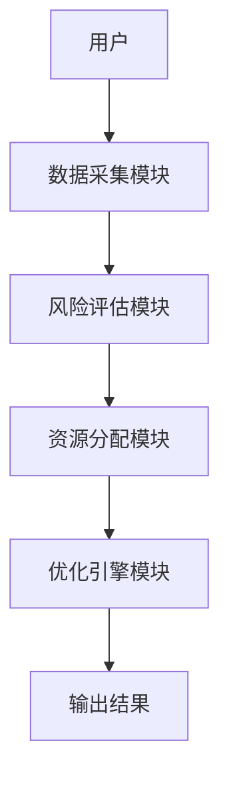
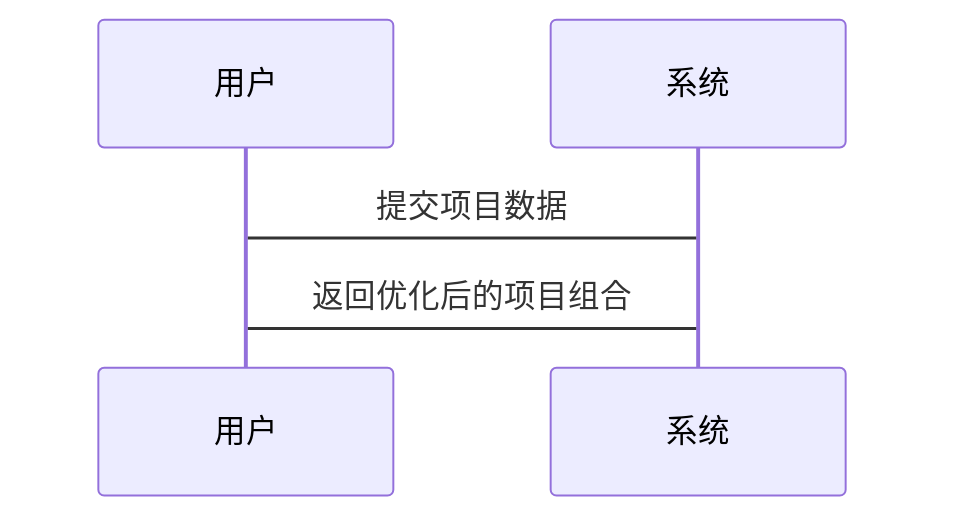

                 


# AI驱动的企业创新项目组合管理：风险平衡与资源最优分配模型

> 关键词：AI驱动，项目组合管理，风险平衡，资源最优分配，创新项目，企业创新

> 摘要：本文深入探讨了AI在企业创新项目组合管理中的应用，特别是如何通过AI技术实现风险平衡与资源最优分配。文章结合理论模型、算法实现和实际案例，系统地分析了AI驱动的企业创新项目组合管理的核心原理、方法和实践应用。通过详细讲解风险平衡与资源分配的理论基础、AI驱动的项目组合管理模型、基于强化学习的优化算法、系统架构设计以及实际项目案例，本文为读者提供了全面的理解和实践指南，帮助企业在创新项目管理中实现更高效的风险控制和资源优化。

---

# 第1章: AI驱动的项目组合管理概述

## 1.1 项目组合管理的基本概念

### 1.1.1 项目组合管理的定义
项目组合管理（Project Portfolio Management，PPM）是指在企业创新活动中，对多个项目的组合进行选择、优先级排序、资源分配和风险管理的过程。目的是在有限资源条件下，最大化项目的整体价值和战略目标的实现。

### 1.1.2 项目组合管理的核心要素
- **项目目标**：明确每个项目的短期和长期目标。
- **资源分配**：合理分配人力、资金、时间等资源。
- **风险评估**：识别和量化项目可能面临的风险。
- **优先级排序**：根据项目的价值、风险和资源需求，确定项目的优先级。

### 1.1.3 传统项目组合管理的局限性
- **主观性**：传统方法依赖于人工判断，容易受到主观因素的影响。
- **复杂性**：随着项目数量的增加，传统方法难以处理复杂的组合优化问题。
- **动态性**：传统方法难以快速响应外部环境的变化和内部资源的动态调整。

## 1.2 AI驱动的创新

### 1.2.1 AI在企业创新中的作用
- **数据驱动决策**：通过分析大量数据，AI能够提供更精准的决策支持。
- **自动化优化**：AI算法能够自动优化项目组合，提高效率。
- **动态调整**：AI能够实时监控项目进展和外部环境变化，动态调整项目组合。

### 1.2.2 项目组合管理的AI驱动特征
- **数据驱动**：AI依赖于大量数据进行分析和预测。
- **自动化**：AI能够自动完成项目的筛选、排序和资源分配。
- **动态优化**：AI能够根据实时数据动态调整项目组合。

### 1.2.3 AI驱动的创新优势
- **提高效率**：AI能够快速处理大量数据，缩短决策时间。
- **降低风险**：AI能够提前识别和量化风险，降低项目失败的可能性。
- **最大化价值**：通过优化项目组合，AI能够最大化企业的整体价值。

## 1.3 风险平衡与资源最优分配的重要性

### 1.3.1 风险平衡的定义
风险平衡是指在项目组合中，合理分配风险，使得整体风险最小化，同时满足企业的战略目标。

### 1.3.2 资源最优分配的定义
资源最优分配是指在有限资源条件下，合理分配资源，使得项目的整体价值最大化。

### 1.3.3 风险平衡与资源分配的关系
- **相互影响**：风险平衡和资源分配是相互关联的，资源分配影响项目的执行风险，而风险又影响资源分配的决策。
- **协同优化**：通过协同优化，可以在风险和资源之间找到最佳平衡点，实现整体价值的最大化。

## 1.4 本章小结
本章介绍了AI驱动的项目组合管理的基本概念、传统方法的局限性以及AI驱动的优势。同时，强调了风险平衡与资源最优分配的重要性，为后续章节的深入分析奠定了基础。

---

# 第2章: 风险平衡与资源分配的理论基础

## 2.1 风险平衡的数学模型

### 2.1.1 风险平衡的优化目标
最大化整体项目组合的价值，同时最小化整体风险。

$$
\text{目标函数：} \quad \max \sum_{i=1}^{n} v_i x_i - \lambda \sum_{i=1}^{n} r_i x_i
$$

其中，$v_i$ 是项目的价值，$r_i$ 是项目的风险，$x_i$ 是项目的选择变量（0或1），$\lambda$ 是风险惩罚系数。

### 2.1.2 风险平衡的约束条件
- **资源约束**：$\sum_{i=1}^{n} c_i x_i \leq C$，其中 $c_i$ 是项目 $i$ 的资源需求，$C$ 是可用资源总量。
- **风险约束**：$\sum_{i=1}^{n} r_i x_i \leq R$，其中 $R$ 是可接受的整体风险水平。

### 2.1.3 风险平衡的数学表达式
$$
\begin{cases}
\max \sum_{i=1}^{n} v_i x_i - \lambda \sum_{i=1}^{n} r_i x_i \\
\sum_{i=1}^{n} c_i x_i \leq C \\
\sum_{i=1}^{n} r_i x_i \leq R \\
x_i \in \{0,1\}
\end{cases}
$$

## 2.2 资源分配的线性规划模型

### 2.2.1 资源分配的变量定义
- $x_i$：项目 $i$ 的选择变量（0或1）。
- $c_i$：项目 $i$ 的资源需求。

### 2.2.2 资源分配的目标函数
$$
\max \sum_{i=1}^{n} v_i x_i
$$

### 2.2.3 资源分配的约束条件
$$
\sum_{i=1}^{n} c_i x_i \leq C
$$

## 2.3 风险与资源的权衡分析

### 2.3.1 风险与资源的权衡关系
- **高风险，高回报**：某些项目风险高，但回报也高。
- **低风险，低回报**：某些项目风险低，但回报也低。

### 2.3.2 风险与资源的敏感性分析
通过分析不同项目的风险和资源需求，找到最优的资源分配方案。

### 2.3.3 风险与资源的优化策略
- **优先选择高价值、低风险的项目**。
- **合理分配资源，平衡风险与回报**。

## 2.4 本章小结
本章通过数学模型分析了风险平衡与资源分配的理论基础，提出了基于线性规划的资源分配模型，并讨论了风险与资源的权衡关系和优化策略。

---

# 第3章: AI驱动的项目组合管理模型

## 3.1 模型设计的核心要素

### 3.1.1 数据输入
- 项目价值 $v_i$
- 项目风险 $r_i$
- 项目资源需求 $c_i$
- 可用资源总量 $C$

### 3.1.2 模型处理
- 数据清洗与特征提取
- 风险与资源的量化
- 算法优化

### 3.1.3 输出结果
- 项目选择 $x_i$
- 资源分配方案
- 风险平衡报告

## 3.2 模型的数学表达

### 3.2.1 模型的优化目标
$$
\max \sum_{i=1}^{n} v_i x_i - \lambda \sum_{i=1}^{n} r_i x_i
$$

### 3.2.2 模型的约束条件
$$
\sum_{i=1}^{n} c_i x_i \leq C
$$

### 3.2.3 模型的变量关系
$$
x_i \in \{0,1\}
$$

## 3.3 模型的验证与评估

### 3.3.1 模型的验证方法
- 交叉验证
- 留出法
- 置信区间分析

### 3.3.2 模型的评估指标
- 准确率
- 召回率
- F1分数

## 3.4 本章小结
本章详细介绍了AI驱动的项目组合管理模型的设计要素、数学表达和验证评估方法，为后续章节的算法实现奠定了基础。

---

# 第4章: 基于强化学习的项目组合优化算法

## 4.1 强化学习的基本原理

### 4.1.1 强化学习的定义
强化学习是一种通过智能体与环境交互，学习最优策略的方法。

### 4.1.2 强化学习的核心要素
- 状态（State）
- 动作（Action）
- 奖励（Reward）

### 4.1.3 强化学习的算法流程
1. 初始化状态 $s_0$。
2. 根据策略选择动作 $a$。
3. 执行动作，得到新的状态 $s_1$ 和奖励 $r$。
4. 更新策略，继续循环。

## 4.2 项目组合优化的强化学习模型

### 4.2.1 状态定义
- 当前可用资源 $C$。
- 未选择的项目集合。

### 4.2.2 动作空间
- 选择或不选择某个项目。

### 4.2.3 奖励函数
$$
r = v_i - \lambda r_i
$$

### 4.2.4 算法实现
```python
class ProjectSelector:
    def __init__(self, projects, resources):
        self.projects = projects
        self.resources = resources
        self.current_state = resources

    def select_project(self, project_index):
        if self.current_state >= self.projects[project_index]['cost']:
            self.current_state -= self.projects[project_index]['cost']
            return True
        return False
```

## 4.3 算法的优化与调优

### 4.3.1 算法的优化策略
- 增加状态空间的维度。
- 使用更复杂的策略网络。

### 4.3.2 算法的调优方法
- 调整学习率。
- 改变奖励函数。

## 4.4 本章小结
本章介绍了强化学习的基本原理，并提出了基于强化学习的项目组合优化算法，通过Python代码实现了算法的核心功能。

---

# 第5章: 系统架构与实现

## 5.1 系统架构设计

### 5.1.1 系统模块
- 数据采集模块
- 风险评估模块
- 资源分配模块
- 优化引擎模块

### 5.1.2 系统架构图


## 5.2 系统接口设计

### 5.2.1 数据接口
- 输入：项目数据表
- 输出：优化后的项目组合

### 5.2.2 接口实现
```python
def optimize_portfolio(projects, resources):
    # 简单实现：选择价值最大且资源需求最小的项目
    selected = []
    remaining_resources = resources
    for project in sorted(projects, key=lambda x: x['value'], reverse=True):
        if remaining_resources >= project['cost']:
            selected.append(project)
            remaining_resources -= project['cost']
    return selected
```

## 5.3 系统交互流程

### 5.3.1 交互流程图


## 5.4 本章小结
本章详细描述了AI驱动的项目组合管理系统的架构设计、接口设计和交互流程，为实际应用提供了参考。

---

# 第6章: 项目实战——AI驱动的创新项目组合优化

## 6.1 项目背景与需求分析

### 6.1.1 项目背景
某科技公司计划启动多个创新项目，需要在有限资源下选择最优的项目组合。

### 6.1.2 数据准备
- 项目价值：$v_i$
- 项目风险：$r_i$
- 项目资源需求：$c_i$
- 可用资源：$C$

## 6.2 数据清洗与特征提取

### 6.2.1 数据清洗
- 删除无效数据。
- 处理缺失值。

### 6.2.2 特征提取
- 提取项目的核心特征。

## 6.3 模型训练与优化

### 6.3.1 模型训练
- 使用强化学习算法训练模型。

### 6.3.2 模型优化
- 调整超参数。
- 提高模型准确率。

## 6.4 实验结果与分析

### 6.4.1 实验结果
- 优化后的项目组合。
- 资源分配方案。
- 风险平衡报告。

### 6.4.2 结果分析
- 项目的整体价值。
- 风险与资源的平衡。

## 6.5 本章小结
本章通过一个实际案例，展示了AI驱动的创新项目组合优化的过程，验证了模型的有效性和实用性。

---

# 第7章: AI驱动的企业创新项目组合管理的扩展与展望

## 7.1 最佳实践与经验分享

### 7.1.1 关键成功因素
- 数据质量。
- 模型选择。
- 参数调优。

### 7.1.2 常见问题及解决方案
- 数据不足：增加数据来源。
- 模型过拟合：减少模型复杂度。

## 7.2 未来研究方向

### 7.2.1 多目标优化
- 同时优化多个目标，如价值、风险、资源。

### 7.2.2 动态调整
- 实时监控项目进展，动态调整项目组合。

## 7.3 本章小结
本章总结了AI驱动的企业创新项目组合管理的最佳实践，并展望了未来的研究方向。

---

# 作者：AI天才研究院/AI Genius Institute & 禅与计算机程序设计艺术 /Zen And The Art of Computer Programming

---

通过以上目录结构和内容安排，我们可以看到，本文从理论到实践，系统地探讨了AI驱动的企业创新项目组合管理的核心问题，包括风险平衡与资源最优分配模型的设计与实现。通过实际案例分析和算法实现，本文为读者提供了一个全面的解决方案，帮助企业在创新项目管理中实现更高效的风险控制和资源优化。

