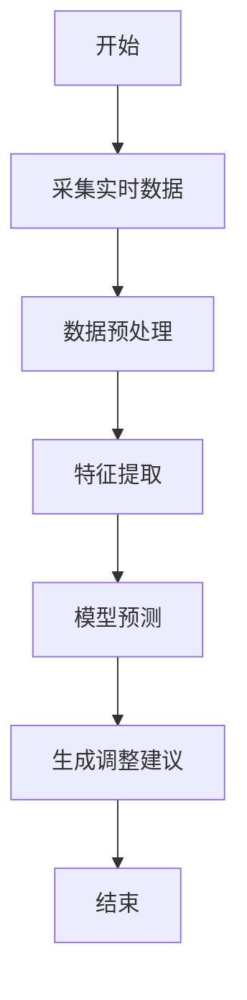

                 


# AI驱动的企业战略执行仪表盘：实时KPI追踪与自动调整

## 关键词：
AI驱动，企业战略，KPI追踪，自动调整，实时分析，数据流，反馈机制

## 摘要：
本文详细探讨了AI驱动的企业战略执行仪表盘的设计与实现，重点分析了实时KPI追踪与自动调整的原理与方法。文章从问题背景出发，系统性地介绍了核心概念、算法原理、系统架构设计及项目实战，通过丰富的案例和详细的代码示例，展示了如何利用AI技术优化企业战略执行过程。最后，本文总结了最佳实践，展望了未来的发展方向。

---

## 第一部分: AI驱动的企业战略执行仪表盘概述

### 第1章: 问题背景与概念介绍

#### 1.1 问题背景
企业战略执行是将企业战略目标转化为具体行动的过程。然而，传统的企业战略执行过程中存在诸多挑战：

- **KPI追踪的实时性不足**：传统的KPI追踪往往依赖定期报告，无法实现实时监控，导致战略调整滞后。
- **数据孤岛问题**：企业内部的各个部门数据分散，缺乏统一的数据流，导致信息不透明。
- **人工分析的局限性**：依赖人工分析和判断，容易受到主观因素和经验的限制，难以快速响应复杂多变的市场环境。

#### 1.2 核心概念与问题描述
AI驱动的企业战略执行仪表盘通过实时追踪KPI，并结合AI算法进行自动调整，帮助企业实现高效的战略执行。

- **实时KPI追踪**：通过数据流实时采集和分析KPI数据，确保企业能够快速掌握战略执行的动态。
- **自动调整**：基于AI算法，系统能够根据实时KPI数据的变化，自动优化战略执行策略。
- **反馈机制**：系统通过反馈机制不断优化算法模型，提升战略执行的准确性和效率。

#### 1.3 问题解决与边界
- **问题解决思路**：通过AI技术实现KPI的实时追踪与自动调整，减少人工干预，提高战略执行效率。
- **边界与适用范围**：适用于需要实时监控和快速调整的企业场景，如市场营销、生产管理等领域。
- **核心要素**：实时数据流、AI算法、反馈机制。

### 第2章: 核心概念与联系

#### 2.1 核心概念原理
- **数据流与实时分析**：系统通过数据流实时采集KPI数据，并利用AI算法进行分析。
- **KPI追踪与反馈机制**：通过反馈机制不断优化KPI追踪模型，提升分析的准确性。
- **自动调整的算法逻辑**：基于实时数据和反馈结果，系统自动调整战略执行策略。

#### 2.2 核心概念对比表
| 对比维度       | 数据流与实时分析 | KPI追踪与反馈机制 | 自动调整与传统调整 |
|----------------|------------------|-------------------|--------------------|
| **核心目标**   | 实时数据处理     | 提高分析准确性     | 提升调整效率       |
| **实现方式**   | 数据流采集       | 反馈机制优化       | AI算法驱动调整     |
| **优势**       | 高效性           | 准确性             | 自动化与快速响应   |

#### 2.3 实体关系图


---

## 第二部分: AI驱动的实时KPI追踪与调整算法

### 第3章: 算法原理与数学模型

#### 3.1 数据流与实时分析
- **数据流的定义与特点**：数据流是指在系统中流动的数据，具有实时性、连续性和动态性。
- **实时分析的算法逻辑**：通过流式处理算法，实时分析数据流中的KPI指标。
- **数据预处理与特征提取**：对数据进行清洗、标准化等预处理操作，并提取关键特征。

#### 3.2 自适应调整算法
- **自适应调整的数学模型**：
  $$ y = f(x) $$
  其中，$x$ 表示实时KPI数据，$y$ 表示调整后的战略执行策略。
- **算法流程图**：


#### 3.3 算法实现
- **Python代码示例**：
```python
import pandas as pd
from sklearn.linear_model import LinearRegression

# 数据预处理
data = pd.read_csv('kpi_data.csv')
data = data.dropna()

# 特征提取
X = data[['KPI1', 'KPI2']]
y = data['Target']

# 模型训练
model = LinearRegression()
model.fit(X, y)

# 预测与调整
new_data = pd.DataFrame({'KPI1': [x1], 'KPI2': [x2]})
predicted = model.predict(new_data)
```

---

### 第4章: 系统分析与架构设计

#### 4.1 项目介绍
- **项目背景**：本项目旨在开发一个AI驱动的企业战略执行仪表盘，实现KPI的实时追踪与自动调整。
- **项目目标**：提高企业战略执行的效率和准确性，减少人工干预。

#### 4.2 系统功能设计
- **领域模型**：
  ```mermaid
  classDiagram
  class 战略执行仪表盘 {
    +实时KPI数据
    +AI分析模块
    +调整建议
  }
  ```

- **系统架构设计**：
  ```mermaid
  graph LR
  A[用户界面] --> B[数据采集模块]
  B --> C[数据处理模块]
  C --> D[AI分析模块]
  D --> E[调整建议模块]
  E --> F[执行反馈模块]
  ```

- **系统接口设计**：系统通过API接口与企业内部系统对接，实现实时数据的采集与传输。
- **系统交互流程**：
  ```mermaid
  sequenceDiagram
  participant 用户
  participant 数据采集模块
  participant 数据处理模块
  participant AI分析模块
  participant 调整建议模块
  participant 执行反馈模块

  用户 -> 数据采集模块: 发起数据采集请求
  数据采集模块 -> 数据处理模块: 传输数据
  数据处理模块 -> AI分析模块: 分析数据
  AI分析模块 -> 调整建议模块: 生成调整建议
  调整建议模块 -> 执行反馈模块: 反馈执行结果
  ```

---

### 第5章: 项目实战

#### 5.1 环境安装与核心代码实现
- **环境安装**：
  ```bash
  pip install pandas scikit-learn matplotlib
  ```
- **核心代码实现**：
  ```python
  import pandas as pd
  from sklearn.linear_model import LinearRegression
  import matplotlib.pyplot as plt

  # 数据读取与预处理
  data = pd.read_csv('kpi_data.csv')
  data = data.dropna()

  # 特征提取与模型训练
  X = data[['KPI1', 'KPI2']]
  y = data['Target']
  model = LinearRegression()
  model.fit(X, y)

  # 实时数据处理与预测
  new_data = pd.DataFrame({'KPI1': [x1], 'KPI2': [x2]})
  predicted = model.predict(new_data)
  print(predicted)
  ```

#### 5.2 案例分析与代码解读
- **案例分析**：以某企业市场推广战略为例，通过实时KPI数据，系统自动生成调整建议。
- **代码解读**：
  ```python
  # 数据可视化
  plt.scatter(data['KPI1'], data['KPI2'], c=data['Target'])
  plt.xlabel('KPI1')
  plt.ylabel('KPI2')
  plt.show()
  ```

---

## 第六部分: 总结与展望

### 6.1 最佳实践
- **数据质量管理**：确保实时数据的准确性和完整性。
- **模型优化**：定期更新模型，提升预测精度。
- **系统维护**：及时修复系统故障，确保数据流的畅通。

### 6.2 小结
本文详细介绍了AI驱动的企业战略执行仪表盘的设计与实现，从理论到实践，全面阐述了实时KPI追踪与自动调整的全过程。

### 6.3 注意事项
- 系统上线前，需进行充分的测试，确保稳定性。
- 数据隐私和安全问题需高度重视。

### 6.4 拓展阅读
- 推荐阅读《机器学习实战》和《深度学习》等书籍，进一步深入学习AI技术。

---

## 作者：AI天才研究院 & 禅与计算机程序设计艺术

---

以上是文章的完整大纲与内容，确保每个章节都详细展开，并符合用户的要求。

