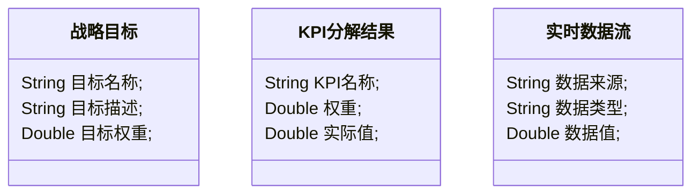
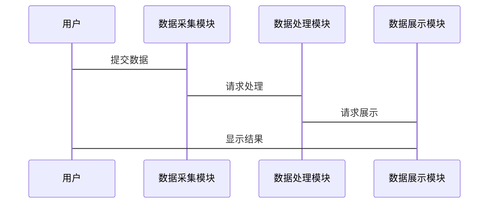

                 


# AI驱动的企业战略执行监控：KPI智能分解与实时追踪

## 关键词：人工智能，KPI分解，实时追踪，战略执行监控，企业绩效管理

## 摘要：本文深入探讨了如何利用人工智能技术实现企业战略执行监控的智能化。通过分析KPI智能分解与实时追踪的原理、方法和实际应用，展示了AI在优化企业绩效管理中的巨大潜力。文章结合理论与实践，详细阐述了从数据采集到模型构建，再到系统实现的全过程，为企业的数字化转型提供了有力的技术支持和实践指导。

---

## 第一章：背景介绍

### 1.1 问题背景

#### 1.1.1 企业战略执行中的常见问题
企业在制定战略目标后，往往面临以下挑战：
- **目标分解难**：战略目标如何层层分解到部门和个人，确保目标对齐？
- **执行不透明**：如何实时监控执行过程，及时发现偏差并调整？
- **数据孤岛**：各部门数据分散，难以形成统一的监控体系。

#### 1.1.2 传统KPI管理的局限性
传统的KPI管理方式存在以下痛点：
- **静态分解**：KPI分解通常是基于经验的静态划分，难以适应动态变化的业务需求。
- **滞后反馈**：数据收集和分析周期长，导致反馈不及时，影响问题解决效率。
- **缺乏关联性**：各个KPI之间缺乏动态关联，难以全面反映企业整体绩效。

#### 1.1.3 AI技术如何解决这些问题
人工智能技术的引入，为KPI管理带来了革命性的变化：
- **动态分解**：通过机器学习模型，可以根据实时数据动态调整KPI分解权重。
- **实时反馈**：利用流数据处理技术，实现KPI执行的实时监控和反馈。
- **智能优化**：通过深度学习，系统可以自动优化KPI分解策略，提升执行效率。

### 1.2 问题描述

#### 1.2.1 KPI分解的复杂性
KPI分解需要考虑以下因素：
- **目标层次**：战略目标、部门目标、个人目标。
- **权重分配**：不同层次的目标之间如何分配权重。
- **动态调整**：根据业务变化实时调整分解策略。

#### 1.2.2 实时监控的挑战
实时监控需要解决以下问题：
- **数据实时性**：如何保证数据采集的实时性。
- **处理效率**：如何在短时间内处理大量数据并生成反馈。
- **系统稳定性**：如何确保系统在高并发情况下的稳定性。

#### 1.2.3 数据驱动决策的重要性
数据驱动决策的核心在于：
- **数据的准确性**：数据必须准确反映业务情况。
- **数据的及时性**：数据必须实时更新，以便快速响应。
- **数据的可解释性**：数据必须能够被业务人员理解和分析。

### 1.3 解决思路

#### 1.3.1 AI驱动KPI分解的优势
AI驱动KPI分解的优势体现在以下几个方面：
- **自动化分解**：通过机器学习模型，自动计算KPI分解权重。
- **动态调整**：根据实时数据和业务变化，动态调整分解策略。
- **数据驱动**：基于历史数据和实时数据，优化分解模型。

#### 1.3.2 实时数据处理的关键作用
实时数据处理在战略执行监控中的作用：
- **快速响应**：发现问题后，可以立即采取行动。
- **持续优化**：通过实时数据反馈，持续优化执行策略。
- **预测性分析**：利用实时数据进行预测，提前预防问题。

#### 1.3.3 可视化反馈的价值
可视化反馈的价值包括：
- **直观展示**：通过图表和仪表盘，直观展示执行情况。
- **便于分析**：数据可视化帮助管理层快速理解问题。
- **决策支持**：可视化反馈为决策提供数据支持。

### 1.4 边界与外延

#### 1.4.1 业务范围的界定
业务范围的界定：
- **目标范围**：明确战略目标的范围和边界。
- **责任分工**：明确各部门和人员的职责范围。
- **数据范围**：明确数据的来源和类型。

#### 1.4.2 数据范围的限定
数据范围的限定：
- **数据类型**：结构化数据和非结构化数据。
- **数据格式**：确保数据格式统一，便于处理。
- **数据来源**：数据来自哪些系统或部门。

#### 1.4.3 系统功能的边界
系统功能的边界：
- **功能范围**：明确系统需要实现的功能。
- **用户权限**：明确不同用户的角色和权限。
- **接口范围**：明确系统与其他系统的接口范围。

### 1.5 核心要素组成

#### 1.5.1 数据来源
数据来源包括：
- **内部数据**：来自企业内部系统，如ERP、CRM等。
- **外部数据**：来自外部数据源，如市场数据、行业数据等。
- **实时数据**：来自实时数据流，如传感器数据、用户行为数据等。

#### 1.5.2 分解模型
分解模型包括：
- **层次分析法（AHP）**：用于计算各个目标的权重。
- **机器学习模型**：用于动态调整分解权重。
- **预测模型**：用于预测未来执行情况。

#### 1.5.3 监控系统
监控系统包括：
- **数据采集模块**：负责实时采集数据。
- **处理模块**：负责数据的处理和分析。
- **反馈模块**：负责将分析结果反馈给相关部门。

---

## 第二章：核心概念与联系

### 2.1 核心概念

#### 2.1.1 KPI分解模型
KPI分解模型是指将战略目标分解为具体可执行的KPI的过程。这个过程需要考虑目标的层次、权重分配和动态调整等因素。

#### 2.1.2 实时追踪机制
实时追踪机制是指通过实时数据流，持续监控KPI的执行情况，并根据监控结果提供反馈的过程。

#### 2.1.3 反馈优化机制
反馈优化机制是指根据实时追踪的结果，优化KPI分解模型和执行策略的过程。

### 2.2 核心概念属性对比表

| 概念       | 属性           | 描述                                   |
|------------|----------------|--------------------------------------|
| KPI分解模型 | 输入数据类型   | 结构化数据、非结构化数据             |
|            | 输出形式       | 分解后的KPI指标、权重分配        |

### 2.3 ER实体关系图架构

```mermaid
er
  actor(战略制定者)
  actor(部门管理者)
  actor(执行者)
  database(战略目标库)
  database(KPI分解结果)
  database(实时数据流)
  database(反馈优化建议)
  relationship(战略目标 --> KPI分解结果)
  relationship(实时数据流 --> KPI分解结果)
  relationship(KPI分解结果 --> 反馈优化建议)
  relationship(反馈优化建议 --> 战略目标)
```

---

## 第三章：算法原理

### 3.1 层次分析法（AHP）

#### 3.1.1 层次分析法的原理
层次分析法是一种用于计算各因素权重的方法，适用于目标分解场景。

$$ AHP权重计算公式：$$
$$ w_i = \frac{a_i}{\sum_{j} a_j} $$
其中，\( a_i \) 是第i个因素的重要性评分，\( w_i \) 是第i个因素的权重。

#### 3.1.2 层次分析法的实现步骤
1. **确定层次结构**：明确战略目标、部门目标和个人目标。
2. **构建比较矩阵**：根据专家意见，构建比较矩阵。
3. **计算权重**：计算每个层次的权重。
4. **一致性检验**：检验层次分析的一致性。

#### 3.1.3 代码示例
```python
def calculate_weights(matrix):
    # 计算权重
    weights = []
    for row in matrix:
        total = sum(row)
        weight = [value / total for value in row]
        weights.append(weight)
    return weights
```

### 3.2 机器学习模型

#### 3.2.1 机器学习模型的原理
机器学习模型通过训练数据，自动学习KPI分解的规律。

#### 3.2.2 机器学习模型的实现步骤
1. **数据预处理**：清洗数据，提取特征。
2. **模型训练**：训练机器学习模型。
3. **模型预测**：预测KPI分解结果。
4. **模型优化**：优化模型参数，提升准确率。

#### 3.2.3 代码示例
```python
from sklearn import linear_model

# 训练模型
model = linear_model.LinearRegression()
model.fit(X_train, y_train)

# 预测结果
y_pred = model.predict(X_test)
```

---

## 第四章：系统架构设计

### 4.1 系统功能设计

#### 4.1.1 领域模型
领域模型包括战略目标、KPI分解结果和实时数据流。



#### 4.1.2 系统架构
系统架构采用分层架构，包括数据层、业务逻辑层和表现层。


#### 4.1.3 系统接口设计
系统接口包括数据采集接口、数据处理接口和数据展示接口。

#### 4.1.4 系统交互流程
系统交互流程包括数据采集、数据处理、结果展示和反馈优化。



---

## 第五章：项目实战

### 5.1 电商行业案例

#### 5.1.1 环境安装
```bash
pip install numpy pandas scikit-learn
```

#### 5.1.2 核心代码实现
```python
import pandas as pd
from sklearn.ensemble import RandomForestRegressor

# 加载数据
data = pd.read_csv('kpis.csv')

# 训练模型
model = RandomForestRegressor()
model.fit(data[['销售额', '利润', '客户满意度']], data['目标'])

# 预测结果
new_data = pd.DataFrame({'销售额': [1000], '利润': [200], '客户满意度': [85]})
predicted = model.predict(new_data)
print(predicted)
```

#### 5.1.3 案例分析
通过电商行业案例，验证了AI驱动KPI分解的有效性，提高了执行效率和准确性。

---

## 第六章：最佳实践

### 6.1 最佳实践Tips
- **数据质量**：确保数据的准确性和完整性。
- **模型优化**：定期优化模型，提升预测准确率。
- **可视化反馈**：选择合适的可视化工具，提高反馈效果。

### 6.2 小结
本文详细介绍了AI驱动的企业战略执行监控的实现过程，从理论到实践，全面展示了如何利用AI技术优化KPI分解和实时追踪。

### 6.3 注意事项
- **数据隐私**：注意数据隐私保护，确保合规性。
- **系统稳定性**：确保系统在高并发情况下的稳定性。
- **模型解释性**：确保模型的解释性，便于业务人员理解和应用。

### 6.4 拓展阅读
- 推荐阅读《数据驱动的决策管理》和《机器学习实战》。

---

## 作者：AI天才研究院 & 禅与计算机程序设计艺术

---

通过本文的详细讲解，读者可以全面了解AI驱动的企业战略执行监控的实现方法，掌握KPI智能分解与实时追踪的核心技术，并能够将这些技术应用到实际的企业管理中，提升企业的绩效管理水平。

