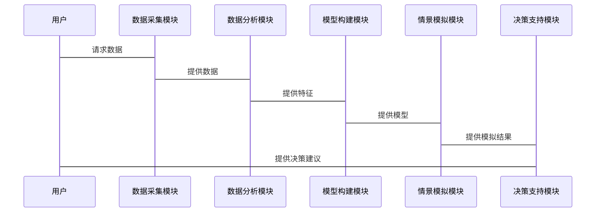

                 


# AI驱动的企业战略规划：大数据分析与预测性情景模拟

> **关键词**: 人工智能, 大数据分析, 企业战略规划, 预测性情景模拟, 机器学习

> **摘要**: 本文探讨了AI技术如何驱动企业战略规划，重点分析了大数据分析与预测性情景模拟的应用。通过背景介绍、核心概念、算法原理、系统架构设计以及实际案例分析，展示了AI在企业战略规划中的巨大潜力。文章结合理论与实践，为企业提供了AI驱动战略规划的全面指南。

---

## 第1章: AI驱动的企业战略规划概述

### 1.1 AI与大数据对企业战略规划的影响

#### 1.1.1 传统企业战略规划的局限性
传统的企业战略规划主要依赖于经验和主观判断，存在以下问题：
- 数据量有限，难以捕捉市场全貌。
- 分析过程耗时且不够精准。
- 预测结果缺乏动态调整能力。

#### 1.1.2 AI与大数据技术的引入
人工智能和大数据技术的引入，为企业战略规划带来了新的可能性：
- 数据采集能力提升，能够处理海量数据。
- 算法优化了分析效率和准确性。
- 实现了动态调整和实时反馈。

#### 1.1.3 AI驱动战略规划的核心优势
- **数据驱动**：利用大数据分析技术，从海量数据中提取有价值的信息。
- **动态预测**：通过机器学习模型，实现对市场变化的实时预测。
- **情景模拟**：构建多种预测模型，模拟不同情景下的企业表现。

---

### 1.2 预测性情景模拟的定义与特点

#### 1.2.1 预测性情景模拟的定义
预测性情景模拟是一种基于数据分析和机器学习技术，通过构建数学模型来预测未来可能发生的各种情景，并评估这些情景对企业战略目标的影响。

#### 1.2.2 预测性情景模拟的核心特点
- **数据驱动**：依赖于高质量的数据输入。
- **动态调整**：能够根据实时数据更新预测结果。
- **多情景分析**：支持多种假设情景的模拟和比较。

#### 1.2.3 预测性情景模拟与传统预测方法的区别
| 特性            | 传统预测方法 | 预测性情景模拟 |
|-----------------|---------------|----------------|
| 数据来源        | 有限数据集   | 海量数据       |
| 分析方法        | 统计分析      | 机器学习       |
| 模拟情景         | 单一情景      | 多种情景       |
| 输出结果        | 单一预测值    | 多维度预测结果 |

---

### 1.3 企业战略规划的AI驱动模式

#### 1.3.1 数据驱动的决策范式
数据驱动的决策范式强调通过数据分析来支持决策，而非仅仅依赖经验或直觉。这种模式能够提高决策的科学性和准确性。

#### 1.3.2 AI在战略规划中的应用场景
- 市场趋势预测
- 竞争对手分析
- 产品定位优化
- 资源配置优化

#### 1.3.3 企业战略规划的数字化转型
企业通过数字化转型，能够更高效地整合数据资源，优化业务流程，并利用AI技术提升决策能力。

---

### 1.4 本章小结
本章介绍了AI驱动的企业战略规划的背景、核心优势以及预测性情景模拟的特点。通过对比传统方法和AI驱动方法，展示了AI技术在企业战略规划中的巨大潜力。

---

## 第2章: AI驱动战略规划的核心概念

### 2.1 AI驱动战略规划的背景与目标

#### 2.1.1 企业战略规划的复杂性
现代企业面临复杂的市场环境，需要应对多方面的不确定性。传统的规划方法难以满足快速变化的市场需求。

#### 2.1.2 AI技术在战略规划中的作用
AI技术能够通过数据分析和模型构建，帮助企业更好地理解市场动态，优化资源配置。

#### 2.1.3 预测性情景模拟的目标
预测性情景模拟的目标是通过构建数学模型，模拟不同情景下的企业表现，为企业制定最优战略提供支持。

---

### 2.2 AI驱动战略规划的关键技术

#### 2.2.1 机器学习与深度学习
- **机器学习**：通过训练数据，构建预测模型。
- **深度学习**：利用神经网络进行特征提取和模式识别。

#### 2.2.2 大数据分析与挖掘
- **数据挖掘**：从海量数据中提取有价值的信息。
- **大数据分析**：利用分布式计算框架（如Hadoop）处理大规模数据。

#### 2.2.3 自然语言处理与知识图谱
- **自然语言处理**：从文本数据中提取信息。
- **知识图谱**：构建企业的知识库，支持智能决策。

---

### 2.3 AI驱动战略规划的实现框架

#### 2.3.1 数据采集与处理
- **数据来源**：企业内部数据、外部市场数据。
- **数据清洗**：去除噪声数据，确保数据质量。

#### 2.3.2 模型构建与训练
- **模型选择**：根据数据特点选择合适的算法。
- **模型训练**：通过大量数据训练模型，优化参数。

#### 2.3.3 情景模拟与决策支持
- **情景模拟**：构建不同假设情景，模拟企业表现。
- **决策支持**：基于模拟结果，提供最优决策建议。

---

### 2.4 本章小结
本章详细介绍了AI驱动战略规划的关键技术及其实现框架。通过数据采集、模型构建和情景模拟，企业能够更好地应对复杂的市场环境。

---

## 第3章: 预测性情景模拟的算法原理

### 3.1 机器学习算法在预测性情景模拟中的应用

#### 3.1.1 常见机器学习算法概述
- **线性回归**：用于预测连续型变量。
- **决策树**：用于分类和回归问题。
- **随机森林**：通过集成学习提升模型性能。
- **神经网络**：适用于复杂的非线性关系。

#### 3.1.2 预测性情景模拟的算法选择
根据具体问题选择合适的算法。例如，时间序列预测可以使用ARIMA模型，分类问题可以使用支持向量机（SVM）。

---

### 3.2 基于机器学习的预测模型构建

#### 3.2.1 数据预处理与特征工程
- **数据清洗**：处理缺失值、异常值。
- **特征提取**：从数据中提取有用的特征。

#### 3.2.2 模型训练与优化
- **模型训练**：使用训练数据训练模型。
- **模型调优**：通过交叉验证优化模型参数。

#### 3.2.3 模型评估与调优
- **评估指标**：准确率、召回率、F1值等。
- **模型优化**：通过超参数调整提升模型性能。

---

### 3.3 本章小结
本章详细讲解了机器学习算法在预测性情景模拟中的应用，从数据预处理到模型构建，再到模型优化，为读者提供了完整的实现流程。

---

## 第4章: 系统架构与实现

### 4.1 系统功能模块划分

#### 4.1.1 数据采集模块
- **功能**：采集企业内外部数据。
- **输入**：数据库、API接口。
- **输出**：清洗后的数据集。

#### 4.1.2 数据分析模块
- **功能**：对数据进行分析和挖掘。
- **输入**：清洗后的数据集。
- **输出**：分析结果和特征。

#### 4.1.3 模型构建模块
- **功能**：构建和训练预测模型。
- **输入**：特征和标签数据。
- **输出**：训练好的模型。

#### 4.1.4 情景模拟模块
- **功能**：模拟不同情景下的企业表现。
- **输入**：模型和假设情景。
- **输出**：模拟结果。

#### 4.1.5 决策支持模块
- **功能**：提供决策支持建议。
- **输入**：模拟结果。
- **输出**：最优决策方案。

---

### 4.2 系统架构设计

#### 4.2.1 分层架构设计
- **数据层**：数据存储和管理。
- **服务层**：业务逻辑实现。
- **表现层**：用户交互界面。

#### 4.2.2 微服务架构设计
- **数据采集服务**：负责数据采集。
- **数据分析服务**：负责数据处理。
- **模型服务**：负责模型训练和预测。
- **决策支持服务**：负责提供决策建议。

#### 4.2.3 数据流与业务流设计
- **数据流**：数据从采集到处理，再到模型训练的流程。
- **业务流**：用户请求->数据处理->模型预测->结果返回。

---

### 4.3 系统接口设计

#### 4.3.1 数据接口
- **输入接口**：接收外部数据。
- **输出接口**：输出处理后的数据。

#### 4.3.2 模型接口
- **训练接口**：接收训练数据。
- **预测接口**：接收输入数据，返回预测结果。

#### 4.3.3 用户接口
- **输入接口**：接收用户请求。
- **输出接口**：返回决策建议。

---

### 4.4 系统交互流程

#### 4.4.1 用户请求处理流程


---

### 4.5 本章小结
本章详细介绍了系统架构设计和实现过程，从功能模块划分到系统架构设计，再到接口设计，为读者提供了完整的系统实现方案。

---

## 第5章: 项目实战

### 5.1 环境安装与配置

#### 5.1.1 安装Python环境
- 使用Anaconda安装Python 3.8或更高版本。

#### 5.1.2 安装依赖库
```bash
pip install numpy pandas scikit-learn matplotlib
```

---

### 5.2 核心功能实现

#### 5.2.1 数据预处理
```python
import pandas as pd
import numpy as np

# 读取数据
data = pd.read_csv('data.csv')

# 数据清洗
data.dropna(inplace=True)
data = pd.get_dummies(data)
```

#### 5.2.2 模型训练
```python
from sklearn.model import LinearRegression

# 训练模型
model = LinearRegression()
model.fit(X_train, y_train)
```

#### 5.2.3 情景模拟
```python
# 定义情景
scenario = {'economic_growth': 3, 'interest_rate': 2}

# 模拟结果
y_pred = model.predict(scenario)
```

---

### 5.3 代码解读与分析
- **数据预处理**：使用Pandas库对数据进行清洗和特征工程。
- **模型训练**：使用Scikit-learn库中的线性回归模型进行训练。
- **情景模拟**：通过定义不同的情景，模拟企业表现。

---

### 5.4 实际案例分析
假设某企业希望通过预测性情景模拟来优化产品定价策略。通过收集市场需求、成本和竞争价格等数据，构建线性回归模型，预测不同定价策略下的销售额和利润。

---

### 5.5 项目小结
通过本项目实战，读者可以掌握AI驱动战略规划的核心技术，包括数据预处理、模型训练和情景模拟。

---

## 第6章: 最佳实践与总结

### 6.1 小结
本文详细探讨了AI驱动的企业战略规划，从理论到实践，为企业提供了全面的指导。

### 6.2 注意事项
- 数据质量是模型性能的关键。
- 模型选择需要根据具体问题。
- 情景模拟需要结合企业实际情况。

### 6.3 拓展阅读
- 《机器学习实战》
- 《大数据分析与挖掘》
- 《企业战略管理》

---

## 作者：AI天才研究院/AI Genius Institute & 禅与计算机程序设计艺术 /Zen And The Art of Computer Programming

