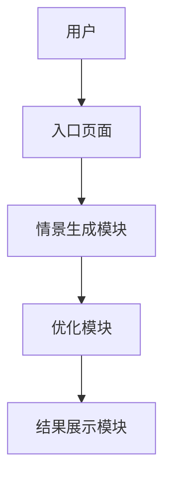
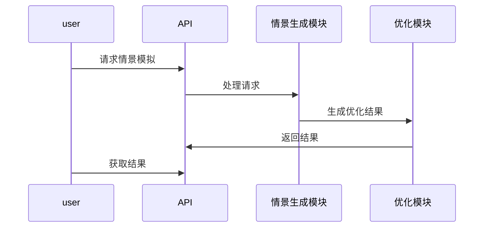

                 


# AI驱动的企业战略规划：情景模拟与优化

> **关键词**：AI驱动、企业战略规划、情景模拟、战略优化、机器学习、人工智能

> **摘要**：本文探讨了人工智能技术在企业战略规划中的应用，重点分析了情景模拟与战略优化的结合。通过详细阐述相关概念、算法原理和系统架构，结合实际案例，展示了AI如何提升企业决策效率和效果。文章旨在为企业提供理论支持和实践指导，助力其在复杂环境中做出更明智的战略选择。

---

## 第一部分：AI驱动的企业战略规划背景与概念

### 第1章：AI驱动的企业战略规划概述

#### 1.1 问题背景与挑战
企业战略规划是企业在复杂多变的环境中制定长期发展目标和行动方案的关键过程。然而，传统的战略规划方法依赖于经验和主观判断，难以应对日益复杂和不确定的市场环境。企业面临以下主要挑战：
- **复杂性**：市场环境、竞争态势和客户需求日益复杂，传统方法难以全面覆盖。
- **不确定性**：全球经济波动、政策变化和技术革新等因素增加了决策的难度。
- **数据量**：企业积累的数据量庞大，传统方法难以有效利用这些数据进行决策。

#### 1.2 AI技术的变革作用
人工智能技术的快速发展为企业战略规划带来了新的可能性：
- **数据处理能力**：AI能够快速处理海量数据，识别复杂模式和趋势。
- **情景模拟能力**：通过机器学习和深度学习，AI可以生成多种未来情景，帮助企业更好地应对不确定性。
- **优化能力**：AI优化算法能够找到最优或近似最优的解决方案，提高决策效率。

#### 1.3 本书的核心目标
本书旨在探讨AI技术如何应用于企业战略规划，通过情景模拟和优化帮助企业做出更明智的决策。具体内容包括：
- **概念解析**：解释情景模拟和战略优化的基本概念。
- **算法原理**：详细讲解相关算法及其在战略规划中的应用。
- **系统设计**：展示系统架构和接口设计，提供实际案例分析。

---

## 第二部分：AI驱动战略规划的核心概念与联系

### 第2章：情景模拟与战略优化的理论基础

#### 2.1 情景模拟的核心原理
情景模拟是通过构建多个未来可能的情景，分析不同情况下企业的发展路径。其核心步骤包括：
- **情景构建**：基于历史数据、市场分析和专家意见生成多种情景。
- **情景评估**：评估每个情景对企业目标的影响，识别潜在风险和机会。

#### 2.2 战略优化的算法原理
战略优化通过数学模型和优化算法寻找最优解决方案。常用算法包括：
- **遗传算法**：模拟生物进化过程，通过变异、交叉和选择生成最优解。
- **模拟退火**：通过随机搜索找到全局最优解，避免陷入局部最优。

#### 2.3 情景模拟与战略优化的协同作用
情景模拟提供多种可能的未来场景，战略优化则在这些场景中寻找最佳策略。两者结合能够帮助企业制定更具前瞻性和灵活性的战略。

### 第3章：情景模拟与战略优化的核心要素

#### 3.1 情景模拟的关键要素
- **输入变量**：如市场趋势、竞争对手行为等。
- **不确定性分析**：评估不同情景下的风险和机会。
- **动态调整**：根据实时数据更新情景，保持模拟的准确性。

#### 3.2 战略优化的核心要素
- **目标函数**：如利润最大化、市场份额最大化等。
- **约束条件**：如资源限制、政策法规等。
- **评估指标**：如净现值、内部收益率等。

#### 3.3 协同优化机制
通过数据流的双向传递，情景模拟和战略优化相互促进，确保决策的科学性和可行性。

---

## 第三部分：AI驱动战略规划的算法原理与数学模型

### 第4章：情景模拟的算法实现

#### 4.1 情景生成算法
- **随机森林**：通过决策树的集成生成多样化的未来情景。
- **深度学习**：利用神经网络预测未来趋势和模式。

#### 4.2 情景评估算法
- **强化学习**：通过试错和奖励机制优化情景评估。

#### 4.3 代码实现
以下是基于随机森林的情景生成代码示例：

```python
import numpy as np
from sklearn.ensemble import RandomForestRegressor

# 示例数据
X = np.array([[1, 2], [3, 4], [5, 6]])
y = np.array([7, 8, 9])

# 训练模型
model = RandomForestRegressor(n_estimators=100)
model.fit(X, y)

# 预测新情景
new_X = np.array([[7, 8]])
print(model.predict(new_X))
```

### 第5章：战略优化的数学模型

#### 5.1 基本模型
优化问题通常表示为：
$$ \text{minimize } f(x) $$
$$ \text{subject to } g(x) \leq 0 $$
其中，$f(x)$是目标函数，$g(x)$是约束条件。

#### 5.2 具体应用
以利润最大化为例，目标函数为：
$$ \text{maximize } \sum (收入 - 成本) $$

---

## 第四部分：系统分析与架构设计

### 第6章：系统设计与实现

#### 6.1 项目背景
某企业希望通过AI技术优化其市场进入战略。

#### 6.2 功能设计
- **情景生成模块**：生成多种市场进入情景。
- **优化模块**：优化选择最佳情景。

#### 6.3 系统架构
以下是系统架构图：



#### 6.4 接口设计
- **API接口**：提供RESTful API供其他系统调用。

#### 6.5 交互流程
以下是交互序列图：



---

## 第五部分：项目实战

### 第7章：环境安装与核心代码实现

#### 7.1 环境安装
- **Python 3.8+**
- **相关库**：安装scikit-learn、numpy等。

#### 7.2 核心代码
以下是核心代码示例：

```python
from sklearn import svm
import numpy as np

# 示例数据
X = np.array([[1, 2], [3, 4], [5, 6]])
y = np.array([7, 8, 9])

# 训练模型
model = svm.SVR()
model.fit(X, y)

# 预测
print(model.predict(np.array([[7, 8]])))
```

---

## 第六部分：最佳实践与小结

### 第8章：总结与展望

#### 8.1 最佳实践
- **数据质量**：确保数据的准确性和完整性。
- **模型选择**：根据具体问题选择合适的算法。

#### 8.2 注意事项
- **模型解释性**：确保模型结果易于理解和验证。
- **实时更新**：根据实时数据动态调整模型。

#### 8.3 拓展阅读
建议读者深入研究强化学习和深度学习在战略规划中的应用。

---

## 作者

**作者：AI天才研究院/AI Genius Institute & 禅与计算机程序设计艺术 /Zen And The Art of Computer Programming**

---

以上是《AI驱动的企业战略规划：情景模拟与优化》的完整目录和内容概要。希望这篇文章能为企业在AI驱动的战略规划中提供有价值的参考和指导。

