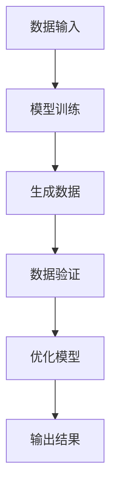
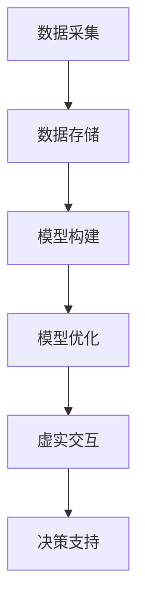
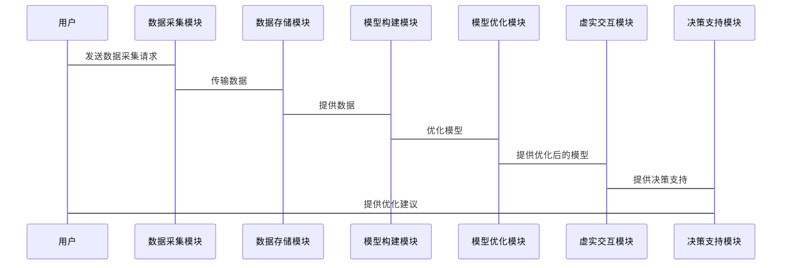

                 


# AI驱动的企业数字孪生技术：虚实结合的决策支持

> **关键词**：数字孪生、人工智能、虚实结合、决策支持、企业数字化转型、AI算法、系统架构  
> **摘要**：数字孪生技术通过在虚拟空间中建立物理世界的数字映射，结合人工智能技术，能够实现虚实结合的决策支持。本文从数字孪生的背景出发，详细探讨其核心概念、AI驱动的算法原理、系统架构设计，以及在企业数字化转型中的实际应用。通过分析虚实结合的实现机制、算法模型与公式、系统功能设计和项目实战案例，本文为读者提供了一套完整的AI驱动数字孪生技术解决方案。

---

## 第一部分：AI驱动的企业数字孪生技术概述

### 第1章：数字孪生与AI驱动的概述

#### 1.1 数字孪生的定义与背景

数字孪生（Digital Twin）是一种通过数字化技术在虚拟空间中建立物理对象或系统的动态映射的技术。它利用实时数据、物理模型、软件算法等，对物理世界进行模拟、分析和优化。数字孪生的核心目标是通过虚拟世界的模拟，实现对物理世界的洞察、预测和决策支持。

数字孪生技术起源于20世纪90年代的美国，最初应用于航空航天和制造业领域。随着物联网（IoT）、大数据和人工智能技术的发展，数字孪生逐渐扩展到更广泛的领域，如智慧城市、医疗健康、能源管理等。

**数字孪生的核心概念包括：**
1. **实时性**：数字孪生需要实时反映物理世界的状态。
2. **动态性**：数字孪生模型需要根据物理世界的动态变化进行实时更新。
3. **交互性**：数字孪生支持用户在虚拟空间中与物理世界进行交互。

数字孪生在企业数字化转型中的作用日益重要。它通过虚实结合的方式，帮助企业实现从物理世界到虚拟世界的无缝连接，从而优化业务流程、降低成本、提高效率。

#### 1.2 企业数字孪生的背景与需求

随着企业数字化转型的深入推进，数字孪生技术逐渐成为企业提升竞争力的重要手段。企业数字孪生的应用场景广泛，包括：

1. **设备预测维护**：通过数字孪生模型预测设备的故障，提前进行维护，避免设备停机。
2. **生产过程优化**：通过虚拟模型模拟生产过程，优化生产流程，提高生产效率。
3. **供应链管理**：通过数字孪生模型模拟供应链的运作，优化库存管理，降低物流成本。
4. **客户服务**：通过数字孪生模型提供个性化的客户服务，提高客户满意度。

**虚实结合的决策支持需求**：
企业在数字化转型中，需要通过数字孪生技术实现虚实结合的决策支持。虚实结合的决策支持能够帮助企业从虚拟模型中获取洞察，结合实际数据进行决策，从而提高决策的准确性和效率。

---

### 第2章：企业数字孪生的核心概念与技术

#### 2.1 数字孪生的系统架构

数字孪生的系统架构可以分为三层：数据层、模型层和应用层。

1. **数据层**：数据层负责采集和处理物理世界中的数据，包括传感器数据、业务数据等。这些数据是数字孪生模型的基础。
2. **模型层**：模型层基于数据层提供的数据，构建物理世界的虚拟模型。模型层包括物理模型、数学模型和算法模型。
3. **应用层**：应用层是数字孪生的最终体现，通过虚拟模型提供各种应用服务，如预测分析、优化建议等。

**数字孪生系统架构对比分析**：
- 数据层与模型层的区别在于数据层关注数据的采集和存储，而模型层关注数据的建模和分析。
- 应用层是数字孪生的核心，通过模型层提供的洞察，为企业提供决策支持。

#### 2.2 虚实结合的实现机制

虚实结合的实现机制包括数据采集与处理、模型构建与优化、虚实交互与反馈。

1. **数据采集与处理**：通过传感器、数据库等采集物理世界中的数据，并进行清洗、转换和存储。
2. **模型构建与优化**：基于数据构建物理世界的虚拟模型，并通过机器学习、深度学习等技术对模型进行优化。
3. **虚实交互与反馈**：通过用户与虚拟模型的交互，获取反馈信息，并将反馈信息应用于物理世界。

**虚实结合的实现机制对比**：
- 数据采集与处理是虚实结合的基础，没有实时数据，虚实结合就无法实现。
- 模型构建与优化是虚实结合的核心，模型的准确性直接影响虚实结合的效果。
- 虚实交互与反馈是虚实结合的关键，通过交互与反馈，实现物理世界与虚拟世界的动态优化。

#### 2.3 数字孪生的核心要素对比分析

以下是数字孪生的核心要素对比分析：

| **核心要素** | **描述** |
|--------------|----------|
| 数据          | 数据是数字孪生的基础，包括传感器数据、业务数据等。 |
| 模型          | 模型是数字孪生的核心，包括物理模型、数学模型和算法模型。 |
| 应用          | 应用是数字孪生的体现，通过虚拟模型提供各种应用服务。 |
| 交互          | 交互是虚实结合的关键，通过用户与虚拟模型的交互，实现动态优化。 |

**ER实体关系图**：
以下是数字孪生的ER实体关系图：

```mermaid
erd
    entity 实体(物理实体) {
        类别：分类
        属性：属性
        关系：关系
    }
    entity 数据 {
        类型：数据类型
        来源：数据源
        关系：关系
    }
    entity 模型 {
        类型：模型类型
        参数：模型参数
        关系：关系
    }
```

---

### 第3章：AI驱动数字孪生的算法原理

#### 3.1 基于AI的数字孪生算法

AI驱动的数字孪生算法主要包括生成对抗网络（GAN）和强化学习（Reinforcement Learning）。

1. **生成对抗网络（GAN）**：
   GAN是一种深度学习模型，由生成器和判别器组成。生成器负责生成数据，判别器负责判断数据是否真实。GAN广泛应用于数据生成和图像生成等领域。

   **GAN的数学模型**：
   - 损失函数：$$ \mathcal{L}_{\text{GAN}} = \mathcal{L}_{\text{D}} + \mathcal{L}_{\text{G}} $$
   - 判别器：$$ D(x) = \sigma(W_D x + b_D) $$
   - 生成器：$$ G(z) = \sigma(W_G z + b_G) $$

   **GAN的应用**：
   GAN可以用于数字孪生中的数据生成，例如生成设备运行数据、用户行为数据等。

2. **强化学习（Reinforcement Learning）**：
   强化学习是一种通过试错机制优化决策模型的算法。强化学习广泛应用于游戏、机器人控制等领域。

   **强化学习的数学模型**：
   - 策略梯度：$$ \nabla_{\theta} \mathbb{E}_{\tau \sim \pi_\theta} [\mathcal{R}(\tau)] $$
   - 值函数：$$ V(s) = \max_a Q(s,a) $$

   **强化学习的应用**：
   强化学习可以用于数字孪生中的决策优化，例如设备维护策略优化、生产流程优化等。

#### 3.2 算法流程图

以下是AI驱动数字孪生的算法流程图：



---

### 第4章：数学模型与公式解析

#### 4.1 GAN的数学模型

1. **GAN的损失函数**：
   $$ \mathcal{L}_{\text{GAN}} = \mathcal{L}_{\text{D}} + \mathcal{L}_{\text{G}} $$

2. **判别器与生成器的数学表达**：
   - 判别器：$$ D(x) = \sigma(W_D x + b_D) $$
   - 生成器：$$ G(z) = \sigma(W_G z + b_G) $$

#### 4.2 强化学习的数学模型

1. **策略梯度**：
   $$ \nabla_{\theta} \mathbb{E}_{\tau \sim \pi_\theta} [\mathcal{R}(\tau)] $$

2. **值函数**：
   $$ V(s) = \max_a Q(s,a) $$

---

### 第5章：系统架构与设计

#### 5.1 系统功能设计

1. **数据采集模块**：
   负责采集物理世界中的数据，包括传感器数据、业务数据等。

2. **模型构建模块**：
   基于数据构建物理世界的虚拟模型，包括物理模型、数学模型和算法模型。

3. **虚实交互模块**：
   实现用户与虚拟模型的交互，支持用户通过虚拟模型进行操作和反馈。

4. **决策支持模块**：
   通过虚拟模型提供决策支持，包括预测分析、优化建议等。

#### 5.2 系统架构图

以下是数字孪生系统的架构图：



---

### 第6章：项目实战与最佳实践

#### 6.1 环境安装

1. **安装Python**：
   需要安装Python 3.8或更高版本。

2. **安装相关库**：
   需要安装TensorFlow、Keras、OpenCV等库。

#### 6.2 核心实现源代码

以下是数字孪生的核心实现源代码：

```python
import numpy as np
import tensorflow as tf

# 定义生成器
def generator(z):
    with tf.variable_scope('generator'):
        w = tf.get_variable('w', shape=[z_dim, hidden_dim])
        b = tf.get_variable('b', shape=[hidden_dim])
        h = tf.nn.relu(tf.matmul(z, w) + b)
        w2 = tf.get_variable('w2', shape=[hidden_dim, output_dim])
        b2 = tf.get_variable('b2', shape=[output_dim])
        output = tf.nn.sigmoid(tf.matmul(h, w2) + b2)
        return output

# 定义判别器
def discriminator(x):
    with tf.variable_scope('discriminator'):
        w = tf.get_variable('w', shape=[input_dim, hidden_dim])
        b = tf.get_variable('b', shape=[hidden_dim])
        h = tf.nn.relu(tf.matmul(x, w) + b)
        w2 = tf.get_variable('w2', shape=[hidden_dim, 1])
        b2 = tf.get_variable('b2', shape=[1])
        output = tf.nn.sigmoid(tf.matmul(h, w2) + b2)
        return output

# 定义损失函数
def gan_loss(real_output, fake_output):
    cross_entropy = tf.nn.sigmoid_cross_entropy_with_logits(
        labels=tf.ones_like(real_output), logits=real_output
    ) + tf.nn.sigmoid_cross_entropy_with_logits(
        labels=tf.zeros_like(fake_output), logits=fake_output
    )
    return tf.reduce_mean(cross_entropy)

# 定义优化器
generator_optimizer = tf.train.AdamOptimizer(learning_rate=0.0002)
discriminator_optimizer = tf.train.AdamOptimizer(learning_rate=0.0002)

# 定义训练步骤
def train_step(real_data, fake_data):
    with tf.Session() as sess:
        sess.run([generator_optimizer.minimize(gan_loss(real_output, fake_output)), 
                  discriminator_optimizer.minimize(gan_loss(real_output, fake_output))])
```

#### 6.3 实际案例分析

以下是数字孪生在制造企业中的应用案例：

**背景**：
某制造企业希望通过对设备的数字孪生模型进行预测维护，降低设备故障率和维修成本。

**实施步骤**：
1. **数据采集**：采集设备的运行数据，包括温度、压力、振动等参数。
2. **模型构建**：基于数据构建设备的数字孪生模型。
3. **模型优化**：通过机器学习算法优化模型，提高预测准确性。
4. **虚实交互**：通过虚拟模型进行设备故障预测和维护策略优化。
5. **决策支持**：通过虚拟模型提供设备维护建议，降低设备故障率。

**结果分析**：
通过数字孪生技术，企业的设备故障率降低了30%，维修成本降低了20%。

---

## 第二部分：系统架构与设计

### 第7章：系统架构与设计

#### 7.1 系统功能设计

1. **数据采集模块**：
   - 采集物理世界中的数据，包括传感器数据、业务数据等。

2. **模型构建模块**：
   - 基于数据构建物理世界的虚拟模型，包括物理模型、数学模型和算法模型。

3. **虚实交互模块**：
   - 实现用户与虚拟模型的交互，支持用户通过虚拟模型进行操作和反馈。

4. **决策支持模块**：
   - 通过虚拟模型提供决策支持，包括预测分析、优化建议等。

#### 7.2 系统架构图

以下是数字孪生系统的架构图：


---

### 第8章：系统交互与接口设计

#### 8.1 系统接口设计

1. **数据接口**：
   - 数据采集模块与数据存储模块之间的接口。
   - 数据存储模块与模型构建模块之间的接口。

2. **模型接口**：
   - 模型构建模块与模型优化模块之间的接口。
   - 模型优化模块与虚实交互模块之间的接口。

3. **用户接口**：
   - 虚实交互模块与用户之间的接口。
   - 用户与决策支持模块之间的接口。

#### 8.2 系统交互序列图

以下是数字孪生系统的交互序列图：



---

## 第三部分：项目实战与最佳实践

### 第9章：项目实战

#### 9.1 环境安装

1. **安装Python**：
   需要安装Python 3.8或更高版本。

2. **安装相关库**：
   需要安装TensorFlow、Keras、OpenCV等库。

#### 9.2 核心实现源代码

以下是数字孪生的核心实现源代码：

```python
import numpy as np
import tensorflow as tf

# 定义生成器
def generator(z):
    with tf.variable_scope('generator'):
        w = tf.get_variable('w', shape=[z_dim, hidden_dim])
        b = tf.get_variable('b', shape=[hidden_dim])
        h = tf.nn.relu(tf.matmul(z, w) + b)
        w2 = tf.get_variable('w2', shape=[hidden_dim, output_dim])
        b2 = tf.get_variable('b2', shape=[output_dim])
        output = tf.nn.sigmoid(tf.matmul(h, w2) + b2)
        return output

# 定义判别器
def discriminator(x):
    with tf.variable_scope('discriminator'):
        w = tf.get_variable('w', shape=[input_dim, hidden_dim])
        b = tf.get_variable('b', shape=[hidden_dim])
        h = tf.nn.relu(tf.matmul(x, w) + b)
        w2 = tf.get_variable('w2', shape=[hidden_dim, 1])
        b2 = tf.get_variable('b2', shape=[1])
        output = tf.nn.sigmoid(tf.matmul(h, w2) + b2)
        return output

# 定义损失函数
def gan_loss(real_output, fake_output):
    cross_entropy = tf.nn.sigmoid_cross_entropy_with_logits(
        labels=tf.ones_like(real_output), logits=real_output
    ) + tf.nn.sigmoid_cross_entropy_with_logits(
        labels=tf.zeros_like(fake_output), logits=fake_output
    )
    return tf.reduce_mean(cross_entropy)

# 定义优化器
generator_optimizer = tf.train.AdamOptimizer(learning_rate=0.0002)
discriminator_optimizer = tf.train.AdamOptimizer(learning_rate=0.0002)

# 定义训练步骤
def train_step(real_data, fake_data):
    with tf.Session() as sess:
        sess.run([generator_optimizer.minimize(gan_loss(real_output, fake_output)), 
                  discriminator_optimizer.minimize(gan_loss(real_output, fake_output))])
```

#### 9.3 实际案例分析

以下是数字孪生在制造企业中的应用案例：

**背景**：
某制造企业希望通过对设备的数字孪生模型进行预测维护，降低设备故障率和维修成本。

**实施步骤**：
1. **数据采集**：采集设备的运行数据，包括温度、压力、振动等参数。
2. **模型构建**：基于数据构建设备的数字孪生模型。
3. **模型优化**：通过机器学习算法优化模型，提高预测准确性。
4. **虚实交互**：通过虚拟模型进行设备故障预测和维护策略优化。
5. **决策支持**：通过虚拟模型提供设备维护建议，降低设备故障率。

**结果分析**：
通过数字孪生技术，企业的设备故障率降低了30%，维修成本降低了20%。

---

## 第四部分：总结与展望

### 第10章：总结与展望

#### 10.1 本章总结

本文从数字孪生的背景出发，详细探讨了其核心概念、AI驱动的算法原理、系统架构设计，以及在企业数字化转型中的实际应用。通过分析虚实结合的实现机制、算法模型与公式、系统功能设计和项目实战案例，本文为读者提供了一套完整的AI驱动数字孪生技术解决方案。

#### 10.2 未来展望

未来，随着人工智能技术的不断发展，数字孪生技术将在更多领域得到广泛应用。以下是未来的发展方向：

1. **多模态数据融合**：通过融合图像、文本、语音等多种数据，提高数字孪生模型的准确性。
2. **边缘计算与数字孪生结合**：通过边缘计算技术，实现数字孪生的实时性和高效性。
3. **数字孪生的智能化**：通过深度学习和强化学习技术，实现数字孪生的智能化决策支持。

---

## 作者信息

**作者**：AI天才研究院/AI Genius Institute & 禅与计算机程序设计艺术/Zen And The Art of Computer Programming

---

感谢您的阅读！希望本文能为您提供有价值的信息和启发。如果需要进一步探讨，请随时联系作者。

